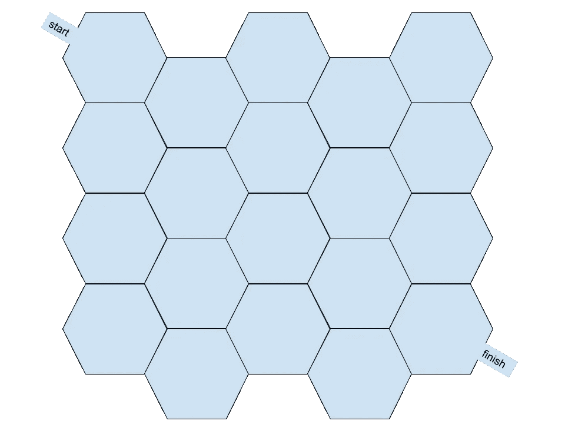
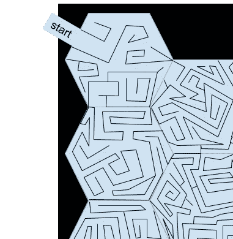
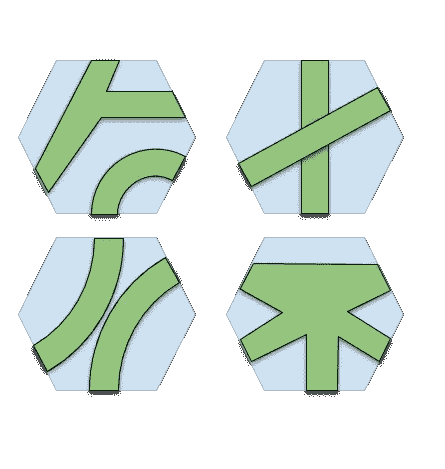
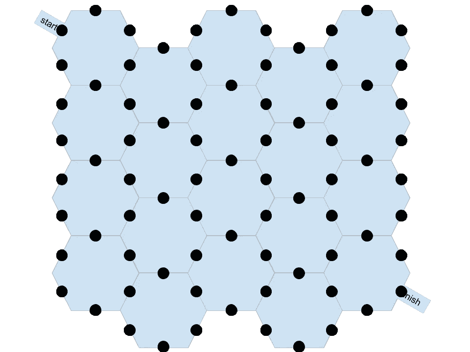
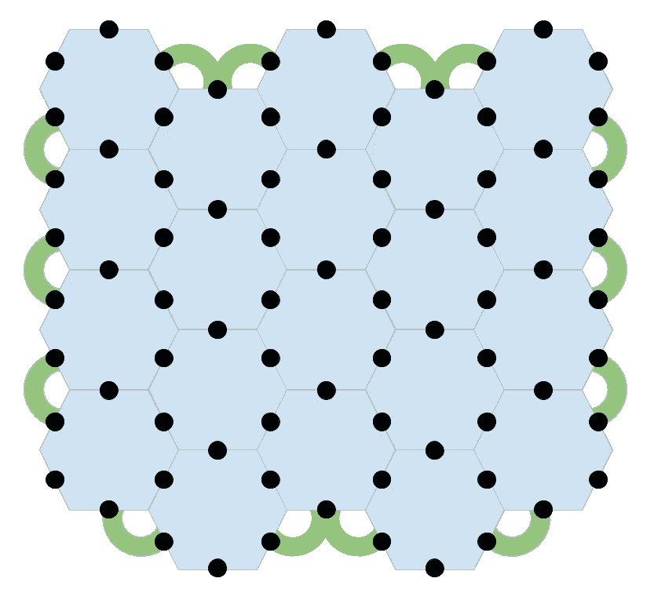
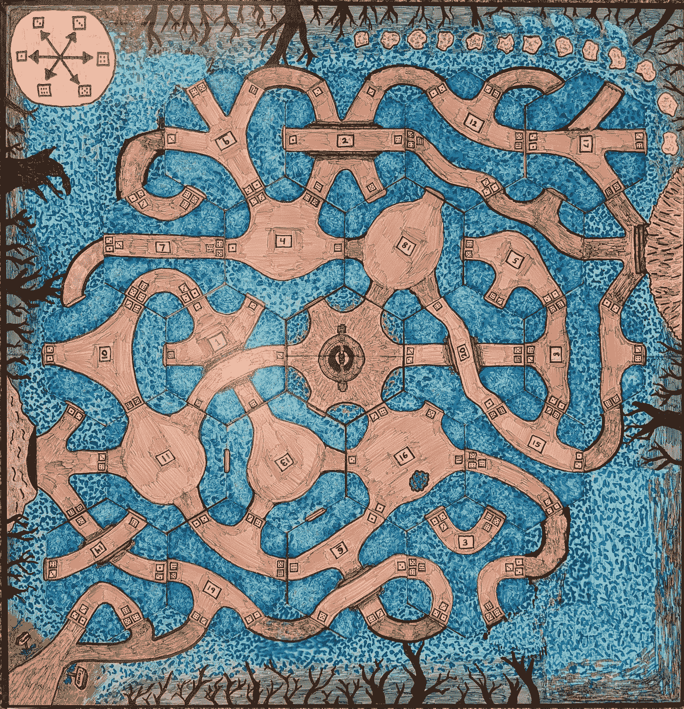
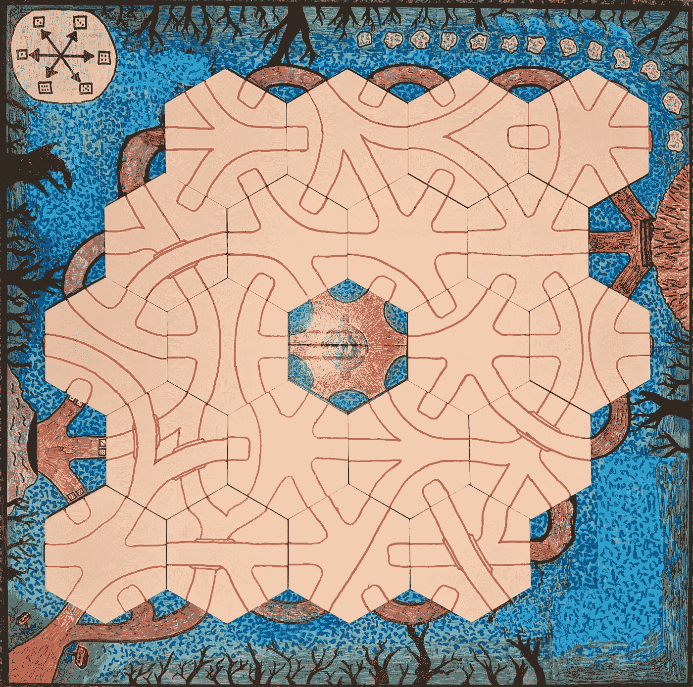

# 用图论、遗传算法和 Haskell 优化迷宫

> 原文：<https://medium.com/analytics-vidhya/optimizing-a-maze-with-graph-theory-genetic-algorithms-and-haskell-e3702dd6439f?source=collection_archive---------3----------------------->

最近，我一直在做一个兼职项目，这个项目成了图论和遗传算法的有趣练习。这就是那次经历的故事。

# 开始

最近，我从工作中抽出时间来恢复我对这个世界的兴奋和好奇。在这段休息时间，我完成了一个棋盘游戏。在这个游戏中，玩家在一个由六边形瓷砖上的迷宫块组成的迷宫中导航，因此当这些瓷砖被随机洗牌和连接时，他们在这样的网格上构建了一个完整的迷宫:



我一点也不确定我能通过随意放置瓷砖来建造一个非常好的迷宫。尽管如此，我认为我可以即兴发挥，看看会发生什么，所以我这样做了。

# 尝试 1:做最简单的事情

迷宫几乎是图论的理想应用。一个*图*(这里我总是指一个*无向图*)是一串由*边*连接的*顶点*。另一方面，迷宫是由*路径*连接的一串*位置*。一样的东西，不一样的话！

在这种情况下，我最初的想法是六边形瓷砖是位置(即顶点)，瓷砖的六个边中的每一个要么是开放的，要么是封闭的，潜在地形成了到相邻瓷砖的路径。那么，问题是这些边缘中的哪一个应该被阻挡。我被两个问题所引导:

1.  解开迷宫应该是可能的。也就是说，从起点到终点应该有(至少有很大概率)一条开放的路径。
2.  解决迷宫应该不是小事。也就是说，在*任何*方向上移动都不应该让你从起点到终点。

这里的一个关键见解是，在图中添加边总是做以下两件事之一:它要么连接图中两个先前未连接的组件，要么通过以第二种方式连接两个先前连接的顶点来创建循环(从一个顶点回到其自身的路径，而不重复边)。因此，这两种担忧表明，如果可能的话，我们希望做第一种，但避免第二种。不幸的是，由于我们的边缘指向随机的方向，我们不清楚如何区分这两者！

但是，至少，我们可以尝试在我们的图中得到正确的边数。我们希望这个图是*非循环的*(即不包含任何循环)，但是是连通的。这样的图被称为*树*。我们将多次使用以下简单的事实:

**命题:**在任何无环图中，边的个数总是等于顶点的个数减去连通分支的个数。(*证明:*通过对边数的归纳:如果没有边，那么每个顶点都是它自己的连通分支。如果有边，删除任何边都会使图保持非循环，因此等式成立，但重新添加该边会添加一条边并删除一个连通分量，从而保持等式。)

**推论:**一棵树的边比顶点少一条。(*证明:*整棵树是一个连通分支。应用上面的命题。)

*所以，*我心想，*我有二十张六角瓷砖，因为盒子里来了这么多空白瓷砖。如果我把它们每一个都当作一个顶点，那么它们之间需要 19 个连接。*

还有一个更复杂的问题。为了打开一条路径，它不得在*或*侧被阻挡，并且迷宫的外部边界总是被阻挡。因此，并不是瓷砖的每条开放边都会给图形添加一个顶点。这个只要稍微换个角度就很容易解决了。除了计算边缘的数量，还可以计算边缘打开的期望概率*。*

在我选择的瓷砖配置中，瓷砖之间有 43 个内部边界，不包括整个迷宫的外部边界。所以我希望每条边界上有大约 19/43(或者大约 43%)的概率有一条边。因为两个瓷砖都需要一个开放的边来形成边缘，如果每个边都是独立选择的，那么瓷砖具有开放边缘的概率应该是它的平方根，或者大约 66%。由于 20 个图块中的每一个在 2 条边的每一条边上都有 6 条边，因此有 240 条边，其中随机的 160 条(即 240 * sqrt(19/43))应该是开放的，其余的 80 条应该被阻挡。

你可以在这里看到这个[的模拟。这个简单的模拟不选择瓷砖。可惜这个实验失败了。如果你尝试几次，你会发现:](https://code.world/haskell#PPNfVOc7vm_imjc9ZIGEQ0w)

1.  迷宫太简单了。迷宫中的 20 个空间是不够的。
2.  开放的边缘在错误的位置是非常常见的，并且你不能从头到尾得到它。

现在，迷宫不是非循环的，所以我可以(并且在实践中，会)增加开放边的概率来解决第二个问题…但这只会使第一个问题变得更糟。没有一种概率可以同时解决这两个问题。

# 尝试 2:更多有趣的瓷砖

老实说，我料到这第一次尝试会失败。我甚至从来没有画过瓷砖，只是模拟了足够多，以确信它不会工作。很明显，我需要地图中有更多的结构。

让结果*看起来*更引人注目的一件事是在每块瓷砖上画出有趣的(但静态的)迷宫，这些迷宫都是相互连接的，并且以适当的概率在各个方向都有出口。不过，这都是假象。最终，它简化为与上面相同的系统。随着开放边缘概率的充分增加，这将满足我的要求。



用静态瓷砖伪造一个更好的迷宫

但是感觉像是出轨。我希望迷宫的高层结构本身就很有趣。不管我对瓷砖有多聪明，前面的部分显示了这在这个模型中是不可能的。

那么，剩下的选择是考虑每个瓦片，而不是一个有许多出口的位置，实际上包含多个位置，具有不同的连接性。由于我不想在瓷砖内部增加人工的复杂性，他们将简单地按照需要连接边缘。一些瓷砖现在看起来像这样:



每个图块具有(潜在的)多个位置的图块

乍一看，连接迷宫的分析变得更加棘手，因为图中顶点的数量发生了变化！上面的三个图块有两个位置，但最后一个只有一个位置。甚至有三种不同路径的瓷砖。

但是不要害怕:另一个视角的改变简化了事情。我们将考虑对偶图，其中每个*边界*是一个顶点，而不是考虑每个图块或路径是一个顶点的图，如下所示:



迷宫图的对偶

现在，我们又一次拥有了固定数量的顶点(77 个)，以及决定这些顶点之间的边的瓦片。为了连接这个图，需要至少 76 条边分布在 20 个瓦片上，或者每个瓦片大约 3.8 条边。也许甚至更多，因为最终的图肯定包含一些循环，所以我们称它为每块 4。

这是我第一次考虑这个图表时犯的错误。上面四个例子中的最后一个瓷砖将五个不同的顶点连接在一起，因此可以直接从它们之间穿过。你可能会天真地认为这相当于 10 条边:每对相连的顶点对应一条边。这符合我的直觉，就瓷砖上的连接而言，连接六个边中的五个应该远高于平均水平。我想到了这一点，并在意识到由此产生的迷宫几乎没有足够的连接之前，根据这一假设设计出了一套完整的瓷砖。

问题是:这 10 条边将包含相当多的循环。对至少 76 条边的要求是针对*非循环*图的。我们将不可避免地在图块之间结束一些循环，但是我们至少应该避免在图块内计算循环*。用无环图连接这五个顶点需要*四条*边，而不是十条。对我们来说，这是哪四条边并不重要。它们只存在于理论上，并不会改变瓷砖的绘制方式。但重要的是只把它们算作四个。*

现在，76 条边感觉起来太多了！如果我们必须平均连接每块瓷砖的六个面中的近五个面，看起来几乎可以移动到任何地方。但仔细想想，这也不是没有道理。将近一半的顶点在迷宫的外部边界上！所有需要做的就是在一个不幸的地方用一条堵塞的路径来隔离这些顶点中的一个。哪怕是六分之一的几率也会孤立其中的六个左右。那些没有被用来连接图的六条边将会在剩下的部分中添加额外的路径！

图的边上的顶点很可能是孤立的，这是一个问题。我决定创造性地缓解这个问题，把这 76 条边中的一部分加在板上，而不是瓷砖上。大概是这样的:



迷宫的外部边缘

有了迷宫外部的这 14 条边(记住连接三个顶点只能算作两条边)，我们只需要迷宫内部的 64 条边，也就是每块瓷砖 3 条多一点。不仅如此，边缘上的瓷砖在最终的迷宫中被隔离的可能性也相当小。

在这一点上，我画了一组瓷砖，通过布置迷宫对它们进行了一点迭代，并对它们何时太容易、太难等有了感觉。我最后和一个我最满意的机械师在一起。这是实际的游戏棋盘，随机布置了一个迷宫。布局与上面的例子略有不同，因为需要在其他游戏元素中工作，但想法本质上是相同的。



真正的游戏板

如果你仔细观察，你会发现最终的迷宫并不是完全相连的:在左下角和右下角的瓷砖上有两个短的不相连的部分。它肯定包含循环，一方面是因为断开的组件释放了导致循环的边，另一方面是因为我已经包含了超过连接迷宫所需的最小边数的边。

但是它很重要，视觉上很有趣，而且总体来说形状很好。这看起来相当容易，但在实际游戏中，玩家只有在到达瓷砖时才会揭开瓷砖，这种体验肯定很像在迷宫中导航，除非你沿着它走，否则你不知道它会通向哪里。总而言之，这是成功的。

# 尝试 3:使用遗传算法

我对这次尝试并不不满，但我怀疑通过一些计算机模拟，我可以做得更好。我稍微研究了一下，发现了一个叫做 [moo](http://hackage.haskell.org/package/moo) 的 Haskell 库，它为遗传算法提供了构建模块。

遗传算法背后的想法很简单:你从最初的答案群体开始，这些答案有时是随机产生的，然后根据一个适应度函数对它们进行评估。你从这个集合中选择最佳答案，然后通过产生随机突变和群体杂交来扩展它。这提供了一个新的群体，它被评估、突变、杂交等。

先说一些进口:

```
import Algebra.Graph.AdjacencyMap.Algorithm (scc)
import Algebra.Graph.ToGraph
import qualified Algebra.Graph.Undirected as U
import Control.Monad
import Data.Containers.ListUtils
import Data.Function (on)
import Data.List
import Moo.GeneticAlgorithm.Binary
import System.IO.Unsafe
import System.Random
import System.Random.Shuffle
```

和一些类型:

```
data Direction = N | NE | SE | S | SW | NW
  deriving (Show, Eq, Ord, Enum)type Trail = [Direction]data Tile = Tile [Trail] [Trail]
  deriving (Show, Eq)
```

A `Direction`是十六进制世界中六个基本方向之一，按顺时针顺序排列。`Trail`是来自一个瓷砖设计的单个轨迹。它被表示为一个方向列表，人们可以从该列表中通过该轨迹离开瓷砖。除此之外的一切都只是视觉设计。最后，`Tile`有顶面和底面，每一面都有一些`Trail`列表

moo 库需要某种方式将值编码或解码为比特串，比特串在遗传算法中扮演 DNA 的角色。该框架将对这些位串进行任意修改，您应该能够读取这些修改后的字符串并获得合理的值。事实上，预计对一个位串的小修改将对编码值产生类似的小变化。

我是这么做的。瓷砖的每一面都被编码成六个数字，每个数字标识与瓷砖方向相连的轨迹。如果一个瓷砖没有在某个方向离开的踪迹，那么那个方向将有一个唯一的踪迹号码，所以本质上它成为一个死胡同。假设我们不想要一条只有一条无分支路径的小径(我们不想要！)，为四个尾号留出空间就足够了，这在字符串中只需要两位。那么一面需要 12 位，双面平铺需要 24 位，全套 20 个平铺需要 480 位。

下面是以这种方式对一堆图块进行编码的代码，从前面的表示开始:

```
encodeTile :: Tile -> [Bool]
encodeTile (Tile a b) =
  concat
    [ encodeBinary (0 :: Int, 3) (trailNum side dir)
      | side <- [a, b],
        dir <- [N .. NW]
    ]
  where
    trailNum trails d =
      case [i | (t, i) <- zip trails [0 .. 3], d `elem` t] of
        [i] -> i
        _ -> error "Duplicate or missing dir on tile"encodeTiles :: [Tile] -> [Bool]
encodeTiles = concat . map encodeTile
```

`encodeBinary`函数是 moo 的一部分，在给定范围的情况下，它只是将一个二进制数编码成一个布尔值列表。剩下的只是匹配踪迹和踪迹编号，并连接它们的编码。

解码稍微复杂一点，主要是因为我们想要做一些标准化，这在以后会很方便。首先是一个帮助函数:

```
clockwise :: Direction -> Direction
clockwise N = NE
clockwise NE = SE
clockwise SE = S
clockwise S = SW
clockwise SW = NW
clockwise NW = N
```

现在解码:

```
decodeTile :: [Bool] -> Tile
decodeTile bs = Tile (postproc a) (postproc b)
  where
    trailNums =
      map
        (decodeBinary (0 :: Int, 3))
        (splitEvery trailSize bs)
    trail nums n = [d | (d, i) <- zip [N .. NW] nums, i == n]
    a = map (trail (take 6 trailNums)) [0 .. 3]
    b = map (trail (drop 6 trailNums)) [0 .. 3]postproc :: [Trail] -> [Trail]
postproc = normalize . filter (not . null)
  where
    normalize trails =
      minimum
        [ simplify ts
          | ts <- take 6 (iterate (map (map clockwise)) trails)
        ]
    simplify = sort . map sortdecodeTiles :: [Bool] -> [Tile]
decodeTiles = map decodeTile . splitEvery tileSizetrailSize :: Int
trailSize = bitsNeeded (0 :: Int, 3)tileSize :: Int
tileSize = 12 * trailSize
```

同样，有些功能(如`decodeBinary`、`bitsNeeded`和`splitEvery`)是 moo 提供的实用功能。`postproc`函数将一点标准化应用于瓷砖设计。由于路径出口的重新排序、路径和瓷砖的旋转不会改变其含义，我们只需在这里做出一致的选择，这样相等的瓷砖将会比较相等。

下一件事，我们需要的是一种方法来评分一套瓷砖，所以最好的可以选择。从一开始，我们就知道评分将涉及洗牌，这实际上包括三种随机化:

*   将牌移动到棋盘上的不同位置。
*   将瓷砖旋转到任意方向。
*   翻转瓷砖，使任何一面都同样可能被看到。

下面是代码:

```
rotateTile :: Int -> Tile -> Tile
rotateTile n
  | n > 0 = rotateTile (n - 1) . rot
  | n < 0 = rotateTile (n + 6)
  | otherwise = id
  where
    rot (Tile top bottom) =
      Tile (map (map clockwise) top) bottomflipTile :: Tile -> Tile
flipTile (Tile top bottom) = Tile bottom toprandomizeTile :: RandomGen g => g -> Tile -> (g, Tile)
randomizeTile g t
  | flipped = (g3, rotateTile rots (flipTile t))
  | otherwise = (g3, rotateTile rots t)
  where
    (flipped, g2) = random g
    (rots, g3) = randomR (0, 5) g2shuffleTiles :: RandomGen g => g -> [Tile] -> (g, [Tile])
shuffleTiles g tiles = (g3, result)
  where
    (g1, g2) = split g
    shuffledTiles = shuffle' tiles (length tiles) g1
    (g3, result) = mapAccumL randomizeTile g2 shuffledTiles
```

为了给瓷砖的随机排列打分，有一个图形库是很有用的。在这种情况下，我选择了 [Alga](https://hackage.haskell.org/package/algebraic-graphs) 来完成这个任务，主要是因为它允许图形具有任意的节点类型(这是我在这里想要的)，它似乎获得了一些兴奋，我还没有机会玩它。Alga 在一个子包中用不同的`Graph`类型(恼人地称之为同一事物)表示无向图，因此有了限定导入。

为了分享实际代码，我现在从上面的照片切换到真正的游戏板。我关心某些固定的地点，因为玩家需要在游戏中到达它们:女巫的小屋、许愿池、怪物的巢穴、果园、泉水和出口。这些都有自己的命名节点。这些牌被命名为“1”到“20”。最后，因为每个图块可以有多条轨迹，所以一个节点由一个名称和一个轨迹编号组成(对于内置位置，该编号始终为 0)。下面是从图块列表构建图形的代码:

```
topSide :: Tile -> [[Direction]]
topSide (Tile top _) = toptileGraph :: [Tile] -> U.Graph (String, Int)
tileGraph tiles =
  U.edges $
    [ ((show a, trailNum a dira), (show b, trailNum b dirb))
      | (a, dira, b, dirb) <- connections
    ]
      ++ [ (("Well", 0), (show c, trailNum c dir))
           | (c, dir) <-
               [ (6, SE),
                 (7, NE),
                 (10, S),
                 (11, N),
                 (14, SW),
                 (15, NW)
               ]
         ]
      ++ [ (("Hut", 0), (show c, trailNum c dir))
           | (c, dir) <- [(1, NE), (5, N), (9, NW)]
         ]
      ++ [ (("Spring", 0), (show c, trailNum c dir))
           | (c, dir) <- [(4, S), (8, SW)]
         ]
      ++ [ (("Orchard", 0), (show c, trailNum c dir))
           | (c, dir) <- [(13, NE), (17, N)]
         ]
      ++ [ (("Lair", 0), (show c, trailNum c dir))
           | (c, dir) <- [(12, SE), (16, S), (20, SW)]
         ]
      ++ [ (("Exit", 0), (show c, trailNum c dir))
           | (c, dir) <- [(19, SE), (20, NE), (20, SE)]
         ]
  where
    trailNum n dir =
      head
        [ i
          | (exits, i) <- zip (topSide (tiles !! (n - 1))) [0 ..],
            dir `elem` exits
        ]
    connections =
      [ (1, S, 2, N),
        (1, SW, 2, NW),
        (1, SE, 5, NW),
        (2, NE, 5, SW),
        (2, SE, 6, NW),
        (2, S, 3, N),
        (2, SW, 3, NW),
        (3, NE, 6, SW),
        (3, SE, 7, NW),
        (3, S, 4, N),
        (3, SW, 4, NW),
        (4, NE, 7, SW),
        (4, SE, 8, NW),
        (5, NE, 9, SW),
        (5, SE, 10, NW),
        (5, S, 6, N),
        (6, NE, 10, SW),
        (6, S, 7, N),
        (7, SE, 11, NW),
        (7, S, 8, N),
        (8, NE, 11, SW),
        (8, SE, 12, NW),
        (8, S, 12, SW),
        (9, NE, 13, N),
        (9, SE, 13, NW),
        (9, S, 10, N),
        (10, NE, 13, SW),
        (10, SE, 14, NW),
        (11, NE, 15, SW),
        (11, SE, 16, NW),
        (11, S, 12, N),
        (12, NE, 16, SW),
        (13, SE, 17, NW),
        (13, S, 14, N),
        (14, NE, 17, SW),
        (14, SE, 18, NW),
        (14, S, 15, N),
        (15, NE, 18, SW),
        (15, SE, 19, NW),
        (15, S, 16, N),
        (16, NE, 19, SW),
        (16, SE, 20, NW),
        (17, SE, 18, NE),
        (17, S, 18, N),
        (18, SE, 19, NE),
        (18, S, 19, N),
        (19, S, 20, N)
      ]
```

乏味，但它的工作！我现在可以给其中一张图打分了。我关心两种事情:能够在任意两个内置位置之间获得的概率，以及创建多条路径的“多余”边的数量。

```
hasPath :: String -> String -> U.Graph (String, Int) -> Bool
hasPath a b g =
  (b, 0) `elem` reachable (a, 0 :: Int) (U.fromUndirected g)extraEdges :: Ord a => U.Graph a -> Int
extraEdges g = edges - (vertices - components)
  where
    vertices = U.vertexCount g
    edges = U.edgeCount g
    components =
      vertexCount (scc (toAdjacencyMap (U.fromUndirected g)))scoreGraph :: U.Graph (String, Int) -> [Double]
scoreGraph g =
  [ -0.1 * fromIntegral (extraEdges g),
    if hasPath "Hut" "Well" g then 1.0 else 0.0,
    if hasPath "Hut" "Spring" g then 1.0 else 0.0,
    if hasPath "Hut" "Lair" g then 1.0 else 0.0,
    if hasPath "Hut" "Orchard" g then 1.0 else 0.0,
    if hasPath "Hut" "Exit" g then 1.0 else 0.0,
    if hasPath "Well" "Spring" g then 1.0 else 0.0,
    if hasPath "Well" "Lair" g then 1.0 else 0.0,
    if hasPath "Well" "Orchard" g then 1.0 else 0.0,
    if hasPath "Well" "Exit" g then 1.0 else 0.0,
    if hasPath "Spring" "Lair" g then 1.0 else 0.0,
    if hasPath "Spring" "Orchard" g then 1.0 else 0.0,
    if hasPath "Spring" "Exit" g then 1.0 else 0.0,
    if hasPath "Lair" "Orchard" g then 1.0 else 0.0,
    if hasPath "Lair" "Exit" g then 1.0 else 0.0,
    if hasPath "Orchard" "Exit" g then 1.0 else 0.0
  ]
```

评分的结果是一个单个分数的列表，这些分数会加在一起决定整体的适合度。我在额外的边上增加了一个较低的负权重，以表达它们不好的事实，但远没有无法到达一个重要的游戏位置那么糟糕。(不过，不可接近并不是致命的，因为游戏也有迷宫随时间变化的机制……这是我的后备计划。)

现在，我只需要通过生成一组随机的游戏棋盘图，并对这些图的得分进行平均，来对牌本身进行评分。但是，当我这样做时，我发现优化的瓷砖还有其他问题:

*   该算法一遍又一遍地重复使用相同的设计，使游戏不那么随机。为了解决这个问题，我添加了一个与每个独特的瓷砖设计数量的平方和相关的小成本。这就是为什么规格化图块很方便，所以我可以找到重复的。一些重复是可以的，但是当我们有四五个相同的设计时，添加更多的重复会变得非常昂贵。
*   该算法生成了大量需要桥接的瓦片。像盐一样，桥梁使小数量的*的地图更有趣，比如上图中的五座桥梁，总共 20 块瓷砖。但是我得到的瓷砖几乎每块都需要桥，有时甚至需要很多桥！为了解决这个问题，我在最终的图块集中为每座桥增加了一点成本。*
*   *瓷砖包括所有六个方向相互连接的瓷砖。出于美学的原因，我希望许愿池是地图上唯一一个具有这种连通性的地方。因此，我添加了一个与使用特定瓷砖设计相关的巨大负成本。*

*下面是生成的代码。*

```
*needsBridge :: [Trail] -> Bool
needsBridge trails =
  or [conflicts a b | a <- trails, b <- trails, a /= b]
  where
    conflicts t1 t2 =
      or [d > minimum t1 && d < maximum t1 | d <- t2]
        && or [d > minimum t2 && d < maximum t2 | d <- t1]numBridges :: [Tile] -> Int
numBridges tiles =
  length
    [ () | Tile a _ <- tiles ++ map flipTile tiles, needsBridge a
    ]dupScore :: [Tile] -> Int
dupScore tiles =
  sum (map ((^ 2) . length) (group (sort sides)))
  where
    sides = map topSide tiles ++ map (topSide . flipTile) tilesnumFullyConnected :: [Tile] -> Int
numFullyConnected tiles =
  length [() | Tile a b <- tiles, length a == 1 || length b == 1]scoreTiles :: RandomGen g => g -> Int -> [Tile] -> [Double]
scoreTiles g n tiles =
  [ -0.05 * fromIntegral (numBridges tiles),
    -0.02 * fromIntegral (dupScore tiles),
    -1 * fromIntegral (numFullyConnected tiles)
  ]
    ++ map (/ fromIntegral n) graphScores
  where
    (graphScores, _) = foldl' next (repeat 0, g) (replicate n tiles)
    next (soFar, g1) tiles =
      let (g2, shuffled) = shuffleTiles g1 tiles
       in (zipWith (+) soFar (scoreGraph (tileGraph shuffled)), g2)*
```

*基本上就这些了。从这里开始，我简单地要求 moo 库运行优化。我懒得弄清楚如何通过 moo 来管道随机数生成，所以我在那里用一个`unsafePerformIO`作弊。我意识到这意味着我被踢出了 Haskell 社区，但是我会抓住没有人读到这里的机会。*

*这是样板文件的其余部分。它的大部分内容都是在不理解的情况下从随 moo 发布的示例中抄袭来的。也许有一些超参数调整会改善事情，但我很高兴我得到了什么！*

```
*main :: IO ()
main = do
  void $ runIO initialize $
    loopIO
      [DoEvery 10 logStats, TimeLimit (12 * 3600)]
      (Generations maxBound)
      nextGeninitialize =
  return (replicate popsize (encodeTiles originalTiles))logStats n pop = do
  let best =
        decodeTiles
          $ head
          $ map takeGenome
          $ bestFirst Maximizing pop
  putStrLn $ show n ++ ":"
  mapM_ print best 
  g <- newStdGen
  print $ scoreTiles g 500 bestnextGen =
  nextGeneration
    Maximizing
    objective
    select
    elitesize
    (onePointCrossover 0.5)
    (pointMutate 0.5)select = tournamentSelect Maximizing 2 (popsize - elitesize)popsize = 20
elitesize = 5objective :: Genome Bool -> Double
objective gen = unsafePerformIO $ do
  g <- newStdGen
  return $ sum $ scoreTiles g 500 $ decodeTiles gen*
```

# *最后的结果*

*使用 moo，我能够保持或提高评分的所有组成部分。*

*对于我在尝试#2 中画的瓷砖:*

*   *40 个瓷砖设计需要 13 个桥。*
*   *重复分数(每个独特设计的计数的平方和)是 106，表明几个设计被重复了四次和五次。*
*   *迷宫中平均有 9.1 条额外的边形成循环。*
*   *通往关键地点的路径概率约为 93%。*

*对于新优化的图块:*

*   *只需要 11 座桥，比最初的设计节省了两座桥。*
*   *重复得分是 72，表明相同设计的副本要少得多，而且一个设计的副本从来不会超过三个。*
*   *在迷宫中平均有 8.4 条额外的边形成循环，比原来的少了近一条。*
*   *关键位置路径的概率约为 92%，与原始路径基本相同。*

*不过，在很大程度上，我认为我了解到我之前设计的瓷砖是非常好的选择，但我确实在使迷宫更具挑战性方面取得了增量改进，而没有对成功的可能性做出太大妥协。*

*新瓷砖的艺术还没有旧的漂亮，但这里有一个用新瓷砖布置的迷宫。*

**

*用基因优化瓷砖铺设的迷宫*

*那么剩下的比赛呢？已经做了很多工作了！迷宫一代其实是很小的一部分。有一堆关于角色塑造的细节(每个玩家选择六个具有独特个性、故事和能力的角色中的一个)，其他机制(有一个在迷宫中随机移动的怪物，带着角色到不同位置收集物品的任务，一个在你玩的时候隐藏和改变迷宫部分的魔法雾，等等。)，还有艺术品。*

*不幸的是，我明天将重返全职工作，可能没有时间去追求琐碎的目标。但是谁知道呢…也许我会找到时间，点击 Kickstarter，完成这项工作。无论如何，我学到了一些东西，过得很愉快，我希望你喜欢这个故事。*