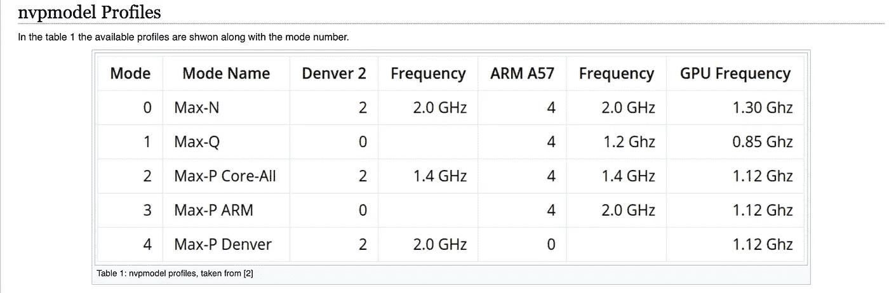

# 优化 arch64 Edge 设备以在 ML 上实现最高性能

> 原文：<https://medium.com/analytics-vidhya/optimizing-arch64-edge-devices-for-maximum-performance-on-ml-cc3d008f675b?source=collection_archive---------9----------------------->


来源 images.google.com

对于深度学习工程师来说，在云基础设施中训练大型模型是一项轻松的任务，例如 [**亚马逊 AWS**](https://aws.amazon.com) ，它在 [**EC2**](https://aws.amazon.com/ec2/) 和 [**Sagemaker**](https://aws.amazon.com/sagemaker/) 中提供高性能计算引擎，以及模型托管等功能。但当涉及到在边缘设备上部署同样沉重的型号，如[**arch V7**](https://archlinuxarm.org/platforms/armv7)(Raspberry 4)和[**arch V8**](https://archlinuxarm.org/platforms/armv8)NVIDIA Jetson 硬件时，这就成了一项艰巨的任务。为了克服 Pi 和 Jetson 等边缘设备的性能问题，我分享了一些优化技术，这些技术可以提高设备的性能，优化深度学习模型。

[**NVIDIA Jetson**](https://www.nvidia.com/en-us/autonomous-machines/embedded-systems/) 是全球领先的嵌入式 AI 计算平台。其用于深度学习和计算机视觉的高性能、低功耗计算使构建软件定义的自主机器成为可能。

Jetson 平台包括具有 GPU 加速并行处理的小型 Jetson 模块、具有开发人员工具和用于构建 AI 应用程序的综合库的 JetPack SDK，以及具有加速开发的服务和产品的合作伙伴生态系统。

NVIDIA Jetson 系列有 4 种类型的设备

1.  杰特森纳米
2.  杰特森 TX1
3.  杰特森 TX2
4.  杰特森 AGX 泽维尔

将机器学习部署到如此强大的边缘设备上总是很有趣，这些设备能够支持几乎所有的深度学习框架，如[**【py torch】**](https://pytorch.org)[**tensor flow**](https://www.tensorflow.org)[**MxNet**](https://aws.amazon.com/mxnet/)**(这也是亚马逊 AWS 正式采用的服务，如**[**【sage maker**](https://aws.amazon.com/sagemaker/)[**Caffe**](https://caffe.berkeleyvision.org)除此之外，NVIDIA 还推出了名为[**Deepstream**](https://developer.nvidia.com/deepstream-sdk)**的强大函数库，在解决物体检测和物体跟踪等问题时派上了用场。**

**尽管在 Jetson 硬件上有如此强大的计算，但在使用强大的深度学习算法(如[**【YOLO】**](https://pjreddie.com/darknet/yolo/)、 [**SSD**](https://arxiv.org/abs/1512.02325) 、 [**Faster-RCNN**](https://arxiv.org/abs/1506.01497) 等)时，性能仍然可能不足。**

**保持每秒 18-20 帧的帧速率是很重要的。**

**作为一名深度学习工程师，我过去遇到过这些问题，但在以有效的方式利用 jetson 机器的计算能力后，我们可以通过实时对象检测模型实现更好的每秒帧数。**

****下面是我们可以调整的指标，以便在 Arch64 架构上获得最佳性能。****

1.  ****运行杰特森时钟。****

**这应该是第一步，因为 jetson_clocks 脚本会禁用 DVFS 调控器，并将时钟锁定到活动 nvpmodel 电源模式定义的最大值。**

```
$ sudo jetson_clocks.sh
```

**2.**创建交换****

**交换空间是当今计算的一个常见方面，与操作系统无关。Linux 使用交换空间来增加主机可用的虚拟内存量。它可以在常规文件系统或逻辑卷上使用一个或多个专用交换分区或交换文件。交换空间是现代 Linux 系统中的第二种内存类型。交换空间的主要功能是当实际 RAM 填满并且需要更多空间时，用磁盘空间代替 RAM 内存。**

```
$ fallocate -l 8G swapfile
$ sudo chmod 600 swapfile
$ sudo mkswap swapfile
$ sudo swapon swapfile
```

**检查内存并交换**

```
$ free -m
```

****3。调整能量分布。****

**Nvidia 提供了更改 CPU 和 GPU 设置的灵活性，以调整 Jetson TX2 的性能和功耗，nvpmodel 工具提供了一些方便且易于切换的能源性能配置文件。**

> **常见的能源概况—**

1.  ****Max Q****

**Nvidia 使用 Max Q 术语来表示最大处理效率，因此在这种模式下，TX2 上的所有组件都配置为最大效率。这种配置使用最佳功率-吞吐量权衡值。**

****2。最大压力****

**为了提高 CPU 的时钟频率，比 Q 消耗更多的功率。这种模式提高了性能，但牺牲了功耗。**

****3。最大数量****

**根据 Nvidia TX2 NVP 模型的定义，在这种模式下，CPU 和 GPU 的时钟频率高于 Max-P，从而进一步降低了功耗。**

**能量分布的比较**

****

**图 arch64 [【维基百科】](https://developer.ridgerun.com/wiki/index.php?title=Nvidia_TX2_NVP_model)的能量分布图**

**为了使用任何配置文件。我个人偏好是 Max-N；)**

```
sudo nvpmodel -m <mode number for desired profile>
```

****4。使用 NVDLA 深度学习推理编译器加速深度学习模型****

**为深度学习设计新的定制硬件加速器显然很受欢迎，但通过新的设计实现最先进的性能和效率是一个复杂而具有挑战性的问题。**

**NVIDIA 深度学习加速器(NVDLA)是一个免费的开放架构，它促进了设计深度学习推理加速器的标准方法。凭借其模块化架构，NVDLA 可扩展、高度可配置，旨在简化集成和可移植性。硬件支持广泛的物联网设备。**

**NVDLA 引入了模块化架构，旨在简化配置、集成和可移植性；它揭示了用于加速核心深度学习推理操作的构建模块。NVDLA 硬件由以下组件组成:**

*   ****卷积核** —优化的高性能卷积引擎。**
*   ****单数据处理器** —用于激活功能的单点查找引擎。**
*   ****平面数据处理器** —用于汇集的平面平均引擎。**
*   ****通道数据处理器** —用于高级标准化功能的多通道平均引擎。**
*   ****专用内存和数据整形引擎** —用于张量整形和复制操作的内存到内存转换加速。**

****5。最后，NVDLA 的替代优化编译器是 TVM 编译器。****

**[**TVM**](https://tvm.ai/about) 是一个开放的深度学习编译器堆栈，适用于 CPU、GPU 和专门的加速器。它旨在弥合以生产力为重点的深度学习框架和以性能或效率为导向的硬件后端之间的差距。TVM 提供了以下主要功能:**

*   **将 Keras、MXNet、PyTorch、Tensorflow、CoreML、DarkNet 中的深度学习模型编译成各种硬件后端上的最小可部署模块。**
*   **在更多后端上自动生成和优化张量运算符的基础设施，性能更好。**

**参考文献—**

1.  **[http://nvdla.org](http://nvdla.org)**
2.  **[https://docs.nvidia.com/jetson/index.html](https://docs.nvidia.com/jetson/index.html)**
3.  **[https://tvm.ai](https://tvm.ai)**