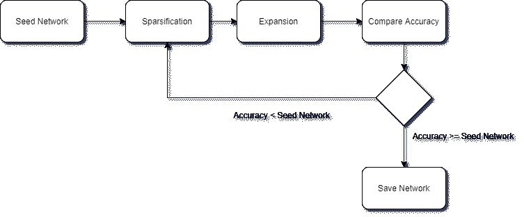
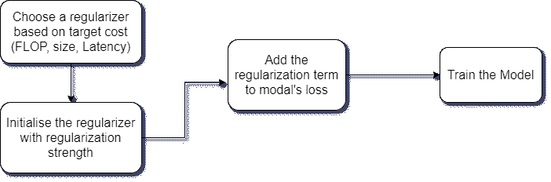
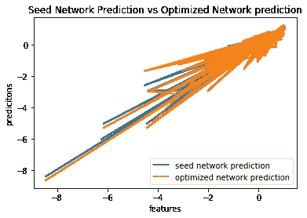

# 用 MorphNet 优化深度神经网络

> 原文：<https://medium.com/analytics-vidhya/optimizing-deep-neural-networks-using-morphnet-e71f74a89e17?source=collection_archive---------16----------------------->

# 介绍

深度神经网络 (DNN)已经被有效地用于解决涉及图像、文本、语音等困难任务。以便将这种深度神经网络部署在诸如手机、汽车部件等资源受限的设备中。需要有一个优化的神经网络，没有多余的连接。这种优化的网络不应该具有比原始网络更低的精度。产生这种优化网络的一种方法是使用 MorphNet。MorphNet 由谷歌于 2018 年**开发并开源。**

理解什么总是很重要的？为什么？又是怎么做到的？对于我们所经历的任何概念。说到这里，让我们试着理解一下 MorphNet。

# 什么是 MorphNet？

*   MorphNet 是一种在训练过程中学习深层网络结构的方法。
*   它将一个工作的神经网络作为输入，产生一个更小、更快、性能更好的优化网络。

# 为什么选择 MorphNet？

*   **目标规则化【MorphNet 用于针对特定任务，如针对 FLOP(每秒浮点运算数)或内存大小或延迟优化网络。**
*   由 MorphNet 生成的优化网络仍然包含与原始网络相同的层数。这是**拓扑变形**。
*   MorphNet 是可扩展的，因为它可以直接应用于任何昂贵的复杂网络。此外，MorphNet 不会产生任何推理开销。
*   MorphNet 是可移植的，因为如果你传送稀疏化的网络就足够了。

# MorphNet 是如何工作的？

MorphNet —算法

*   将待优化的工作神经网络称为种子网络。它可以是[人工神经网络](https://en.wikipedia.org/wiki/Artificial_neural_network)、卷积神经网络[等..](https://en.wikipedia.org/wiki/Convolutional_neural_network)
*   MorphNet 通过*收缩*和*扩展*阶段的循环来优化神经网络。这个循环一直持续到修剪后的扩展网络的精度大于或等于种子网络。
*   它首先通过[稀疏约束优化](https://arxiv.org/pdf/1203.4580.pdf)对神经网络进行正则化，并通过对修剪后的权重进行恢复和再训练来提高预测精度。

## 稀疏化

MorphNet 算法——稀疏化

MorphNet 识别低效神经元，并通过应用稀疏正则化器从网络中剪除它们，使得网络的总损失函数包括每个神经元的成本。我相信你在文章结束时会明白这一点。

## 膨胀

MorphNet 算法—扩展

*   在*扩展阶段*中，使用一个宽度倍增器来均匀扩展所有层的尺寸。基本上，每一层中神经元及其连接的数量都会增加。
*   净效应是将计算资源从效率较低的网络部分重新分配到它们可能更有用的网络部分。

# **实施**

本节显示的代码段解释了将 MorphNet 配置到种子网络所需的必要步骤。

*   稀疏约束优化需要稀疏约束。假设 FLOP 是稀疏性约束，最终目标是获得 FLOP 优化的神经网络。
*   第一步是根据我们的任务选择正则化子。在我们的情况下，它是失败的。MorphNet 还提供其他正则项，如延迟、内存大小。
*   然后，正则化器(实际上是稀疏正则化器)用种子网络的输出边界 ops 和正则化强度(超参数)初始化，正则化强度定义了网络必须被修剪的程度。修剪得越多，网络就越小。较小的网络需要较低的计算能力。
*   我们知道神经网络中的损失只不过是神经网络的预测误差。基于损失更新权重，以便尽可能地减少损失。这个正则化器计算相对于目标资源的神经元成本，在我们的例子中是翻牌。该成本被添加到神经网络的损失中，从而成为稀疏约束优化。

*   加入损失后，网络的训练就发生了(稀疏化)。经过训练的网络的准确性可能较低，因为其中的神经元数量较少。这种经过修剪的稀疏网络可以被传送以实现便携性。

稀疏化

*   在扩展阶段，使用一个宽度乘数来增加每层中的神经元，以达到更好的精度。正常训练网络就够了。

膨胀

# 结果

以下是针对控制预测问题，在[前馈神经网络](https://en.wikipedia.org/wiki/Feedforward_neural_network)上集成 MorphNet 后的结果。

从下面的图中，可以观察到种子网络和 MorphNet 优化网络的预测彼此高度重叠。

# 结论

1.  MorphNet 非常有效，因此在精度损失很少甚至没有损失的情况下，显著减少了模型大小/FLOPs。
2.  MorphNet 虽然高效，但应用速度很快，也很容易实现。
3.  每个机器学习实践者都可以利用 MorphNet 来针对各种应用特定的约束优化模型。

# 参考

*   [阿里尔·戈登、埃拉德·埃班、奥菲尔·纳丘姆、陈博、吴昊、吴昊、爱德华·蔡、 **MorphNet: Fast &深度网络的简单资源受限结构学习**、2018](https://arxiv.org/abs/1711.06798)
*   【github.com/google-research/morph-net 
*   [ai . Google blog . com/2019/04/morphnet-forward-faster-and-small . html](https://ai.googleblog.com/2019/04/morphnet-towards-faster-and-smaller.html)
*   www.wikipedia.org