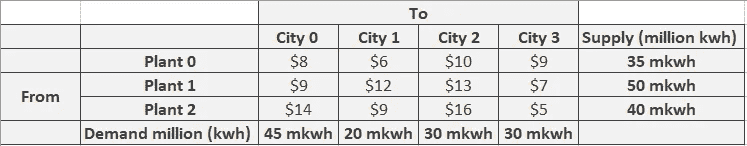

# 利用 PYTHON 优化输电成本

> 原文：<https://medium.com/analytics-vidhya/optimizing-electricity-transmission-cost-using-python-de84e7aee805?source=collection_archive---------9----------------------->

# **问题陈述**

Powerco 有 3 个发电厂，供应 4 个城市的需求，如下表所示。从一家工厂向一个城市输送 100 万千瓦时电力的成本取决于电力必须传输的距离。

这些城市的用电高峰出现在同一时间(下午 2 点)。

**目标:获得满足各城市高峰电力需求的最优成本。**

# 提议的解决方案:

首先，手头的问题是一个**‘运输问题(TP)’**，这是一个特殊类型的线性规划问题(LPP)，其中目标是最小化从多个来源(发电厂)到多个目的地(城市)的产品(在我们的研究中是传输的电力)的配送成本。

**我们将通过在 Python 中实现 Gurobi 优化器来解决这个 TP，如下所示:**

提议的解决方案的过程从从问题陈述中识别集合开始。工厂 0、1、2 和城市(0、1、2、3)是可识别的集合，可建模如下:

接下来，我们将输入现有数据，包括成本矩阵、每个城市的需求和每个发电厂的供应，如下所示:

现在，TP 模型可以被描述为一个 LPP:

值得注意的是，我们没有关于由工厂 I 生产并供应的(百万)kwh 的数量的信息，该数量被进一步发送到城市 j。

因此，现在让我们声明一个变量:

这可以通过如下声明输入到 LP 模型中:

此外，从数学上来说，手头问题的最佳解决方案将意味着计算与将电力从一个工厂输送到一个城市相关联的最小成本，同时牢记供应和需求要求。

目标的数学公式是:

这可以使用 Gurobi 优化器合并到 TP 中，如下所示:

指定了所有这些之后，我们现在将包括约束。这个问题识别了 3 种类型的约束——需求约束、供给约束和非负约束。在这三个中，非负约束写为:

这种限制强调了这样一个事实，即在任何时候，传输的 kwh 数都是正数。然而，这只是理论上写的，由 Gurobi 在后端处理。

剩下的两个约束可以解释如下:

1.  **需求约束**

**2。供应约束**

这些约束可以使用 Python 中的 Gurobi 建模为:

我们的模型现在已经公式化了；让我们打印 Gurobi 优化器计算的优化成本。

**下面的输出表明，在遵守约束条件的情况下，从发电厂向城市输电的优化成本为 1190 美元。**

此外，让我们深入了解提议的计划，看看我们是否满足了所有条件，通过执行**敏感性分析来获得优化的成本。**

上面的输出证明每个城市的需求得到满足，而没有超过任何工厂的供应，例如，对于城市 0，需求是 4500 万 kwh，使用来自工厂 0 的 500 万 kwh 和来自另外两个工厂的 2000 万 kwh 来供应；这仍然没有耗尽每个工厂的最大供应能力，并且每个工厂向任何城市供应的总量保持在整个模型的供应限度内。这证明了 1190 美元的成本是最优的传输成本。

**简单地说，1190 美元的供需平衡传输计划可以被视为:**

