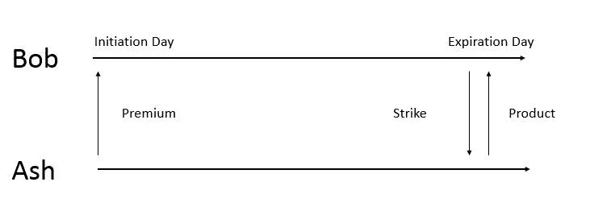

# 选项:了解和评估

> 原文：<https://medium.com/analytics-vidhya/options-get-to-know-and-valuation-ec79e3b38a56?source=collection_archive---------26----------------------->

照片由温德尔·希恩通过 [Unsplash](https://unsplash.com/photos/dWC-Nijufzo) 拍摄

期权在城里并不是什么新鲜事，人们以前已经听过很多次了。然而，他们中的大多数人都被数学模型的定义和复杂性所迷惑。我们将讨论选项，并试图避免定义和数学的本质，而是简单的类比解释，以获得整体画面。

选项分为欧式和美式。美式允许投资者在到期日之前行权，而欧式则不能。这篇文章，将只侧重于欧洲风格。

让我给你讲一个鲍勃和阿什的故事。鲍勃是一名汽酒制造商，阿什拥有数英亩的葡萄园。Bob 需要葡萄来经营他的起泡工厂，Ash 需要顾客来维持运营。由于天气、成熟度和土壤结构等多重因素的影响，葡萄的价格每年都在波动。由于原材料价格不稳定，鲍勃很难维持生产。

几个不眠之夜后，Bob 想到了保障葡萄价格的“看涨期权”,并准备向 Ash 提出这个想法。Bob 将给予 Ash“溢价”作为拥有“期权”的权利，并给予“执行价”作为商定价格。阿什表示同意，并继续谈论“到期日”或“期权”可以行使的那一天。当市场上的葡萄价格高于“执行价格”时，Ash 将根据“执行价格”支付，并有义务供应给 Bob 的工厂。然而，如果市场上的葡萄价格低于“执行价格”，Bob 就不会要求从 Ash 购买，Ash 就可以将“溢价”留在自己的口袋里。听起来很公平，对吧？

图 1 |行使认购期权机制

现在情况发生了变化，因为 Ash 正在寻找客户来维持业务。Ash 向 Bob 提供了“看跌期权”, Bob 同意了这个想法。Ash 将给予 Bob 一笔“溢价”作为拥有“期权”的权利，以及一笔“执行价”作为约定价格。他们进一步讨论了“到期日”或“期权”可以行使的日期。当葡萄的价格高于市场上的“执行价格”时，Ash 不需要卖给 Bob，Bob 可以保留“溢价”。如果市场上的葡萄价格低于“执行价格”，Bob 有义务按照给定的“执行价格”从 Ash 购买。因此，“看跌期权”是“看涨期权”的反义词。

图 2 |行使看跌期权机制

在理解了期权的基本机制之后，无论是看涨期权还是看跌期权，现在你就可以开始下一步了。为了理解期权的价值，我们将用 Black-Scholes 期权定价模型来讨论期权定价。

# 布莱克-斯科尔斯期权估价

1.  **历史**

Black-Scholes (1973)期权定价模型是由迈伦·斯克尔斯和罗伯特·默顿(Robert Merton)为其与费希尔一起开发初始期权定价模型而开发的，该模型用两个风险变量来调整风险。N(d1)是当前股票价格的风险调整系数，N(d2)是行权价格现值的风险调整系数。这项发明获得了 1997 年的诺贝尔奖。

**2。假设**

布莱克-斯科尔斯模型的关键假设包括:

*   回报是正态分布
*   基础资产无收益
*   没有交易成本和税收
*   无风险利率是已知的和恒定的
*   基础资产的波动性是已知的和恒定的
*   期权只能在到期日行使；这只适合欧式风格的选择

**3。型号**

图 3 |布莱克-斯科尔斯公式

ct =长期呼叫值

Pt =长期看跌价值

K =执行价格

T-t =估价日和到期日之间的年数

St =估价日的基础资产

rt =估价日的连续无风险利率

σt =估价日的基础波动率

N( )=标准正态累积分布函数

**4。示例**

我知道数学似乎令人生畏，现在让我们来看看例子。我们将以麦当劳公司为例。

图 4 | Python 上的 Black-Scholes 模型

图 5 | MCD 长呼叫值

就是这样，用 Python 几秒钟就搞定了。

# 结论

期权乍看之下可能有点令人困惑，幸运的是，在你阅读了 Bob 和 Ash 在开头的故事，并深入研究了 Black-Scholes 期权估价之后，现在你已经完全理解了期权的基本原理。

# 参考

*   布莱克和斯科尔斯(1973 年)。期权和公司债务的定价。*政治经济学杂志*， *81* (3)，637–654。
*   j . c . Gardner 和 c . b . McGowan Jr .(2012)。使用 Black-Scholes 期权定价模型和从互联网下载的数据评估可口可乐和百事可乐期权。*《商业案例研究杂志(JBCS)】*， *8* (6)，559–564。
*   Gottesman，A. A. (2016)。*衍生品基础:远期、期货、期权和掉期简介*。新泽西州霍博肯:威利。
*   [https://finance.yahoo.com/quote/MCD/options?p=MCD&日期=1610668800](https://finance.yahoo.com/quote/MCD/options?p=MCD&date=1610668800)
*   [https://trading economics . com/United States/国债收益率](https://tradingeconomics.com/united-states/government-bond-yield)

> 免责声明:
> 
> 本材料仅供一般参考，不作为专业建议。提供的信息没有考虑投资目标、风险承受能力或财务状况。