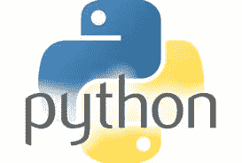
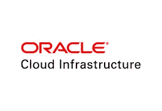

# Oracle 云基础设施(OCI) Python SDK:自动化资源管理

> 原文：<https://medium.com/analytics-vidhya/oracle-cloud-infrastructure-oci-python-sdk-automating-resource-management-17d75bec33c4?source=collection_archive---------4----------------------->

如何在不使用云控制台的情况下管理我们的云资源？AWS、GCP、微软 Azure 和甲骨文 clouds 提供 Python SDKs，允许开发者使用 Python 访问云资源。开发人员可以访问各种功能，这些功能为我们提供有关已分配资源的数据，控制更改资源，甚至自动化一些资源以…