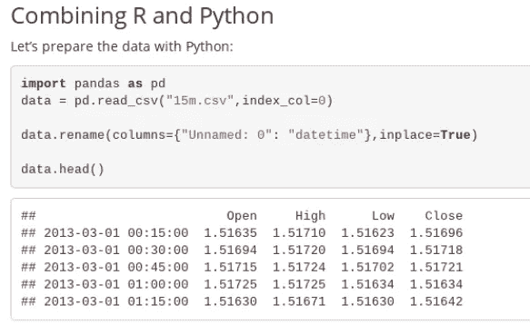
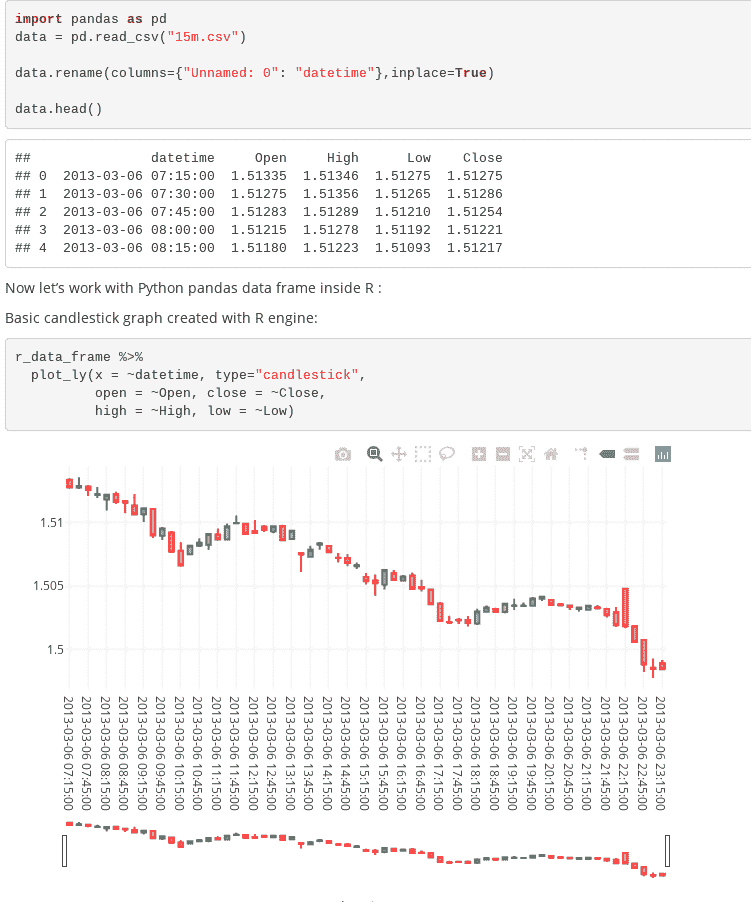

# 用 Python 和 R 编制带有 Rmd 文件的动态报告

> 原文：<https://medium.com/analytics-vidhya/orchestrating-dynamic-reports-in-python-and-r-with-rmd-files-b0d7d1615481?source=collection_archive---------23----------------------->

*要不要用 Python 提取 csv 文件，用 R 可视化？用 R 准备一切并用 Python 做结论听起来怎么样？如果您知道正确的库和技术，两者都是可能的。在这里，我们将在一个分析中使用两种语言遍历一个用例。*

## **Python 里面 R 反之亦然**

用 Python 和 R 编写的几个支持包允许分析师在一个 Python 或 R 脚本中结合 Python 和 R。熟悉 R 的人可以使用 [reticulate](https://rstudio.github.io/reticulate/) 包在 R 内部调用 Python 代码，然后，一个 R 脚本就可以在 Python 和 R 之间互操作了(Python 对象被翻译成 R 对象，反之亦然)。但是，如果您使用 Python，但是想要使用 R 的一些功能，可以考虑使用用 Python 编写的 [rpy2](https://rpy2.readthedocs.io/en/version_2.8.x/introduction.html) 包来启用嵌入式 R 代码。

R markdown 是一个流行的框架，用于将代码和结果组合成一个输出，它提供了一个优雅的 Python 和 R 集成。我们将在一个 Rmd 脚本中创建一个结合了两种语言的动态报告。我们将使用[外汇交易数据](https://en.wikipedia.org/wiki/Foreign_exchange_market)来捕捉 15 分钟间隔内的价格变动，然后绘制一个交易分析师在定价模型中使用的蜡烛图( [OHLC](https://www.investopedia.com/terms/o/ohlcchart.asp) 图表)。

## **在 R Markdown 文档中用 Python 代码运行 R**

一个 R markdown，或 Rmd，是一个包含文本或注释(与文本格式相结合)以及用``包围的 R 代码块的文本文件。在 R 或 R Studio 中，您可以从文件中创建有用的报告，并以 HTML、pdf 或 word 等输出格式呈现。但是，主要的好处是源代码、输出和注释都包含在一个文件中，便于团队之间的协作。

即使是 R 爱好者也可能不知道 Rmd 文件可以包含 Python 块。更方便的是，对象在环境之间共享，允许程序员用 Python 调用对象，用相反的语言调用 R。

## **使用 Python 进行 R Markdown**

让我们看看如何在 Rmd 中使用 Python。首先，确保 Python 安装在您的计算机上，并且您计划在 Rmd 中使用的所有 Python 库或模块都已安装(如果愿意，可以使用 pip works 和[虚拟环境](https://www.lukaskawerau.com/rmarkdown-with-python-and-virtual-envs/))。

在 Rmd 文件中，Python 代码块类似于 R 块:Python 代码放在标记内:` ` `{python}和` ``。

下面是一个简单的嵌入 Python 代码的 R markdown:

在上面的例子中，csv 是在 pandas 库的帮助下加载的，一列被重命名，第一行被打印。在文件标题中，报告用###定义，并打印单个作者注释。下面是我们运行 Rmd 时的结果:

除了代码和输出之外，还打印了标题和作者注释。现在已经使用 Python 加载了数据，可以在 R:

R 代码以``{r}开头，以` `结尾。代码后面是 Python 块和 R 代码中引用的对象。在我们的例子中，R 对象是在 reticulate 包的帮助下从 Python 对象转换而来的。py$data 命令检索在 Python 中创建的对象，并将其转换为 R 数据框架。现在，当 R 数据帧被创建时，它可以在 R 代码中进一步使用。

下面是输出的样子:

现在我们将继续使用 R，并创建一个交易者经常使用的可视化图形:蜡烛图。下面是在 [plotly](https://plot.ly/r/candlestick-charts/) 库中编写的[烛台](https://en.wikipedia.org/wiki/Candlestick_chart)图的 R 代码:

这应该会显示以下内容:

这个简单的例子演示了如何使用 Python 和 R 来创建报告。流行的 Python pandas 库用于加载和数据准备。然后，R 用于可视化。

可以创建一个 R 数据对象，然后在 Python 环境中引用它。下面是一个这样的例子，其中创建了一个带有 Python mpl_finance 模块的可视化:

就是这样！现在，您可以选择使用哪种语言，或者让您的团队以他们喜欢的语言进行协作。

## **Rmd 入门**

热门平台(如:Coursera、Udemy、Vertabelo Academy、Data Camp)都有 r 和 Python 课程。数据可视化概念也包含在许多。R 和 Python 对于数据科学来说都很棒，而且两者都可以工作。如果你被鼓励开始学习，考虑一下这些:

1.  在 Coursera 上，有一个关于可再生研究和 R markdown 基础知识的很棒的课程:

[https://www . coursera . org/lecture/reproducible-research/r-markdown-5NzHN](https://www.coursera.org/lecture/reproducible-research/r-markdown-5NzHN)

2.如果你不熟悉 R，Data Camp 在这里有很好的介绍:

[https://www.datacamp.com/courses/free-introduction-to-r](https://www.datacamp.com/courses/free-introduction-to-r)

3.作为 Vertabelo Academy 的作者，我个人可以推荐我们的 Python 和 R 课程。他们特别关注那些有商业背景的人:

[https://academy.vertabelo.com/course/python-data-science](https://academy.vertabelo.com/course/python-data-science)

https://academy.vertabelo.com/course/data-visualization-101

4.Edx 有很多 Python 和 R 的课程，包括哈佛，IBM，微软的。对于 Python 初学者，可以试试这个 IBM 的课程:【https://www.edx.org/course/python-basics-for-data-science-2 

## **总结**

Python 和 R 是当今最热门的数据科学语言。熟悉这两者是有好处的，因为项目可能需要它们各自的方面。有许多包可以帮助集成这两种用例。一个是 R markdown，一种用于在 R. Rmd 文件中制作动态文档的文件格式，无缝集成了可执行代码和注释。在 reticulate 包的帮助下，可以很容易地在 Python 中访问 R 对象，反之亦然。分析师现在不需要在 Python 和 R 之间做出选择——将两者集成到一个文件中是可能的。