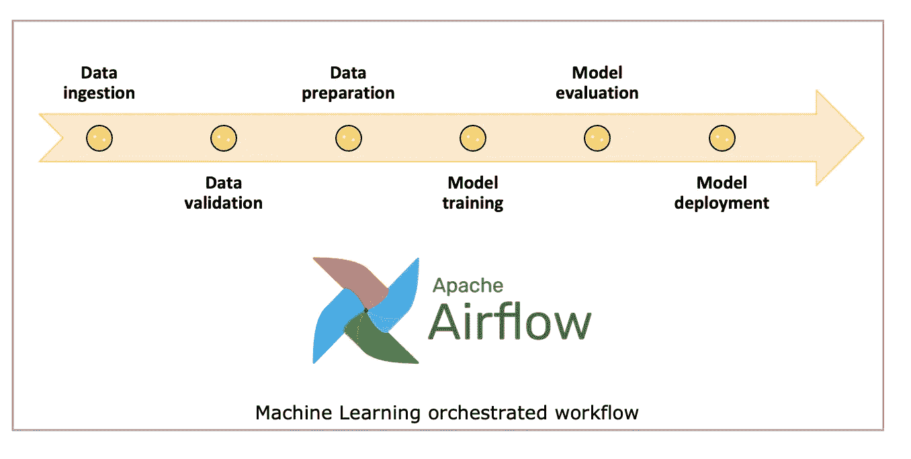

# 使用 Apache 气流为 MLOps 编制机器学习实验

> 原文：<https://medium.com/analytics-vidhya/orchestrating-machine-learning-experiments-for-mlops-using-apache-airflow-dcbc0bab3801?source=collection_archive---------3----------------------->

如今，越来越多的机器学习模型投入生产，对采用人工智能功能的公司来说，运营整个机器学习工作流程的需求变得至关重要。

我们可以使用 Apache Airflow 平台来编排机器学习的不同阶段

机器学习实验通常遵循一组预定义的阶段，例如: