# 线性回归的普通最小二乘法(OLS)

> 原文：<https://medium.com/analytics-vidhya/ordinary-least-square-ols-method-for-linear-regression-ef8ca10aadfc?source=collection_archive---------0----------------------->

这篇文章是关于简单线性回归的普通最小二乘法(OLS)。如果您是线性回归的新手，请阅读这篇文章，了解简单线性回归的实现。这篇文章将帮助你逐步理解简单线性回归是如何工作的。

简单线性回归是一种模型，它有一个与响应(因变量或目标变量)y 有关系的单个回归变量(自变量)x

y =β0+β1 x+ε—————( 1)

其中β0:截距

β1:斜率(未知常数)

ε:随机误差分量

这是一条线，其中 y 是我们要预测的因变量，x 是自变量，β0 和β1 是我们需要估计的系数。

**β0 和β1 的估计:**

OLS 方法用于估计β0 和β1。OLS 方法寻求最小化残差平方和。这意味着从给定的数据中，我们计算从每个数据点到回归线的距离，平方它，以及所有平方误差的总和。

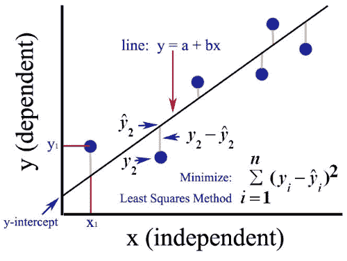

从等式(1)我们可以写出

yi = β0 + β1 x + εi， *i* = 1，2，…..n————( 2)

等式(2)是一个样本回归模型，根据 n 对数据(yi，)写成(i = 1，2，…)..，n)。因此，最小二乘准则为

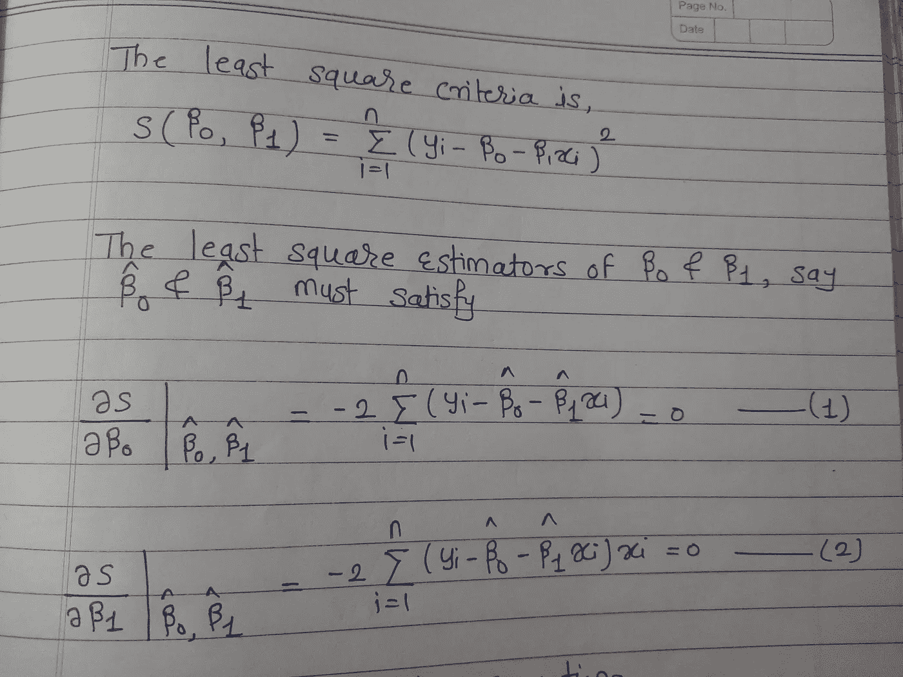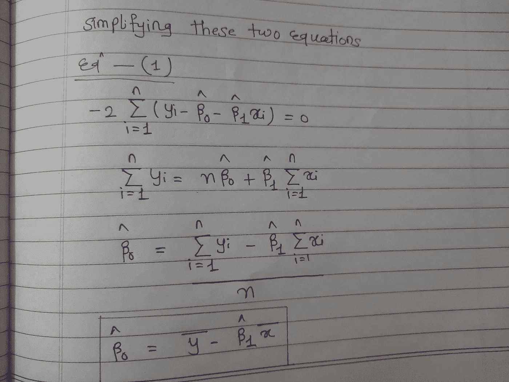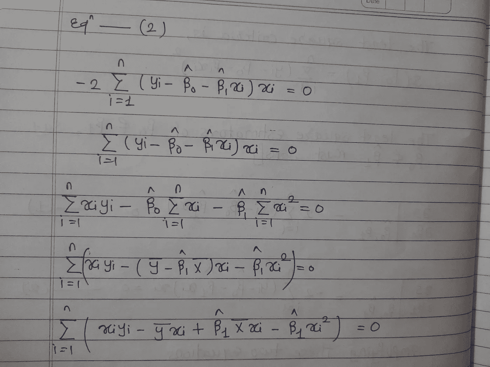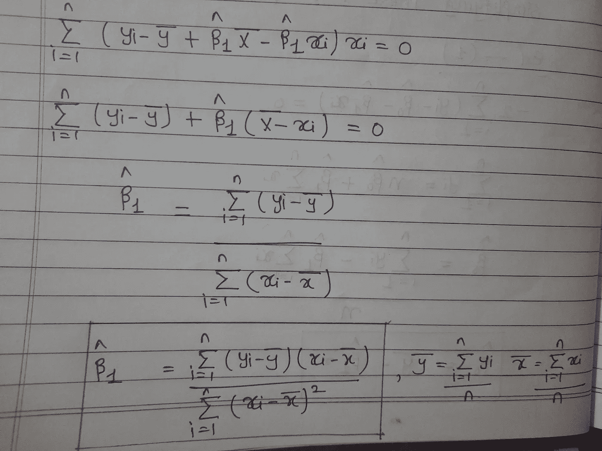

普通最小二乘法

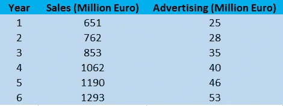

我们举个简单的例子。该表显示了制造公司的一些数据。表格中的每一行都显示了一年的销售额和该年的广告支出。这里我们的目标变量是销售——我们想要预测的。

线性回归估计销售额= β0 + β1 *(广告)

**估计斜率(β1):**

1.  计算 x 和 y 的平均值

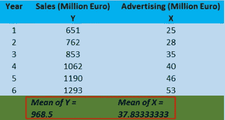

2.根据平均值计算每个变量的误差

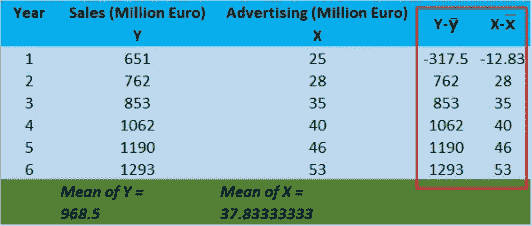

3.将每个 x 的误差乘以每个 y 的误差，并计算这些乘积的总和

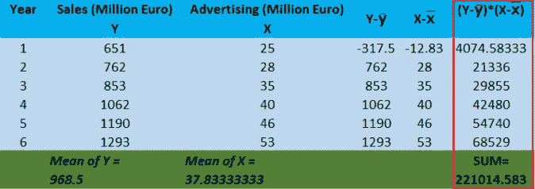

4.从这些平方值的平均值和总和中求每个 x 值的残差的平方

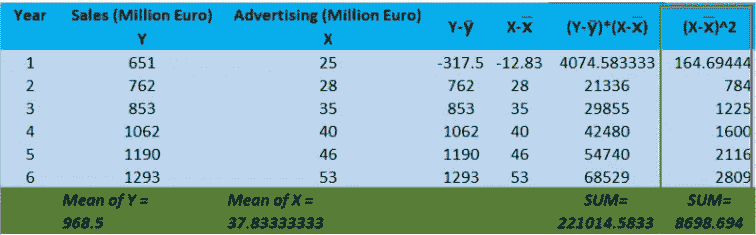

现在我们有了所有的值来计算斜率(β1) = 221014.5833/8698.694 = 25.41

**估计截距(β0):**

β0 =均值(y)-(β1 ***** 均值(x))

我们已经知道了计算β0 的所有值。

β0 = 968.5-(37.83333333*25.41)=7.239

**做预测:**

现在，我们有了简单线性回归的系数。

y = 7.239 + 25.41* x

让我们对我们的数据进行预测。

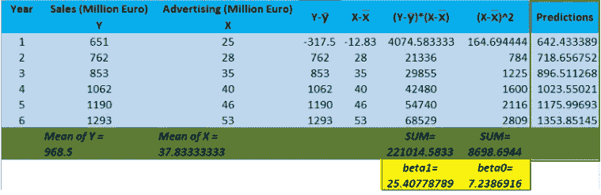

**估计误差:**计算我们预测的误差(均方根误差或 RMSE)

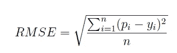

均方根误差

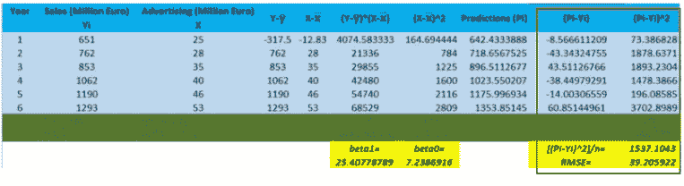

根据计算的 RMSE，我们可以说每个预测平均误差约为 39.2059 个单位。

我们可以使用优化技术，通过最小化模型对数据的误差来计算系数。你可以在给定的链接上阅读我关于优化的文章。

[https://medium . com/@ aishwaryagulve 97/implementation-of-random-gradient-descent-1d 36 b 6 A0 c 013](/@aishwaryagulve97/implementation-of-stochastic-gradient-descent-1d36b6a0c013)