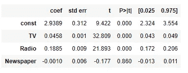

# 普通最小平方(OLS)回归

> 原文：<https://medium.com/analytics-vidhya/ordinary-least-squared-ols-regression-90942a2fdad5?source=collection_archive---------1----------------------->

## 口译:

OLS(普通最小二乘)回归是最简单的线性回归模型，也称为线性回归的基础模型。虽然它是一个简单的模型，但在机器学习中，它并没有被赋予太多的权重。OLS 就是这样一个模型，它告诉你的不仅仅是整个模型的准确性。它还会告诉你每个变量的表现，如果我们有不想要的变量，如果数据中有自相关，等等。

它也是更容易理解和更直观的技术之一，并且它为学习更高级的概念和技术提供了良好的基础。这篇文章解释了如何使用 statsmodels Python 包执行线性回归。

**注:**还有一种 Logit 回归，类似于 Sklearn 的 Logistic 回归，对分类问题有效。

OLS 反映了 X 和 y 变量之间的关系，遵循简单的公式:

y = b1X+B0 #简单线性

𝑦 = b0 + b1X1 + b2X2…+𝜀#多线性

在哪里

b0 — y —截距

b1、b2 —斜率

x，X1，X2-预测值

y-目标变量

OLS 是一种估计量，其中 b1 和 b0 的值(来自上述等式)以这样的方式选择，即最小化观察的因变量和预测的因变量之间的差的平方和。这就是为什么它被命名为普通最小二乘法。

此外，当模型试图降低预测和实际之间的误差率时，这意味着它试图减少损失并更好地预测。你试图预测你的预测者对结果的影响。

**注意:**理想情况下，在使用 OLS 计算模型构建之前，需要满足线性假设。本文的目的是解释 OLS 模型中的所有元素。

让我们更好地理解这个例子，我取了一个简单的数据集——广告数据:

考虑中的数据。数据形状是 200x4

在线性模型中，1 变量的系数依赖于其他自变量。因此，如果数据减少或增加，将会影响整个模型。例如，假设在未来，我们也有另一种广告媒体，比如社交媒体，我们将不得不重新拟合和计算系数和常数，因为它们取决于数据集的维度。

如果您想查看多元线性回归的公式:

 [## 多元线性回归

### 多元线性回归(MLR)，也简称为多元回归，是一种统计技术，使用…

medium.com](/@nishigandha.sharma.90/multi-linear-regression-6ea7a16c9fe7) 

所以实际上，不断添加变量并检查它们的线性关系是不可行的。这个想法是使用以下两个步骤来选择最佳变量:

1.领域知识

2.统计检验-不仅是参数和非参数检验，还检查自变量之间是否存在多重共线性以及与目标变量的相关性。

关联热图

在这里，我们快速检查数据的相关性，很明显，销售和电视广告有很强的相关性。比如说，广告的增加会导致销售额的增加，但是如果像报纸这样的媒体的读者群很低，也可能导致负相关。

因此，获得正确的变量是任何模型构建最重要的一步。这将有助于降低处理成本，同时建立正确的机器学习模型。

**步骤 1:** 导入库并添加常量元素。我们这样做是因为当所有其他包含的回归变量都设置为零时，我们希望我们的因变量取非零值。该值将显示为常数，即 1。稍后当我们形成模型时，在我们的多元线性公式中，常数值的系数将是 b0。

带有常数的 x 个变量

**第二步:**拟合 X 和 y 变量，检查汇总。现在让我们跑一跑，看看结果。我们将解释该汇总表的每一部分。

OLS 模型

为了便于解释，我们将摘要报告分为 4 个部分。

**第一节:**

总的来说，我们的模型表现良好，准确率达 89%。让我们快速切入，首先从左上角部分开始:

左上部分

这一部分给出了模型的基本细节，你可以阅读和理解，比如 y 变量是什么，模型是什么时候建立的等等。让我们来看看红色 Df 残差中突出显示的元素和 Df 型号:

**Df 残差:**在我们理解这个术语之前，让我们先理解什么是 Df 和残差:

*Df* 这里是自由度(Df ),表示在不违反任何约束的情况下，分析中可以变化的独立值的数量。

*回归中的残差*简单来说就是模型无法解释的误差率。它是数据点和回归线之间的距离。

残差=(观察值)——(拟合值/期望值)

***df(残差)*** 是样本量减去被估计的参数个数，所以变成 df(残差)= n — (k+1)或 df(残差)= n -k -1。

因此，我们的计算是:

200(总记录)-3(X 变量的数量)-1(自由度)

**Df 模型:**数据中 X 个变量的简单数量，不包括常量变量 3。

**第二节:**

右上部分

**R 平方:**它是因变量 y 的变化程度，由 X 中的因变量来解释。就像在我们的情况下，我们可以说，对于给定的 X 变量和一个多元线性模型，89.7%的方差由模型来解释。在回归分析中，这也意味着我们的预测值与实际值(即 y. R2)接近 89.7%，并达到 0 到 1 之间的值。

R2 分数的缺点是，X 中变量的数量越多，R2 倾向于保持不变，或者增加很小的数量。然而，新增加的变量可能重要，也可能不重要。

***R2 =模型解释的方差/总方差***

**OLS 模式:**整体模式 R2 为 89.7%

**调整的 R 平方:**这解决了 R2 评分的缺点，因此被认为更可靠。R2 没有考虑对模型不重要的变量。在一元线性回归中，R2 值和调整后的 R2 值是相同的。如果模型中加入更多的无关紧要的变量，R2 与调整后的 R2 之间的差距将会继续扩大。

***调整后的 R 平方= 1—[(1—R2)*(n—1))/(n—k—1)]***

其中 n —记录的数量，k 是除常数外的重要变量的数量。

**OLS 模型:**模型调整后的 R2 为 89.6%，比 R2 低 0.1 个百分点。

**F-统计量和概率(F-统计量):**此处方差分析应用于具有以下假设的模型:

**H0:** b1，b2，b3(回归系数)为 0 或者没有自变量的模型更好的拟合数据。

**H1:** 系数(b1，b2，b3)中至少有一个不等于 0，或者具有独立变量的当前模型比仅截距模型更适合数据。

实际上来说，让所有的自变量的系数都为 0 是不太可能的，我们最终会拒绝零假设。然而，有可能每个变量本身都没有足够的预测性，没有统计学意义。换句话说，你的样本提供了足够的证据来断定你的模型是显著的，但不足以断定任何单个变量是显著的。

***F-统计量=解释方差/未解释方差***

**OLS 模型:**F-stat 概率为 1.58e-96，远低于 0.05 即 orα值。它仅仅意味着得到至少一个非零值系数的概率是 1.58e-96。

**对数似然值:**对数似然值是对任何模型的拟合优度的度量，或用于导出最大似然估计量。值越高，模型越好。我们应该记住，对数似然可能介于-Inf 到+Inf 之间。因此，绝对看值不能给出任何指示。估计量是通过求解获得的，也就是说，通过找到使观察样本的对数似然最大化的参数。

**AIC 和 BIC:** 阿凯克信息准则(AIC)和贝叶斯信息准则(BIC)是两种评分和选择模型的方法。

**AIC = -2/N * LL + 2 * k/N**

**BIC = -2 * LL + log(N) * k**

其中 N 是训练数据集中示例的数量，LL 是训练数据集中模型的对数似然，k 是模型中参数的数量。

如上所述，分数被最小化，例如选择具有最低 AIC 和 BIC 的模型。

计算出的数量与 AIC 不同，尽管可以证明与 AIC 成比例。与 AIC 不同，BIC 因模型的复杂性而对其进行更多的惩罚，这意味着更复杂的模型将具有更差(更大)的分数，从而更不可能被选中。

**第三节:**

低吠声..这是很多信息。我们还有两个部分要讲，让我们直接进入中心部分，这是总结的主要部分:

中央部分

现在我们知道，列 ***coef*** 是 b0、b1、b2 和 b3 的值。所以这条线的方程式是:

y = 2.94 + 0.046 *(电视)+ 0.188*(广播)+ (-0.001)*(报纸)

***Std err*** 是每个变量的标准误差，是变量离回归线的距离。

***t 和* P > |t|: t** 简单来说就是每个变量的 t-stat 值，假设如下:

**H0:** 斜率/系数= 0

**H1:** 斜率/系数不= 0

在此基础上，它给出了 t 统计值，而 **P > |t|** 给出了 P 值。当 alpha 为 5%时，我们测量变量是否显著。

**【0.025，0.975】**—在默认的 5% alpha 或 95%置信区间，如果 coef 值位于该区域，我们说 coef 值位于可接受区域内。

查看 p 值，我们知道我们必须从列表中删除“报纸”,它不是一个重要的变量。在此之前，让我们快速解释一下模型的最后一部分。

**第四节:**

底部截面

**综合的:**他们测试一组数据中已解释的方差是否明显大于未解释的方差。这是对残差的偏斜度和峰度的测试。我们希望综合得分接近 0，其概率接近 1，这意味着残差遵循正态分布。

在我们的例子中，综合得分非常高，远远超过 60，其概率为 0。这意味着我们的残差或误差率不遵循正态分布。

**偏斜—** 其数据对称性的一种度量。我们希望看到接近零的东西，表明残差分布是正态的。注意，这个值也驱动综合。

我们可以看到，我们的残差是负偏的，为-1.37。

**峰度—** 它是数据曲率的度量。更高的峰值导致更大的峰度。峰度越大，可以解释为残差在零附近的聚类越紧密，意味着模型越好，离群值越少。

查看结果，我们的峰度是 6.33，这意味着我们的数据没有异常值。

**德宾-沃森—** 德宾-沃森(DW)统计是对统计回归分析中残差的自相关性进行的测试。德宾-沃森统计值将总是在 0 和 4 之间。值为 2.0 意味着在样本中没有检测到自相关。

*德宾-沃森*值为 2.084，非常接近于 2，我们认为数据不具有自相关性。

注:自相关，也称为序列相关，它是观测值之间的相似性，是它们之间时滞的函数。

**Jarque-Bera(JB)/Prob(JB)—**JB score 简单地用以下假设检验残差的正态性:

H0:残差服从正态分布

H1:残差不服从正态分布

Prob(JB) 非常低，接近于 0，因此我们拒绝零假设。

**Cond。编号:**条件编号用于帮助诊断共线性。共线性是指一个独立变量接近于一组其他变量的线性组合。

在我们的例子中，条件数是 454，当我们减少变量时，让我们看看分数是如何减少的。

好了，我们的文章快结束了，我们已经看到了这个 OLS 模型中每一个元素的解释。最后一节，我们更新了 OLS 模型并比较了结果:

如果我们看看我们的模型，只有 p 值为 0.86 的报纸高于 0.05。因此，我们将在移除报纸后重建一个模型:

更新的 OLS 模型(移除报纸)

**请注意**如前所述，每个变量的系数值相互依赖。因此，我们应该总是一列一列地删除，这样我们就可以测量差异。

当我们拿走报纸时，我们的精度水平不会改变，但是系数已经更新。然而，AIC，BIC 分数和 Cond。没有。减少了，这证明我们提高了模型的效率。

哇！我们终于到了这篇文章的结尾。我们在上面解释的 OLS 模型中有许多要素。我试图简化并阐明 OLS 总结的每一部分。

如果你有任何疑问，请在评论中提问，如果你发现有什么不对劲，请让我知道。

如果你从这篇文章中学到了新东西，请鼓掌。

参考资料:

1.[https://realpython.com/linear-regression-in-python/](https://realpython.com/linear-regression-in-python/)

2.[https://www . stats models . org/dev/examples/notebooks/generated/ols . html](https://www.statsmodels.org/dev/examples/notebooks/generated/ols.html)

3.http://www.stat.yale.edu/Courses/1997-98/101/linreg.htm

4.[https://statistics byjim . com/regression/ols-linear-regression-assumptions/](https://statisticsbyjim.com/regression/ols-linear-regression-assumptions/)