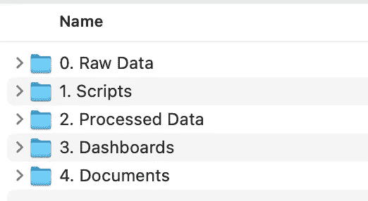
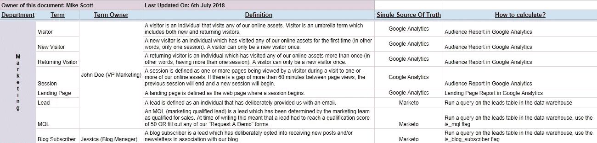
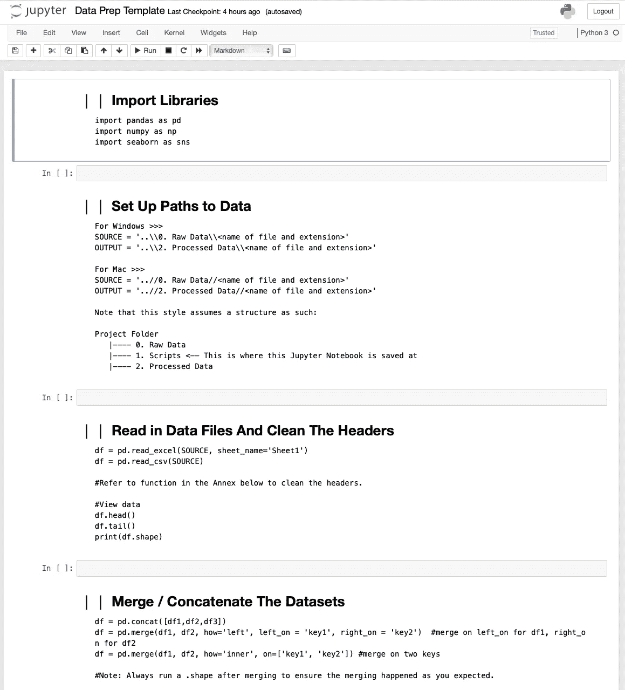

# 组织您的数据分析工作流程

> 原文：<https://medium.com/analytics-vidhya/organise-your-data-analytics-workflow-63f910071d0e?source=collection_archive---------14----------------------->

# 概观

有没有想过为什么你的数据分析(DA)项目每天都变得越来越乱，有没有一个标准的工作流程来组织你的 DA 项目？当我开始我的 DA 之旅时，我遇到了这个问题，幸运的是，我已经找到了最适合我的工作流程。你可以试试这个，也许你会喜欢它😃

# 步骤 1:创建文件夹

每个 DA 项目总是从这些文件夹开始

创建上述文件夹，并相应地放置您的文件。文件夹以数字开头，这样就可以很容易地按文件夹名称对它们进行排序。如果你打算把每个文件都转储到一个通用文件夹中，时间一长就会变得很乱。其他人也很难理解你的项目。

## 0.原始数据

此文件夹包含未经任何处理的原始数据集。它可以是在。csv 或。xlsx 格式。

## 1.剧本

该文件夹将存储您的 python 或 R 脚本，脚本将从存储在`0\. Raw Data`文件夹中的文件中读取。

## 2.处理过的数据

脚本生成的所有已处理数据都将存储在该文件夹中。

## 3.仪表板

图形、图表或 tableau 文件可以存储在该文件夹中。

## 4.文档

其他文件，如数据字典或文献综述可以放在这里。

# 步骤 2:创建数据字典

**数据字典是描述数据库的内容、格式、结构及其元素之间关系的一组信息。**创建和维护字典可能是一件麻烦的事情，但从长远来看，它非常有用，尤其是当项目涉及多个利益相关方时。

# 步骤 3:创建数据准备模板

当您执行[数据清理或数据预处理](/sciforce/data-cleaning-and-preprocessing-for-beginners-25748ee00743)时，您将导入相同的库、相同的数据清理过程等。因此，为什么不创建一个模板，以便您可以继续使用它，省去从头开始键入所有内容的麻烦。

这里有一个使用 jupyter notebook 创建的[数据准备模板](https://github.com/blurboy1985/Data-Prep-Template/blob/master/1.%20Scripts/Data%20Prep%20Template.ipynb)。这是数据准备过程的快速开始。您可以在其他项目中重复使用它。

# 最后一步:为你的项目创建一个列表

跟踪你已经完成或正在进行的所有项目是必须的！如果你将来有类似的项目，这个列表将是你参考的少数工具。

> 快速提示——为每个项目添加一个日期，这样您就可以轻松地将它们分成不同的年份或月份。