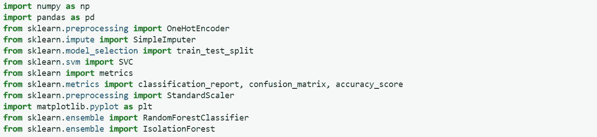
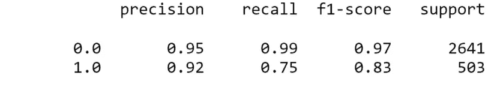
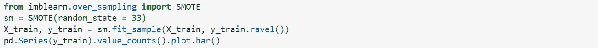
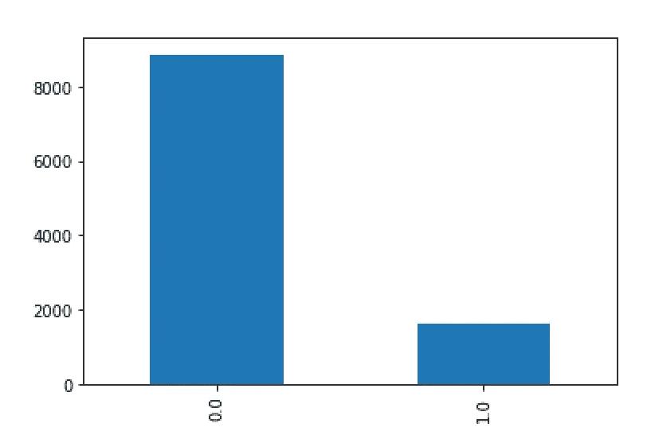
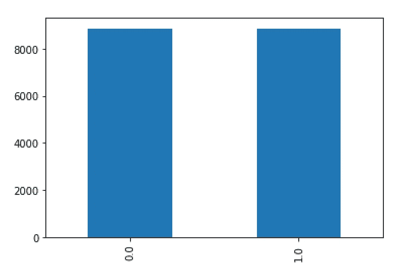
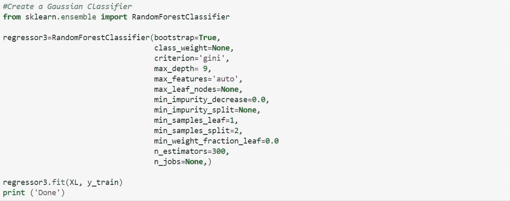
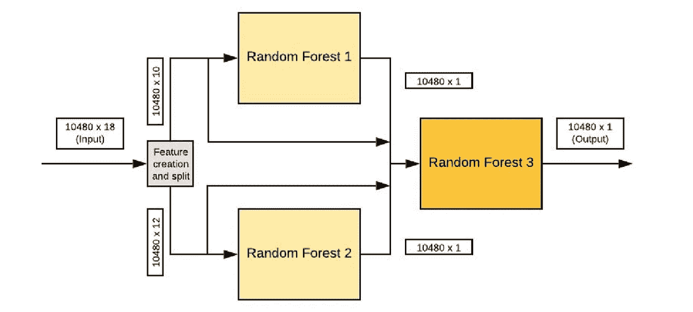
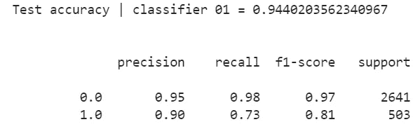
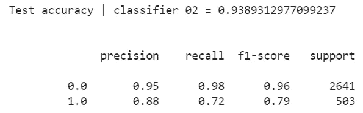
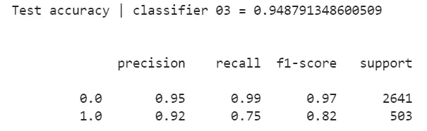

# 使用随机森林的网上购物者购买意愿

> 原文：<https://medium.com/analytics-vidhya/ospi-mul-randomforests-156acdb73fd9?source=collection_archive---------9----------------------->

## 具有功能分割的多个随机森林| sklearn

通过观察在线购物者在所考虑的在线平台上的行为(通常是在购物网站上的行为)来预测他们的购买兴趣是一个有趣的话题。另外，如果你对机器学习(ML)感兴趣，这是一个很好的话题来探索和实践你的 ML 知识。在本文中，我们将主要关注我们使用的模型和一些技巧来提高交叉验证的准确性。这是我们发表的系列文章的第二篇，在第一篇文章中，我们讨论了与我们使用的数据集相关的预处理和特征工程。请随意点击[链接](/@minikiraniamayadharmasiri/preprocessing-data-for-predicting-online-shoppers-purchasing-intention-ml-ba78186b7e85)查看。

**你需要什么？**

太简单了。您将需要一个 jupyter 笔记本，并导入以下库。

1.  Numpy
2.  熊猫
3.  Sklearn

除此之外，通过点击[链接](https://www.kaggle.com/roshansharma/online-shoppers-intention)下载数据集，并通过上面的链接阅读我们的第一篇文章。

将必要的库导入 jupyter-notebook

通常，我们的做法是从逻辑回归开始，看看它如何在数据集上工作。在这种情况下，我们能够在测试集上获得 0.781 的准确度。然后，我们在 sklearn-python 的帮助下尝试了一个 SVM，我们能够获得 0.891 的精度。然而，在初始阶段，即使使用随机森林或神经网络，我们也无法获得超过 0.900 的精度。

**为什么精度不超过 0.900？**

当我们观察训练数据集时，我们清楚地发现数据集偏向于“0”收入。这实际上会影响我们用来训练和预测的任何模型。最大的问题是，尽管所有的模型都有较高的预测“0”收入的准确性，但预测“1”收入的准确性却非常低。事实上，当我们计算类的精确度时，这是非常清楚的。

随机森林分类器的分类精度

为了迎合这种情况，最初的步骤是对训练数据集进行过采样，并在收入中创建平衡。

使用 sklearn - SMOTE 进行过采样

过采样前后的收入

即使在过采样之后，精度也没有提高到预期水平。所以我们不得不尝试不同的方法来提高精确度。

**具有特征分割的多个随机森林**

使用 sklearn 的 randomforest 分类器示例

在我们尝试的所有模型中，random forest 能够在测试数据上提供最高的交叉验证准确性。因此，动机是使用多个随机森林，并通过将特征分成组来训练它们，我们认为这将提高交叉验证的准确性。在这种情况下，我们使用了两个随机森林分类器，并用不同的特征集训练它们。接下来使用这两个随机森林的结果和所有初始特征，训练另一个随机森林以获得最终结果。总共有三个随机森林一起工作来预测收入。

模型的框图

但是，将两个随机森林的要素分成两组是至关重要的。总共有 14 个特征，如果两个随机森林被提供了所有的特征而没有分裂，那么这两个随机森林的结果将是相同的。那么使用两个随机森林的意图就不满足了。因此，将特征分成两组，并分别训练前两个随机森林。当我们观察前两个随机森林的结果时，我们能够如预期的那样识别两个分类器的结果中的细微差异。

前两个随机森林的分类报告

下一步是将这两个预测结果与初始输入特征结合起来，并训练第三个也是最后一个分类器以获得最终结果。在这一步中，我们希望第三个模型通过考虑所有特征，以更符合逻辑的方式合并前两个模型的预测，并给出最终预测。正如预期的那样，第三个分类器的准确性提高了，这证明了我们最初的假设是正确的！

最终随机森林分类报告

**为什么在某些情况下，具有特征分裂的多个随机森林更好？**

尽管在大多数情况下，一个随机森林就足够了，但在某些情况下，多个随机森林可能有助于提高准确性。如果您的要素可以清楚地识别为两个或多个独立的集合，那么使用带有要素分割的多个随机森林可能会改善您的结果。通过考虑标注的相关性来分割要素也是一种很好的做法，但是要小心，这可能会导致过度拟合。然而，最好的方法是通过考虑它们在该领域的技术意义来分割特征。

访问我们的 GitHub [库](https://github.com/Isuru-Dissanayake/OSPI-kaggle)获取代码和更多细节。