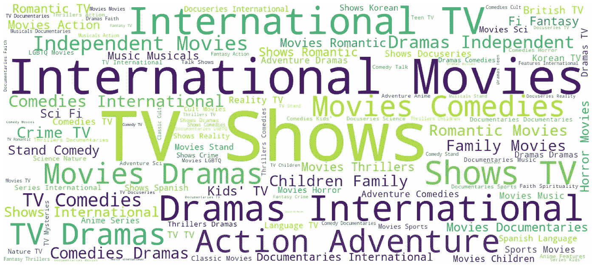
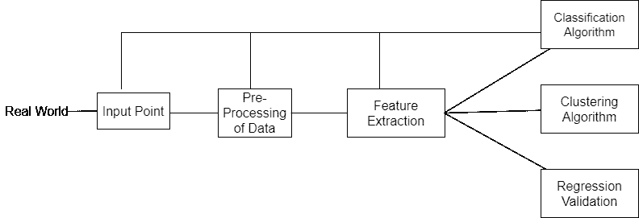
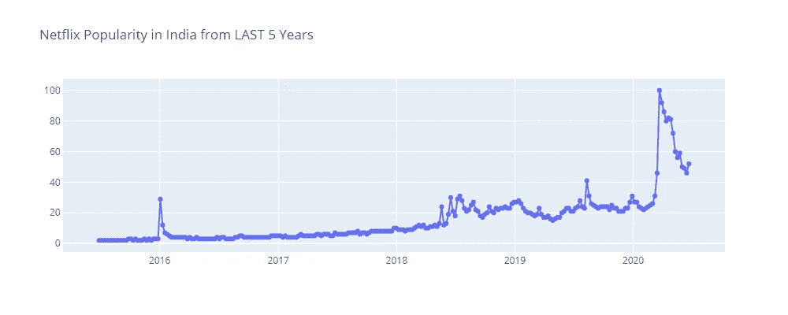
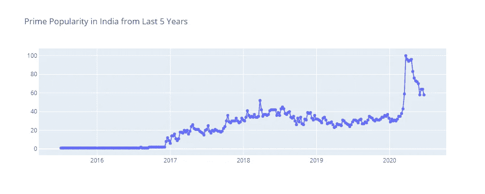
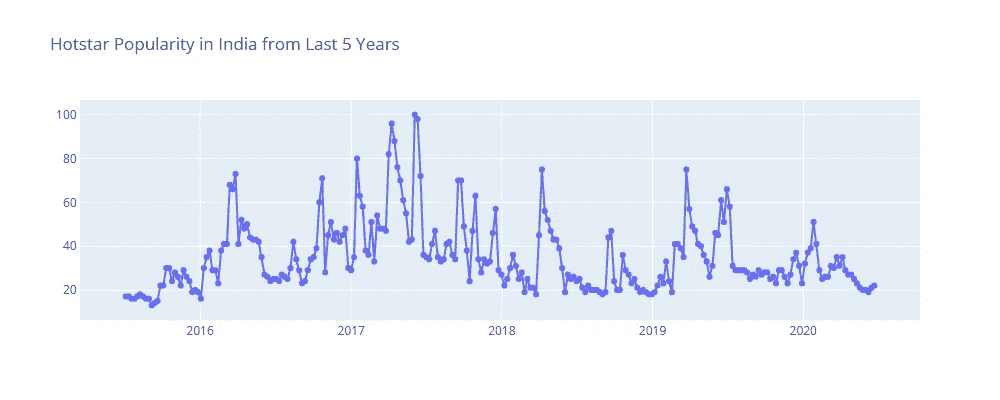

# OTT 平台——内容怪兽

> 原文：<https://medium.com/analytics-vidhya/ott-platforms-the-content-monster-210dc6fcef8f?source=collection_archive---------15----------------------->

# 什么是 OTT 平台？

OTT 或“over the top”平台是最初创建的视频和内容平台，旨在“超越”电视和有线电视的限制，为平台上的用户提供有线电视上可用的内容。世界总人口的 59.6%正在为成千上万的目的访问互联网，并以令人难以置信的速度消费内容。人们在 OTT 上消费内容的比例是巨大的。这一庞大的人口创造了一种需求，内容创作者和 OTT 平台也加入了这一潮流，以满足这一需求。面向当今一代的 OTT 平台意味着“真正的内容”。网飞、Prime Video、Youtube、Disney+等平台已经在数字领域掀起波澜有一段时间了。这些 OTT 平台通过独家交易、原创内容、在线首播等吸引了年轻人群的方式，创造了对其内容的巨大需求。OTT 平台提供广泛的内容，包括电影、电视剧、网络系列、播客，甚至有声读物。消费内容的方式在不断变化，OTT 平台正引领这场竞赛，让有线电视几乎过时。

OTT 已经存在很长时间了，它们不是新的。印度的第一个 OTT 平台是 Reliance Entertainment 在 2008 年推出的 BigFlix。该平台是一个超前于其时代的想法，这可能是我们没有人听说过它的原因(甚至是我，在为本文进行研究之前)。在大约 8 年的时间里，我们消费内容的方式发生了变化，成年后的千禧一代希望找到可以在旅途中快速消费的相关内容。我们总是为我们观看的内容付费，要么是有线电视费，要么是 DTH 充值，但互联网上的内容一直被视为免费资源；这是不正确的，至少不是完全正确的，最初，PPV 或按次付费平台和服务统治了向大众提供内容的游戏。直播体育赛事、电视连续剧、重大世界事件都包括在按次付费模式中，允许观众购买私人电视转播的赛事或系列节目并单独付费。1997 年一场比赛*“伊万德·霍利菲尔德对迈克·泰森 II”*的按次付费模式从按次付费购买中赚取了大约 20，000，000 美元(200 万英镑)。2017 年，格斗运动历史上最大的一场比赛*(弗洛伊德·梅威瑟对阵康纳·麦格雷戈维斯特)*的每次观看收入为 670 万美元。由此可见，为内容付费是一个古老的概念。变化在于内容的数量和成年千禧一代的高质量内容的真空，他们在技术和几乎一切的快节奏访问中长大。我们想要我们最喜欢的电影，电视剧，网络系列，或任何内容，我们现在就想要！这种心态为 OTT 平台提供了必要的推动力，OTT 平台现在将在很长一段时间内成为我们生活的一部分。

# 流媒体服务的吸引力

从人类诞生之初，娱乐内容就一直吸引着人们。在早期的罗马时代，角斗士的战斗曾经统治了表演。音乐、讲故事、戏剧、舞蹈和其他各种宫廷表演都得到了皇室的支持和喜爱。无产者的娱乐形式不像在宫廷里表演的那样复杂。感知娱乐之间的差异是由于社会地位的差异造成的，这是流媒体服务的关键。像网飞、亚马逊、迪士尼、谷歌这样的公司已经理解了这一鸿沟，并以惊人的方式占领了市场。以下是世界上最大的基于订阅的流媒体平台网飞上可用内容类型的词云。

网飞的内容类型

像网飞这样的平台所迎合的流派数量之多令人震惊。“狂看”是如今常用的一个术语，用来描述在笔记本电脑或电视前没完没了地观看内容。沉迷于某部电视连续剧或新发布的网络连续剧是一种新的社会认可。内容消费在最近几年达到了前所未有的高度，未来的趋势看起来甚至会更大。通过在沙发上或裹着毯子看电视连续剧或现场足球比赛来娱乐，已经为这种生活方式创造了观众和上瘾。流媒体服务的**挂钩**是一个非常聪明的心理把戏；每一个流媒体服务都在你观看的每一集或每一部电影中为你的头脑创造了深刻的雕刻体验。从动作片到非常详细的纪录片，流媒体平台创造了身临其境的体验，即使是大多数流媒体服务的黑暗模式背景也能给你的大脑一种剧院般的感觉。多厅影院和礼堂在电影或舞台表演期间关闭灯光，这使个人专注于屏幕或舞台上发生的事情，即光源。许多观众认为他们喜欢内容，我确信这是平台变得如此之大的一部分，但他们实际上喜欢沉浸在一部连续剧或一部电影中。

身临其境的平台设计，悬疑的结局，或者我们称之为*悬崖吊脚楼*加在一起只是 OTT 吸引我们的一半原因。另一半是所有人类根深蒂固的行为，我们都以多种方式表现出来。这种倾向或行为被称为**“逃避现实”**

如果我们相信弗洛伊德，人类不能简单地依靠从现实中榨取的微薄的满足感生存。他只是说人类永远不会满足于他们生活的现实；逃避现实的幻想对人类来说是必要的。每个人在日常世俗生活中都有目标、抱负和任务；自古以来，娱乐一直是他们逃离日常生活的一种方式。学校一天的 20 分钟休息时间，尽管是指定用来吃饭的；变成孩子心态逃离课堂常规的时间。流媒体服务提供的沉浸式体验旨在成为脱离现实和脱离我们周围世界的“完美逃脱计划”。网飞的标语是*“看看接下来会发生什么”，这难道不令人惊讶吗？这句口号基本上总结了流媒体服务如何让我们着迷。就在一集的演职员表开始之前，下一集的链接弹出来了，我们沉浸其中，逃离了现实，以至于我们一集接一集地狂欢，直到剧集结束。*

钩子还没有结束。一旦我们在网飞这样的流媒体平台上掉进兔子洞，我们就会以前所未有的速度消费内容，但内容是以这样一种方式准备和提供给我们的，它触发了我们大脑神经网络的所有特殊位置，让我们立即点击我们从未计划观看的连续剧或电影，因为“自从你观看了 X，你可能会喜欢下面的内容”或“今天在你的国家的趋势”。

没错，我说的是流媒体服务使用的推荐系统，或者普通大众理解的“我的推荐”。令人惊讶的是，仅仅通过学习一个人的观看模式，就可以判断和适应他们的行为。我们大脑神经网络中的特殊位置是由计算神经网络激发的，计算神经网络使用来自数百万人和我们的数据来为我们创建量身定制的建议。**排名矩阵**和**模式算法/模式识别算法**是流媒体平台成功背后的秘方。我前面已经尝试解释了一些排名矩阵，然后是一个小的模式匹配算法。

## 1.历史矩阵

基本上，所有用户的历史记录都是用条目作为用户条目二进制矩阵来维护的。例如，三个人 A、B 和 C 都观看了系列 Z，但是只有 A 和 B 观看了系列 X，A 也观看了系列 y。历史矩阵看起来像这样

## 2.共生矩阵

在这种情况下，我们将历史矩阵从用户逐项二进制矩阵转换为非二进制逐项矩阵，这告诉我们已经观看的内容的共现。X 和 Y 共出现一次，X 和 Y 共出现两次，而 Y 和 Z 共出现一次。

共生矩阵

## 3.指示器矩阵

这个矩阵有点难以理解，这个矩阵保留了“有趣的结论”或者我们用科学术语理解的“异常”。原因很简单，某些系列或电影非常受欢迎，几乎所有的人都看，例如，“黑客帝国”或“生活大爆炸”；因此，在你的推荐中使用它们是很常见的。因此，为了增加“有趣的商数”,矩阵中的异常很重要，而不是普通的偶然事件。这里，一个观看 X 的人是他喜欢 Y 的指示矩阵，这是从历史排名矩阵中得出的。

指示器矩阵

# 模式识别

模式算法的结构

模式识别框架可以分为不同的部分。该框架有助于处理数据，并识别数据中的现有模式，这有助于根据通过特征提取算法提取的特征来映射人们对内容的喜好。从回归变量中对提取的特征进行聚类和验证，然后将回归变量输入分类算法。分类将分类的特征反馈到输入点、预处理数据和特征提取，以改进建议。因此，每次我们选择一个新的标题来观看，每个用户的个性化算法都会更新其矩阵，模式识别会获得新的输入，以通过系统并反馈给流媒体平台上的定制推荐。

# 网飞、Prime Video、Disney+的分析和消费趋势

最受欢迎的流媒体服务是拥有近 20 亿活跃用户的 Youtube，但在本文中，我们谈论的是专门的流媒体服务，如网飞、Prime Video、Disney+等平台。领导这些拥有近 1.82 亿付费用户的公司网飞拥有近 1.4 亿小时的内容，并且每月增加更多内容，被认为是有史以来最好的流媒体服务。

在过去的 5 年中，网飞的用户数量稳步增长，2020 年疫情的情况实际上加速了公司的用户基础。疫情创造了一个完美的逃离环境，而网飞使人能够逃离迷宫般的内容。以下是基于谷歌搜索和网站访问的网飞在印度的受欢迎程度图表

同样，对于 Prime video，我们可以看到随着时间的推移，人们对流媒体服务的兴趣在 2020 年第一季度达到顶峰。当某个系列或某部电影上映时，人们的兴趣达到顶峰。内容营销在决定兴趣趋势方面起着巨大的作用。

该分析中最有趣的部分是，尽管与流媒体服务市场中的巨大竞争对手相比，一个小服务“Hotstar”在过去 5 年中在印度最受欢迎，但在 2020 年第一季度表现不佳，而所有其他平台都表现出色。如果仔细想想，它以前流行的原因很简单。答案是板球和体育。印度虔诚地追随板球，Hotstar 提供了一种在移动中观看板球比赛的方式，几乎每场比赛都有直播。“Hotstar”等流媒体服务带来的板球等体育赛事的转播权增加了一层人气，但自疫情局势以来，大多数体育赛事被取消，这导致 Hotstar 作为流媒体服务的受欢迎程度下降。

# 结论

我们已经看到娱乐是如何被人类用作逃避机制的，以及有多少 OTT 平台利用了逃避现实的需求，并将其变成了数百万美元的公司。对内容的需求不会下降，我们已经把自己附在这个永无止境的循环中，享受一集又一集；阻止需求的增长几乎是不可能的。人类的行为在很多情况下只是本质上的原始，一旦我们发现了我们感兴趣的东西；我们对它的要求越来越高。互联网上的内容兔子洞恰恰导致了内容黑洞。在我们开始脱离现实并理解“现实比虚构更好”之前，必须阻止人类内部创造的渴求内容的怪物。

我个人不认为我们会看到流媒体平台的衰落，拉兹·卡普尔先生用非常健康的方式总结了这一点，他说:“表演必须继续下去！”。因此，平台会随着时间的推移不断变化和发展，但娱乐需求将永远存在。

感谢您的阅读

再见！

Linkedin 链接: [Dhruv 的 LinkedIn](https://www.linkedin.com/in/dhruv-batta-2a455514b/)

GitHub 链接: [Dhruv 的 Github](http://www.github.com/dhruvbatta)