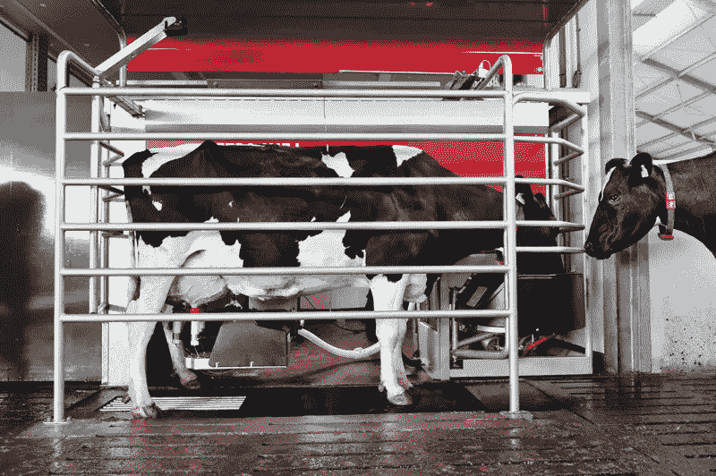
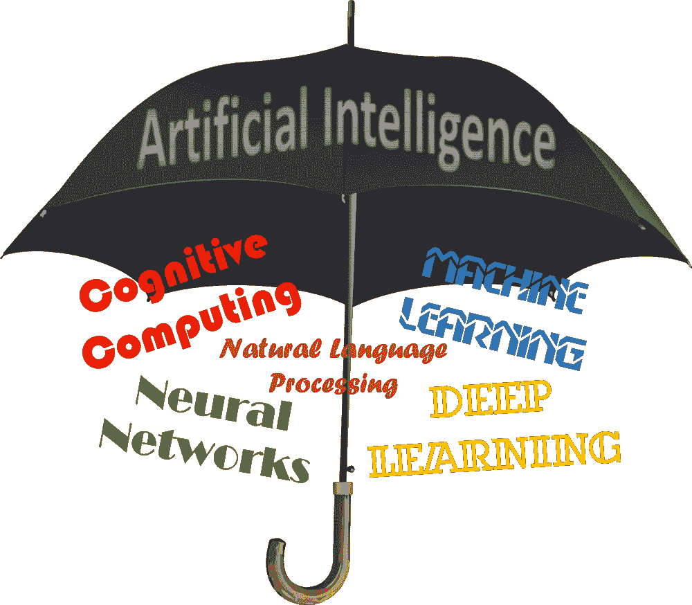

# 我们人造的未来

> 原文：<https://medium.com/analytics-vidhya/our-artificial-future-e6d6ae3f757c?source=collection_archive---------24----------------------->

## 机器人和人工智能对人类的影响

机器人和人工智能是一些最有争议的话题，我们人类害怕或不耐烦地等待着它们的到来。

# 首先，什么是机器人和人工智能？

人工智能是一种计算机程序，用于模仿我们人类完成的任务(希望效率更高)，而机器人是设计用来完成人类完成的任务的机器，这些任务通常需要更多的肌肉运动。

## 让我们从机器人将如何影响我们开始

机器人正在适应新的责任，因为它们被创造成我们从未见过的新尺寸和形状。但是，这些技术只有在为用户提供经济、努力或时间优势的情况下才会在世界范围内广泛传播。

我们今天在社会上看到的机器人积极影响的一个例子是在农场。在那里，机器人被用来挤牛奶，让农民做更少的工作，而有更多的时间做其他重复性较低的工作。

很酷，对吧？

但是，一些人以消极的眼光看待这一技术的下一步，并质疑机器人将如何真正为我们提供优势。

随着机器人成为世界上更大的一部分，一些人预测未来许多人将会失业。事实上，到 2030 年，25%传统上由人类占据的工作将被最有可能为机器人等事物提供动力的人工智能工作所取代。

与此同时，许多人将不得不调整他们的生活方式和日常工作生活，以适应这些技术带来的变化。

我说这些不是为了吓唬你。事实上，我觉得许多人对人工智能和机器人未来将为我们做什么有错误的看法。

## 人工智能将如何影响社会？

技术总是被用来改善我们的生活。人工智能也不例外。通过使用这项新兴技术，世界各地的公司和人们不仅可以节省资金，而且人工智能还有能力做许多不同的事情，包括拯救许多生命。随着人工智能的引入，许多人看到了更加个性化的医疗保健系统的潜力。同样，通过不再需要人们筛选数据，我们作为人类将负责完成更具创造性和以人为本的任务。

人工智能最令人惊讶的一点是，它是一种伞状技术。那么这意味着什么呢？看看这张海报:

这张海报展示了人工智能这个术语下有多少子概念

让我们看看一些更有趣的人工智能类型(在我看来):

*   神经网络
*   机器学习
*   自然语言处理

## 神经网络

很简单，神经网络是模式识别器。这种人工智能能够用于预测股票市场的未来趋势或世界各地患者的健康状况。

## 机器学习

机器学习是通过我们人类讨厌筛选的东西来驱动的，数据。这就是为什么机器学习是人工智能最令人兴奋的方面之一，因为它(可以说)在我们的工作中最准确地模仿了人类。这是因为程序通过用给定的更多数据完成某项任务来发展知识。

## 自然语言处理

这个名字就说明了一切！自然语言处理处理的是对我们人类所说的语言的理解和应用。

# 为什么机器人和人工智能会让我们的生活变得更好？

预测未来的最好方法之一是分析过去。我们以前已经看到过指数技术对人们的影响。最伟大的例子之一是 ERMA，它彻底改变了商业世界。更新和管理账户余额等繁琐的任务不再需要多人来完成。

许多人预计，由于这项即将到来的技术，美国各地的就业人数将会减少。尽管有这些看法，但随着 ERMA 创造新的工作机会，专注于重复性较低的任务，就业增加了。

有了这些知识，我们就能够理解机器人和人工将如何对社会产生类似的影响。随着机器人和人工智能进入社会，世界上许多国家的放射科医生、建筑工人、收银员、药剂师或护士的工作将不再相同。

机器人技术对全球工业产生影响的一个很好的例子是在制药领域。在普拉特谷药房，使用机器人使处方药物的数量增加了 50%。这使得在药房工作的药剂师能够专注于更人性化的任务，如糖尿病患者的鞋子安装。

## 商业中的人工智能

人工智能及其在商业中的应用是这项技术最令人兴奋的方面之一。投资者不仅可以使用像神经网络这样的东西来预测股票市场的未来趋势，而且人工智能可以自动化世界各地公司的整个记账过程。我预测，商业领域将是未来几年因技术而经历最大变化的领域之一，人工智能将在其中发挥重要作用。

## 我们日常生活中的机器人

同样，机器人也会随着其他技术的发展而发展。让机器人如此特别的是它们如何能够与人工智能等其他技术融合，变得更加自主，对人类更加有用。我看到的一个具体的技术融合是在机器人和大脑计算机接口之间。想象一下，在几年后，有了这两种技术，我们能够在一天内只用我们的大脑和机器人的帮助建造一座城市！

# 不管怎样，人工智能和机器人都是为了让我们的生活变得更好，而不是更差！