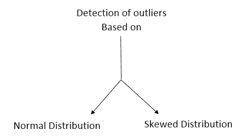
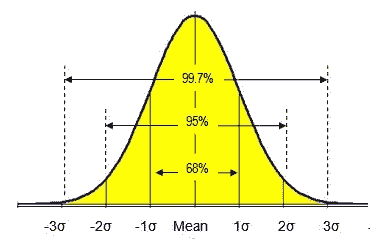
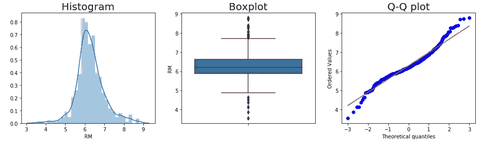
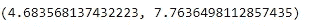
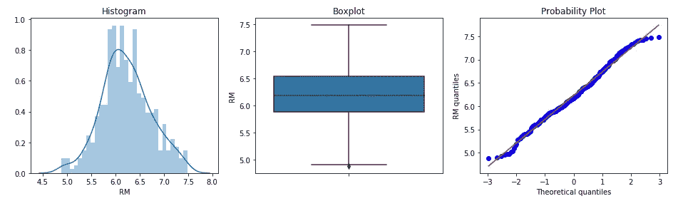
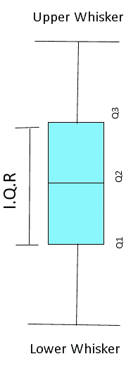
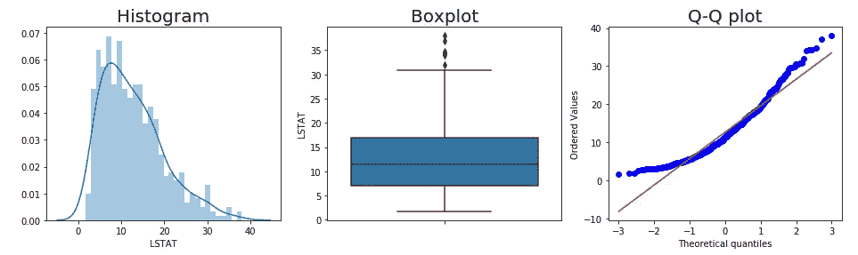
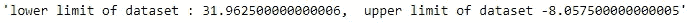
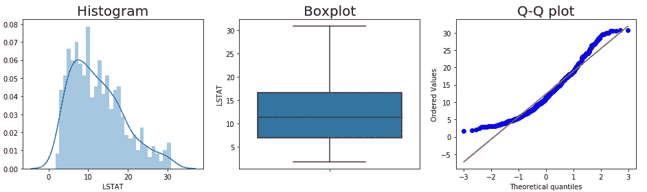

# 机器学习中的离群点检测

> 原文：<https://medium.com/analytics-vidhya/outlier-detection-in-machine-learning-26e0bc7105cd?source=collection_archive---------5----------------------->


[来源](https://www.google.com/search?q=outliers+image+with+human+example&tbm=isch&ved=2ahUKEwjqmNrAgKPtAhWPgEsFHVPUA9gQ2-cCegQIABAA&oq=outliers+image+with+human+example&gs_lcp=CgNpbWcQAzoECAAQQzoCCAA6BAgAEBg6BAgAEB5QwP4DWJatBGDNrgRoAHAAeACAAeQCiAHLIpIBCDAuMTQuOC4xmAEAoAEBqgELZ3dzLXdpei1pbWfAAQE&sclient=img&ei=ZxbBX6rJBY-BrtoP06iPwA0&bih=657&biw=1366#imgrc=PXB5MV2WT6xXeM)

> **什么是离群值？**

异常值是那些与给定数据集中的其他观察值有显著差异的数据点。这可能是由于测量中的可变性和填充数据点中的错误解释造成的。

假设我们有一个数据集，包含学校和学生家之间的距离，单位为公里，给定为 **5，6，7，8，9，10，6，7，100** ，在此数据集 **100** 将表现得像一个异常值。

> **是否应该剔除离群值？**

并不总是需要删除异常值，取决于业务案例的要求，我们作为机器学习工程师决定是否应该删除异常值。我们可以在人们最喜欢的电视节目的数据集中去掉离群值，但是当我们有关于信用卡欺诈的数据集时，我们不能去掉离群值。你是否应该移除它取决于你的常识和观察。

假设至少 30%(或大量)的数据点是异常值，这意味着异常值中有一些有趣和有意义的见解，您不应该删除它。

**为什么要剔除离群值？**

离群值增加了数据集中的可变性，这降低了统计显著性，使我们的模型不太准确。有各种各样的方法来检测它。在这篇博客中，我将讨论基于分布的异常值检测。

> **基于分布的异常值检测**



## 一、正态分布数据:

在正态分布的情况下，如果数据点远离范围( **μ + 3σ)** 和 **(μ — 3 σ)** 被视为**异常值。**



正态分布

```
# Plotting and observing whether dataset has outliers or not
plt.figure(figsize=(16, 4)) # figure size
plt.subplot(1, 3, 1) #multiple plot plottig and 1st position of fig
sns.distplot(df["RM"], bins=30) #checking is data normally dist ?
plt.title('Histogram') 
plt.subplot(1, 3, 2)  #plotting second position of figure
sns.boxplot(y=df["RM"]) #boxplot
plt.title('Boxplot')
plt.subplot(1, 3, 3) #plotting third position of figure
stats.probplot(df["RM"], dist="norm", plot=plt) #q-q plot to check #how our data is distributed in reference with normal distribution
plt.ylabel('RM quantiles')
plt.show()
```



图 1

正如我们看到的图 1 **分布图**说明数据集是正态分布的，**箱线图**和 **Q-Q 图**我们可以说数据集中存在一些异常值。现在，我们的下一步将是找到最小和最大边界值，其中每个数据点将被视为离群值。

```
#outlier boundary value for normally distributed dataset
def min_max_boundary(data,col):
    min_value=df[col].mean()-3*df[col].std()
    max_value=df[col].mean()+3*df[col].std()
    return min_value,max_value
min_max_boundary(df,"RM")
```



最小和最大边界值

## 任何大于 8.39 且小于 4.17 的值都将被视为异常值。

## 移除异常值:

```
#filtering all the value mabove maximum boundary value and below #minimum  boundary value 
df=df[(df["RM"] >4.683568137432223) & (df["RM"] < 7.7636498112857)]
--------------------------------------------------------------------
#plotting the df["RM"] after removing outliers
plt.figure(figsize=(16, 4)) 
plt.subplot(1, 3, 1)  
sns.distplot(df["RM"], bins=30)  
plt.title('Histogram') 
plt.subplot(1, 3, 2)   
sns.boxplot(y=df["RM"]) 
plt.title('Boxplot')
plt.subplot(1, 3, 3) 
stats.probplot(df["RM"], dist="norm", plot=plt)
plt.ylabel('RM quantiles')
plt.show()
--------------------------------------------------------------------
```



图 2

## **二。偏斜分布数据:**

如果值不在以下范围内:-**25 个百分点-(1.5 * IQR)&75 个百分点+(1.5*IQR)** ，则 datpoint 被视为异常值。

这里 **IQR= Q3-Q1** (如下图所示)



箱形图

```
#plotting different plot to analyse presence of outliers
plt.figure(figsize=(16, 4)) # figure size
plt.subplot(1, 3, 1) #multiple plot plottig and 1st position of figure
sns.distplot(df["LSTAT"], bins=30) #checking data is normally distributed or not
plt.title('Histogram',fontsize=20) 
plt.subplot(1, 3, 2)  #plotting second position of figure
sns.boxplot(y=df["LSTAT"]) #boxplot
plt.title('Boxplot',fontsize=20)
plt.subplot(1, 3, 3) #plotting third position of figure
stats.probplot(df["LSTAT"], dist="norm", plot=plt)#q-q plot to check how our data is distributed in reference with normal distribution
plt.title("Q-Q plot",fontsize=20)
plt.show()
```



图 3

正如我们看到的图 2 **分布图**解释了数据集是右偏的**箱线图**显示了一些远离上须的数据点，因此数据集中存在异常值。 **Q-Q 图的**对齐偏离 45 度角，表明数据集中存在异常值。现在，我们的主要任务是找到最小值和最大值的边界，超出该边界的数据将被视为异常值。

```
#finding upper and lower boundary limit
def non_normal_outliers(data,col):
    IQR=df[col].quantile(0.75)-df[col].quantile(0.25)
    lower_limit=data[col].quantile(0.75) + (1.5*IQR)
    upper_limit=data[col].quantile(0.25) - (1.5*IQR)
    return "lower limit of dataset : {0},  upper limit of dataset 
            {1}".format(lower_limit,upper_limit) non_normal_outliers(df,"LSTAT")
```



我们可以用另一种方式编写相同的代码，以列表的形式打印最小值和最大值。

```
list1=[]
def outer_function(data,col):
    # Hidden from the outer code
    IQR=df[col].quantile(0.75)-df[col].quantile(0.25)
    def max_value(data,col):
        max_=df[col].quantile(0.75) + (1.5*IQR)
        return max_
    list1.append(max_value(data,col))
    def min_value (data,col):
        min_=df[col].quantile(0.25) - (1.5*IQR)
        return min_ 
    list1.append(min_value(data,col))
#inner_increment(5)
outer_function(df,"LSTAT")
list1
--------------------------------------------------------------------[out]>> [31.962500000000006, -8.057500000000005]
```

## 移除异常值:

```
#filtering values lie above and below min and max value
df=df.loc[(df["LSTAT"]<list1[0]) & (df["LSTAT"]>list1[1])]
--------------------------------------------------------------------
#plotting the dataset after eliminating outliers
plt.figure(figsize=(16, 4)) 
plt.subplot(1, 3, 1)  
sns.distplot(df["LSTAT"], bins=30)  
plt.title('Histogram') 
plt.subplot(1, 3, 2)   
sns.boxplot(y=df["LSTAT"]) 
plt.title('Boxplot')
plt.subplot(1, 3, 3) 
stats.probplot(df["LSTAT"], dist="norm", plot=plt)
plt.ylabel('RM quantiles')
plt.show()
```



图 4

## 结论:-

希望你对这个话题有足够的了解，请分享你对这个博客的看法。不断学习，不断成长。