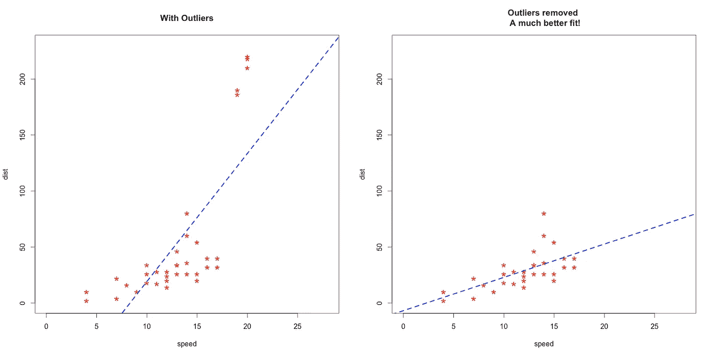
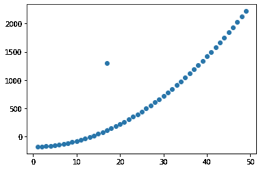
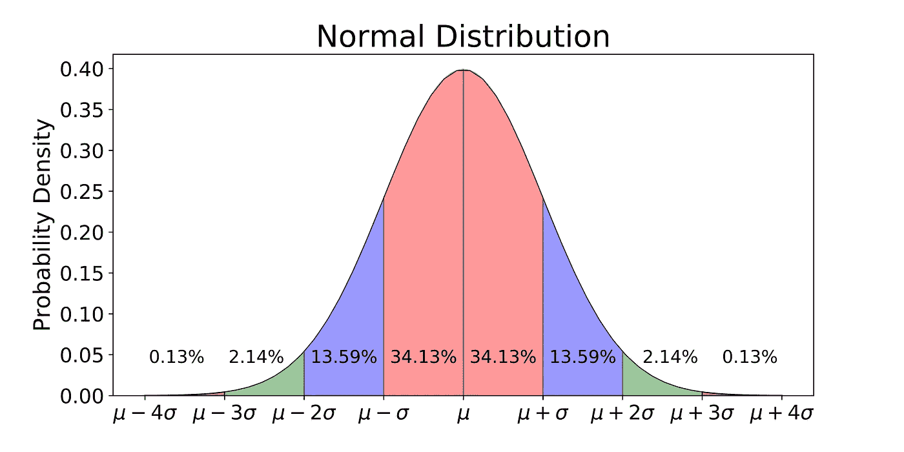

# Python 中基于多元正态分布的离群点检测

> 原文：<https://medium.com/analytics-vidhya/outlier-detection-with-multivariate-normal-distribution-in-python-480033ba3a8a?source=collection_archive---------4----------------------->


*所有的代码文件都可以在:*[*https://github . com/ashwinhprasad/Outliers-Detection/blob/master/Outliers . ipynb*](https://github.com/ashwinhprasad/Outliers-Detection/blob/master/Outliers.ipynb)获得

# **什么是离群值？**

任何不寻常的和偏离标准“正常”的都被称为**异常**或**异常值。** 检测给定数据中的这些异常称为异常检测。

有关异常值或异常检测的更多理论信息，请查看: [**异常检测如何工作？**](/analytics-vidhya/how-anomaly-detection-works-4651f1786431)

# 为什么我们需要去除异常值或检测它们？

**案例 1 :** 考虑一家大型制造公司正在制造一架飞机的情况。一架飞机有不同的部分，我们不希望任何部分以不寻常的方式运行。这些异常行为可能是由多种原因造成的。我们想在这些部件被固定在飞机上之前检测出来，否则乘客的生命可能会有危险。



**案例二:**从上图可以看出，离群值是如何影响最佳拟合直线的方程的。因此，在执行之前，为了获得最准确的预测，去除异常值是很重要的。
在这篇文章中，我将使用多元正态分布

# 数据准备

1.  导入库

```
**import** **pandas** **as** **pd**
**import** **numpy** **as** **np**
**import** **random**
**import** **matplotlib.pyplot** **as** **plt**
```

2.创建自定义数据集

```
*#define x1 and x2* 
x1 = np.arange(1,50,1) 
x2 = np.square(x1) + np.random.randint(-200,200)
```

3.向数据集添加异常值

```
*#adding outliers*
x1 = np.append(x1,17)
x2 = np.append(x2,1300)
data = np.stack((x1,x2),axis=1)
plt.scatter(x1,x2)
```

4.可视化数据集



现在，我们必须尝试从这个数据集中检测异常值

# 多元正态分布的异常检测



```
**from** **scipy.stats** **import** multivariate_normal*#calculate the covariance matrix*
data = np.stack((x1,x2),axis=0)
covariance_matrix = np.cov(data)

*#calculating the mean*
mean_values = [np.mean(x1),np.mean(x2)]

*#multivariate normal distribution*
model = multivariate_normal(cov=covariance_matrix,mean=mean_values)
data = np.stack((x1,x2),axis=1)

*#finding the outliers*
threshold = 1.0e-07
outlier = model.pdf(data).reshape(-1) < threshhold
```

1.  在第一步中，我们将列 **x1** 与 **x2** 堆叠在一起，并将其存储在变量**数据**中
2.  计算数据的**协方差矩阵**和 **x1** 和 **x2** 的**均值**
3.  **multivarial _ normal**是 **scipy** 中的一个类，它有一个名为 **pdf** 的函数，用于计算一个值等于数据集中每个数据点的概率。(这方面的理论部分包含在[异常检测如何工作](/analytics-vidhya/how-anomaly-detection-works-4651f1786431)中)
4.  我们为数据集中的所有数据点计算这个概率
5.  我们还选择了一个**阈值**，任何概率低于该阈值的数据点都被视为异常，我们为这些值创建了一个布尔列，并将其存储在变量**异常值**中。
6.  这里，(真=异常，假=非异常)

```
**for** boolean,i **in** enumerate(outlier):
  **if** i == **True**:
    print(data[boolean]," is an Outlier")**output:** [  17 1300]  is an Outlier
```

1.  我们现在知道，所有概率低于阈值的数据点在异常值列表变量中被标记为真。
2.  现在，我们打印出异常值，并用我们在数据创建部分注入到数据集中的异常值检查值。
3.  通过这种方法，我们成功地发现了数据模式中的异常值

# 结论

多元正态分布是找出异常值的非常强大的工具，因为该算法还考虑了变量如何随数据集中的其他变量而变化，而许多其他算法没有这样做。

离群点检测在很多领域都有应用，就像上面给出的例子一样，而且是必须要学的


补充说明:异常检测和消除与消除我们中间的冒名顶替者一样重要。
如果不移除，它可能会影响整个模型或引发问题，就像冒名顶替者杀害船员或破坏船只一样。

# 谢谢你