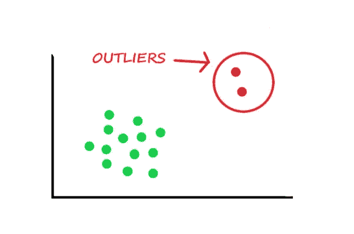
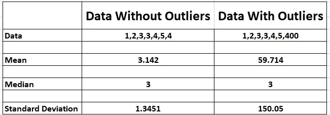
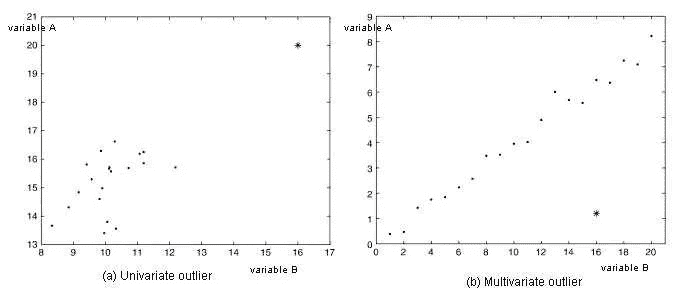
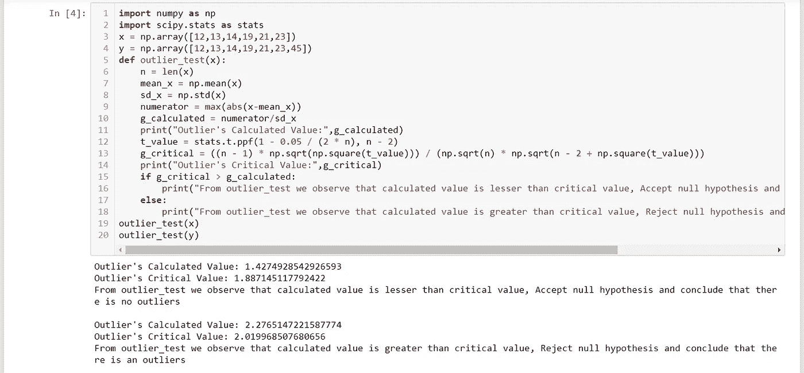

# 使用 Python 进行离群点检测

> 原文：<https://medium.com/analytics-vidhya/outlier-detection-with-python-79a82514223b?source=collection_archive---------7----------------------->

基于假设检验的机器学习离群点检测。

在本文中，我将带您完成机器学习中的离群点检测任务。异常值是分析师和数据科学家常用的术语，因为它需要特别注意，否则，它会导致完全错误的估计。

简而言之，异常值检测是一种远离样本整体模式的观察结果。

# 什么是离群值？

异常值是在数值上远离其余数据的观察值，或者简单地说，是超出范围的值。让我们举一个例子，用一个没有离群值的数据集来检查一个数据集会发生什么。

如您所见，含有异常值的数据集具有显著不同的均值和标准差。在第一个场景中，我们会说平均值是 3.14。但是有了异常值，平均值攀升至 59.71。这将完全改变估计。

让我们举一个离群值的具体例子。在一个 50 人的公司里，45 个人月薪 Rs。6000，5 大四，月薪 rs。每人 10 万。如果你计算公司员工的平均月薪是 14500 卢比，这会给你一个不好的结论。

但如果你拿工资中位数，那就是 6000 卢比，比平均水平更敏感。因此，中值是衡量平均值的合适标准。这里你可以看到一个异常值的影响。

**现在，在开始异常值检测任务之前，让我们快速了解一下异常值的主要原因:**

1.  数据输入错误:人为错误，如数据收集、记录或输入过程中的错误，会导致数据中出现异常值。
2.  测量误差:这是异常值最常见的来源。这是由于使用的测量仪器出现故障造成的。
3.  自然异常值:当异常值不是人为的(由于错误)时，它就是自然异常值。大多数真实世界的数据都属于这一类。

# 使用假设检验的机器学习中的离群点检测

现在，我将使用 Python 编程语言来完成机器学习中的离群点检测任务。

异常值可以有两种类型: ***单变量和多变量*** 。

***单变量 vs 多变量***

上面，我们已经讨论了单变量异常值的例子。当我们观察单个变量的分布时，可以发现这些异常值。多元异常值是 n 维空间中的异常值。

假设检验是机器学习中检测异常值的常用技术。假设检验是一种使用在样本中测量的数据来检验关于总体中参数的主张或假设的方法。在这种方法中，如果关于总体参数的假设为真，我们通过确定样本统计可能被选择的概率来检验假设。

假设检验的目的是确定总体参数(如平均值)可能为真的概率。假设检验有四个步骤:

1.  陈述假设。
2.  定义决策的标准。
3.  计算检验统计量。
4.  做个决定。

现在让我们看看如何使用 Python 编程语言来实现机器学习中异常值检测任务的假设检验:

使用 Jupyter 笔记本

机器学习的一个主要问题是离群值。如果你会忽略数据中的离群值，那么它将导致你的机器学习模型性能不佳。

我希望您喜欢这篇关于使用假设测试和 Python 编程语言在机器学习中进行离群点检测的文章。