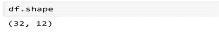

# 用 Python 处理异常值

> 原文：<https://medium.com/analytics-vidhya/outlier-treatment-9bbe87384d02?source=collection_archive---------0----------------------->


杰西卡·鲁斯切洛在 [Unsplash](https://unsplash.com?utm_source=medium&utm_medium=referral) 上的照片

## **1——什么是离群值？**

离群值是数据集中远离所有其他观察值的数据点。


位于数据集总体分布之外的数据点

许多人对极端值和异常值感到困惑。

## **2 —什么是极值？**

一个极值只是一个最小值或一个最大值，它不需要与数据相差太多。

## **3 —极值&异常值之间的差异是什么？**

极值只是一个最小值或最大值，它不需要与数据有很大的不同&远离其他点的点称为离群点。

例如:-员工的年龄

年龄= 21、23、24、25、26、28、30、45 岁

在哪里

极值=30

异常值=45

## **4 —数据集中存在离群值的原因是什么？**

4.1-数据的可变性

4.2 -实验测量误差

## **5 —我们如何识别异常值？**

5.1-使用箱线图

5.2-使用散点图

5.3-使用 Z 分数

## **6 —异常值处理有两种方法**

1.  **四分位距(IQR)法**
2.  **Z 评分法**

**6.1 — IQR 法**

使用 IQR，我们可以找到离群值。

**6.1.1 —识别异常值的标准是什么？**

数据点落在高于第三四分位数(Q3)和低于第一四分位数(Q1)的四分位数范围的 1.5 倍之外


**6.2.2 —使用 IQR 去除异常值**

第一步:——收集并读取数据


**步骤 2:** —检查数据的形状



**第三步:——**检查异常值

```
import seaborn as snssns.boxplot(data=df,x=df[‘hp’])
```


**第四步:—实施**

```
Q1=df[‘hp’].quantile(0.25)Q3=df[‘hp’].quantile(0.75)IQR=Q3-Q1print(Q1)print(Q3)print(IQR)Lower_Whisker = Q1–1.5*IQRUpper_Whisker = Q3+1.5*IQRprint(Lower_Whisker, Upper_Whisker)**Output: -** 96.5
          180.0
          83.5
          -28.75 305.25
```

**第五步:—异常值处理**

应用条件移除异常值:

```
df = df[df[‘hp’]< Upper_Whisker]
```

异常值将是低于下须或高于上须的任何点

**步骤 6: —** 检查数据的形状


## **6.2 — Z 评分法**

使用 Z 分数，我们可以发现异常值

**6 . 2 . 1-识别异常值的标准是什么？**

超出 3 个标准偏差的数据点。我们可以使用 z 值，如果 z 值超出 2 个标准差。

**6.2.2 —以下是移除异常值的步骤**

**步骤 1:——**收集数据并读取文件


**步骤 2:** —检查数据的形状


**第三步:** —获取 Z 得分表。

```
from scipy import statsz=np.abs(stats.zscore(df.hp))print(z)
```


**第四步:-**

我们找到数据集中每个数据点的 z 得分，如果 z 得分大于 3，则我们可以将该点归类为异常值。任何超出 3 个标准差的点都是异常值。

```
threshold=3print(np.where(z>3))
```

**输出:-**

```
(array([  8,  13,  95, 116], dtype=int64),)
```

**第五步:-**

```
df1=df[(z< 3)]print(df1)
```

**第六步:** —检查数据形状


上述步骤将从数据集中移除异常值。