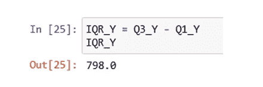

# 数据中的异常值及其检测方法。

> 原文：<https://medium.com/analytics-vidhya/outliers-in-data-and-ways-to-detect-them-1c3a5f2c6b1e?source=collection_archive---------0----------------------->

**什么是离群值？**

说白了，离群值可以被称为一系列数据中的异类。异常值可能与我们样本中存在的大多数数据点不同寻常且极其不同。它可能是非常大的观察值，也可能是非常小的观察值。由于异常值的极端性质，在计算数据的统计时，异常值可能会产生有偏差的结果，从而影响进一步的统计/ML 模型。

检测和处理异常值是数据清理最重要的阶段之一。

例如，让我们考虑下表中的这些值。由于这个表非常小，看一眼它就能让我们知道 10000 是一个异常值。然而，在现实生活中，要处理的数据将非常大，在真实场景中一眼就能发现异常值并不是一件容易的事情。

上述观察值的平均值为 1307，高于表中的大多数值。我们都知道平均值是算术平均值，通常代表数据的中心。在这里，1307 远不是整个数据的中心。罪魁祸首是一个极端的观测值 10000。因此，10000 可以被定义为异常值，它扭曲了数据的实际结构。

**离群值可以是单变量也可以是多变量**。

**单变量异常值**通常指变量上的极值点。例如:上述示例中的 10000。

在本文中，我们将重点了解几种检测单变量异常值的方法。

**多元异常值**通常是两个或更多变量的异常数据点的组合。散点图主要用于多变量设置，表明响应变量与一个或多个预测变量之间的关系。有时，异常值可能落在响应变量(x 轴)和预测变量(y 轴)的预期范围内，但仍可能是异常值，因为它不符合模型，即它不符合模型的回归线。与单变量异常值相反，多变量不一定是极端数据点。

**既然我们现在知道什么是异常值，我们将通过各种方法来识别它们。**

1.检测异常值的最简单方法是绘制特征或数据点。可视化是推断整体数据和异常值的最好和最简单的方法之一。散点图和箱线图是检测异常值的最佳可视化工具。

**散点图**-散点图可用于明确检测数据集或特定要素何时包含异常值。

在下图中，我使用了一个名为“房价预测”的数据集作为例子。数据集的来源是 Kaggle。

从图中可以清楚地看到，因变量“销售价格”更多地集中在 0–55000(约为特征地块面积)的范围内，超过 150000 的点显然是异常值，因为这些点会导致与数据整体结构不相称的统计数据。

因此，我们可以为我们怀疑可能包含异常值的数据集的所有要素绘制散点图。

**箱线图:**箱线图是另一个非常简单的可视化工具，它使用四分位数间距(IQR)技术的概念来检测异常值。

在下图中，少数异常值用红圈突出显示。

在这里，我们绘制了基于年份的销售价格与批量配置的关系。

下图中的异常值示例:“corner LotConfig”在 2007 年有一个 Saleprice 大于 700000 的异常值。

**直方图**也可以用来识别异常值。然而，在直方图中，离群值的存在可以通过孤立的条来检测。

如果我们以最初的八个数为例，我们可以清楚地看到异常值 10000 远离孤立的右柱，其余七个数据点一起朝向左柱。

直方图通常用于单变量设置，在这种设置中，我们绘制单个变量(在我们的例子中为数字)的数据分布图，并识别数据分布之外的异常值(10000 ),如下所示。

2> **四分位距(IQR)技术:**该方法可以通过计算边界来找出作为异常值的数据点的最大值和最小值。

IQR 位于数据集的中间，是第一个四分位数和第三个四分位数之间的值，可计算如下:

我们都知道什么是中位数，它可以被称为数据集频率分布的中点或观察值的中点。

数据集的下半部分是所有低于中值的值的集合。数据集的上半部分是当数据以降序排序时高于中值的所有值的集合。

由 Q1 表示的第一个四分位数是数据集下半部分的中位数。也称为第 25 百分位，它表示数据集中约 25%的值低于 Q1，约 75%的值高于 Q1。

类似地，用 Q3 表示的第三个四分位数是数据集上半部分的中值。也称为第 75 百分位，它表示数据集中约 75%的数字位于 Q3 以下，约 25%位于 Q3 以上。

使用箱线图可以很容易地看到这一点:

箱线图:Q1-第一个四分位数，Q3-第三个四分位数

我们将在下面的步骤中讨论如何使用 python 计算相应的四分位数。

在 Python 中，我们可以使用以下步骤来实现 IQR，并最终检测异常值:

**现在假设，我想找出数据集“df”中的变量 Y 是否有异常值。**

首先，我们导入重要的 python 库，如 pandas、numPy、sklearn、scipy 等。

**步骤 2:** 导入具有以下值的数据集‘df ’:

**第三步:*计算变量 y 的第一个和第三个四分位数***

第一个四分位数= **Q1_Y = df['Y']。分位数(0.25)**

**步骤 4 *:计算四分位距(IQR):***

**IQR_Y = Q3_Y — Q_Y**

**第 5 步:**下面的代码将给出在“Y”变量上有异常值的记录。

**df[NP . logical _ or(df[' Y ']<(Q1 _ Y—1.5 * IQR _ Y)，df[' Y ']>(Q3 _ Y+1.5 * IQR _ Y))]**

# Q1 _ Y-1.5 * IQR _ Y = 700-(1.5 * 798)= 700–1197 =-497-这是检测具有最小值的异常值的下限。

# Q3 _ Y+1.5 * IQR _ Y = 1498+(1.5 * 798)= 1498+1197 = 2695-这是检测具有最大值的异常值的上限。

**正如我们在上面的截图中看到的，下面的方框图也显示了这一点:**

在下限-497 以下，我们有两个最小值异常值-599 和-978。

并且我们在上边界 2695 上方有三个最大值异常值 20000、34000 和 55000。

检测数据集“df”异常值的箱线图

使用直方图将其可视化。孤立条表示我们的数据集“df”包含异常值。

因此，如果没有检测到分别低于和高于下限和上限的这些异常值，可能会对总体数据的统计推断给出不成比例的结果，从而损害预测模型的准确性。

*然而，有许多方法可以处理异常值，其中之一是数据封顶，其中低于下限的异常值可以用第一个四分位数— Q1 值代替，高于上限的异常值可以用第三个四分位数— Q3 值代替。*

有多种统计测试可以用来检测异常值，其中之一就是假设检验。

假设检验通常用于从进行检验的随机样本中得出关于整个总体的结论。

假设检验围绕以下两个关于总体的互斥陈述，以确定哪个陈述最能得到样本数据的支持:

零假设。例如，变量没有异常值。

o 替代假设。例如，变量有异常值。

下面的三个统计测试使用假设检验的概念来识别异常值。

格拉布斯试验

卡方检验。

o **迪克森的 Q 测试。**

在 Grubbs 检验和 Dixon 的 Q 检验中，假设我们将要发现异常值的数据是正态分布的。

鉴于卡方检验可用于卡方分布。

Dixon 的 Q 检验通常应用于包含很少观察值的数据集或样本，因此很少用于数据科学。

以上三种测试都使用以下无效假设和替代假设来检测异常值**。**

H0:没有异常值。

H1:至少有一个例外。

异常值检测根据 P 值和显著性水平得出结论。

显著性水平为 0.05，如果 p 值