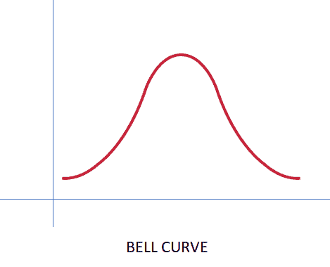
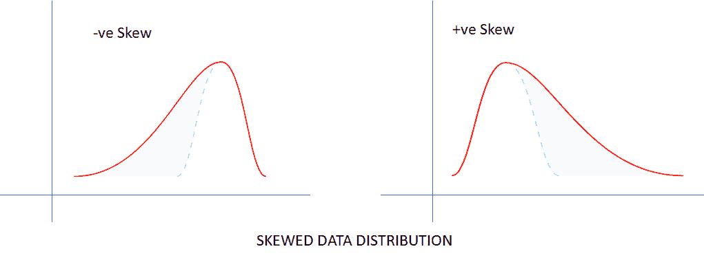
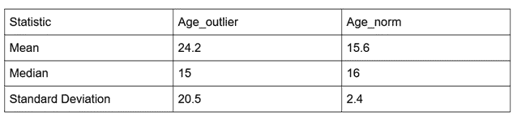
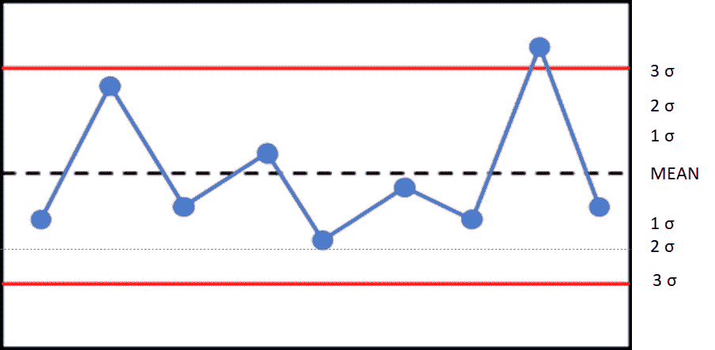
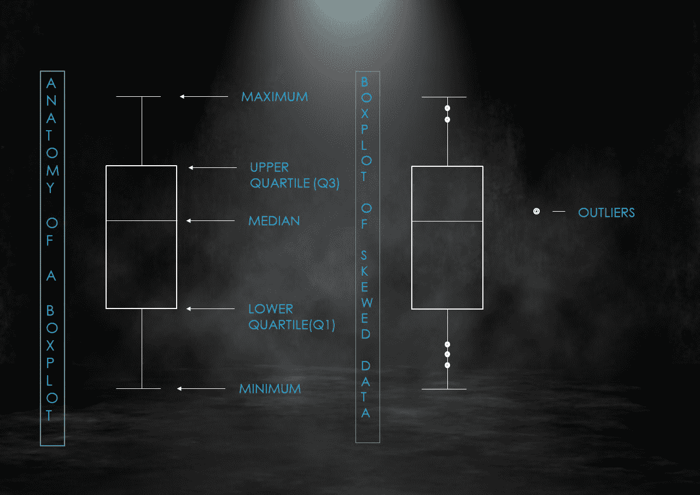

# 机器学习 A-Z 中的异常值:从检测到处理

> 原文：<https://medium.com/analytics-vidhya/outliers-in-machine-learning-a-z-detection-to-handling-92f9c3bc1d24?source=collection_archive---------4----------------------->

在本文中，我们将介绍统计学中异常值的概念及其在机器学习领域中的应用。从零开始，我们将逐步识别异常值并最终处理它们。

**分布曲线**

*钟形曲线*

这种类型的曲线可以被认为是理想化的曲线。这种曲线不仅在概率论中有应用，而且在许多实际生活中也有应用。这里，我们将从统计学的角度来看它。许多事件如掷骰子、人的身高等都遵循这条曲线。对于本文来说，我们并不需要了解所有关于钟形曲线的知识。这里的关键是，在这样的曲线中，绘制数据的平均值、中值和众数几乎相等或非常接近。

*偏斜的数据分布*

扭曲的数据在现实生活中最常见。整篇文章都在处理有偏差的数据。同样，这里的主要要点是，对于偏斜数据，要么均值>中值>众数(+偏斜)，要么众数>中值>均值(-偏斜)。我们将继续从异常值开始，获得更多关于倾斜数据的直觉。

**什么是离群值？**

离群值是指那些远离大多数数据点的数据点。所以，基本上，离群点是罕见或独特的点。

这里有一个简单的例子:

假设我们有一组 10 个数字:{45，47，56，3，54，42，50，99，48，55}。在这个集合中，我们观察到大部分数字位于 40 和 50 之间。但是有两个数字，3 和 99，离大多数其他数字都很远。这些数字被称为异常值。

让我们通过一个真实的例子对异常值有更多的直觉。

**对异常值的直觉**

让我们考虑一下印度一个城市居民的月工资。大多数居民的收入在 400 美元到 1000 美元之间。这大约是总人口的 75-80%。现在让我们来看看上面的一个水平，将会有一个月收入超过 1000 美元但不到 3000 美元的居民。也有月薪低于 400 美元但超过 200 美元的人。这两个群体占总人口的 15-20%。最后，我们来到最低的(月收入< $200) and the highest tiers(monthly income > $3000)，这是其余的人。

现在，最后一组收入( $30000)将是离群值。问题是为什么？这些居民，要么很穷，要么很富，只占人口的很小一部分。他们要么比大多数人挣得多，要么比大多数人挣得少。所以，他们远离大多数数据点。因此，这些数据点将被归类为异常值。

从中得出的关键结论是，离群值几乎存在于每个场景中，数据集中有离群值是很正常的。有时离群值是由于数据收集中的错误而出现的，但大多数时候，离群值存在于现实世界中。

离群值会带来一些问题，这使得离群值处理成为必要。在下一节中，让我们讨论离群值如何影响数据集。

离群值如何影响数据集？

离群值对数据集影响很大。让我们取一组 4 个青少年和 1 个老年人的年龄(Ages_outlier)和另一组 5 个青少年的年龄(Ages_norm)。因此，第一组包含一个异常值。

Ages_outlier = {11，13，15，17，65} Ages_norm = {12，14，16，17，19}

以下是两组的统计概述:

分析上表，我们可以清楚地看到年龄“65”对 Age_outlier 集合的影响。

对于 Age_norm，预期平均值为 15.6，因为大多数(或所有)数据点位于 10 和 20 之间。在 Age_outlier 中，尽管大多数数据点在 10 到 20 之间，但平均值为 24.2，这并不代表数据集。如果只看平均值，他会得出年龄异常值由 20 到 30 岁的人组成，这是不正确的。

中间一行是我们得出一个非常重要的结论的地方。中位数对异常值是稳健的。简而言之，一个数据集的中位数代表了该数据集。这就是为什么在处理有偏差的数据集时，中值比平均值更可取，因为它比数据集的平均值描绘出更清晰的画面。因此，数据集的平均值和中值之间的巨大差异证明了异常值的存在。

标准差也是异常值存在的指标。如果一个数据集有一个非常高的标准偏差值，我们可以得出结论，数据是分散的。低标准偏差值表明不存在异常值。大多数数据点位于(平均值 2 *标准偏差)的范围内。

通常，如果数据点大于(平均值+2 *标准偏差)或小于(平均值-2 *标准偏差)，则将其归类为异常值。

因此，很明显，离群值的存在改变了数据集的统计图像。在下一节中，让我们看看其他几种识别异常值的方法，既有数学上的也有视觉上的。

# 识别异常值

**用数学方法识别异常值**

在前一节中，我们已经讨论了用数学方法识别异常值的两种方法。在介绍一种非常流行的异常值检测方法之前，我们将简单地回顾一下它们。

使用集中趋势的度量:

这种方法比定量更直观。如果平均值和中值之间的差异非常大，则存在异常值。准确地说，数据集的中值和众数将彼此非常接近，而平均值将位于距中值和众数一定距离的位置。

*a .标准差法:*

该方法的灵感来自于这样一个事实，即大多数数据点位于(平均值 2 *标准偏差)的范围内。因此，任何小于(平均值-2 *标准偏差)或大于(平均值+2 *标准偏差)的数据点实际上都是异常值。(注意:可以把阈值取为 3 *标准差，而不是 2 *标准差。门槛没有硬性规定。)

这也称为 Z 分数法。

> z 得分= (X — μ) / σ

所以，一个数据点的 Z 值基本上就是减去平均值，然后除以标准差。如果 Z 分数位于-2 到 2(或者-3 到 3，阈值由您选择)的范围之外，那么数据点 X 就是异常值。

*b .四分位极差法:*

每个数据集都有称为四分位数的数据点。当按升序排列时，第 50 个百分位的数据是中位数。第 25 个百分位数的数据是下四分位数(Q1)。第 75 百分位数据代表上四分位数(Q3)。上下四分位数之差称为四分位数间距(IQR)。

> IQR = Q3-Q1

根据以下公式，可以检测出异常值:

> 下限= Q1–1.5 * IQR
> 
> 上限= Q3+1.5*IQR

小于下限或大于上限的数据点是数据集的异常值。

现在，我们将看看如何直观地检测异常值的存在。

**视觉识别异常值**

开头显示的分布曲线可用于直观检测异常值，因为这些点可能位于曲线的最右侧或最左侧。以下是其他几种方法。

*a .控制图:*

控制图是商业解释中非常有用的工具。但是，它并不真正用于异常值检测。但是我们可以通过这些图表很好地发现它们。基本上，它包含 7 条水平线，在平均值和数据的线图的两侧划分出(3 *标准偏差)。控制图术语并不是真正必要的。任何接近平均值(3 *标准差)的都是异常值。通常不使用它，因为它处理数据组，但是如果我们有一个小的数据集，那么我们可以用离散值来处理它。

*b .箱线图:*

箱形图，顾名思义就是箱形图，实际上非常有效地显示了异常值。下图是箱线图，显示了带有异常值的数据在箱线图上的外观。

这是一段代码，可以用来在 python 中绘制箱线图

> 将 matplotlib.pyplot 作为 plt 导入
> 
> plt .箱线图(数据)

**处理异常值**

所以，我们知道什么是离群值，我们也已经确定了它。但是，我们现在该怎么办？以下是我们处理这些数据点的几种可能的方法。

*a .丢弃异常值:*

一个可能的步骤是丢弃包含异常值的数据点。回到月薪的例子，假设你正在研究人们如何增加收入。所以，你可以去掉“富有”的数据点，或者如果你在研究富裕的人，你可以去掉“贫穷”的数据点。这将确保您根据问题使用正确的数据集进行训练。但是，这有两个问题:a .大多数机器学习算法需要大量数据来训练，你通过丢弃数据来减少训练集，b .数据集的某些部分被忽略，这在现实中实际存在。

*b .应用数学变换*

如果您不想移除异常值，那么您可以做的是将数据集的范围向下调整到某个范围。

例如，如果应用 sigmoid 变换，那么变换后的数据将介于 0 和 1 之间。如果取数据集的正弦值，那么结果数据的范围在-1 和 1 之间。

同样，如果数据点非常小，那么你可以对数据进行指数变换，还有很多这样的方法。这些结果中最好的是通过大量的反复试验获得的。这是一种非常流行的处理异常值的方法。

*c .闵可夫斯基错误方法*

我们通常在机器学习问题中使用均方误差(基于回归)。

> MSE =(1/numberofexamples)(prediction-actual)^2

均方误差的问题是，对于一个异常值,(预测-实际)值将很大，然后它被平方，所以如果误差是 20，那么平方后它变成 400。

我们可以使用类似于均方误差的 Mikowski 误差，而不是通常的均方误差，只是我们将它提高到小于 2 的幂，称为 Minkowski 参数(通常为 1.5)，而不是平方(预测-实际)。

> 闵可夫斯基误差=(1/numberofexamples)(prediction-actual)^p

这里，如果误差是 20，那么最后它变成 89.44。因此，给予每个预测的权重减少了。

因此，我希望您对什么是异常值、它们如何影响包含它们的数据集、如何从视觉上和数学上识别异常值以及最终如何处理数据集中的异常值有一个公平的认识。