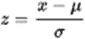

# 机器学习中的异常值

> 原文：<https://medium.com/analytics-vidhya/outliers-in-machine-learning-e830b2bd8660?source=collection_archive---------12----------------------->

杰西卡·鲁斯切洛在 [Unsplash](https://unsplash.com?utm_source=medium&utm_medium=referral) 上的照片

**什么是离群值？**

异常值是数据集中的数据点，在这些数据点中，正常观察值中存在异常观察值，这可能会导致奇怪的准确度分数，从而扭曲测量结果，因为结果并不代表实际结果。

**形式定义**:

异常值是出现在远处并偏离样本总体模式的观察值。输入数据中的异常值会扭曲和误导机器学习算法的训练过程，导致训练时间更长，模型更不准确，最终结果更差。

假设你有一个 1000 人的样本，他们都必须在红色和蓝色之间选择一种颜色。

如果 999 人选择红色，只有一个人选择蓝色，我会说那个选择蓝色的人是那个样本的异常值。

**异常值出现的原因:**

数据输入错误(人为错误)

测量误差(仪器误差)

实验错误(数据提取或实验计划/执行错误)

有意的(为测试检测方法而制造的虚拟异常值)

数据处理错误(数据操作错误)

采样误差(从错误的或各种来源提取或混合数据)

**自然**(不是错误，数据新颖)

**检测异常值:**

数据可视化:

可视化方法，如**分布曲线、箱线图、直方图和散点图**可用于检测异常值。

z 分数或极值分析:

观察值的 z 得分或标准得分是一种度量标准，用于指示数据点相对于样本均值的标准偏差(假设为高斯分布)。一些 Python 库，如 Scipy 和 Sci-kit learn help，可以通过以下表达式计算任意数据点的 z 值:

计算数据集上每个样本的 z 得分时，必须指定阈值。

聚类方法:

数据集中特征、趋势和总体之间的关系可以通过聚类方法(如 k-means 和)以图形方式表示。dbscan 可用于检测多维参数和非参数分布中的异常值。

**处理异常值:**

**删除异常值**如果异常值是由于数据输入错误、数据处理错误或异常值观测值数量很少，也删除超出给定阈值的点，我们将这些点归类为异常值。

如果异常值的数量很小，则使用**均值/中值/随机插补**来代替它们。

用投影的方法把你的数据总结成两个维度比如 [**PCA**](https://machinelearningmastery.com/calculate-principal-component-analysis-scratch-python/) **，SOM 或者 Sammon 的映射**

如果有大量的异常值，我们应该在统计模型中分别对待它们。其中一种方法是**将两个组视为两个不同的组**，为两个组建立单独的模型，然后合并输出。

**为什么治疗异常值很重要？**

异常值非常重要，因为它们会影响平均值和中值，进而影响任何数据集中的误差(绝对值和平均值)。当您绘制误差图时，如果数据集中的异常值未得到处理，您可能会得到较大的偏差，这将导致不适当的精度。