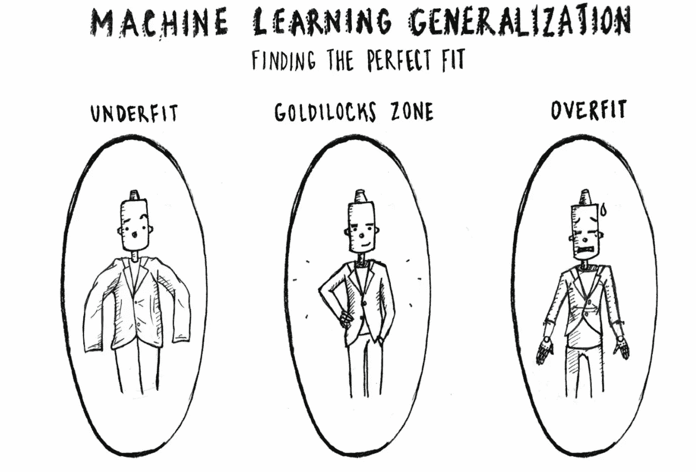
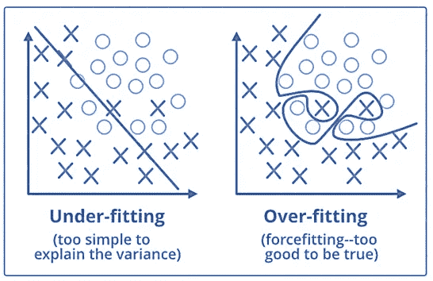
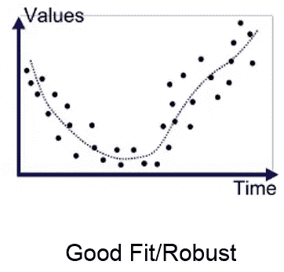
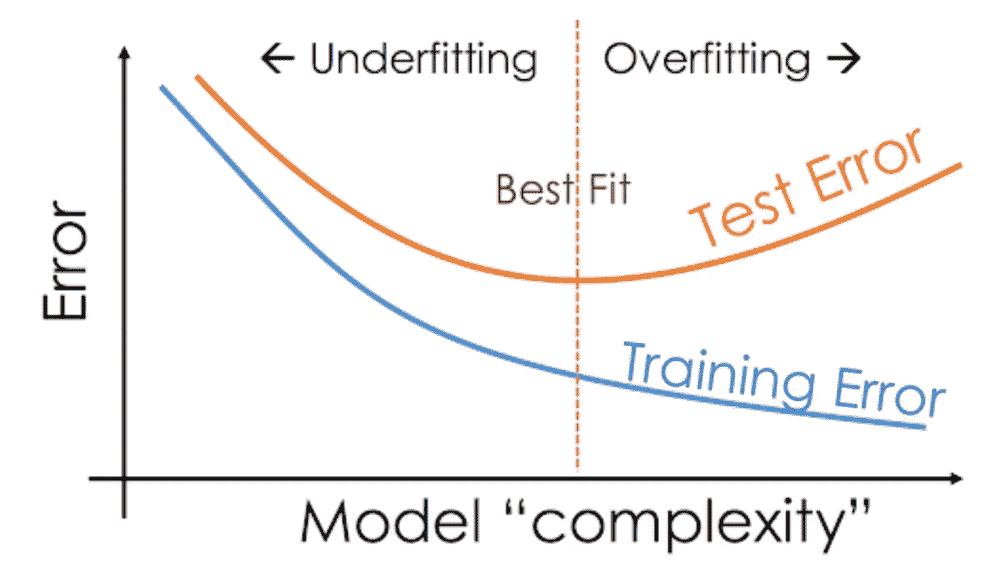

# 过装和欠装型号。

> 原文：<https://medium.com/analytics-vidhya/over-fitted-and-under-fitted-models-f5c96e9ac581?source=collection_archive---------14----------------------->

在统计和机器学习中，最常见的任务之一就是将*模型*拟合到一组训练数据上，从而能够对一般的未训练(测试)数据做出可靠的预测。

**那么，什么是过度拟合呢？**

*   **统计模型中的过拟合**是指描述随机误差或噪声，而非潜在关系。
*   当模型非常复杂时，例如相对于观察值的数量而言参数过多，就会出现过拟合。
*   过度拟合的模型具有较差的预测性能，因为它对训练数据中的微小波动反应过度。
*   过度拟合基本上是一种建模错误，当一个函数与有限的一组数据点过于接近时就会出现这种错误。

**还有，什么是不合身？**

*   **当统计模型或机器学习算法无法捕捉数据的潜在趋势时，就会出现欠拟合**。
*   例如，当将线性模型拟合到非线性数据时，会出现欠拟合。这种模型的预测性能也很差。
*   直观地说，当模型或算法与数据拟合得不够好时，就会出现拟合不足。
*   如果模型或算法显示低方差但高偏差，则发生欠拟合。

## 如何打击过装和欠装？

***打击过度拟合:***

*   对数据进行重采样以估计模型精度(k 倍交叉验证)，并通过验证数据集来评估模型。
*   **提前停止**是一种正则化形式，用于在使用迭代方法(如梯度下降)训练模型时避免过度拟合。然而， ***早期停止的一个小缺点是它在优化代价函数的同时尽量不要过拟合模型，这导致优化的代价函数不如早期停止的那么好。(为了避免这种 L2 正则化被使用)。***
*   **剪枝**在构建决策树模型时被广泛使用。它只是删除了对当前问题没有多少预测能力的节点。然而，在 RandomForest 算法中这是不需要的，因为在该算法中随机树使用随机特征，因此各个树是强的，但是彼此不那么相关。
*   **正则化，**它引入了一个代价项，用于在目标函数中引入更多的特征。因此，它试图将许多变量的系数推至零，从而减少成本项。

***对战斗欠配合:***

*   通过使用更多的数据以及通过特征选择来减少特征，可以避免欠拟合。
*   增加 ML 模型中参数的大小或数量。
*   增加模型的复杂性或类型。
*   增加训练时间，直到模型的成本函数最小。

## 非常适合统计模型:

*   理想情况下，当模型做出的预测误差为 0 时，这种情况被认为与数据非常吻合。
*   这种情况可以在过拟合和欠拟合之间的点上实现。为了理解它，我们必须随着时间的推移来观察我们的模型的性能，同时它从训练数据集学习。

> 随着时间的推移，我们的模型将不断学习，因此模型在训练和测试数据上的误差将不断减小。如果它学习的时间太长，由于存在噪声和不太有用的细节，模型将变得更容易过度拟合。因此，我们的模型的性能将会下降。

*   为了得到一个好的拟合，我们将在误差开始增加之前停止。在这一点上，该模型被认为对训练数据集以及我们看不见的测试数据集具有良好的技能。如下图所示。

喜欢我的文章？请为我鼓掌并分享它，因为这将增强我的信心。此外，我每周日都会发布新文章，所以请保持联系，以了解数据科学和机器学习基础系列的未来文章。

另外，请务必通过 linkedIn 与我联系。

[Alex](https://unsplash.com/@alx_andru?utm_source=medium&utm_medium=referral) 在 [Unsplash](https://unsplash.com?utm_source=medium&utm_medium=referral) 上的照片