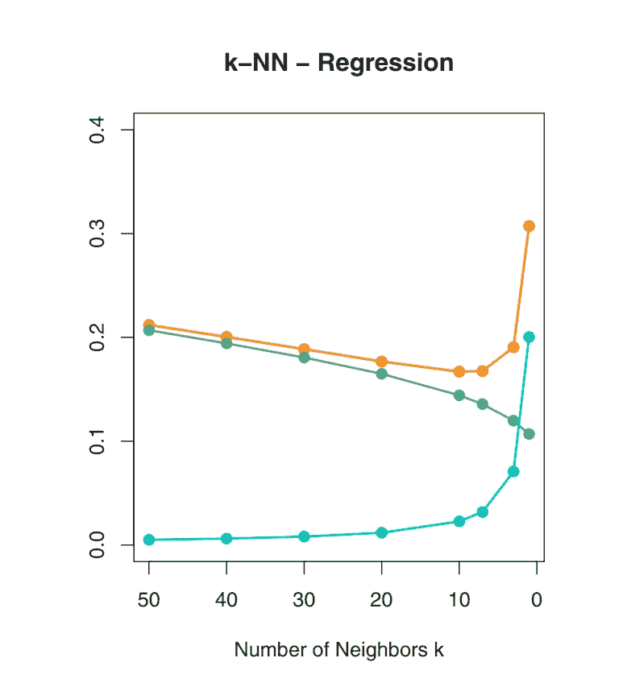
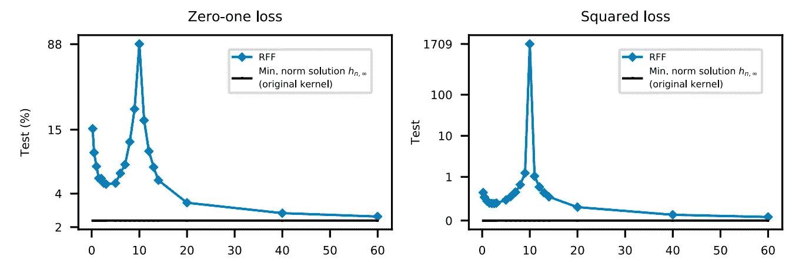
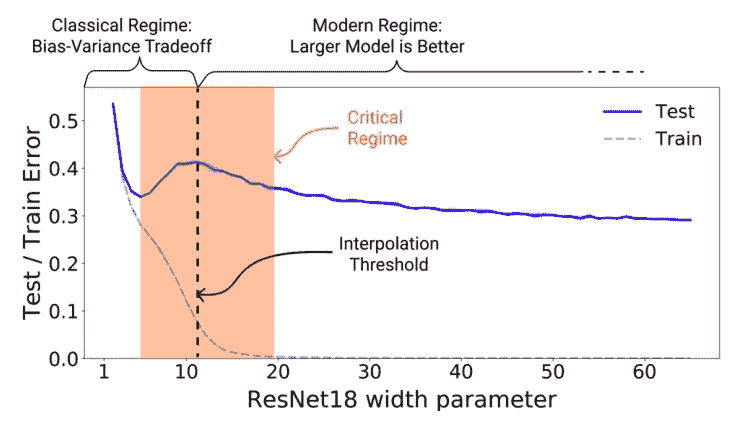

# 双重下降还是偏差-方差权衡？这是你需要的

> 原文：<https://medium.com/analytics-vidhya/over-parametrized-equals-to-overfitted-here-is-the-answer-you-need-af5bb0535a8?source=collection_archive---------18----------------------->

A 随着机器学习和统计学习的发展，获得一个具有更好泛化能力的模型一直是人们的生计。一般化仅仅定义了智能代理在现实中的适用性。如果代理确实是人工智能，它应该能够像人一样概括抽象的概念和特征。

在经典世界中，专家们提出偏差-方差权衡来解释一种在一定程度上获得良好泛化模型的方法。随着计算技术的进步，我们能够训练和部署具有更多参数和计算复杂性以及下降速度的模型。研究人员发现，一般化理论在那些大型模型中似乎有所不同。事实是大模型实际上在概括方面表现得更好。

古典智慧认为这很奇怪。大型模型通常是过度参数化的，尤其是对于那些深度神经网络。过去的教学告诉我们，一个过度参数化的模型应该过度符合所看到的数据。但是从经验上来说，大模型不仅不会过度拟合，而且在参数化不足的情况下甚至比最优模型更好。这是深度学习的奥秘之一。

本文将试图给出一个概述和深入的解释，以弥合经典观点和新观点。

## 经典智慧——偏差-方差权衡

在监督学习的内容中，偏差是预测值与真实值之间的期望差，而方差是预测值的期望差。

通常，一方面，高偏差模型将遭受欠拟合问题，因为它表明该模型还不能学习数据空间的特征模式。另一方面，高方差模型将遭受过拟合，因为它表明它对相对于所见数据的噪声非常敏感。

在经典观点中，当我们增加模型规模时，偏差和方差成反比。当我们试图减少其中一个时，另一个就会上升。因此，将存在一个最佳的模型尺寸，以平衡两者，从而得到一个具有较好泛化能力的模型。

因此，我们需要在偏差和方差之间进行权衡，以找到一个具有良好通用性的方法。这种现象在下图中得到很好的说明，图中的模型是一些合成数据的 k-NN 回归。很明显，最佳方案是 k=7 的方案。

一些合成数据的 k-NN 回归模型。k 越小，意味着模型复杂度越高。黄色曲线是测试误差，绿色曲线是偏差，蓝色曲线是方差。图为“统计学习的要素——数据挖掘、推理和预测”

## 超越古典智慧的神秘

在我们上面提到的偏差-方差权衡的主张中，在最佳模型复杂性之后，随着方差开始急剧增加，偏差的减少不再有太大帮助，继续增加它将在泛化方面变得更差。

然而，这些年来我们从深层神经网络得到的事实似乎并不遵守这一规律。随着计算技术的进步，各种领域的最新模型的模型复杂性正在增加。年复一年，我们很容易发现，获得更好模型的直接方法之一是用合适的架构增加模型的复杂性。尽管不同领域的模型复杂性增量效应背后有不同的机制和理论，但对于那些来自经典统计学习的专家来说，如果他们是现代人工智能和数据科学发展的新手，这是不直观的。

MNIST 识别的经典模型。“调和现代机器学习实践和经典偏差-方差权衡”的数字

当我们超越欠参数化区域时，尽管在模型复杂度刚刚超过插值阈值时泛化能力仍然很差，但是如果我们不断增加复杂度并收敛到最优，泛化能力将会不断提高。此外，这种现象似乎不仅仅发生在深度神经网络上，实际上它也发生在经典的学习模型上。

在我上面引用的图中，这是一个 RFF(随机傅立叶特征)模型，您可以将其视为两层完全连接的神经网络，其中一层具有冻结参数，用于 MNIST 识别。不难发现，“越大越好”同样适用于古典模型。

## 新世界——双重血统

图为“深度双重下降:更大的模型和更多的数据伤害哪里”

“双重下降”是一种现象的名称，当我们在广泛的应用领域中不断增加模型复杂性而不是泛化能力时，我们就会看到这种现象。在我们研究的模型中，双重下降似乎不仅仅是一种“局部”现象，它实际上似乎普遍存在。

在我上面引用的图中，一个典型的用于计算机视觉的深度神经网络，在模型复杂性不断增加的过程中，由于模型参数适应数据特征，测试误差首先开始下降。在经典智慧提出“甜蜜的锅”之后，检验误差开始上升，泛化能力不断恶化。然而，当复杂度超过插值阈值后，谜底就出现了。只要我们不断增加模型的复杂度，测试误差就会不断减小，达到一定的复杂度后，测试误差就会开始小于我们在参数化不足的情况下得到的甜筒。

上面的例子很好地证明了为什么当我们想要获得一个更好的模型时，增加模型的复杂度几乎总是有效的。上述现象的答案现在还没有得到证实。这需要更多的时间进行调查和理论建设。

但是我们可以看到一件非常有趣的事情。在上图中，训练误差在插值阈值后进入最优区域，而测试误差进入泛化能力不断提高的区域。这可能是因为当复杂度大到足以适应可见数据时，过度参数化带来的过量容量和表达能力使得模型能够注意和概括可见数据的隐含模式和特征。由于学习这些抽象特征是影响模型是否能够从训练数据推断出未知数据的归纳偏差的关键标准，它最终会不断改进，因为它在某种程度上获得了通过数据空间学习我们分配给它的任务的全局能力。

更有意思的是，如果我们把模型复杂度当做人脑成熟度。我们可以把欠参数化状态看作是人类学习一个新概念的探索期。在此期间，我们将坚持归纳出一些关于对象的明显的共同模式，这使我们不断改进学习。但是当我们成长时，我们大脑的更好的成熟触发我们跳出框框思考，并开始怀疑我们以前得到的结论。最后，在我们完全发现我们之前看到的那些东西后，我们能够看到全貌，并最终概括出构建我们需要学习的概念的全球特征。由于我们在这一制度中总结出的特点是全球性的，我们将表现得越来越好。这个周期相当于过度参数化的状态。

虽然 about 的观点尚未得到证实，但我们可以看到，它是数据驱动模型和人类之间一种非常有趣的联系。

## 结论

到目前为止，我们已经发现了模型复杂性一般化的一种新现象，并表明与这种新现象相比，旧智慧是一种更狭隘的局部现象。但是要做进一步的研究还有很多工作要做。

还有很多关于双重血统的新发现，以及它给专家们带来的实用技能和知识，这里还没有讨论。当你想构造和训练一个更好模型时，那些重要的发现可能会让你大吃一惊，并给你带来很多好处。我将把它们留到以后的文章中，以免这篇文章太长。

如果你喜欢这篇文章，请鼓掌，如果你想阅读更多，请跟我来。如果你有任何问题，请在下面给我留言。

参考:

 [## 深度双重下降:更大的模型和更多的数据带来的伤害

### 我们表明，各种现代深度学习任务表现出“双重下降”现象，其中，随着我们增加模型…

arxiv.org](https://arxiv.org/abs/1912.02292) 

[https://web.stanford.edu/~hastie/Papers/ESLII.pdf](https://web.stanford.edu/~hastie/Papers/ESLII.pdf)

 [## 调和现代机器学习实践和偏差-方差权衡

### 机器学习的突破正在迅速改变科学和社会，然而我们对此的基本理解…

arxiv.org](https://arxiv.org/abs/1812.11118)  [## 弱特征的两种双重下降模型

### “双下降”风险曲线是最近提出的定性描述样本外预测精度…

arxiv.org](https://arxiv.org/abs/1903.07571)  [## 两层神经网络的推广:一个渐近的观点

### 两层神经网络的推广:渐近观点:DR:双层神经的衍生人群风险…

openreview.net](https://openreview.net/forum?id=H1gBsgBYwH)