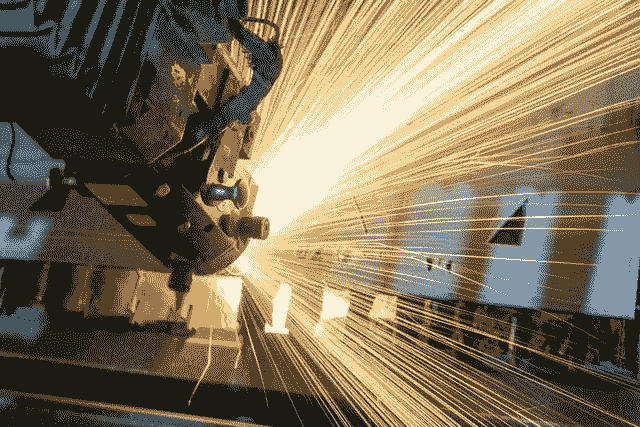

# 克服制造业的最大挑战[5 个使用案例]

> 原文：<https://medium.com/analytics-vidhya/overcoming-top-challenges-in-manufacturing-5-use-cases-6bc7c964657?source=collection_archive---------38----------------------->

无论 2020 年新冠肺炎被提及的频率有多高，这里都不能忽略它。全球疫情给该行业带来了巨大的压力。管理层解雇工人；延迟打破了供应链；零件和项目停滞不前；该行业的损失仍在计算中。虽然克服 COVD-19 的后果是一个挑战，这是一种此时此地的事情，而长期的…