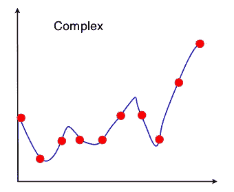
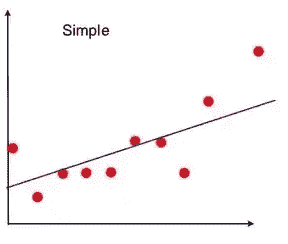
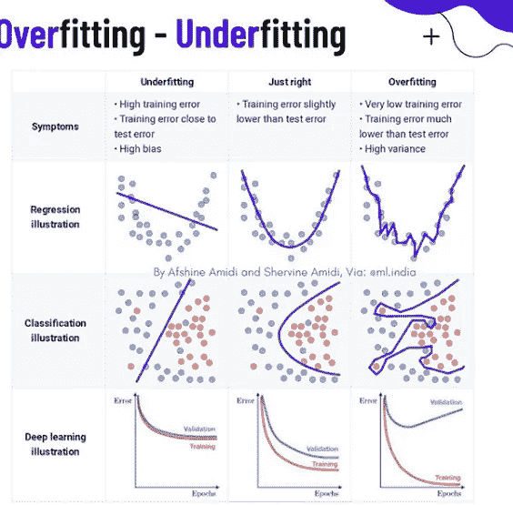

# 过度拟合和欠拟合

> 原文：<https://medium.com/analytics-vidhya/overfitting-and-underfitting-b26c7e053385?source=collection_archive---------24----------------------->

在进入主题之前，让我们看看另外两个术语，偏差和方差。

**偏差引起的误差:**偏差引起的误差是预期模型预测与训练数据真实值的差异量。它是通过用简单得多的模型来近似复杂的模型而引入的。高偏差算法更容易学习，但灵活性较差，因此它们对复杂问题的预测性能较低。线性算法和过于简化的模型导致模型偏差较大。

**方差误差:**方差误差是一个训练集的预测值与所有训练集的期望值之间的差异量。在机器学习中，different 训练数据集将导致 different 估计。但是理想情况下，它在训练集之间不应该变化太大。然而，如果一种方法具有很高的方差，那么训练数据中的小变化会导致结果的大变化。

上面可以看到低偏高方差。

在第二幅图像中可以看到高偏差和低方差。因此，在偏差和方差之间总是有一个权衡。

现在，来看看过度适应和欠适应。

**欠拟合:**
它的出现仅仅意味着我们的模型或算法与数据拟合得不够好。当我们用较少的数据来建立一个精确的模型时，或者当我们试图用非线性数据建立一个线性模型时，通常会发生这种情况。在这种情况下，机器学习模型的规则过于简单和灵活，无法应用于如此少量的数据，因此该模型可能会做出许多错误的预测。

在这种情况下，要么更改模型，获取更多数据，同时通过要素选择减少要素。

**过度拟合:**

当一个模型用如此多的数据进行训练时，它开始从我们的数据集中的噪音和不准确的数据条目中学习。那么由于太多的细节和噪声，该模型不能正确地对数据进行分类。过度拟合的原因是非参数和非线性方法，因为这些类型的机器学习算法在基于数据集构建模型时具有更大的自由度，因此它们可以真正构建不现实的模型。

过度拟合背后的主要原因可能是长时间的训练或使用多项式算法。避免过度拟合的解决方案是，如果我们有线性数据，则使用线性算法；如果我们使用决策树，则使用最大深度等参数。

上图清楚地显示了偏差和方差与欠拟合和过拟合的关系。显然，如果我们的模型拟合不足，我们就会遭受高偏差，如果我们的模型拟合过度，我们就会面临高方差问题。

甚至当我们比较我们的训练集和验证集中的误差时，很明显，当过度拟合时，训练误差将非常小，而验证误差将非常大。在欠拟合中，训练和验证误差几乎相等且很高。

**如何防止过度拟合**

1.  交叉验证。交叉验证是防止过度拟合的有力预防措施。
2.  用更多数据训练。不是每次都管用，但是用更多的数据训练可以帮助算法。
3.  移除特征:有时
4.  早期停止:这肯定会停止过度拟合我们的模型，但有时我们的模型没有得到完全训练。
5.  正则化:广泛用于防止过度拟合的技术之一。

**如何防止不合身**

1.  增加 ML 模型中参数的大小或数量。
2.  通过添加更多的层或增加它们的大小来增加模型的复杂性或类型。
3.  增加训练时间，直到成本函数最小。

这都是我这边的。您可以通过以下方式联系我:

电子邮件:ashishgusain12345@gmail.com

github:【https://github.com/AshishGusain17 

领英:[https://www.linkedin.com/in/ashish-gusain-257b841a2/](https://www.linkedin.com/in/ashish-gusain-257b841a2/)