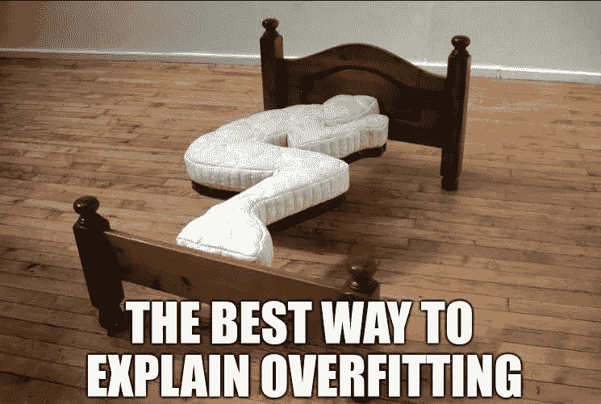
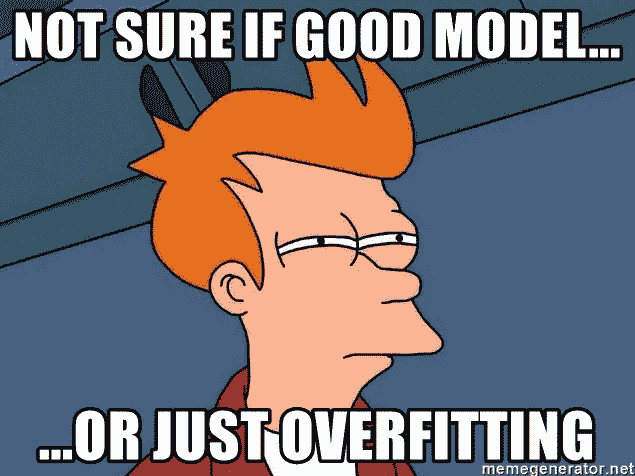
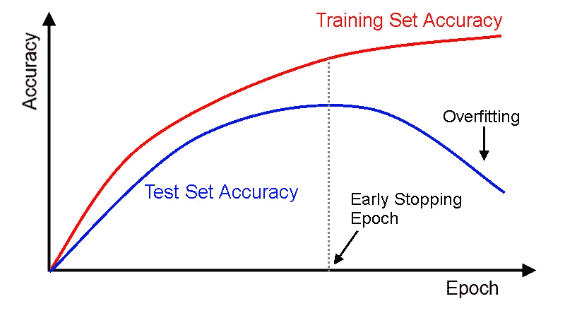
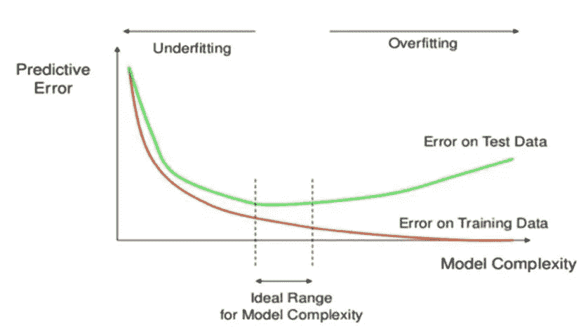
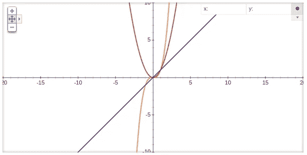

# 适配过度与适配不足:对完美平衡的追求

> 原文：<https://medium.com/analytics-vidhya/overfitting-and-underfitting-the-quest-for-a-perfect-balance-4e0f499c12ad?source=collection_archive---------12----------------------->

来源:互联网

完美的平衡，就像所有事物应该的那样…！”强大的灭霸在电影《无限战争》中臭名昭著的对话中提到了人性。具有讽刺意味的是，这段对话在机器学习工程师的生活中具有重大意义。就我们机器学习工程师而言，平衡的斗争是过度适应和欠适应之间的斗争。正如你们所知，机器学习围绕着使用相关的预定义数据对任务进行建模，并进一步使用该模型做出明智的决策。模型的准确性取决于它概括任务的能力。过拟合和欠拟合是决定模型性能的两个关键术语。在这篇博客中，我将会给你一个关于这两个术语的深刻见解。

来源:互联网

假设有三个学生，学生 A、学生 B 和学生 C，他们即将参加期末物理考试。他们三个都有 H.C .维尔马提供的“*物理学概念”作为参考。学生们对整本教科书漫不经心，对其中解释的概念不给予任何重视。然而，学生 B 试图抓住并概念化教科书中每章背后的基本概念。学生 C 从头学了一半书，留下了另一半。但是无论他学到了什么，他都忠实于与之相关的概念。现在让我们来看看下面的场景:*

**场景 1:大部分问题直接来自教科书。**

在这种情况下，学生 A 占了上风，因为他成功地背诵了整本教科书。学生 B 也会表现很好，但不如学生 a 好。学生 C 勉强通过考试

**情景 2:大部分问题间接来自给定的课本。**

在这里，学生 B 将胜过其他人。学生 A 会惨败，学生 C 会勉强通过考试。

**情景三:大部分问题间接来源于教材的前半部分。**

在这里，学生 C 或学生 B 同样有可能名列前茅。然而，学生 A 还是会悲惨地失败，因为大多数问题都是间接从课文中问出来的。

现在参考上述结果，我想解释一下过度适应和欠适应的概念。机器学习模型最期望的结果是很好地概括定义的任务。一般化是模型向从未见过的输入提供合理输出的能力。模型的性能以及它的整体应用在很大程度上依赖于模型的泛化。

我想是时候深入探讨过度适配和适配不足这两个术语了。Gareth James 的《统计学习导论》对过度拟合和欠拟合的解释如下:

> *过度拟合是指总体成本确实很小，但模型的泛化不可靠的情况。这是因为模型从训练数据集中学习了“太多”。而拟合不足是指模型“没有从训练数据中学习到足够的知识”，导致泛化能力低和预测不可靠*。

如果你正在追求数据分析，我建议你阅读这本书，但如果你正在更多地关注深度学习领域，我不建议你这样做。

回到我们的场景，学生 A 可以被视为一个过度拟合模型的完美例子。这里的训练精度会非常高。为什么是男生？因为他能够在考试中脱颖而出，因为考试中的问题和课本上的一模一样。但是测试的准确性会非常低，因为他没有通过考试，因为大多数问题都间接来自给定的教科书。

来源:Inernet

学生 C 是一个不满足模型的好例子。在这里，培训的准确性非常低，因为他甚至没有完成向他提供的基本教学大纲。一般来说，在大多数情况下，测试精度也会显得很低。然而，测试精度可能很高，例如场景 3 中的情况。这主要是由于训练和测试数据集的分布之间的高度互相关。由此得出的主要结论是，测试精度不应该是决定模型效率的唯一标准。

那么，他们中表现最好的是谁呢？不是别人，正是学生 b。在他的训练和测试准确性之间有一个完美的平衡。他能够概括分配给他的整个任务。这实际上是从一个合理的机器学习模型中预期的。一个好的统计模型应该能够从训练数据中获取最多的信息，并且能够概括任务。一个模型既不能过拟合，也不能过拟合。训练精度和测试精度之间应该总是有很强的相关性，这样它们在数量上就不会相差太多。我个人倾向于两者之间最多相差 5-8 个单位。

来源:互联网

让我们继续讨论过度拟合和欠拟合这两个术语的统计数据。在继续之前，我想解释一下与之相关的两个基本术语。它们是**方差**和**偏差**。

> 偏差基本上是我们的机器学习模型的期望值(均值)和相应分布中的真实(实际)值之间的差异。简而言之，这就是模型的预期值与估计的真实值之间的差异。期望值不应与模型的结果混淆，因为两者完全不同。
> 
> 方差是指如果使用不同的相关数据集来评估我们的模型，我们的机器学习模型的估计值将发生变化的量。统计定义表明，方差是机器学习模型与其均值的方差的期望值。

> 这些与适配过度和适配不足有什么关系？

来源:互联网

当一个模型甚至不能捕捉数据的基本基本模式或分布时，就会发生拟合不足。这些模型通常有很高的偏差。上图中的第一个图表是一个欠拟合模型的示例。从图表本身来看，很明显模型的偏差很大。

然而，当我们的模型完全捕捉到数据的潜在模式，而不是分布时，就会发生过度拟合。这些模型有很高的方差。上图中的最后一个图形显示了一个过度拟合的模型。

偏差和方差取决于各种因素，例如我们用于建模的统计模型的性质和类型、我们为训练模型而固定的属性数量以及训练模型所依据的时期数量。

来源:互联网

为大量时期训练模型可能会导致过度拟合。广泛鼓励部署诸如早期停止的方法，其中当测试准确度没有显著增加时，训练实际上停止，以防止过度拟合。随着对相同数据的训练数量的增加，我们完全捕获了数据的潜在模式，这是一种过度拟合的情况，但却无法概括分布。理想情况下，您应该微调历元的数量，使其既不应该太大，也不应该太小。

模型的尺寸与过度拟合有很大关系。如果你的统计模型只有很少的属性，那么它可能有很高的偏差和很低的方差。另一方面，如果你的模型有大量的属性，那么它将有高方差和低偏差。模型的复杂性取决于属性的数量，也称为维度。复杂度越高，描述模型的多项式的阶就越高，这直接导致更高的方差。

紫色:y = x 的图形，橙色:x 的图形，红色:x 的图形

从图中可以明显看出，随着多项式次数的增加，相应的图的方差也有增加的趋势。当多项式的次数很高时，训练集的拟合度会越来越好，最终可能会过度拟合。

过拟合和欠拟合的问题也取决于我们选择的统计模型的类型。当学习诸如决策树或随机森林之类的目标函数时，非参数和非线性模型更有可能过度拟合。

被称为主成分分析(PCA)的降维技术或诸如岭回归和套索回归之类的正则化技术可以在属性数量变高的情况下使用。特征工程技术也可以用来删除不必要的或最不重要的属性。除了所有这些，重采样技术也被广泛用于防止过拟合。最流行的重采样技术是 k 倍交叉验证。它允许您在不同的训练数据子集上训练和测试您的模型 k 次。所有这些技术的主要目的是在偏差和方差之间找到一个完美的平衡，没有过拟合和欠拟合的问题。

掌握偏差和方差之间的权衡对于成为机器学习冠军非常必要。有时这些术语经常被认为是不恰当的。然而，我敦促你在处理任何类型的机器学习问题时，记住所有这些概念。获得一个非常高精度的模型从来都不是我们的主要目标，而是一个一般化的模型才是最终目标。永远记住保持平衡。

来源:互联网

> 在这篇博客中，我向你介绍了术语“过度适应”和“欠适应”的基本概念，我希望这篇博客对你有所帮助，并激励你深入主题。