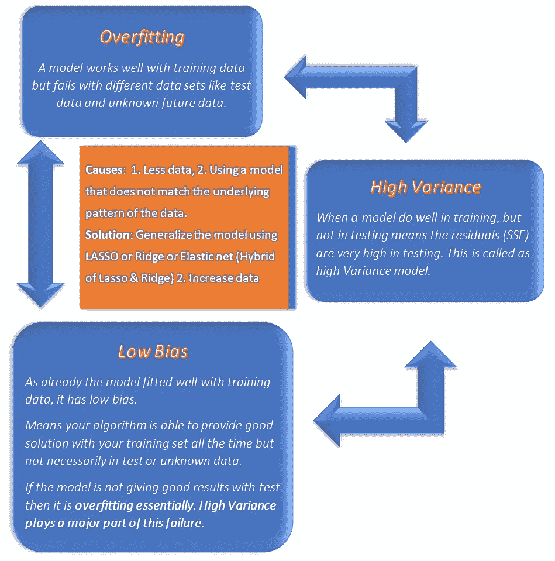
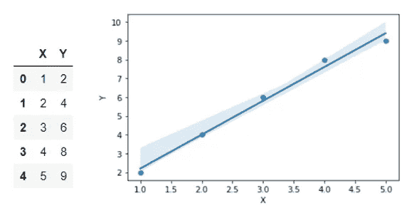
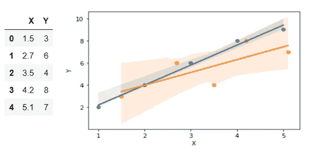
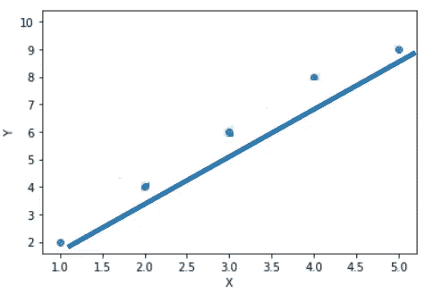
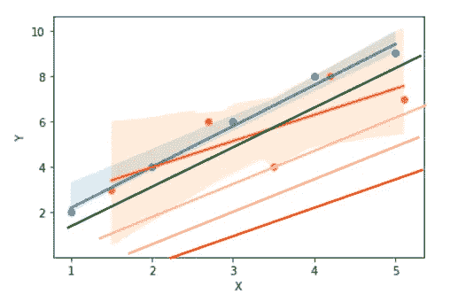
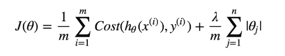
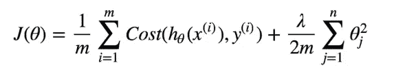
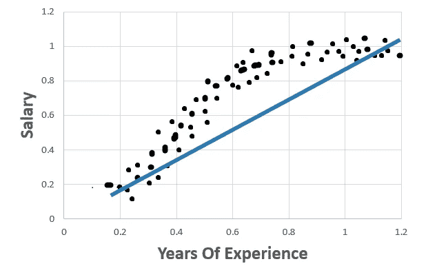
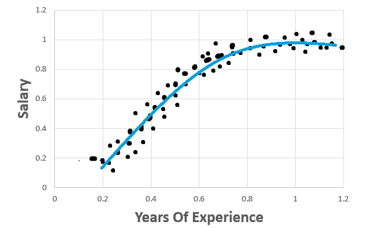

# 过度拟合—偏差—方差—正则化

> 原文：<https://medium.com/analytics-vidhya/overfitting-bias-variance-regularization-fd929ff54218?source=collection_archive---------14----------------------->

当线性回归模型对训练数据很有效，但对测试数据或未知的新数据无效时，这意味着模型过度拟合。

> **当我们为训练数据的模型增加更多复杂性时，就会出现过度拟合。当复杂性增加时，模型对数据中的噪声做出反应。**

**这里的噪声指的是与数据点没有真正的关系，而只是随机选择的数据点。**

例如，在多项式回归中，我们增加了太多的次数以适应训练数据，但这将无法明智地处理测试数据。这个场景是用一个花哨的词**过拟合**提到的。

为了理解过度拟合，让我们以下面的线性回归模型为例。

过度拟合

我们可以看到，这条回归线非常符合上述数据。

让我们看看当我们绘制测试和训练数据时会发生什么，这样我们就可以比较这两条最佳拟合线。

过度拟合—测试

现在，您可以看到测试数据(橙色点)具有不同于训练数据的最佳拟合线。

这意味着，对于训练数据的最佳拟合线，不同数据集的误差值之和变化很大。

变化很大？是啊！这就是所谓的高方差。

> **数据集之间误差总和的差异(训练&测试)称为方差。**
> 
> ***如果一个模型在训练中产生的误差(SSE)很小，而测试误差(SSE)很大，那么称之为高方差模型。***
> 
> ***如果该模型产生的测试数据误差非常接近训练中得到的误差，则称之为低方差模型。***

在第一个“过度拟合”图中，如果我们稍微调整了训练数据的回归线，以便它可以推广到测试数据以及不同的数据集，会怎么样？

这些调整可以通过向 SSE 值添加罚值来降低系数来完成。

当惩罚太低时，比如说 0，那么它就是我们的原始线性回归，我们发现它是过度拟合的模型。

假设 SSE 值仍然保持较低，通过逐渐增加惩罚，系数开始逐渐减小，最佳拟合线一点一点地移动，从而模型将被一般化。

在一个点上，通过增加罚值，直线会移出广义点，不再是最佳拟合直线。

带惩罚的线性回归

在上图中，我们绘制了具有不同惩罚的一般化线条。

当惩罚稍微增加时，我们得到绿线，这样它可以推广模型。(只是为了演示，我已经手绘好了)

当进一步增加时，线移出数据。黄色、粉色和红色的线甚至没有靠近数据，这不是一个好的迹象。因此，当增加惩罚时，模型的适合度开始变得不适合(不适合任何数据集)。

这种向线性回归成本函数添加惩罚的方式称为正则化。

# **收缩/正则化方法:**

1.  拉索-L1 正则化
2.  岭-L2 正则化-了解我们的模型有多灵活。正则化程度越高，我们的模型就越不容易过度拟合。

**拉索还是 L1 正规化:**

来源[https://towards data science . com/optimization-loss-function-under-the-hood-part-ii-d20a 239 CDE 11](https://towardsdatascience.com/optimization-loss-function-under-the-hood-part-ii-d20a239cde11)

**岭或 L2 正则化:**

来源[https://towards data science . com/optimization-loss-function-under-the-hood-part-ii-d20a 239 CDE 11](https://towardsdatascience.com/optimization-loss-function-under-the-hood-part-ii-d20a239cde11)

现在，我们已经看到了过度拟合和高方差在其中的作用。

让我们看看偏差是如何与方差相关联的。

在下图中，只有 3 个数据点。

# **什么是偏见？**

考虑下面的线性回归模型:

在该图中，数据点非常适合多项式回归。但不是线性回归。因此，该模型在训练和测试数据集上都产生很高的误差。这种情况称为高偏差。

> **机器学习模型无法找到真实关系的现象称为偏差。**
> 
> **Foreman 的文章对此进行了总结:
> “偏差是算法通过不考虑数据中的所有信息(欠拟合)而持续学习错误东西的倾向。”**

线性回归可以很好地拟合训练数据，而很差地拟合测试数据。这被称为**过拟合**数据(低偏差和高方差)。

模型可能非常不适合训练和测试数据(高偏差和低方差)。这被称为**欠拟合**数据。

一个理想的模型是同样适合训练和测试数据集。

> **高偏差发生在:
> 1。我们的数据量非常少，无法找到数据中的真实关系。
> 2。当使用与数据的基本模式不匹配的模型时。例如:当我们试图为非线性数据建立线性模型时。**

**克服过拟合:**

1.  使用正则化(即套索、脊、弹性网)。
2.  移除实际上没有关系的要素。
3.  添加更多数据点。

**克服拟合不足:**

1.  欠拟合意味着你的模型太简单。增加模型的复杂性，例如使用要素的多项式。(即增加多项式回归的次数。)
2.  合并更多的特征或计算特征的相互作用。

C **结束语:**

1.  线性回归可以很好地拟合训练数据，而很差地拟合测试数据。这被称为过度拟合数据(低偏差和高方差)。
2.  类似地，它可能非常不适合训练和测试数据(高偏差和低方差)。这就是所谓的数据欠拟合。
3.  一个理想的模型是同样适合训练和测试数据集。
4.  我们仍然可以通过使用正则化或添加模式特征或添加更多的数据点来克服这些问题。