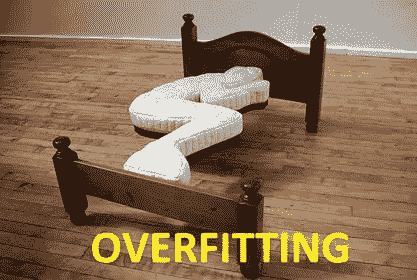
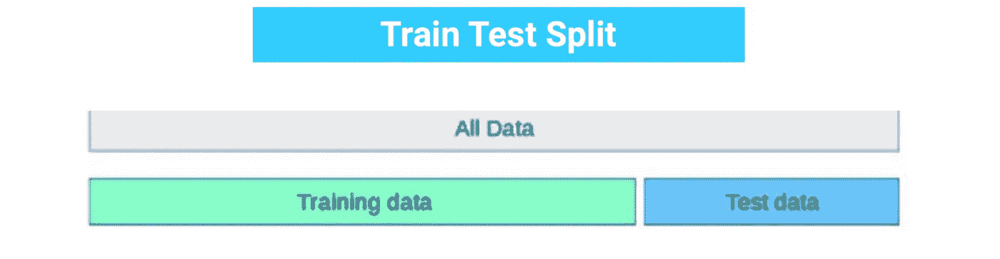
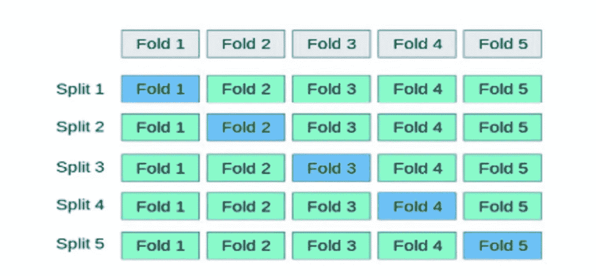
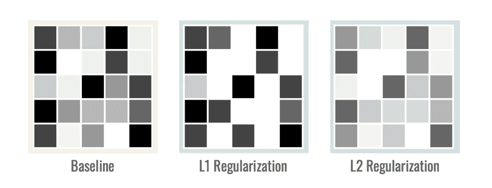
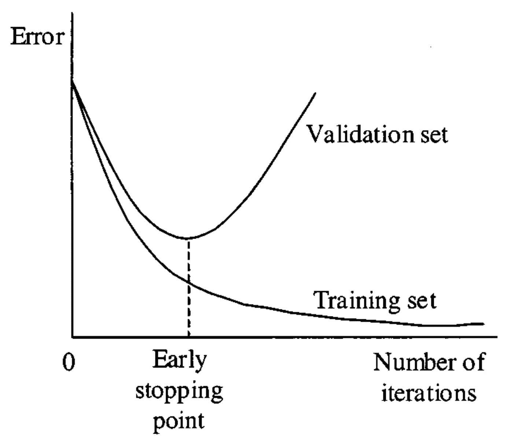

# 过度拟合:检测和预防

> 原文：<https://medium.com/analytics-vidhya/overfitting-detection-prevention-848e6adeabf8?source=collection_archive---------10----------------------->

单词“过度拟合”定义了模型中的一种情况，其中统计模型开始解释数据中的噪声，而不是数据集中存在的信号。当模型过于复杂或过于灵活时，就会出现这个问题。回归模型中的过度拟合显示了噪声的 R 平方值、回归系数和 p 值，而不是总体中的真实关系。

参考图片来自 facebook

该模型不是学习数据的一般分布，而是学习每个数据点的*预期* *输出*。

# **如何检测过度拟合**

1.  为了避免过度拟合，我们可以将数据集分成随机的训练和测试子集。

如果你的模型在训练集上的表现比在测试集上好得多，那么你很可能过度拟合了。

例如，如果您的模型在训练集上看到 80%的准确性，但在测试集上只有 50%的准确性，这将是一个很大的警告。然后，它会自动成为模型的危险信号。

**2** 。检测过度拟合的另一种方法是从一个将作为基准的简单基线模型开始。这种方法被称为**奥卡姆剃刀测试**。奥卡姆剃刀被认为是奥卡姆的英国方济各会修士威廉(约 1287-1347 年)发明的。在两个模型的性能相当的情况下，它基本上选择简单的模型。

根据该方法，与过度复杂的机器学习模型相比，简单的机器学习模型可以预测更好的数据洞察力，过度复杂的机器学习模型通常遭受被称为偏差方差权衡的统计噪声。但有时很难判断哪部分数据是噪音。

虽然检测过度拟合是一个很好的实践，但也有几种技术可以防止过度拟合。让我们来看看防止机器学习中过拟合的几种方法。

# **如何防止过拟合**

1.  **用更多数据训练**

这种技术可能并不是每次都有效，因为大量的训练有助于模型的建立。它有助于模型更好地识别信号。

**2。移除特征**

虽然一些算法有内置的特征选择方法，但是如果一个特征不能解释模型中的相关性，我们可以手动删除它。我们甚至可以使用一些特性选择试探法作为一个好的起点。

**3。交叉验证**

在标准的 k 折叠交叉验证中，我们将数据分成 k 个大小大致相等的子集，称为折叠。然后，我们通过保留一个用于测试的折叠和其他 k-1 个用于训练的折叠来迭代地训练该算法。每次不同的一组或一组折叠用于验证。

**4。正规化**

它通过使用更广泛的技术，人为地迫使我们的模型避免复杂性。最常见的被称为 L1 和 L2(岭回归):

1.  L1 罚旨在最小化权重的**绝对值** **值**
2.  L2 罚值旨在最小化权重的**平方** **大小**。

*L1* 具有正则化以及变量选择的优点。它强制特征**、**将*减去*、*有用的*参数设置为 0。它帮助我们在*数据集*中识别**最相关的特征**。L1 罚分的缺点是它的计算效率通常不如 L2 罚分那么高。

来源:[https://hacker noon . com/memoring-is-not-learning-6-tricks-to-prevent-fitting-in-machine-learning-820 b 091 DC 42](https://hackernoon.com/memorizing-is-not-learning-6-tricks-to-prevent-overfitting-in-machine-learning-820b091dc42)

**5。提前停止**

我们可以继续进行一定数量的迭代，直到新的迭代改进了模型。之后，模型的能力会耗尽，因为它开始过度拟合训练数据。

来源:[https://www . research gate . net/figure/Early-stopping-based-on-cross-validation _ fig 1 _ 3302948](https://www.researchgate.net/figure/Early-stopping-based-on-cross-validation_fig1_3302948)

**参考文献:**

1.  [https://elitedata science . com/over fitting-in-machine-learning](https://elitedatascience.com/overfitting-in-machine-learning)
2.  [https://statistics byjim . com/regression/over fitting-regression-models/](https://statisticsbyjim.com/regression/overfitting-regression-models/)
3.  [https://hacker noon . com/memoring-is-not-learning-6-tricks-to-prevent-fitting-in-machine-learning-820 b 091 DC 42](https://hackernoon.com/memorizing-is-not-learning-6-tricks-to-prevent-overfitting-in-machine-learning-820b091dc42)