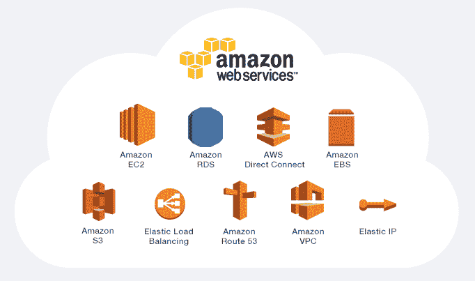
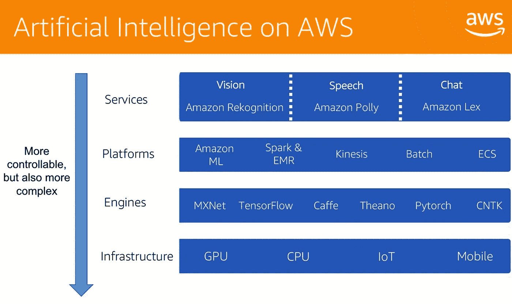
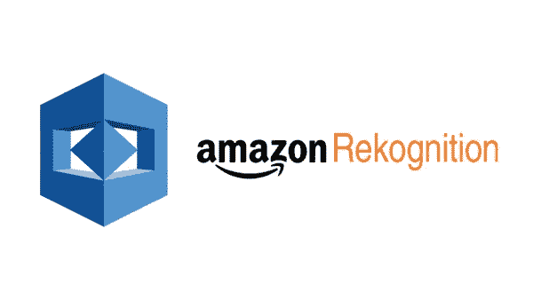
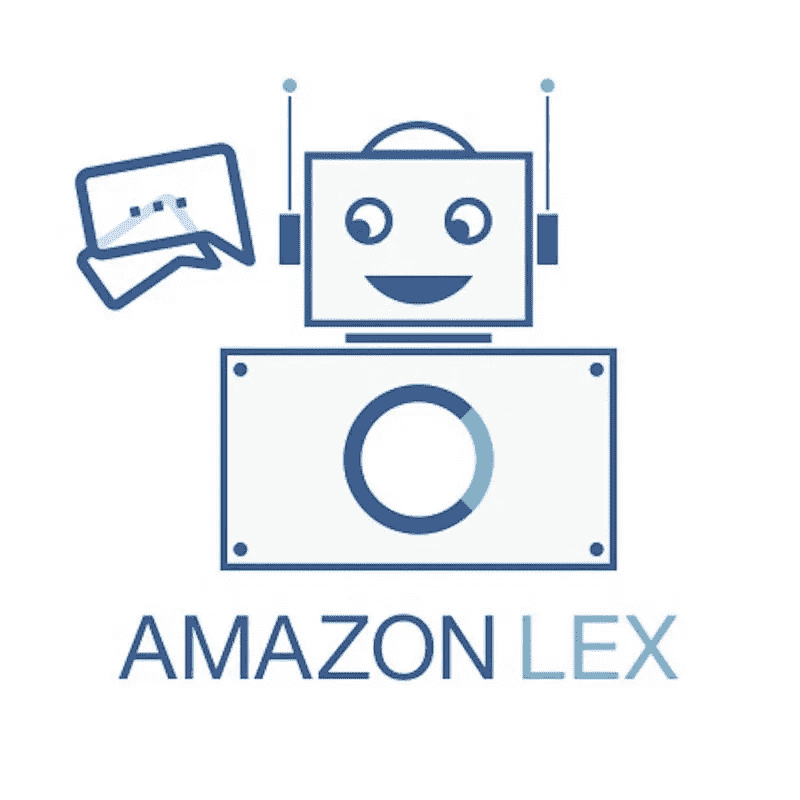
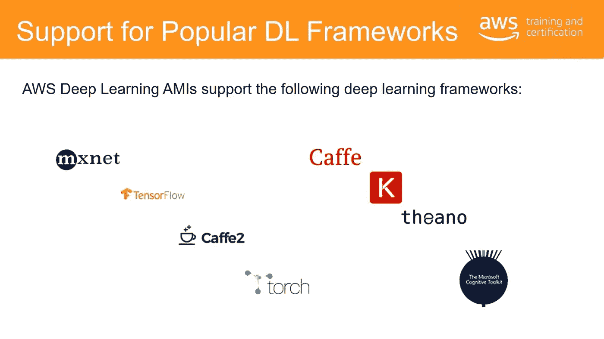
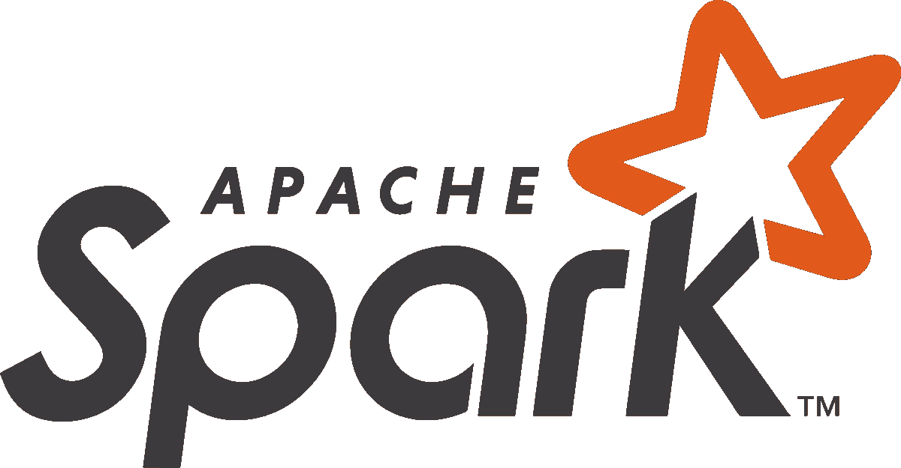

# 基于人工智能的亚马逊网络服务(AWS)概述

> 原文：<https://medium.com/analytics-vidhya/overview-of-all-ai-based-amazon-web-services-aws-2f850eda93a8?source=collection_archive---------3----------------------->

人工智能在亚马逊得到了广泛应用。在 Amazon.com 上，用户可以看到亚马逊推荐引擎的推荐，这改善了他们的购物体验。人工智能用于发现客户体验的趋势，以便开发新产品和改进现有产品。在履行和物流部门，机器人挑选、堆放、分类和移动箱子，以便将它们运送给客户。亚马逊员工过去每天必须步行数英里。通过使用人工智能，他们节省了时间，并腾出员工来更快地为更多客户服务。

现在 AWS 已经广泛提供人工智能工具，以便企业可以创新和改进他们的产品。亚马逊网络服务通过利用亚马逊在人工智能和机器学习方面的内部经验，提供一系列人工智能服务。这些服务在这里根据四层来划分，

1.  人工智能服务
2.  人工智能平台
3.  人工智能框架
4.  AI 基础设施。

他们从最简单到最复杂，从上到下进行组织。让我们简单地看一下每一层。

> 每个人工智能服务都是为处理特定的常见人工智能任务而构建的。这些服务使开发人员能够通过一个名为预训练服务的 API 将智能添加到他们的应用程序中，而不是开发和训练他们自己的深度学习模型。

 [## 亚马逊识别-视频和图像- AWS

### 通过机器学习自动化图像和视频分析。Amazon Rekognition 可以轻松添加图像和视频…

aws.amazon.com](https://aws.amazon.com/rekognition) 

Amazon Recognition 使您可以轻松地为应用程序添加图像分析。通过 rekognition，您可以像检测名人一样检测特定的对象、场景和人脸，并识别图像中的不适当内容。您还可以搜索和比较面孔。Rekognition 的 API 使您能够快速将复杂的基于深度学习的视觉搜索和图像分类添加到您的应用程序中。

 [## 亚马逊波利

### 使用深度学习将文本转换为逼真的语音亚马逊 Polly 是一种将文本转换为逼真语音的服务…

aws.amazon.com](https://aws.amazon.com/polly/) 

Amazon Polly 是一项将文本转换成逼真语音的服务，允许您创建能够说话的应用程序，并构建全新类别的语音产品。亚马逊 Polly 的文本到语音服务使用先进的深度学习技术来合成听起来像人声的语音。

 [## 亚马逊 Lex -构建对话机器人

### 您的应用程序的对话界面由与 Alexa Amazon Lex 相同的深度学习技术提供支持

aws.amazon.com](https://aws.amazon.com/lex/) 

Amazon Lex 是一项为任何使用语音和文本的应用程序构建对话界面的服务。它提供自动语音识别，用于将语音转换为文本，并提供自然语言理解，以识别文本的意图。这使您能够构建具有高度吸引人的用户体验和逼真的对话式交互的应用程序。

> 堆栈的人工智能平台层包括旨在支持定制人工智能相关任务的产品和框架，例如用你自己的数据训练机器学习模型。

对于那些想要完全管理使用自己的数据构建模型的平台的客户，我们有亚马逊机器学习。

[https://aws.amazon.com/machine-learning](https://aws.amazon.com/machine-learning/)/

它是为希望专注于构建模型的开发人员和数据科学家设计的。该平台消除了与部署和管理用于培训和托管模型的基础架构相关的无差别开销。它可以分析您的数据，为您提供建议的数据转换，训练您的模型，甚至帮助您评估模型的准确性。

 [## 亚马逊电子病历-大数据平台-亚马逊网络服务

### 轻松运行和扩展 Apache Spark、Hive、Presto 和其他大数据框架分析师、数据工程师和数据…

aws.amazon.com](https://aws.amazon.com/emr/) 

Amazon EMR 是一个灵活、可定制和可管理的大数据处理平台。这是一个托管解决方案，因为它可以为您处理诸如扩展和高可用性之类的事情。Amazon EMR 不需要深入了解如何设置和管理大数据平台，您可以获得一个预配置的集群来接收您的分析工作负载。它是为任何数据科学工作负载而构建的，不仅仅是人工智能。

 [## Apache Spark 面向大数据的统一分析引擎

### 闪电般快速的统一分析引擎 Apache Spark 是用于大规模数据处理的统一分析引擎…

spark.apache.org](https://spark.apache.org/) 

Apache Spark 是一个开源的分布式处理系统，通常用于大数据工作负载。Apache Spark 利用内存缓存和优化执行来提高性能，它支持一般批处理、流分析、机器学习、图形数据库和即席查询。它可以在 Amazon EMR 集群上运行和管理。

> 人工智能框架和基础设施层是为专家机器学习实践者准备的。换句话说，对于那些乐于建立深度学习模型、训练它们、进行预测(也称为推理)以及将模型中的数据应用于生产应用的人来说。

底层基础设施由亚马逊 EC2 P3 实例组成，这些实例针对机器学习和深度学习进行了优化。亚马逊 EC2 P3 实例提供了强大的 NVIDIA GPUs 来加速计算，因此客户可以在传统 CPU 所需的一小部分时间内训练他们的模型。

经过培训后，Amazon EC2 C5 compute optimize 面向通用实例。除了基于 GPU 的实例之外，也非常适合使用训练模型运行推理。

AWS 支持所有主要的深度学习框架，并使它们在没有 AWS 的情况下易于部署，深度学习 Amazon machine image 可用于 Amazon Linux 和 Ubuntu，因此您可以创建托管的、自动可扩展的 GPU 集群，用于任何规模的训练和推理。它预装了 Apache MX net、tenser flow、Cafe 和 Caffe2 等技术，以及自动填充机器学习软件，如用于数据科学的 Anaconda 包。

现在我们来看几个用例。几乎所有的行业领域现在都在用 AWS AI 进行创新。举个例子，

1.  Fraud.net 使用亚马逊机器学习来支持其机器学习模型。
2.  该公司使用 Amazon DynamoDB 和 AWS Lambda 来运行代码，而无需供应和管理服务器。
3.  Fraud.net 也使用亚马逊红移进行数据分析。

他们从这种设置中获得了什么好处？

Fraud.net 推出和训练机器学习模型的时间几乎是其他平台的一半。它降低了复杂性，有助于发现新的欺诈模式。它每周为客户节省约 100 万美元。

总之，你可以通过自动化重复和手动任务、吸引客户和使用人工智能优化产品质量来影响你的业务。

# 在这里找到我

大家好！希望这是有帮助的！

由**瓦里舒喘气**

-统计学家、数据科学家和作词人。

如有任何建议、更正或只是想和我聊聊，请联系我-

https://www.linkedin.com/in/varishu-pant/

此外，看看我在 [Analytics Vidhya](https://medium.com/analytics-vidhya) 发表的其他博客(比如未观察到的组件模型)

## [https://medium.com/@varishupant](/@varishupant)

此外，如果你对嘻哈感兴趣，我在 Spotify、Youtube 和其他流媒体平台上有原创作品:

 [## 瓦里舒裤

### 大家好！我是一个内向的人，用嘻哈的方式向世界传达我的想法。我说唱自己的歌词，也做…

www.youtube.com](https://www.youtube.com/channel/UCotoIKSpZC6YLP5d11qEkcw)