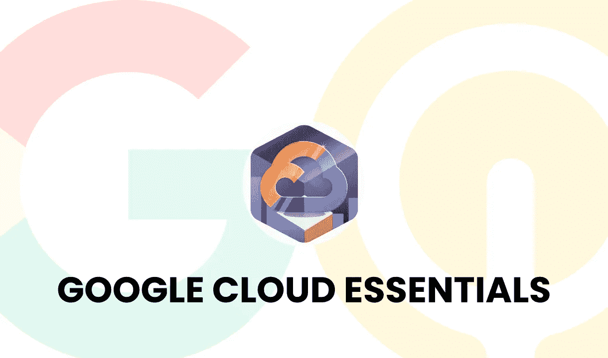
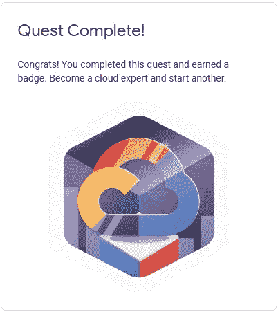

# Google Cloud Essentials Quest 概述

> 原文：<https://medium.com/analytics-vidhya/overview-of-google-cloud-essentials-quest-b8047744847c?source=collection_archive---------13----------------------->

## 概述

如果你希望深入或全面地了解谷歌云，无论你是否有云计算方面的知识，那么你一定要看看这个探索，[链接](https://www.qwiklabs.com/quests/23)。

Google Could Essentials 是一个入门级别的任务，有助于了解 Google Cloud 的基本原理。从编写云 Shell 命令和部署我的第一个虚拟机，到在 Kubernetes 引擎或负载平衡上运行应用程序，Google Cloud Essentials 是该平台基本功能的主要介绍。

让我们看看任务大纲是什么:

1.  **qwikilabs 和谷歌云之旅**
2.  **创建虚拟机**
3.  **云壳入门& gcloud**
4.  **Kubernetes 发动机:Qwik 启动**
5.  **设置网络和 HTTP 负载平衡器**

**qwik labs 和 Google Cloud 之旅**是第一次动手实验，基本上是对 Google Cloud 的概述。有几个问题将检查您对该主题的理解，其余的是关于访问 Google 云控制台、云控制台中的项目、角色和权限、云外壳等。

**创建虚拟机**是第二个创建虚拟机并连接 NGINX web 服务器的实验室。计算引擎允许用户创建虚拟机，其资源位于特定区域或地带。NGINX web 服务器用作负载平衡器。负载平衡器的工作是在多个计算资源之间分配工作负载。创建这两个以及一个问题将标志着第二个实验的结束。

**云壳入门& gcloud** 是第三节实验课。Google Cloud Shell 提供了对托管在 Google Cloud 上的计算资源的 gcloud 命令行访问。云壳是一个基于 Debian 的虚拟机。Cloud SDK gcloud 和其他实用程序预装在 Cloud Shell 中。该会话从初始化 Cloud SDK 和设置环境变量开始，最后创建 n1-standard-2 类型的虚拟机。

**Kubernetes 引擎:Qwik 启动**是第四个实验室。如果你不知道什么是[谷歌 Kubernetes 引擎](https://cloud.google.com/kubernetes-engine/) (GKE)，它基本上允许你指定每个容器需要多少 CPU 和内存(RAM)，这是用来更好地组织集群内的工作负载。GKE 为使用谷歌基础设施管理和扩展容器化应用程序提供了一个托管环境。Kubernetes 引擎环境由多台机器组成，组成一个[容器集群](https://cloud.google.com/kubernetes-engine/docs/concepts/cluster-architecture)。该会话首先将默认计算区域设置为 **us-central1-a** ，并创建一个 Kubernetes 引擎群集。一个集群至少由一台集群主机和多台称为节点的工作机组成。然后，您必须对刚刚创建的集群的凭证进行身份验证，之后您可以将应用程序部署到集群。

**设置网络和 HTTP 负载平衡器**是最后一个实验。本实验将向您介绍云负载平衡，以及网络负载平衡器和 HTTP 负载平衡器之间的区别。负载平衡器将用户流量分布在应用程序的多个实例中。通过分散负载，它降低了运行缓慢和无法正常工作的风险。根据流量类型，您可以对 HTTP 和 HTTPS 流量、TCP 流量和 UDP 流量使用负载平衡器。在本实验中，您将只使用 **L3:网络负载平衡器，L7 : HTTP(S)负载平衡器。**本课程首先为您在之前的实验中学到的所有资源设置默认区域和分区。然后，您将通过创建一个简单的 Nginx web 服务器集群来创建多个 web 服务器实例。然后，您将创建一个网络负载平衡器，根据传入的 IP 协议数据(如地址、端口和协议类型)来平衡系统的负载。然后，您将创建一个 HTTP(s)负载平衡器，但在此之前，您将运行一个基本的健康检查命令来验证实例是否正在响应 HTTP 和 HTTPS 流量。因此，这标志着 Google Cloud Essentials Quest 的结束。

感谢您的阅读。你可以在我的 LinkedIn 个人资料上查看任务的真实性: [LinkedIn-RahulBhatt](https://www.linkedin.com/in/TheRahulBhatt)

图 1 .完成了对谷歌云本质的探索