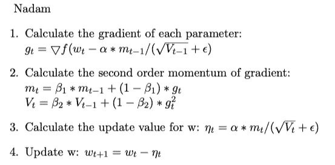

# DNN 优化器概述:何时以及如何选择哪个优化器—第 1 部分

> 原文：<https://medium.com/analytics-vidhya/overview-of-optimizers-for-dnn-when-and-how-to-choose-which-optimizer-951084b72061?source=collection_archive---------6----------------------->

在这个故事里，我想**回顾一下深度神经网络**的优化方法的发展*【DNN】***分享一下使用优化器**的建议。

> 这是我的故事的第一部分。如果你熟悉所有的优化器并想练习使用优化器，请查看[第 2 部分](/@shengfang/overview-of-optimizers-for-dnn-when-and-how-to-choose-which-optimizer-part-2-16524dedbfd2)。

**你能在第 1 部分和第 2 部分找到什么:**

1.  从直观的角度简要回顾流行的优化。(第一部分)
2.  流行的自适应优化器 *Adam* 的缺点。(第二部分)
3.  关于联合使用不同优化器以获得更好性能的建议。(第二部分)

**谁可能感兴趣:**

1.  想简单了解一下从 *SGD* 到 *Nadam* 的优化者。(第一部分)
2.  想要练习如何使用它们。(第二部分)

# 优化的直观视角

*DNN* 优化的目标是找到最佳参数 w，使损失函数 *f(w，x，y)* 最小，利用下面的 *f(w)* 进行简化，服从 *x，y* ，其中 *x* 为数据， *y* 为标号。梯度下降( *GD* )是机器学习最常用的优化方法。在这个方法中，我们需要另一个参数叫做学习率， *α* 。

现在我们开始梯度下降过程，在每个批次/步骤 *t:*

接下来，让我们用这 4 个步骤来回顾不同的优化。

# 优化器综述

> 批量梯度下降(BGD)

*BGD* 仅针对一次参数更新，计算整个训练数据集的梯度。收敛可能会非常缓慢。如果训练数据集太大而无法填充到内存中， *BGD* 变得难以处理。此外， *BGD* 不兼容在线更新模型，例如，动态更新新数据。

> 随机梯度下降( *SGD* )

*SGD* 用一个数据计算梯度。计算变得更快，但是梯度下降的过程变得波动。仅从一个数据计算的梯度下降方向不是全局稳定的。它甚至可以与真正的梯度下降方向相反。

> 小批量梯度下降

*新币*和 *BGD* 之间的权衡是小批量梯度下降。这个优化器使用部分数据( *n > 1* )来计算梯度并更新参数 *w* 。这是现代机器学习训练过程中最常用的设置。在本故事的其余部分，*新币*表示小批量的*新币。*

> 带动量的 SGD

**动机** : *SGD* 在峡谷状曲面曲线中优化有困难。很容易堵在鞍点。图 1[1]显示了不同优化器在鞍点处的峡谷状曲线上的行为。红点的最终位置称为鞍点。不要担心图像中的新名称，我将在故事的其余部分介绍它们。

图 1:鞍点

图 2 和图 3 [1]是中间有局部最小值的等高线图。带闪光的线条是优化的痕迹。对于图 2，很容易发现竖步大，横步小。但是我们需要的是沿着水平方向的一大步和沿着垂直方向的一小步，如图 3 所示。图 3 中应用的技术是 call momentum，它累积过去的梯度来确定当前的梯度，以加速收敛。

**解决方案**:带动量的 *SGD 的实现使用了指数平均的方法。指数率 *β* 通常设定为 0.9。*

> 带内斯特罗夫加速的 SGD(内斯特罗夫加速梯度，NAG)

**动机**:一个深度学习模型有几十万个参数。当我们在这样的高维空间中优化参数时，很容易陷入局部极小值。如果我们能给优化器前瞻的能力，它给我们更多的机会跳出局部最小值。*带内斯特罗夫加速度的 SGD*用预测近似值 *w* 计算电流梯度。通过将电流 *w* 与先前的更新值相加来进行近似。那么当前更新值被认为是近似值的校正。更多的解释可以在[2]和[3]中找到。

**解决方案:**

> 阿达格拉德

**动机**:动量赋予 *SGD* 根据梯度历史调整更新值的能力。但是对于 *w* 的所有参数，学习率是相同的。我们可以根据参数的重要性用不同的学习率来更新参数吗？在网络的训练过程中，我们可以对那些与频繁特征相关的参数进行慢速更新，而对那些与非频繁特征相关的参数进行快速更新。所以所有的参数都能以相似的节奏收敛。我们用二阶动量来实现这个命题。我们对一个参数的所有过去梯度的平方求和。该参数的重要性通过将总体学习率除以总和来衡量。

解决方案:

> AdaDelta/RMSprop

**动机**:在 *AdaGrad* 中计算出的二阶动量是所有历史的积累，当训练过程较长时变得极其巨大。这导致更新值无限接近 0，模型无法收敛。为了克服这个问题，我们计算二阶动量的指数平均值来代替所有过去梯度的总和。

**解决方案:**

> 圣经》和《古兰经》传统中）亚当（人类第一人的名字

**动机** : *Adam* 是最常用的优化器，因为它结合了 *SGD 和 momentum* 以及 *RMSProp* 。

**解决方案:**

> 那达慕

**动机**:是否*亚当*结合了之前讲过的所有方法？我们似乎忘记了*内斯特罗夫加速梯度*。让我们整合它，这个优化器叫做 Nadam。

**解决方案**:

现在，我们已经用直观的视角回顾了 DNN 的大多数优化器。一些从业者认为优化者像*亚当*、 *SGD 带动量*、*等*。 *SGD* 是否带有学习率调度程序。我的意见是可以也可以不可以，预定学习率可以和 *SGD 带动量*有一样的效果，但是不能更新不同学习率的参数。

对于新从业者，建议使用*亚当*。但是为什么越来越多的研究人员在他们的论文中使用*带有动量*和预定学习速率的 SGD 呢？*亚当*怎么了？如何使用 *SGD 配合动量*达到更好的性能？请检查这个故事的第二部分。

## **参考**:

1.  南鲁德，梯度下降优化算法概述，[https://ruder.io/optimizing-gradient-descent/index.html](https://ruder.io/optimizing-gradient-descent/index.html)
2.  G.Hinton，N.Sricastava，K. Swersky，机器学习的神经网络，[http://www . cs . Toronto . edu/~ tij men/CSC 321/slides/lecture _ slides _ le C6 . pdf](http://www.cs.toronto.edu/~tijmen/csc321/slides/lecture_slides_lec6.pdf)
3.  https://cs231n.github.io/neural-networks-3/#sgd
4.  【https://zhuanlan.zhihu.com/p/32230623 
5.  萨尚克·j·雷迪，萨坦·卡莱，桑基夫·库马尔，《亚当和超越的融合》，[https://openreview.net/forum?id=ryQu7f-RZ](https://openreview.net/forum?id=ryQu7f-RZ)
6.  Nitish Shirish Keskar，Richard Socher，通过从 Adam 切换到 SGD 提高泛化性能，[https://arxiv.org/abs/1712.07628](https://arxiv.org/abs/1712.07628)