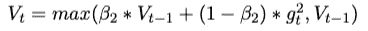
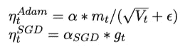
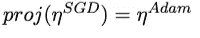

# DNN 优化器概述:何时以及如何选择哪个优化器—第 2 部分

> 原文：<https://medium.com/analytics-vidhya/overview-of-optimizers-for-dnn-when-and-how-to-choose-which-optimizer-part-2-16524dedbfd2?source=collection_archive---------32----------------------->

在这个故事里，我想**回顾一下深度神经网络**的优化方法的发展*【DNN】***分享一下使用优化器**的建议。

> 这是我故事的第二部分。如果你不熟悉 *DNN、*的优化者，请阅读[第一部分](/@shengfang/overview-of-optimizers-for-dnn-when-and-how-to-choose-which-optimizer-951084b72061)。

**你能在第 1 部分和第 2 部分找到什么:**

1.  从直观的角度简要回顾流行的优化。(第一部分)
2.  流行的自适应优化器 *Adam* 的缺点。(第二部分)
3.  关于联合使用不同优化器以获得更好性能的建议。(第二部分)

**谁可能感兴趣:**

1.  想简单了解一下从 *SGD* 到 *Nadam* 的优化者。(第一部分)
2.  想要练习如何使用它们。(第二部分)

亚当是强大的自动调整学习速度。但是为什么许多研究人员在他们的论文中使用*新币*？*亚当*怎么了？如何同时利用*亚当*和 *SGD 的优势？*

我们先回顾一下 Adam 的缺点，然后谈谈联合使用 *Adam* 和 *SGD* 的做法。

# 亚当怎么了？

> **问题 1:不收敛**

文献[5]证明了 *Adam* 在某些情况下会导致模型不收敛。让我们检查一下使用不同优化器时收敛的细节。

在具有一阶动量的 *SGD* 方法中，学习率是固定的。当模型收敛时，更新值变得接近 0。

对于 *AdaDelta/RMSProp* 和 *Adam* ，二阶动量的波动会导致模型的不稳定。因此，本文建议如下过滤二阶动量:

在这种情况下，更新值显示出总体下降的趋势。

> **问题 2:局部最小值**

在文献[6]中，作者在 *CIFAR-10* 数据库上做了实验。Adam 比 *SGD* 收敛更快，但是 *SGD* 性能更好。他们的结论是: *Adam* 的更新值太小，无法在训练结束时收敛到全局最小值。

# 亚当还是 SGD？

*亚当*和 *SGD* ，哪个更好？很难说。

对于新从业者，最好用*亚当*，性能不错。 *Adam* 具有自适应的学习速率，擅长学习稀疏数据的表示。

虽然 *Adam* 在训练开始时收敛速度很快，但专家们更喜欢使用 *SGD* 或组合 *Adam* 和 *SGD* ，因为 *Adam* 可能会导致模型不稳定或在训练结束时收敛到局部最小值。论文[6]的作者建议首先使用 Adam 进行快速收敛，然后使用 SGD 对模型进行微调。

怎样才能把*亚当*和 *SGD* 结合起来？让我们关注以下两个问题:

1.  什么时候从 *Adam* 切换到 *SGD* ？
2.  从*亚当*切换到*新币*时，我们应该使用什么样的学习速率？

先回答第二个问题。我们回忆一下 SGD 和 Adam 的更新值:

我们希望 *SGD* 至少可以像 *Adam* 一样更新参数。为此，我们将 *SGD* ( *UV_SGD* )的更新值投射到 *Adam (UV_ADAM)* 的更新值的方向。我们必须确保 *UV_SGD* 在 *UV_ADAM* 方向上的投影与 *UV_ADAM* 的值相同。

根据这个方程，我们可以计算出 *SGD* 的学习率 *α* 。作者将指数平均滤波器添加到学习率中以获得更稳定的值，标记为 *ƛ* 。

在 *α* 和 *ƛ* 的帮助下，我们来回答第一个问题:什么时候从*亚当*切换到 *SGD* 。正如作者在论文中提到的，当 *α* 和 *ƛ* 的绝对差值小于某个阈值时。是时候转换了。

# 参考:

1.  南鲁德，梯度下降优化算法概述，[https://ruder.io/optimizing-gradient-descent/index.html](https://ruder.io/optimizing-gradient-descent/index.html)
2.  G.Hinton，N.Sricastava，K. Swersky，机器学习的神经网络，[http://www . cs . Toronto . edu/~ tij men/CSC 321/slides/lecture _ slides _ le C6 . pdf](http://www.cs.toronto.edu/~tijmen/csc321/slides/lecture_slides_lec6.pdf)
3.  [https://cs231n.github.io/neural-networks-3/#sgd](https://cs231n.github.io/neural-networks-3/#sgd)
4.  [https://zhuanlan.zhihu.com/p/32230623](https://zhuanlan.zhihu.com/p/32230623)
5.  Sashank J. Reddi，Satyen Kale，Sanjiv Kumar，关于亚当和超越的融合，[https://openreview.net/forum?id=ryQu7f-RZ](https://openreview.net/forum?id=ryQu7f-RZ)
6.  Nitish Shirish Keskar，Richard Socher，通过从 Adam 切换到 SGD 提高泛化性能，[https://arxiv.org/abs/1712.07628](https://arxiv.org/abs/1712.07628)