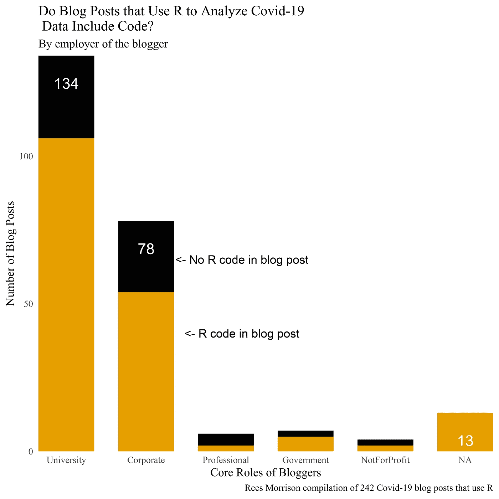
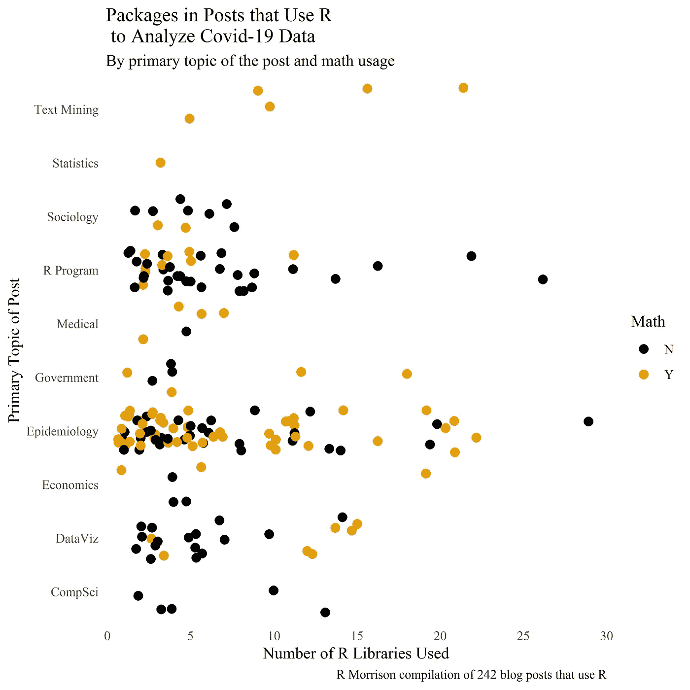
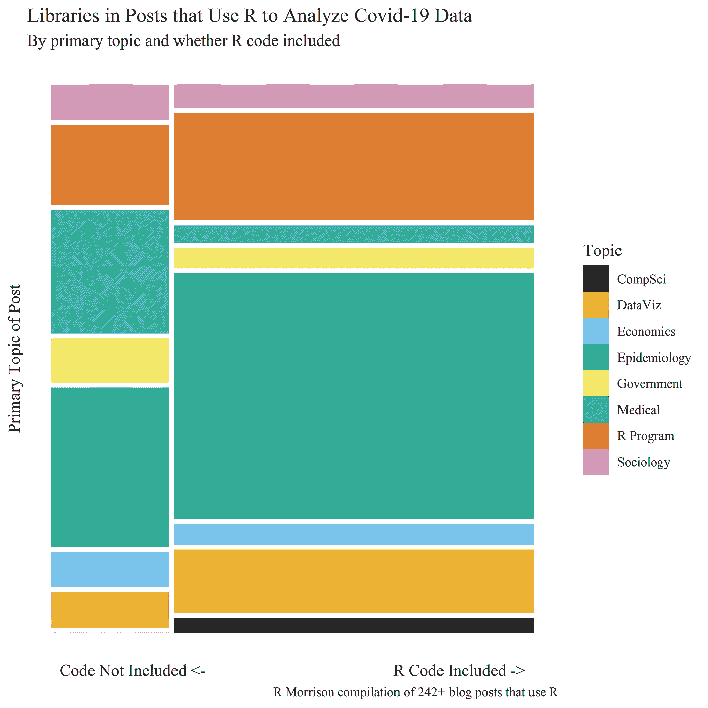

# 博客文章中使用 R 分析新冠肺炎数据的包

> 原文：<https://medium.com/analytics-vidhya/packages-in-blog-posts-that-use-r-to-analyze-covid-19-data-41f45bd96f52?source=collection_archive---------25----------------------->

为了帮助 covid19 研究社区和为其做出贡献的 R 博客作者，我一直在收集结合 R 编程和冠状病毒数据的博客帖子(“CovidRposts”)。前七篇文章的网址列在这篇文章的末尾。我从一开始的目标就是传播编程工具、数据源和数学技术的知识。另一项调查旨在帮助 R 社区找到志同道合的博客作者，无论是通过博客作者及其所在国家的工作角色，特别是多产的贡献者，还是他们帖子的主题。最近，我意识到我的研究可以说很多关于 R 从业者社区的知识共享。如果任何读者希望看到我在本文中使用的代码或获得 CovidRposts 数据，请给我写信，地址是 Rees(at)ReesMorrison(dot)com。

因为 R 研究人员经常希望看到其他人的代码和技术，对于这篇文章，让我们看看有多少张贴者提供了他们的 R 代码(要么在帖子本身中，要么在 GitHub 库中)。

图中的每一列都代表了我所说的博客作者的“[核心角色](/@rees_32356/blog-posts-about-covid19-that-use-r-c10e4a96fdf9)——他们工作的地方。在每一列的下方，金色部分显示了提供 R 代码的博客文章的数量。上面的黑色部分显示了有多少文章没有提供代码。

学者比企业博客更有可能提供他们的代码(22%的学者没有代码，相比之下，30%的企业类型没有代码)。令人惊讶的是，即使在学术博客中，也有接近五分之一的帖子不包含代码。有人会认为他们会更加注重可复制性和知识共享。其次，即使是为公司工作的博客写手也会分享他们的代码，这种情况在三分之二以上的时间里都会发生。有人可能会认为，公司会坚持让员工保持专有代码的私密性(尽管许多博客作者是以个人身份而非员工身份写作的。)其他三个角色和五个博客作者(我无法确定他们的核心角色)有零散的例子，所以没有明显的结论。该组包括 8 个无代码职位和 22 个代码职位。当对所有 242 篇文章进行分析时，几乎每四篇文章中就有一篇没有分享他们的 R 代码(242 篇中有 61 篇)。

在包含代码的帖子中，接下来考虑一下博主们使用了多少 R 包。这个图按照主题对代码帖子进行了分类，这是我对每个帖子的主要主题的(公认的主观)评估。重复一遍，这个图只覆盖了代码可用的 180 篇文章。这些帖子中使用的 R 包库的数量显示在 x 轴上。该数量范围从单个包到最多 29 个包。我们应该注意到，这些数字有些模糊，因为它们来自对“图书馆”在一篇博客文章中出现的次数的搜索。在少数情况下，可能有人在加载包的代码中使用了“库”这个词(“库(包的名称)”)。顺便说一句，一些博主使用“要求(包的名称)”，但是我编辑了我的帖子，将“要求”替换为“库”。

此外，该图根据数学技巧是否突出来给点着色。大约一半提供代码的博客帖子也以值得注意的方式使用了数学技术，博客作者强调了这一点。例如，提供代码的四个文本挖掘帖子都依赖于数学，通常与稀疏矩阵或线性代数有关。然而，大约一半的流行病学职位没有采用显著的数学技术。那些做的大多是解决 SIR 模型和解决常微分方程。

作为关于 R 代码存在的第三个视角，我们创建了一个马赛克图。左边部分代表不提供 R 代码的博客帖子(在帖子本身或 GitHub 存储库中)。右边部分代表大约三分之二提供代码的帖子。水平带表示帖子的主要主题(此图省略了几篇专注于文本挖掘或统计的帖子，因为色盲填充调色板最多包含八种颜色)。举个例子，在代码帖子中，最大的矩形属于流行病学(绿色)；在无代码的帖子中，蓝色的经济学几乎与流行病学的数量相当。

本系列的前几篇文章:

2020 年 6 月 15 日[1] [日期、角色和国家](/@rees_32356/blog-posts-about-covid19-that-use-r-c10e4a96fdf9)；2020 年 6 月 29 日【2】[套餐](/@rees_32356/covid19-related-blog-posts-and-the-r-packages-they-use-f0b82a4d07eb?sk=417652235909c672b2a9d4e1015c266f)；2020 年 7 月 8 日【3】[数据来源与数学](/@rees_32356/data-sources-in-covid19-posts-that-use-r-and-mathematical-techniques-used-in-the-posts-23bab2870de3)；2020 年 7 月 14 日【4】[话题](https://medium.com/@rees_32356/blog-posts-on-covid-19-and-r-topics-written-about-da60c1921b08 https://bit.ly/38XSChy)；2020 年 7 月 29 日 [R 和新冠肺炎任期](https://medium.com/@rees_32356/covid-19-and-r-coding-terms-in-blog-posts-by-topic-5adf6a4f0614 https://bit.ly/39LsIOG)s；2020 年 8 月 6 日[6] [多产发帖人的步伐和博文(215)与全球正面案例的匹配](/@rees_32356/prolific-bloggers-on-covid-19-and-the-pace-of-posts-558f438f9f8d)；以及 2020 年 8 月 27 日【7】[博文字数](/@rees_32356/word-and-character-count-of-blog-posts-on-covid19-with-r-42b9c498e73a)。