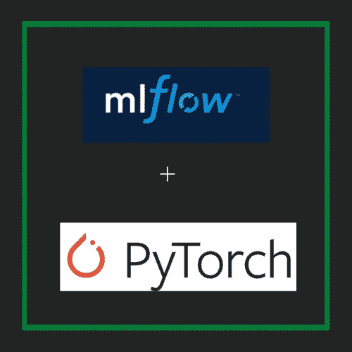
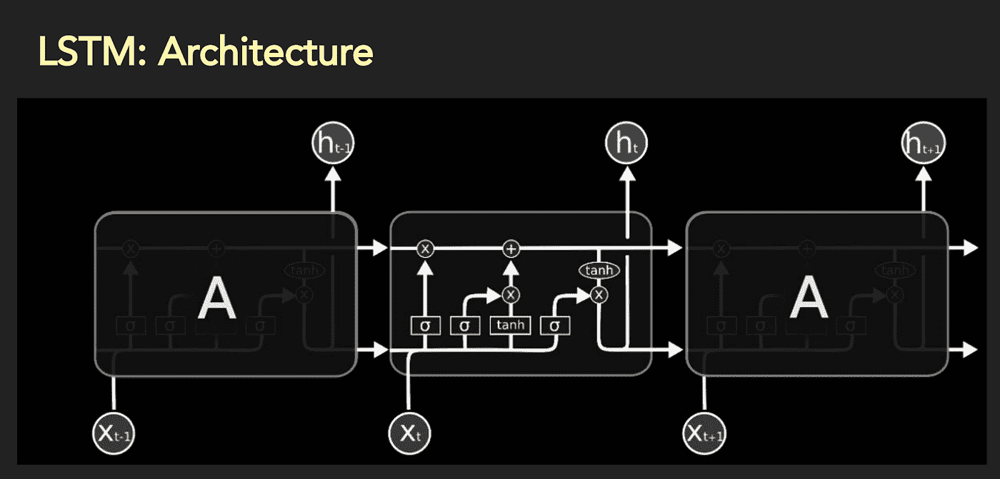
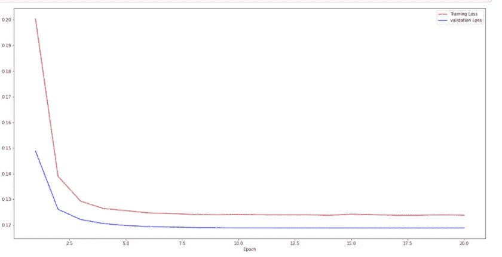

# 使用 MLflow 打包 Pytorch 模型

> 原文：<https://medium.com/analytics-vidhya/packaging-your-pytorch-model-using-mlflow-894d62dd8d3?source=collection_archive---------4----------------------->

大多数机器学习项目始于研究环境；通常是一个笔记本，数据科学家在这里收集数据、开发功能、训练和验证模型。最终产品通常是数据预处理代码、机器学习代码、环境依赖、配置文件等的混合。然后，数据科学家转向工程团队，打包他们的代码，并为生产环境做好准备。在这个过程中，更具挑战性的是工程团队在生产环境中精确复制模型的能力。即，给定两种环境中相同的原始输入数据，我们在两种环境中得到相同的输出。

[MLflow](https://www.mlflow.org/) 是一个管理端到端机器学习生命周期的开源平台。围绕 MLflow 有四大支柱: [MLflow 跟踪](https://www.mlflow.org/docs/latest/tracking.html)、 [MLflow 项目](https://www.mlflow.org/docs/latest/projects.html)、 [MLflow 模型](https://www.mlflow.org/docs/latest/models.html)、 [MLflow 注册表](https://www.mlflow.org/docs/latest/model-registry.html)。在这个项目中，我使用 MLflow 模型。MLflow Models 定义了一种打包机器学习模型的标准格式，可用于各种下游工具，如通过 REST API 的实时服务或 Apache Spark 上的批处理推理。

在本文中，我将在 Pytorch 中构建一个文本分类模型，并使用 MLflow 模型对其进行打包。这个帖子包含以下内容:

1.  使用预训练单词嵌入的文本预处理。
2.  模型定义。
3.  模特培训。
4.  使用 MLflow 进行模型打包。

**使用预训练单词嵌入的文本预处理**

每种机器学习算法都与数字打交道。为了使用文本数据作为特征，我们需要将语料库中的每种单词类型转换成某种数字表示。传统的自然语言处理方法大多基于字数统计技术，通常将字符转换为小写，删除标点符号，删除符号或特殊字符，对标记执行词干分析或词汇化。当使用预先训练的嵌入时，最终模型的质量取决于我们的语料库的词汇与嵌入的词汇的匹配程度。我正在使用 GloVe 嵌入，更具体地说是 [glove.840B.300d.zip](http://nlp.stanford.edu/data/glove.840B.300d.zip) ，我不会将我的语料库中的字符转换成小写，因为我的嵌入处理字母大小写标记。我通过执行以下操作来清理语料库:

1.  删除嵌入中没有出现的所有字符符号。符号是一种字符，它不是 ASCII 字符、整数或下面列出的任何拉丁字符，包括空格。
2.  使用 [TreebankTokenizer](https://kite.com/python/docs/nltk.TreebankWordTokenizer) 处理收缩。
3.  移除标记开头的撇号。

文本预处理:删除符号

文本预处理:处理缩写。

文本预处理:删除撇号。

清理完语料库后，我使用 Keras Tokenizer 对语料库进行标记，以构建我们的语料库的词汇，构建嵌入矩阵，将文本标记转换为索引序列，填充或截断序列以具有相同的长度。

## **模型定义**

为了训练模型，我使用了一种特殊的递归神经网络(RNNs)，称为长短期记忆网络(LSTMs)。LSTMs 解决了传统 RNNs 中遇到的长相关性和消失梯度问题。LSTMs 模块包含控制信息流的交互层。它们维持一个单元状态，并使用称为门的结构，在那里信息被添加到单元状态或从单元状态移除。更重要的是，它们通过遗忘门遗忘之前状态的不相关部分，通过更新门选择性地更新状态值，通过输出门选择性地输出单元状态的某些部分。我使用两层双向 LSTM。

LSTM 建筑

模型代码

**模特培训**

我使用二元交叉熵损失在 10 个时期上训练模型。

培训代码

学习曲线

**使用 MLflow** 打包模型

既然我们已经训练并验证了模型，那么是时候打包它了。我们需要做以下工作:

1.  序列化记号化器、嵌入矩阵、模型的权重。
2.  定义包含序列化对象的文件路径的字典工件。
3.  定义包含所有依赖项的 Conda 环境。
4.  定义 PythonModel 类，它包括“预测”函数逻辑。

我们打包的模型可以被任何下游应用程序使用。我只需要加载包并调用“预测”功能。

最终的 app[https://toxicityapi.herokuapp.com/](https://toxicityapi.herokuapp.com/)

# 参考

数据集:[https://www . ka ggle . com/c/jigsaw-unintended-bias-in-toxicity-classification](https://www.kaggle.com/c/jigsaw-unintended-bias-in-toxicity-classification)

github Repos:[https://github . com/jonad/py torch _ ml flow/blob/master/text classification _ with _ ml flow . ipynb](https://github.com/jonad/pytorch_mlflow/blob/master/textclassification_with_mlflow.ipynb)