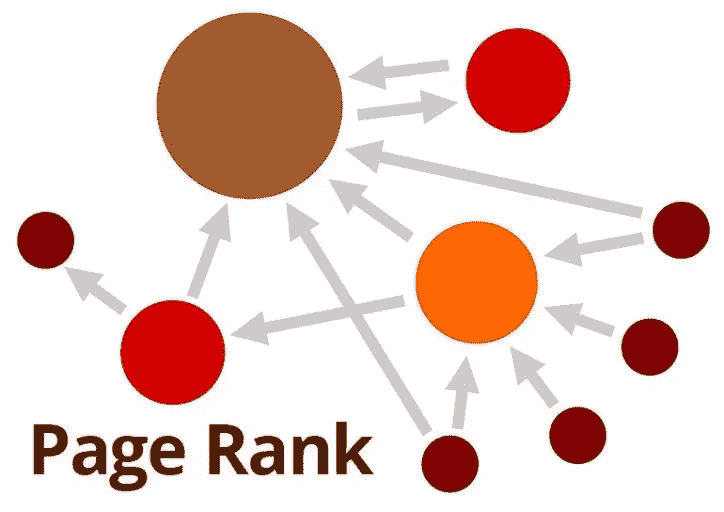

# Python 中的 PageRank

> 原文：<https://medium.com/analytics-vidhya/pagerank-in-python-a3354c474522?source=collection_archive---------9----------------------->

# **什么是 PageRank？**

PageRank 是衡量网页在万维网中相对重要性的方法。它根据网页与网络中其他网页的关联为每个网页提供排名。

[来源](https://www.google.com/imgres?imgurl=https%3A%2F%2Fi1.wp.com%2Fwww.k-ecommerce.com%2Fblog%2Fwp-content%2Fuploads%2F2019%2F04%2FPagerank-small.jpg%3Ffit%3D724%252C512%26ssl%3D1&imgrefurl=https%3A%2F%2Fwww.k-ecommerce.com%2Fblog%2Fecommerce-seo-and-links-connect-and-grow%2Fpagerank-small%2F&tbnid=grJhKChE7KUmeM&vet=12ahUKEwjRseCnmfnpAhU1PH0KHYdbDEgQMygIegUIARDPAQ..i&docid=pgheBcqhjp69MM&w=724&h=512&q=page%20rank&safe=active&ved=2ahUKEwjRseCnmfnpAhU1PH0KHYdbDEgQMygIegUIARDPAQ)

# Python 中如何计算 PageRank？

**NetworkX** 是 Python 可以用来创建**图结构**，计算 PageRank，total…