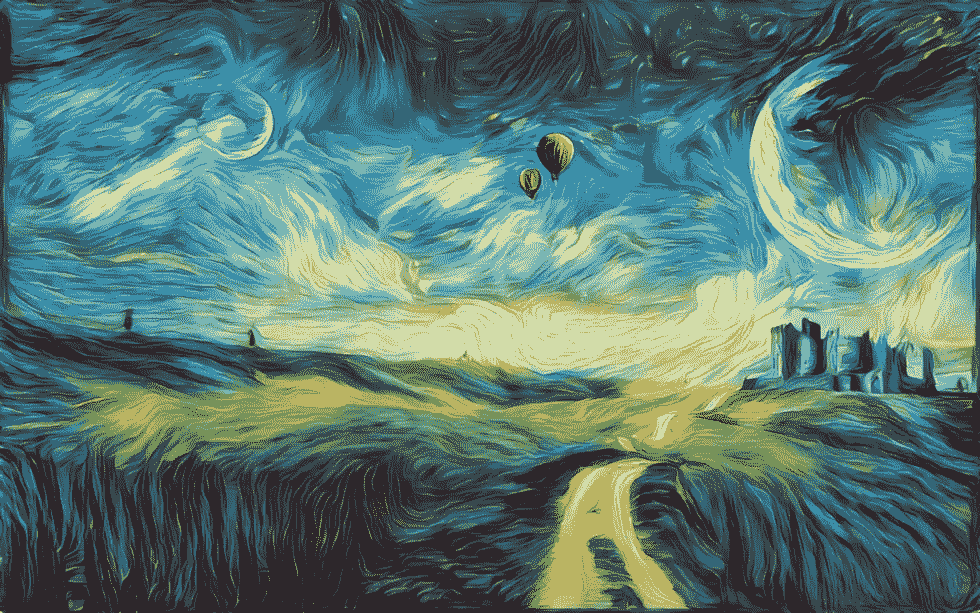
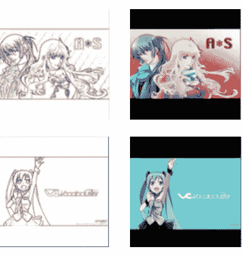
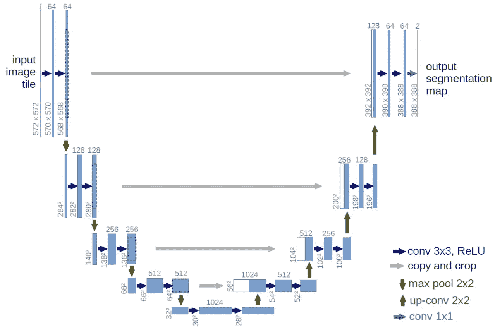
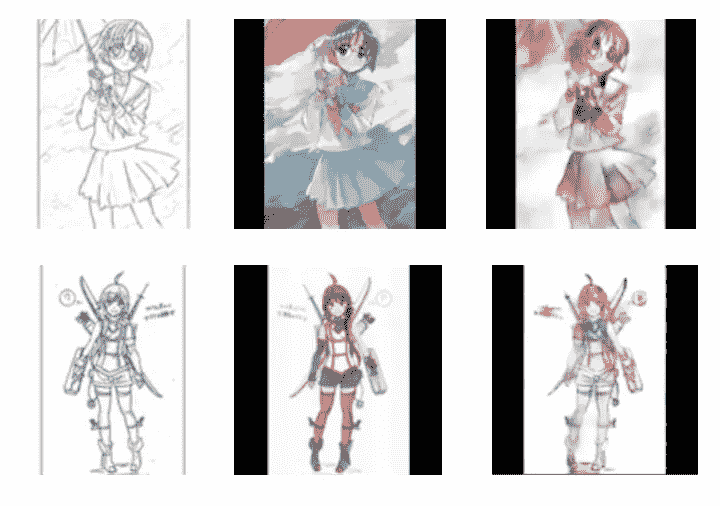
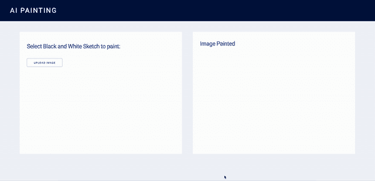

# 用 ML 画素描

> 原文：<https://medium.com/analytics-vidhya/painting-sketches-with-ml-33a3ece74d31?source=collection_archive---------15----------------------->

*训练一个 U-NET 深度学习模型绘制黑白草图*



资料来源:deepdreamgenerator.com

艺术是把我们和机器以及机器能做什么区分开来的东西之一。算法往往没有创造力，它们试图自动化某些决策，或者复制其他人创造的一些规则。这项任务是机器胜过人类的地方。

这就是为什么我总是对产生艺术的算法感兴趣:可以自己创作音乐或绘画的机器。以谷歌的[深梦项目](https://github.com/google/deepdream)为例，其中一个团队训练了一个卷积神经网络来检测图像上的物体，但他们强迫该模型在它们不存在的地方找到物体，从而产生了一些心理图像。或者看看谷歌的[洋红色](https://magenta.tensorflow.org/)项目。Magenta Studio 是谷歌大脑项目“探索机器学习作为工具在创作过程中的作用”。

当然，我们还远远没有让机器产生艺术，但是现在有大量的软件来帮助艺术家指导他们的工作。这些软件使用人工智能来推荐或纠正他们工作的某些方面。

如今，训练深度学习模型来完成某些任务也非常容易。这就是我们在这篇文章中要做的，我们将训练一个深度学习模型来绘制黑白草图。我们将使用 TensorFlow 2 中的 Keras API 来开发和训练我们的深度学习模型。你可以在这个 [Github repo](https://github.com/luchonaveiro/color-sketch) 上找到所有代码。

# 数据

要开发深度学习模型，我们首先需要的是数据，大量的数据。在这种情况下，要教一台机器如何绘画，我们需要两样东西:黑白草图和已绘草图。因此，在训练机器时，我们将展示大量绘画图像的例子，这样我们就可以使用这种算法来绘画。

我们将要使用的数据是您可以在 [Kaggle](https://www.kaggle.com/wuhecong/danbooru-sketch-pair-128x) 上找到的数据。对于这个例子，我们不会使用所有的图片，我将在我的机器上本地训练模型，所以我们将使用 15000 张图像的子集来训练我们的模型。

这是我们将要使用的一些草图和彩色图像:



Kaggle 数据集上的两个图像示例

# 模型

为了完成这项任务，我将训练一个深度学习模型，特别是一个 U-NET 架构。我将使用一个类似于这篇[论文](https://arxiv.org/abs/1505.04597)中提出的生物医学图像分割的架构。

该论文中提出的 U-NET 架构大致如下:



U-NET 架构图

基本上，这种类型的模型有两条路径:收缩路径或编码器路径(左边的一条)和扩展路径或解码器路径(右边的一条)。而且在编码器层和解码器层之间有一个连接。这种连接使我们能够映射原始图像，在每个向上调用的卷积层上都有彩色图像。

# 模特培训

因此，为了能够训练模型，首先我们要设置图像。由于它们很多，在训练算法时不适合内存，我们将使用模型类*、*的 *train_on_batch* 方法，因此我们必须准备那些批图像。

因此，首先我们确定将用于训练、验证和测试的图像文件名:

所以我们有 12000 张图片用于训练，1500 张用于验证，1500 张用于测试。如果我们打印 *img_train* 数组，我们会得到以下响应:

```
['0000/2762000.png',  
'0000/973000.png',  
'0000/810000.png',  
'0000/2914000.png',  
'0000/15000.png',
...]
```

因此，我们在这里存储所有的文件名，然后我们将用来创建每个批处理。为此，我们定义了以下函数，其中 *imd_idx* 是已经处理的图像数量， *arr* 是包含文件名的列表， *n_samples* 是要处理的图像数量。

这个函数加载图像并将它们作为 numpy 数组附加在一起。因此，它返回处理的新图像数、附加的黑白草图数组和附加的彩色图像数组。

现在我们可以定义模型架构了:

因此，我们的输入大小是 128x128 像素的图像，这里我们可以看到我们如何通过使用 Keras 的 *Add()* 函数将编码器路径与解码器路径连接起来。我们还使用 *Conv2DTranspose()* 函数再次放大图像。

现在我们可以开始训练它了，正如我之前所说的，我们将使用模型类的 *train_on_batch* 和 *test_on_batch* 方法来创建训练管道。

因此，一旦模型被训练好，我们就可以用它来画草图，并将它们与真正的画进行比较。让我们从测试集中画一些图像。左边是草图，中间是真实的绘画图像，右边是模特画的图像。



将真实的油漆与模型油漆进行比较

我们可以看到，在第一张图片上，模型遇到了一点麻烦，可能是因为背景的原因，但在第二张图片上，模型做得非常好。

# AI 绘画 App

有了训练好的模型，我们可以用它开发一个应用程序来给用户想要画的任何图像上色。为此，首先我们将使用 TensorFlow 服务于模型。你可以看我之前的文章来解释如何做到这一点。

一旦我们运行了该服务，我们就可以将任何图像作为请求发布到 TensorFlow 服务端点，作为响应，我们会将该图像显示为彩色。

所以现在我们打算用 [Dash by Plotly](https://plotly.com/dash/) 来构建一个 app。该应用程序将接收输入图像，对其进行处理，将其发送到 TensorFlow 服务端点，并向客户端显示处理后的输出。这里我们有一个视频作为例子



Plotly 应用程序，内置经过训练的模型

为了构建这个应用程序，我们将使用 [Docker Compose](https://docs.docker.com/compose/) 。Compose 是一个定义和运行多容器 Docker 应用程序的工具。使用 Compose，您可以使用 YAML 文件来配置应用程序的服务。然后，只需一个命令，您就可以从您的配置中创建并启动所有服务。

因此，首先我们必须定义两个 docker 文件。TensorFlow 服务 Dockerfile 文件如下

Plotly 应用程序的 Dockerfile 文件如下

现在，我们必须在 YAML 配置文件上定义服务:

这里我们定义了每个服务的端口和镜像，我们定义了 Plotly app 依赖 TensorFlow 服务。因此，要运行它，我们应该执行以下命令:

```
docker-compose up
```

现在，我们已经运行了 Plotly 应用程序和 TensorFlow 服务端点。所以如果我们去 [http://localhost:8050/](http://localhost:8050/) 就可以开始玩 app 了。