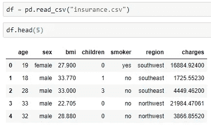
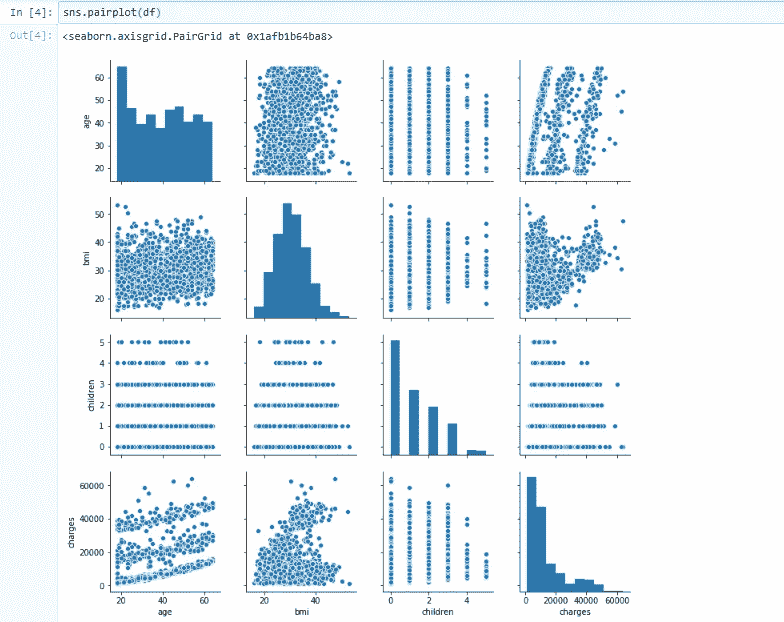
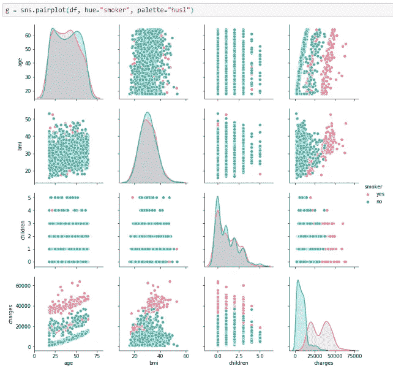
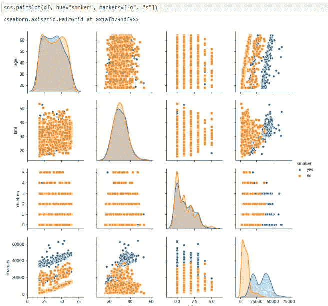
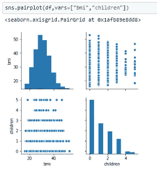
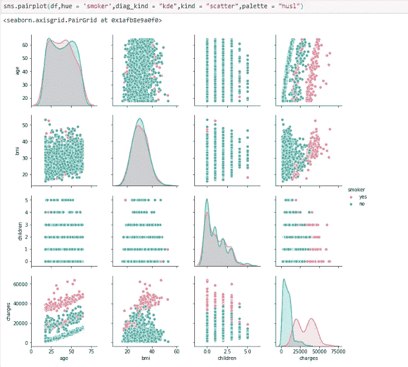

# PAIRPLOT 可视化

> 原文：<https://medium.com/analytics-vidhya/pairplot-visualization-16325cd725e6?source=collection_archive---------0----------------------->

当您想要进行探索性数据分析(“EDA”)时，Pairplot 可视化会很方便。

Pairplot 将给定的数据可视化，以找到它们之间的关系，其中变量可以是连续的或分类的。
***绘制数据集中两两关系。***

Pairplot 是 ***seaborn*** 库的一个模块，它提供了一个高级接口，用于绘制有吸引力且信息丰富的统计图形。

让我们看看同样的事情是怎么做的。

1.  获取您的数据

从数据中可以看出，数据集中既有连续列，也有分类列。

让我们使用 pairplot 来绘制数据:
从下图中，我们可以观察到每个图中的变化。这些图采用矩阵格式，其中行名代表 x 轴，列名代表 y 轴。主对角线子图是每个属性的单变量直方图(分布)。

`**Pairplot Parameters:
seaborn.pairplot**` **( *数据*，*色调=无*，*色调 _ 顺序=无*，*调色板=无*，*变量=无*，*x _ 变量=无*，*y _ 变量=无*，*种类= '散布'*，*诊断 _ 种类= '自动'***

除了数据，所有其他参数都是可选的。 **pairplot** 可以接受的其他参数很少。

了解一些常用参数— →

# 分类变量的不同级别，由绘图元素的颜色决定:

色调有助于您获得数据中变量的差异，以将绘图方面映射到不同的颜色。
*sns.pairplot(df，hue="smoker")*

使用不同的调色板。它基本上是一组用于映射色调变量的颜色。
***g = SNS . pair plot(df，hue="smoker "，palette="husl")***

为色调变量的每个级别使用不同的标记:
***sns.pairplot(df，hue="smoker "，markers=["o "，" s"])***

我们也可以使用 pairplot 用“vars”来绘制支线剧情。

常用:
***sns.pairplot(df，hue = 'smoker '，diag_kind = "kde "，kind = "scatter "，palette = "husl")***

其中:
**种:**种为非同一性关系的情节。{'scatter '，' reg'}
**diag_kind :** 对角线支线剧情的种类。{'hist '，' kde'}

Pair plot 用于理解最佳特征集，以解释两个变量之间的关系或形成最分离的聚类。通过在我们的数据集中绘制一些简单的线或进行线性分离，也有助于形成一些简单的分类模型。

还有其他不同的图，你可以用 EDA 技术来帮助你更好地理解数据的不同变量之间的关系。

以上所有技术将帮助你选择最合适的变量来构建你的机器学习模型。

谢谢大家！