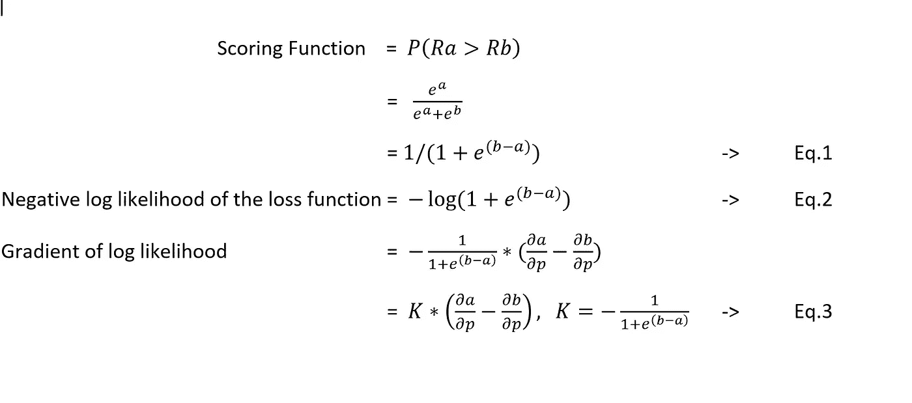

# 成对排序:EPL 预测

> 原文：<https://medium.com/analytics-vidhya/pairwise-ranking-epl-prediction-3ce755575958?source=collection_archive---------29----------------------->

**简介:**

我们经常会遇到这样的情况，我们需要根据特定的属性对两个或更多的类/事件进行比较/排序。最简单的方法是获得每个类在属性上的累积分数，并根据分数对它们进行排序。这给我们提供了一个全局选择可能性的概念。然而，分数与其他分数没有可比性。对于两个班级 A 和 B，理想的分数应该是 A 比 B 好 n%,反之亦然。

图片来源:Shutterstock

后者可以通过监督学习来实现，但不是通过默认的回归和分类，而是成对排序。成对排名有许多应用:搜索结果优化、产品排名等。在本文中，我们将简要讨论什么是成对排序及其背后的一些理论。如果你对理论很敏锐，我还是会说通过略读内容来刷新它。本系列的下一篇文章将在一个实时案例研究中应用它，我们将预测 2020-21 赛季结束时的英超联赛排名(这是足球迷:D 的一个额外的次要兴趣)。

[https://medium . com/@ David acad 10/pairwise-ranking-EPL-prediction-part 2-756542 b 85 c2b](/@davidacad10/pairwise-ranking-epl-prediction-part2-756542b85c2b)

**理论:**

尽管深入的成对排序理论超出了这里的范围，但它有助于从高层次上理解/解释我们在案例研究中获得的结果。可用于排名的算法很少:RankNet、LambdaRank、LambdaMart 等。我们不会深入所有的细节，而是试图对 RankNet 和进一步的 LambdaRank 有一个了解。

让我们考虑两个类别 A 和 B，它们必须根据属性 p 的得分 A 和 B 被排列为 Ra 和 Rb。该模型的目标是根据得分将一个类别排列在另一个类别之上，并通过定义的损失函数进一步优化它。损失函数(得分函数)应该反映概率中得分大小的差异，并且应该是对称的。所以 sigmoid 函数是个不错的选择。

参数 K 决定了排名分数的大小。如果 a>b，那么 A 会被 K 向下推，B 向上，反之亦然。这是 RankNet 背后的理念。这个作品**中的**在排名刚好两个档次。然而，在实际应用中，我们必须对多个项目进行排序[A，B，C…..z 等。].如果 A 是最高等级，其次是 B，Z 是最差等级，根据等式 3，我们通过在相同尺度下与 B 和 Z 进行比较来优化 A 的分数。然而，B 的得分应该比 z 的权重更大。为了固定来自评分函数的得分的权重，通过将被称为归一化中断累积增益(NDCG)的惩罚因子乘以 k 来引入 than。考虑存在 N 个类别:

将等式 5 应用于等式 3 给出了λrank 方法:

因此，在存在多个类的情况下，NDCG 惩罚因子根据类的相关性向来自类比较的分数提供权重。此外，要注意的是，NDCG 是一个相对的规模，从而避免进一步的偏见。与排名靠后的班级相比，它对排名靠前的班级给予了更多的重视。

有几个其他的替代函数应用于 NDCG 作为惩罚因子，如 MAP(平均精度),如果你有兴趣也可以看看。

**结论:**

现在，我们对如何在幕后应用成对排序有了一个简单的概念。在这一系列的下一篇文章中，我们将有一个有趣的应用，我们试图预测 2020-21 赛季结束时英超联赛的积分榜。可以在这里访问:[https://medium . com/@ David acad 10/pairwise-ranking-EPL-prediction-part 2-756542 b 85 c2b](/@davidacad10/pairwise-ranking-epl-prediction-part2-756542b85c2b)

我们用来给球队排名的参数将是最近 5 场比赛的结果。当应用于 2019-20 赛季的验证时，看到它与真正的积分榜有多接近是非常有趣的。

**参考:**

[*https://www . Microsoft . com/en-us/research/WP-content/uploads/2016/02/MSR-TR-2010-82 . pdf*](https://www.microsoft.com/en-us/research/wp-content/uploads/2016/02/MSR-TR-2010-82.pdf%09)

[https://medium . com/@ nikhilbd/intuitive-explain-of-learning-to-rank-and-lambdamart-Fe 1e 17 fac 418](/@nikhilbd/intuitive-explanation-of-learning-to-rank-and-ranknet-lambdarank-and-lambdamart-fe1e17fac418)

[https://ml explained . com/2019/05/27/learning-to-rank-explained-with-code/](https://mlexplained.com/2019/05/27/learning-to-rank-explained-with-code/)