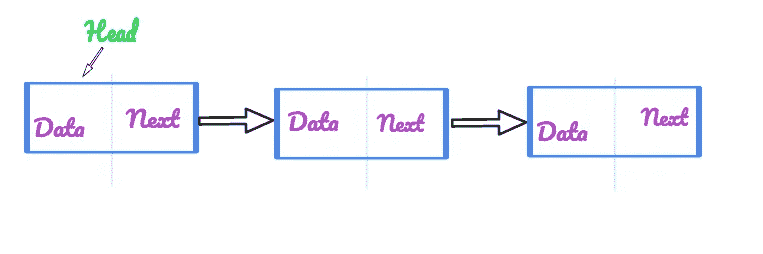

# 回文链接列表—第二天(Python)

> 原文：<https://medium.com/analytics-vidhya/palindrome-linkedlist-day-2-python-441a963697dc?source=collection_archive---------11----------------------->


祖尔莫里·萨维德拉在 [Unsplash](https://unsplash.com?utm_source=medium&utm_medium=referral) 上的照片

今天是我参加 365 天编码挑战的第二天。我将根据链接列表解决一个问题。在我深入这个问题之前，让我先谈谈 LinkedList 的几个特性。

1.  LinkedList 包含一系列节点，这些节点使用指向下列节点的指针相互连接。



单向链表

2.一个基本节点将包含两个部分，

a.数据

b.下一个指针的地址

3.LinkedList 有一个指向 LinkedList 开头的 head 指针。

4.LinkedList 不一定有连续的内存分配。

下面的代码显示了 LinkedList 上一个节点的结构。

```
**class Node:
def __init__(self, data):
self.data = data
self.next = None**
```

好了，现在我们已经看到了 LinkedList，让我们继续今天的问题。

[**234**](https://leetcode.com/problems/palindrome-linked-list/) **。回文链表**

给定一个单链表，判断它是否是回文。

**例 1:**

```
**Input:** 1->2
**Output:** false
```

**例 2:**

```
**Input:** 1->2->2->1
**Output:** true
```

看到这个问题后我的第一个想法是用一个栈，把每个节点的数据插入到栈中，然后通过从栈中弹出元素和链表中的每个元素来比较元素。

代码将如下所示

```
class Solution:
    def insert_stack(self, head):
        stack_rev = []
        while(head):
            stack_rev.append(head.val)
            head = head.next
        return stack_rev

    def isPalindrome(self, head: ListNode) -> bool:
        if head == None:
            return True
        stack_rev = self.insert_stack(head)
        while(head):
            if(head.val == stack_rev.pop()):
                head = head.next
            else:
                return False
        return True
```

复杂性分析

**时间复杂度**

我们需要遍历 LinkedList 中的每个元素，这需要 O(N)时间

**空间复杂度**

我们使用一个堆栈来存储元素，这将占用 O(N)的空间。

我们能试着减少空间使用吗？

也许如果我们把 LinkedList 分成两半，颠倒前半部分，然后比较两半部分的节点。

```
class Solution:
    def isPalindrome(self, head):
    rev = None
    # Slow pointer
    slow = head
    # Fast pointer
    fast = head# Until the first half keep reversing the nodes
    while fast and fast.next:
        #Keep moving in double speed
        fast = fast.next.next
        #Keep reversing the node
        slow_next = slow.next
        slow.next = rev
        rev = slow
        slow = slow_next
    #In case lenght of linkedlist is odd
    if fast:
        slow = slow.next
    # Compare the elements
    while rev and rev.val == slow.val:
        slow = slow.next
        rev = rev.next
    return not rev
```

复杂性分析

**时间复杂度**

我们需要遍历 LinkedList 中的每个元素，这需要 O(N)时间

**空间复杂度**

我们没有使用任何额外的空间来执行上述转换，因此使用的空间是 O(1)。

我想提高我的写作技巧，所以任何建议或批评都非常欢迎。