# 巴拿马论文遇见知识图

> 原文：<https://medium.com/analytics-vidhya/panama-papers-meet-knowledge-graph-c70652d98f92?source=collection_archive---------12----------------------->

关键词:知识图、网络分析、巴拿马论文、Python。

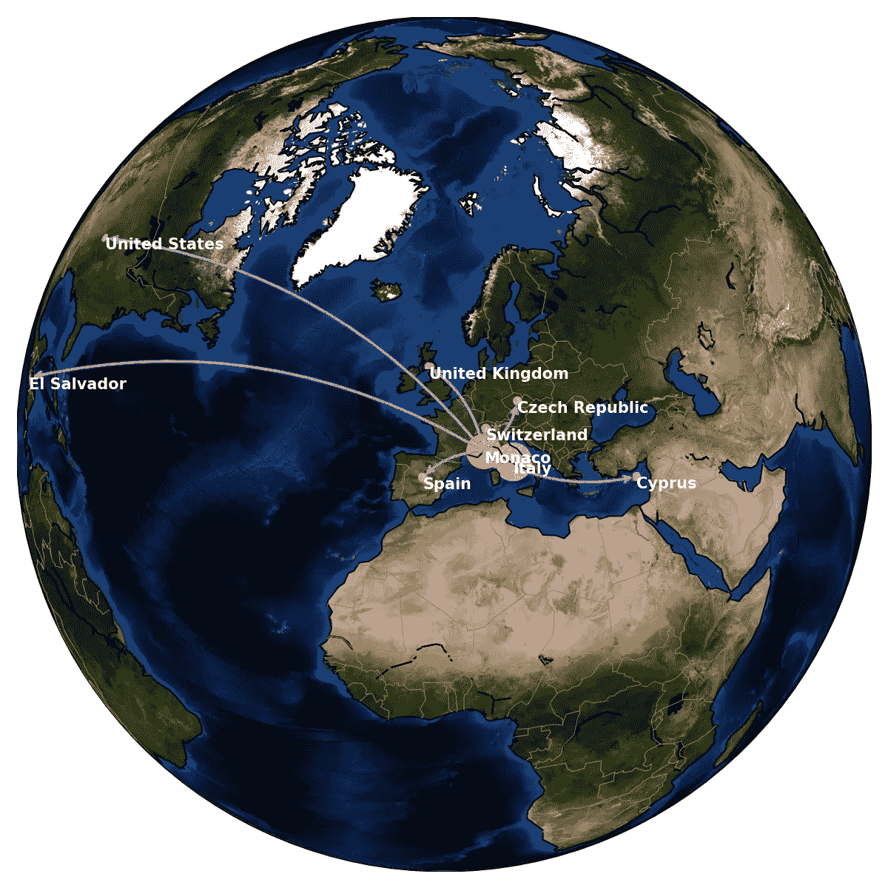

> 这个博客是对巴拿马论文数据集应用知识图表方法的一个温和的展示。从简单介绍巴拿马论文和知识图谱开始，我对巴拿马论文数据库进行了一些基本的分析，然后是中心性和成分分析以及第三大成分的案例研究。通过这些分析，结果表明中国官员是莫萨克·丰塞卡最重要的客户之一。80%的节点(约 40 万个)由莫萨克丰塞卡网络连接。第三大组成部分揭示了摩纳哥如何成为避税天堂，其最著名的客户在意大利。
> 
> 如果有人喜欢我的任何统计图表/幻灯片，请下载并随意使用，但请引用这个博客/我的 [github](https://github.com/JJ1991Z/Medium) 链接。非常感谢，希望你喜欢阅读。如果你对结果有任何疑问，请随时通过 [LinkedIn](https://www.linkedin.com/in/xuejin-zhang/) / [Twitter](http://@YeatsXJ) 给我发消息。

# 1.巴拿马文件介绍

“巴拿马文件”指的是巴拿马律师事务所 Mossack Fonseca 泄露的文件，其中详细列出了 21.4 万个离岸避税天堂的财务和客户律师信息。迄今为止，至少有 140 个离岸实体与政客或政府官员有关联，与 12 位国家领导人有直接联系，导致冰岛总理辞职和大规模抗议。

关于这个故事的更多信息，可以从《卫报》获得两个很好的摘要，该报对巴拿马文件进行了全面的报道。

[](https://www.theguardian.com/news/2016/apr/08/mossack-fonseca-law-firm-hide-money-panama-papers) [## 莫萨克·丰塞卡:帮助超级富豪藏钱的公司内幕

### 2013 年 6 月，两名瑞士律师进行了一次私人电话聊天。他们很恼火。在伦敦，大卫·卡梅伦刚刚…

www.theguardian.com](https://www.theguardian.com/news/2016/apr/08/mossack-fonseca-law-firm-hide-money-panama-papers) [](https://www.theguardian.com/news/2016/apr/03/the-panama-papers-how-the-worlds-rich-and-famous-hide-their-money-offshore) [## 巴拿马文件:世界上的富人和名人如何把他们的钱藏在海外

### 世界上一些最杰出的领导人、政治家和名人的隐藏财富被一个…

www.theguardian.com](https://www.theguardian.com/news/2016/apr/03/the-panama-papers-how-the-worlds-rich-and-famous-hide-their-money-offshore) 

# **2。知识图、本体和网络简介**

首先，我想讨论一下这几个经常相互关联，有时也可以互换使用的术语:**知识图、**本体和**网络**。我将使用以下定义:

**本体**根据牛津词典，有两个完全不同的意思:

> 因为它的不可数形式:本体论是哲学的一个分支，研究存在，即生存还是毁灭。
> 
> 对于它的可数形式:**本体是一个主题领域中的概念和类别的列表，显示它们之间的关系**。

自然，后一种形式是这里的主要焦点。更简单地说，本体是相互联系的实体(包括抽象概念)的一种表示形式。

接下来，我们来看看知识图。下面是**知识图**的开发时间表。

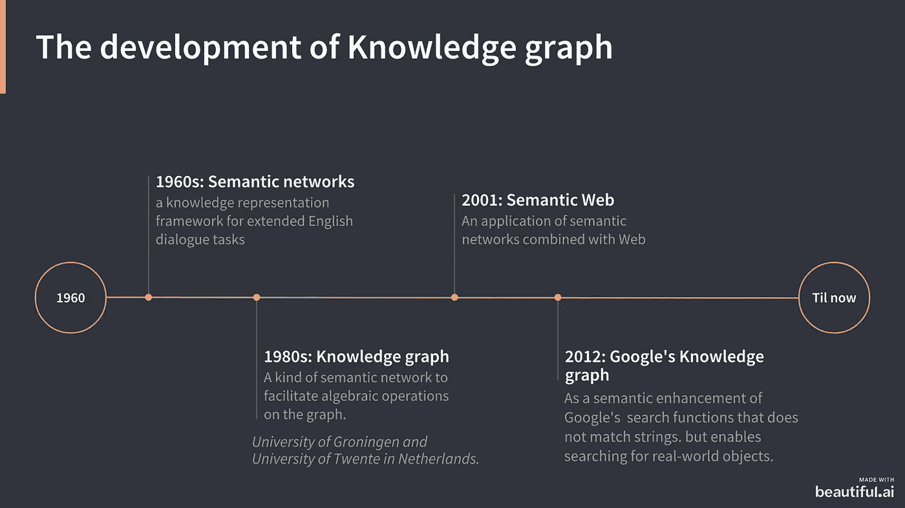

解释知识图相关概念发展的图，从 20 世纪 60 年代至今。

[**知识图**可以被设想为实体的大型**网络**，它们的语义类型，以及实体之间的属性和关系。](http://ceur-ws.org/Vol-1695/paper4.pdf)

> 因此，这三个术语之间的关系可以总结如下:
> 
> 网络是**知识图的表现形式；**而**知识图**是**本体**的应用形式。

尽管如此，还是有各种各样的定义和分类法发表。下面列出了几个不错的介绍博客。为了清楚起见，我将坚持使用术语知识图。

[](https://hackernoon.com/wtf-is-a-knowledge-graph-a16603a1a25f) [## WTF 是知识图？

### 解开术语的纠结，总结出它的语义、智能和活力。

hackernoon.com](https://hackernoon.com/wtf-is-a-knowledge-graph-a16603a1a25f) [](https://towardsdatascience.com/knowledge-graph-bb78055a7884) [## 知识图谱

### 知识图的简要描述，它的用途，它如何可以是机器学习的完美补充，也…

towardsdatascience.com](https://towardsdatascience.com/knowledge-graph-bb78055a7884) [](https://neilpatel.com/blog/the-beginners-guide-to-the-googles-knowledge-graph/) [## 谷歌知识图谱初学者指南

### 谷歌正在建立人类历史上最大的知识仓库——这是在你们的帮助下完成的…

neilpatel.com](https://neilpatel.com/blog/the-beginners-guide-to-the-googles-knowledge-graph/) 

# **3。巴拿马论文作为知识图谱网络概述**

knowledge graph 对巴拿马论文的分析有助于揭示超级富豪如何利用离岸实体避税。ICIJ 使用 neo4j 软件进行了大量分析。我是一个 python 的人，所以我使用开源的 Python 库， [networkx](https://networkx.github.io/) 和 [graph-tool](https://graph-tool.skewed.de/) ，对 panama 论文进行分析。要从 ICIJ 获取原始数据库，请点击[此链接](https://offshoreleaks.icij.org/pages/database)。

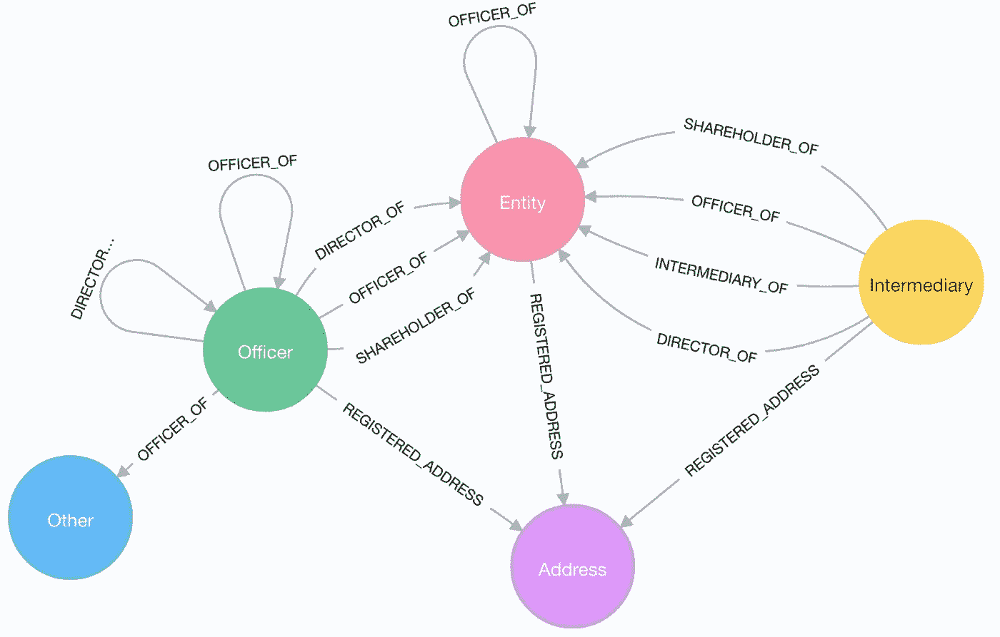

巴拿马论文知识图的数据结构。填充颜色的圆圈是节点，从一个节点指向另一个节点的箭头是边。(来源:[https://guides . neo4j . com/sandbox/icij-paradise-papers/data shape . html](https://guides.neo4j.com/sandbox/icij-paradise-papers/datashape.html))

上图是展示巴拿马论文的数据结构的抽象说明。**节点**代表相关的概念和范畴，画为圆圈；**边**表示节点之间的关系，如箭头所示。有 5 种不同的节点(每种节点都有独特的颜色),这些节点之间有 33 种不同的边。以下是 5 个*节点*的描述，摘自[github.com/REDeLapp/Panama-Papers-Network-Analysis](https://github.com/REDeLapp/Panama-Papers-Network-Analysis):

# 3.1 节点

*   实体(离岸)
    由代理人在低税、离岸管辖区创建的公司、信托或基金。
*   在离岸实体中发挥作用的个人或公司。
*   中介人
    寻找离岸公司和离岸服务提供商的中间人，通常是律师事务所或要求离岸服务提供商为客户创建离岸公司的中间人。
*   地址
    ICIJ 获得的原始数据库中的联系邮政地址。
*   其他
    未知/未标记的节点。

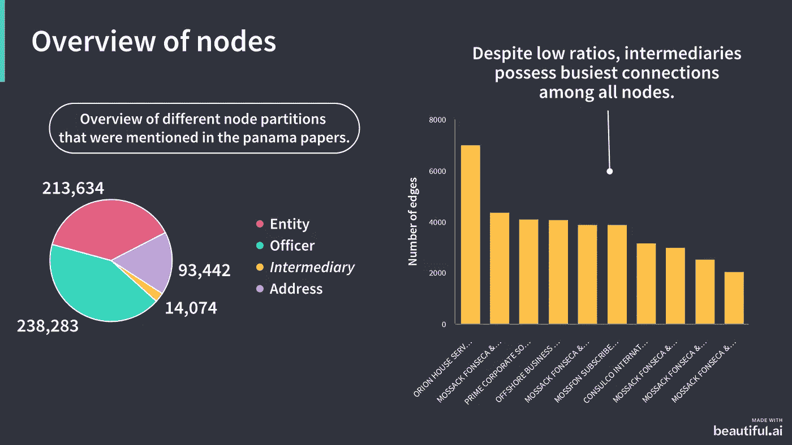

节点概览图。左边的饼图显示了在巴拿马论文中发现的不同种类节点的比例。右侧是连接了最高边的前 10 个节点的条形图。两个图表中应用了相同的颜色代码。

作为任何花哨的网络分析之前的基本概述，我绘制了一个饼图来了解不同类型节点的比例。如上图所示，左边的饼图显示“**官员**”和“**实体**”节点最常见，地址频率约为一半，“中介”部分是官员的二十分之一。然而，它们的流行度并不是这些节点最重要的属性；连接到它们的边的数量更好地捕捉了它们的相对重要性，即它们的**中心性**。因此，我计算了连接到每个节点的节点数，并在左侧列出了排名最高的节点以及连接到它的边数。令人惊讶的是，所有这些都是“中间”节点。这表明了在巴拿马论文知识图谱研究中，**中介**作为枢纽的作用。

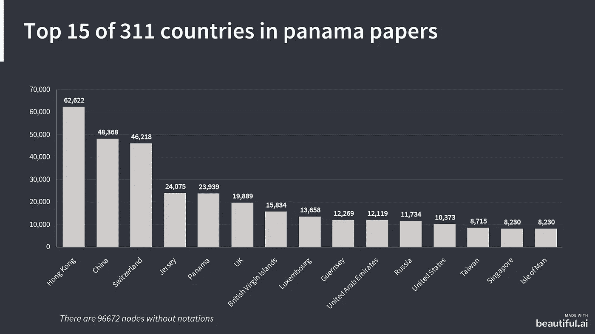

巴拿马报告中发现的国家流行率图。大多数节点都有国家符号，此条形图中显示的是节点符号最多的国家。

第二，我想知道在巴拿马论文数据集中的所有节点中，哪些地区的代表性最强。从上面的柱状图来看，**香港排名第一**，**中国**和**瑞士**分列二、三位。海峡群岛之一的泽西岛和巴拿马分别排名第四和第五。解释这是一个更广泛的背景，我们看到一些“通常的嫌疑人”；**香港**是主要的金融中心之一，它与**中国**的接近磨练了它的头号地位。**中国是仅次于美国的世界第二大经济体，也是莫萨克·丰塞卡公司最多的国家[，这可能是由于其受限的资本市场。长期以来被认为是“银行保密之父”的瑞士，自 20 世纪中期以来一直是世界上最大的离岸金融中心和避税天堂之一。泽西岛](https://www.scmp.com/news/china/policies-politics/article/1934168/china-was-largest-market-panama-papers-law-firm)**和巴拿马都是公认的主要离岸金融中心，并享有避税天堂的国际声誉。

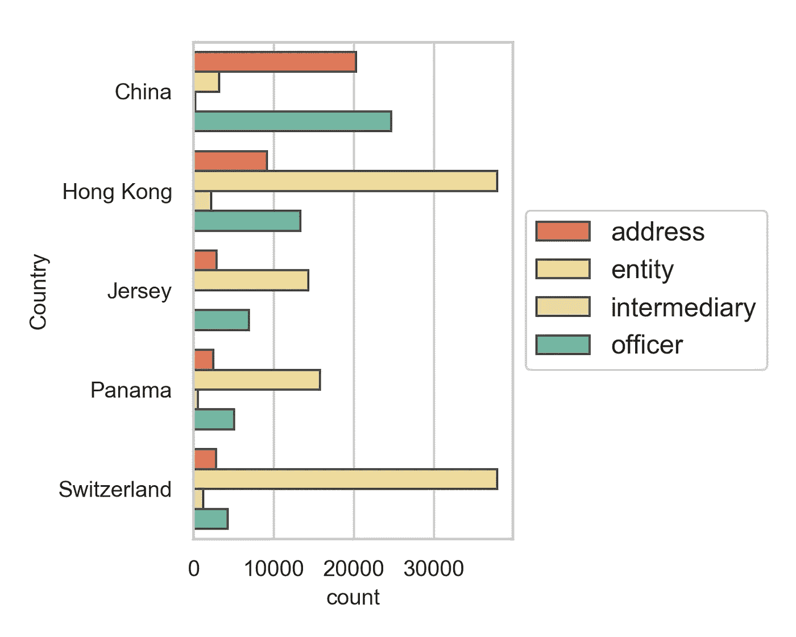

按国家和类型分类的节点数量图。每个条形代表前 5 个国家中不同类型节点的数量。

根据之前的结果，了解哪种类型的节点在这些排名靠前的国家最普遍是值得的。上图显示，在排名前五的国家中，除中国外，离岸实体普遍存在。根据地址和官员的贡献，中国排名第二。

# 3.2 边缘

对节点的初步分析已经足够了，现在让我们来看看**边**。在 33 种不同的*边缘*中，99.9%属于“股东”、“中介”、“注册地址”、“受益人”四种类型。详细情况显示在下面的条形图中。

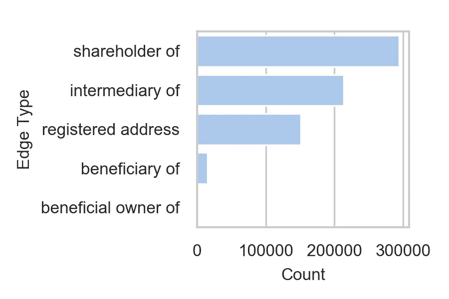

巴拿马文件中发现的前 5 种边缘类型。

# 3.3 成分分析

在分别单独分析了节点和边之后，联合分析边如何连接不同的节点是我的下一步:所有的节点都是通过这些边相互连接的吗？用更专业的术语来解释:应该执行**成分分析**。在这里，我使用 networkx 的功能对从巴拿马论文中提取的 559，600 个唯一节点和 674，102 条边进行组件分析。以下是我发现的列表。

```
167 components were found, each was composed of 1 nodes. 
3807 components were found, each was composed of 2 nodes.
1483 components were found, each was composed of 3 nodes.
1158 components were found, each was composed of 4 nodes.
738 components were found, each was composed of 5 nodes.
755 components were found, each was composed of 6 nodes.
435 components were found, each was composed of 7 nodes.
383 components were found, each was composed of 8 nodes.
255 components were found, each was composed of 9 nodes.
```

总共鉴定出 11，043 种独立成分。按照组成组件的节点数量分类，组件的数量在上面列出。组件分析提供的好处之一是从数据库中删除无用的节点。例如，很明显，两个零度节点(即节点没有指向/来自它们的边的单分量。)和单度节点(每条边只连接两个节点)提供的信息不多，因此可以从未来的调查中删除。

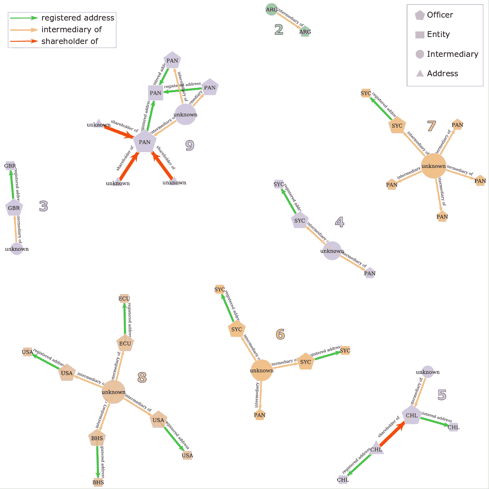

由不超过 10 个节点组成的小组件图。此图中显示的每个组件中的节点都用唯一的颜色进行着色，节点的数量绘制在每个组件的旁边。节点和边的注释显示在图的顶部。每个节点顶部都标注了国家的缩写。沿边缘标注边缘的类型。这个图形是通过 graph-tool 创建的。

组件分析的另一个好处是它提供了一个更好的角度来检查更大的网络。我很想知道这些小组件中的节点是如何连接的，以及它们是否值得进一步研究。我从 8 个不同类别的组件中随机选择了一个例子，并使用 graph-tool 描述了这些组件，如上图所示。

观察到一些有趣的连接模式，如**【中介】→【实体】→【地址】** ← **【官员】**。通常，前两个也是通过同一个官员联系的。这揭示了一种简单的避税方法: ***官员雇用中介中间人/律师事务所建立离岸实体来隐藏他们的资金，因此，官员与其离岸实体之间的联系可以通过他们与同一个地址的联系来揭示*** 。另一个耐人寻味的现象是高度的“中介”节点。这表明**中间节点作为巴拿马文件的** **枢纽**的重要性，使人们能够集中精力对资金流动和隐藏的联系进行进一步调查。

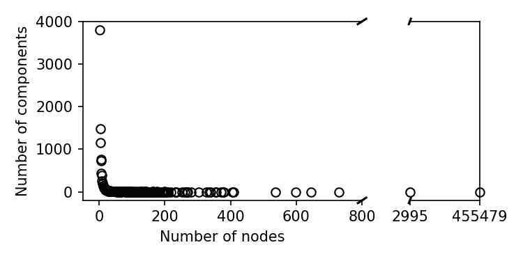

175 种成分分布图。

现在，让我们来看看拥有 10 个以上节点的组件。上图显示了巴拿马文件中所有成分的分布情况。有趣的是，最大的组件由 455，479 个节点组成，包含了巴拿马论文知识图所有节点的 81%。剩余的 19%的节点形成大小变化很大的组件。我们假设最大的分量具有最普遍的重要性。尽管如此，通过关注这些小组件，还是可以揭示一些有趣的结果。

# 3.4 总结

> **559600 个唯一节点，674102 条边，11043 个独立分量**。

前面对节点、边和组件的分析捕捉到了 Mossack Fonseca 为避税和建立离岸实体等而组织的庞大运营网络。庞大到无法从论文中手工提取所有知识。然而，通过构建巴拿马论文的知识图，可以保存节点的所有属性以及它们之间的交互，以供以后查询。人们可以始终关注一个官员、一个实体或一个中介，并相应地进行分析，例如 neo4j 采用 SQL-ish 语言来根据用户的请求提取特定属性的节点/边，然后描绘本地小型网络。

总的来说，有许多不同的方法来描述/检查知识图，最重要的步骤是预处理数据库，理解数据结构，并选择适合手头问题的方法。

# 4.一些花哨的东西

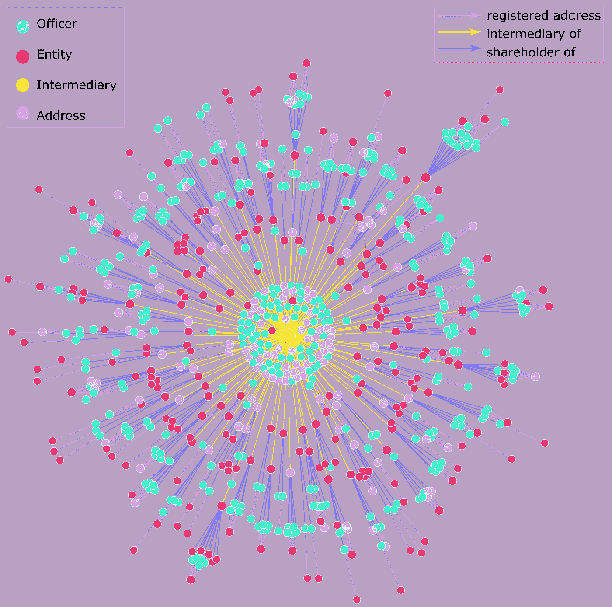

包含 730 个节点的第三大组件的图。看起来有点像病毒，对吧？

此处显示的图表是 Fruchterman-Reingold 弹簧组布局的网络。该组件是第三大组件，有 730 个节点。只有一个中间节点，但它具有最高的度，即与其余节点的连接最多。观察到的模式支持成分分析的结果，即中介机构是巴拿马文件知识图的枢纽。还观察到一些新的模式:高级职员的分组是由他们与同一个境外实体或同一个地址的共同联系产生的，这表明这些高级职员可能是家庭或商业伙伴。

尽管如此，Fruchterman-Reingold 布局的复杂连接无助于评估每个集群/节点。因此，我尝试了另一种布局:中间节点位于中心的部首树:

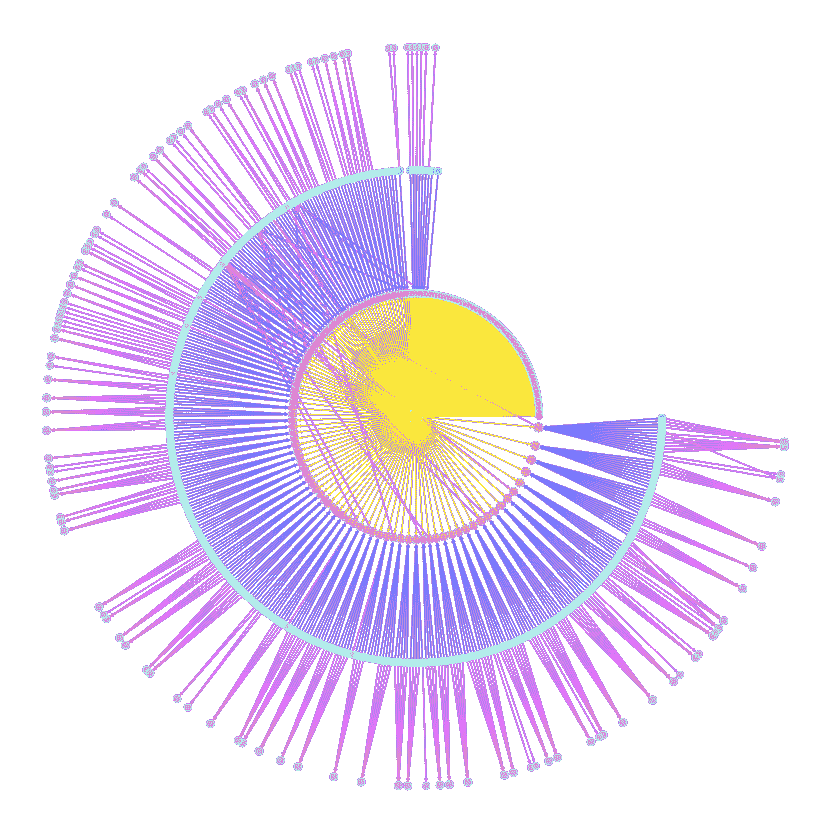

包含 730 个节点的第三大组件的图，采用激进树布局。

似乎大多数节点和连接都符合以下模式:

> 许多官员→一个地址
> 
> 许多官员→一个实体
> 
> 许多离岸实体→中介

现在，我们知道了超级富豪通过中介和离岸实体隐藏资金的模式。同样有趣的是，这些实体大多在哪里，这些超级富豪来自哪里。


不同国家之间的联系图。这里应用了相同的颜色代码。

在这个图中，我根据节点的“国家”标签绘制了节点之间的连接，并将它们投影到这个正交地图上。从这张连接图中我们可以看到，Monacan 中介公司为意大利、塞浦路斯、捷克、英国、西班牙、瑞士、美国和萨尔瓦多的超级富豪在摩纳哥设立离岸实体提供便利。

# 对相关工作的个人建议

*   使用哪个术语:本体、知识图和网络？

> 我个人认为，这两者之间的差异在实践中是相当微妙的。然而，如果你想知道使用哪一个，这里是我的建议:对于简历/面试，推荐使用**本体/知识图**；通常，这是招聘人员将寻找的，并更直接地捕捉这些方法在复杂数据上引入顺序的标准应用。当搜索技术资源时，比如开源编程库、研究论文等。如果前两个关键词都没有找到满意的结果，也许可以用“**网络”**来代替。

*   如何开始网络分析/知识图谱学习？

> 对于数据科学家来说，预处理数据库通常比选择“正确的”工具/算法进行后续分析更重要。在进行任何分析之前，理解问题的数据结构是很重要的。例如，在我开始这里的分析之前，我阅读了关于巴拿马论文的报告，收集了 ICIJ 提供的数据库，并在同一个数据库中搜索了已发表的分析。第三，我决定巴拿马文件的哪些方面最让我感兴趣，并专注于这些方面。
> 
> 最后，我开始了对巴拿马文件的分析，侧重于一个特定的方面。我通常的策略是首先对节点进行分析，然后是边，然后是组件分析，描绘和润色网络。我发现这个策略非常直观，因为我尽力将统计结果与这些关系的更广泛的背景联系起来。有用的可视化有助于数据科学家和非数据科学家之间的交流，并可以通过清晰地陈述假设和发现来帮助将专家知识纳入图表分析工作流。

谢谢你的阅读，希望你喜欢它。:)