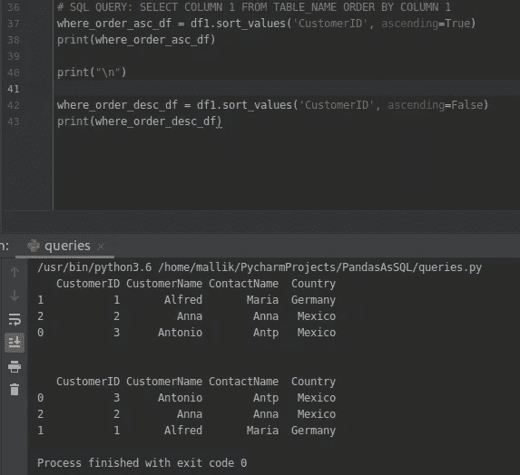
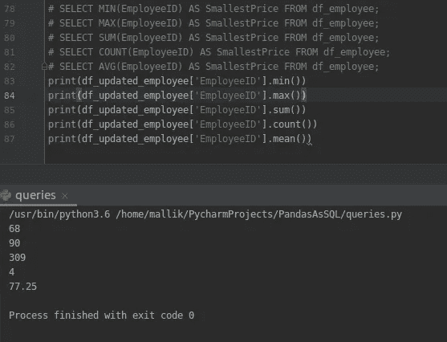

# 熊猫作为 SQL

> 原文：<https://medium.com/analytics-vidhya/pandas-as-sql-a6ac3bb13166?source=collection_archive---------10----------------------->

## 使用 Python 探索 SQL 查询与 Pandas


用 Python 弄脏你的手

*Pandas* 是一个开源的、BSD 许可的库，为构建在 C 库之上的 [Python](https://www.python.org/) 编程语言提供高性能、易于使用的数据结构和数据分析工具。

**使用 pip3 安装熊猫**

> $ pip3 安装熊猫


**在 python 脚本里面导入熊猫**


**将 Python 连接到 MySQL 数据库**

我们有两个表的客户数据库，使用 SQLAlchemy 连接和检索，并转换到数据框架。

`$ pip3 install sqlalchemy`

`$ pip3 install pymysql`

`$ sudo apt-get install python-mysqldb`


这里，我们将客户、订单表数据存储在数据帧 df1、df2 中。

**让我们开始对数据帧进行查询…**

1.  **从 df1 中选择** only 列(客户名称)

```
# SQL Query: SELECT CustomerName from Customers;new_df = df1['CustomerName']
```


2.**从 df1 中选择**和 **WHERE** 子句

```
# SQL Query: SELECT * FROM TABLE WHERE COLUMN_NAME = SOME_VALUE
where_df = df1.loc[df1['CustomerName'] == 'Alfred']
```


3.**从 df1 中选择 AND，OR** 和 **NOT** 运算符

**和**(我们有两套，国家为墨西哥)

```
# SQL QUERY: SELECT COLUMN 1,COLUMN 2 FROM TABLE_NAME WHERE CONDITION1 AND CONDITION2
where_and_df = df1.loc[(df1['Country'] == 'Mexico') & (df1['ContactName'] == 'Anna')]
```


**或**

```
# SQL QUERY: SELECT COLUMN 1,COLUMN 2 FROM TABLE_NAME WHERE CONDITION1 OR CONDITION2
where_or_df = df1.loc[(df1['Country'] == 'Mexico') | (df1['ContactName'] == 'Anna')]
print(where_or_df)
```


**不是**

```
# SQL QUERY: SELECT COLUMN 1 FROM TABLE_NAME WHERE NOT CONDITION 
where_not_df = df1.loc[(df1['Country'] != 'Mexico')]
```


**4。** **按**顺序排列

```
where_order_asc_df = df1.sort_values('CustomerID', ascending=True)
print(where_order_asc_df)
```



**5。插入**

创建新数据框以插入值

```
#INSERT INTO table_name (column1, column2, column3, ...) VALUES (value1, value2, value3, ...);
# Create a dataframe and insert value
data = {'EmployeeName': ['John', 'Kate', 'Max', 'Linie'],
        'EmployeeID': [68, 74, 77, 78]}

# create data frame
df_employee = pd.DataFrame(data)
```


追加到现有数据框


**6。空值**

带有空值的数据帧


**7。更新**

```
# SQL Query:UPDATE table_name SET column1 = value1, column2 = value2, ... WHERE condition;
df_updated_employee.loc[df_updated_employee.EmployeeName == 'Max', 'EmployeeName'] = 'NewMax'
```


**8。删除**

```
# SQL QUERY: DELETE FROM table_name WHERE condition;
# dropping row based on index values
df_updated_employee.drop([3], inplace=True)
```


**9。选择顶部底部**

```
# Top
# SQL Query: SELECT column_name(s) FROM table_name WHERE condition LIMIT number;
print(df_updated_employee.head(2))

# Bottom
# SQL Query: SELECT column_name(s) FROM table_name WHERE condition LIMIT number;
print(df_updated_employee.tail(1))
```


**10。最小值、最大值、总和、计数和 AVG**

```
# SELECT MIN(EmployeeID) AS SmallestPrice FROM df_employee;
# SELECT MAX(EmployeeID) AS SmallestPrice FROM df_employee;
# SELECT SUM(EmployeeID) AS SmallestPrice FROM df_employee;
# SELECT COUNT(EmployeeID) AS SmallestPrice FROM df_employee;
# SELECT AVG(EmployeeID) AS SmallestPrice FROM df_employee;
print(df_updated_employee['EmployeeID'].min())
print(df_updated_employee['EmployeeID'].max())
print(df_updated_employee['EmployeeID'].sum())
print(df_updated_employee['EmployeeID'].count())
print(df_updated_employee['EmployeeID'].mean())
```



**11。在**中

```
# SELECT column_name(s) FROM table_name WHERE column_name IN (value1, value2, ...);
print(df_updated_employee.isin({'EmployeeName': ['John']}))
```


**12。在**之间

```
# SELECT column_name(s) FROM table_name WHERE column_name BETWEEN value1 AND value2;
print(df_updated_employee[df_updated_employee['EmployeeID'].between(74, 77)])
```


**13。加入**


join 子句用于根据两个或多个表之间的相关列来组合它们中的行。

**内部连接**


***如果列值匹配则获取该特定行。***

SQL 查询( ***内部联接)*** :


```
# SQL QUERY
select * from orders **inner JOIN** Customers on Orders.CUstomerID=Customers.CustomerIDinner_join_df = pd.merge(df1,df2,on='CustomerID',how='inner')
```


**左连接**


LEFT JOIN 关键字返回左表(表 1)中的所有记录，以及右表(表 2)中的匹配记录。如果不匹配，则右侧的结果为空。

***从左表中获取所有记录，从右表中只获取匹配值，其他为空。***

```
# SQL QUERY
SELECT * FROM Customers **LEFT JOIN** Orders ON Customers.CustomerID = Orders.CustomerID ORDER BY Customers.CustomerName;left_join_df = pd.merge(df1,df2,on='CustomerID',how='left')
```


**右连接**


RIGHT JOIN 关键字返回右表(表 2)中的所有记录，以及左表(表 1)中的匹配记录。当没有匹配时，结果从左侧为空。

***从右表中获取所有记录，从左表中只获取匹配的值，其他为空。***


**全外接**


当左(表 1)或右(表 2)表记录中有匹配项时，FULL OUTER JOIN 关键字返回所有记录。

注意:完全外连接可能会返回非常大的结果集！

提示:完全外部连接和完全连接是相同的。

***从右表获取所有记录，从左表获取所有匹配值..***

```
# SQL QUERY
SELECT * FROM Customers **FULL OUTER** **JOIN** Orders ON Customers.CustomerID = Orders.CustomerID ORDER BY Customers.CustomerName;full_outer_join_df = pd.merge(df1,df2,on='CustomerID',how='outer')
```

