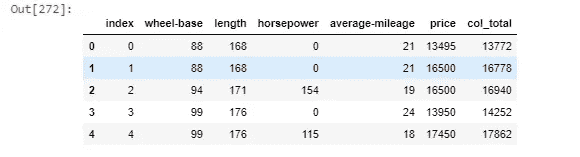

# 熊猫全指南(A-Z)

> 原文：<https://medium.com/analytics-vidhya/pandas-complete-guide-a-z-36ba8bd15232?source=collection_archive---------12----------------------->

## 熊猫图书馆全攻略


掌握熊猫，成为数据世界的神龙大侠。

为什么要学熊猫？

对于那些想成为有抱负的数据科学家的人来说，andas 是一个必不可少的工具。在此之后，你可以提供令人难以置信的数据见解，影响你的经理做出一些关键决策，或者为业务主管增加价值。

熊猫图书馆里有很多令人惊叹的技术。此外，如果你对机器学习很感兴趣，那么数据预处理是建立模型的重要步骤。这一步还需要你对用于预处理数据的 pandas 库有深入的了解，因为一个好的数据确实会产生更准确的机器学习模型。

本文的内容如下所示，只需点击一下就可以直接访问。不仅仅是理论上的学习。有一个从初级到高级水平的完整代码的实现，附在文章的结尾或可以访问“[这里](https://github.com/psssnikhil/medium)”。

**将此页设为书签**，这样你只需点击一下鼠标就可以参考你的疑问。需要时，只需浏览下面的内容。

内容:

**第一章**:

*   [什么是熊猫图书馆？](#b8dc)
*   [将 csv 或 xlsx 文件读入数据帧](#36d0)
*   [读取使用任何分隔符分配列名的数据](#f482)
*   [使用不同的属性，如(。列)和方法(。描述，。信息)](#7c74)

**第二章**:

*   [切割数据帧](#ff57)
*   [访问带有索引值(loc 和 iloc)的数据](#bf84)
*   [loc 和 iloc 的区别](#290c)
*   [在数据帧中设置索引，并使用 loc](#a161) 获取数值

**第三章**:

*   [打印数据框中的列](#2b6c)
*   [删除特定列](#5588)
*   [unique，nunique，value_counts()](#e867)
*   [重命名列，串联](#6990)
*   [合并，加入](#2186)
*   [Groupby 和可以应用于它的函数。](#2bfc)
*   [映射、应用、应用映射](#77b9)

一旦你掌握了以上内容，你也可以使用下面的技巧，我会继续添加。一定要访问学习新技巧的页面。

[**奖励章(掌握熊猫的把戏)**](#07c5) **:**

*   为两个数据帧赋值“=”，以及使用 copy()的优点。
*   使用条件
    - >过滤数据，指定 if 和 else 等选择条件
    - >选择特定的数据类型
    - >使用 value_counts()获取特定的统计数据
*   将特定值替换为 NaN(将“”替换为 NaN 等)..)
*   检查数据帧中的 NaN 值
*   替换或填充 NaN(使用“0”、“平均值”、ffill 方法)
*   在数字数据框架中，获取行总计和列总计
*   使用熊猫的数据透视表。

熊猫是什么？

Pandas 是由 Wes McKinney 开发的高级数据操作工具。它建立在 Numpy 包之上，其关键数据结构称为 DataFrame。数据帧允许您存储和操作观察行和变量列中的表格数据。这些数据可以被处理成不同的数据类型，并且可以使用 pandas library 中的许多内置函数进行分析。

介绍够了，让我们进入内容。

**第一章:**

1)导入 pandas 库并将 csv 或 excel 文件读入数据帧。

```
import pandas as pd
df=pd.read_csv(‘Automobile_data.csv’)
#if file format is xlsx use pd.read_excel
df.head(10)
```


df.head()给出了 DataFrame 的前 5 行，作为可视化的示例。通过向其中传递数字，可以根据需要调整计数。例如，df.head(10)给出 10 行。

如果 DataFrame 中的数据不包含列名，或者使用“|”或“，”等分隔符来分隔列名，那么 pandas 可以处理这种情况。


使用任何分隔符读取数据，将列名指定为 showm:

```
df2=pd.read_csv(‘Automobile_data_without_col.csv’,sep=”|”,names=[‘company’,’body-style’,’wheel-base’])
df2.tail()
```


2)让我们了解一些分析数据的基本方法。

```
df.columnsIndex(['index', 'company', 'body-style', 'wheel-base', 'length', 'engine-type',
       'num-of-cylinders', 'horsepower', 'average-mileage', 'price'],
      dtype='object')df.info()
```

。info 方法从数据帧中为我们提供了以下详细信息

```
df.info()<class 'pandas.core.frame.DataFrame'>
RangeIndex: 61 entries, 0 to 60
Data columns (total 10 columns):
index               61 non-null int64
company             61 non-null object
body-style          61 non-null object
wheel-base          61 non-null float64
length              61 non-null float64
engine-type         61 non-null object
num-of-cylinders    61 non-null object
horsepower          61 non-null int64
average-mileage     61 non-null int64
price               58 non-null float64
dtypes: float64(3), int64(3), object(4)
memory usage: 4.8+ KB
```

。描述方法为我们提供数据帧中数据的统计，如计数、平均值、标准偏差等。

```
df.describe()
```


**第二章:**

切片数据帧

在下面的例子中，从索引 1 到 4 的切片给出了从 1 到 3 的行，索引为 4 的行将不会被选中。

```
#slicing of Dataframe
df[1:4]
```


```
#Accessing the data with the index value
df.loc[1]
#alternate method that is using iloc
df.iloc[1]
#output for both methods is shown below
```


索引 1 的 loc 和 iloc 的输出

如果您观察 loc 和 iloc 的输出，在这种情况下它们是相等的。那么 loc 和 iloc 有什么区别。让我们进入细节。

**loc vs iloc？**

`loc`从索引中获取带有**特定标签**的行(或列)。而
`iloc`获取索引中**特定位置**的行(或列)(所以它只接受整数)。

```
#accessing data in specific column
df[‘company’].head()#the above can be done using iloc as shown below (slicing )
df.iloc[0:5][‘company’]
```


```
#using index 1 getting the values from the specified columns
df.loc[[1],[‘body-style’,’length’]]
```


将索引设置为 company so loc 完全可以理解。

```
df1=df.set_index(‘company’)
df1.head()
```


```
df1.index.values 
#observe the output.there are many duplicates values .we will handle them getting only unique in the next steps.
```


以下代码表示转到包含 alfa-romero 的行，并相应地获取所有给定的列数据

```
df1.loc[[‘alfa-romero’],[‘body-style’,’length’]]
```


第三章:

```
cols=df.columns
print(cols)**Output:**Index(['index', 'company', 'body-style', 'wheel-base', 'length', 'engine-type',
       'num-of-cylinders', 'horsepower', 'average-mileage', 'price'],
      dtype='object')
```

现在让我们打印所有列的名称

```
#print all columns names in order
for i in cols:
 print(i)**Output:**index
company
body-style
wheel-base
length
engine-type
num-of-cylinders
horsepower
average-mileage
price
```

让我们使用 drop 方法消除或删除一些列(使用 head 只获得数据帧的前 5 行)

```
df.drop([‘num-of-cylinders’,’average-mileage’],axis=1).head()
```


```
df[‘company’].unique() #output:
array(['alfa-romero', 'audi', 'bmw', 'chevrolet', 'dodge', 'honda',
       'isuzu', 'jaguar', 'mazda', 'mercedes-benz', 'mitsubishi',
       'nissan', 'porsche', 'toyota', 'volkswagen', 'volvo'], dtype=object)
```

这就对了。正如上面承诺的，我们有独特的公司名称。

给出唯一值的数量(n 代表数字)

```
df[‘company’].nunique()#output:
16
```

value_counts()方法:

这给出了所取的单个列中不同值的计数。

```
df[‘company’].value_counts()#output:
toyota           7
bmw              6
nissan           5
mazda            5
audi             4
mercedes-benz    4
mitsubishi       4
volkswagen       4
chevrolet        3
isuzu            3
alfa-romero      3
jaguar           3
porsche          3
honda            3
dodge            2
volvo            2
Name: company, dtype: int64
```

**Pandas 中的 CONCAT** 功能:

(注意:在追加行时，两个数据帧中的列名必须相同。否则它将抛出一个错误)

```
df3=df[3:8]
new_data=pd.concat([df,df3],axis=0)
df.info()   
print('#######')
new_data.info()#Output:
<class 'pandas.core.frame.DataFrame'>
RangeIndex: 61 entries, 0 to 60
Data columns (total 10 columns):
index               61 non-null int64
company             61 non-null object
body-style          61 non-null object
wheel-base          61 non-null float64
length              61 non-null float64
engine-type         61 non-null object
num-of-cylinders    61 non-null object
horsepower          61 non-null int64
average-mileage     61 non-null int64
price               58 non-null float64
dtypes: float64(3), int64(3), object(4)
memory usage: 4.8+ KB
#######
<class 'pandas.core.frame.DataFrame'>
Int64Index: 66 entries, 0 to 7
Data columns (total 10 columns):
index               66 non-null int64
company             66 non-null object
body-style          66 non-null object
wheel-base          66 non-null float64
length              66 non-null float64
engine-type         66 non-null object
num-of-cylinders    66 non-null object
horsepower          66 non-null int64
average-mileage     66 non-null int64
price               63 non-null float64
dtypes: float64(3), int64(3), object(4)
memory usage: 5.7+ KB
```

重命名列

```
df4=df3.rename(columns={‘company’:’brand’})
df4
```


合并:

```
merged_df=df.merge(df4, how=’left’,left_on=’company’, right_on=’brand’)merged_df.head()  
 #merged the dataframe on company and brand on the left(which takes keys from left dataframe ie df)
#_x and _y are attached as the names are same in both dataframes
```


**加入:**

Join 类似于 merge，但控制级别较低。它将两个表中的列与用定义的 lsuffix 和 rsuffix 重命名的公共列组合在一起。您可以使用“如何”来定义组合方式

在示例中，定义了 lsuffix 和 r 后缀。您还可以通过传递“on”参数来连接 DataFrame，该参数采用要执行连接的列名。

**如何** *{ '左'，'右'，'外'，'内' }，默认为'左'*

如何处理两个对象的操作？

*   左:使用调用框架的索引(或列，如果指定了 on)
*   右:使用他人的索引。
*   outer:将调用框架的索引(或列，如果指定了 on)与其他框架的索引形成并集，并对其进行排序。按字典顺序。
*   inner:形成调用框架索引(或列，如果指定了 on)与其他框架索引的交集，保留调用框架索引的顺序。

```
df_joined=df.join(df2,how=’left’,lsuffix=’ — x’,rsuffix=’ — y’)
df_joined.head()
```


**GroupBy** 在熊猫中的作用:

groupby 操作涉及拆分对象、应用函数和组合结果的某种组合。这可用于对大量数据进行分组，并对这些组进行计算操作。

```
 #Groupby demonstrated in simplest way possible
grouped=df.groupby(‘company’)
grouped
#Output:
<pandas.core.groupby.generic.DataFrameGroupBy object at 0x000001A67A64A400>
```

这将创建一个 groupby 对象，可以为其应用许多函数，如下所示

```
grouped1=df.groupby(‘body-style’)
grouped1.groups
#Output:
{'convertible': Int64Index([0, 1, 46], dtype='int64'),
 'hardtop': Int64Index([35, 45], dtype='int64'),
 'hatchback': Int64Index([2, 13, 14, 16, 17, 27, 28, 29, 30, 36, 37, 47, 48, 49, 50], dtype='int64'),
 'sedan': Int64Index([ 3,  4,  5,  7,  8,  9, 10, 11, 12, 15, 19, 20, 21, 22, 23, 24, 25,
             26, 31, 32, 34, 38, 39, 40, 41, 42, 44, 55, 56, 57, 58, 59],
            dtype='int64'),
 'wagon': Int64Index([6, 18, 33, 43, 51, 52, 53, 54, 60], dtype='int64')} 
```

选择一个特定的组
通过调用带有该组名称的 get_group，我们可以返回相应的数据子集。

```
grouped1.get_group(‘sedan’).head() 
```


一旦我们获得了 groupby 对象，我们就可以应用如下所示的大小函数

```
grouped1.size()
#Output
body-style
convertible     3
hardtop         2
hatchback      15
sedan          32
wagon           9
dtype: int64
```

另一个可以应用的重要函数是给定列的 groupby 对象的“平均值”。

```
grouped[‘average-mileage’].mean() 
## we get average mileage of car belonging to different companies
##Output:
company
alfa-romero      20.333333
audi             20.000000
bmw              19.000000
chevrolet        41.000000
dodge            31.000000
honda            26.333333
isuzu            33.333333
jaguar           14.333333
mazda            28.000000
mercedes-benz    18.000000
mitsubishi       29.500000
nissan           31.400000
porsche          17.000000
toyota           28.714286
volkswagen       31.750000
volvo            23.000000
Name: average-mileage, dtype: float64
```

**骨料(。agg):**

聚合是聚合组的一种方式。*。agg* 可以使用函数名(即字符串)或实际函数(即 Python 对象)。因此，这为我们提供了所需格式的所有所需数据的总体聚合，可以根据我们的需要进行定制。

```
 df.groupby(‘company’).agg({ 
 ‘body-style’:’size’,
 ‘average-mileage’:[‘sum’,’mean’],
 ‘price’:[‘sum’,’mean’]
})
```

这里，我们将一个字典传递给聚合函数，其中 *body-style、average-miles、price* 是*键*是列名，值是正在应用的函数，如(size、['sum '、' mean'])等..

agg 最常用的函数有:
“size”:对行进行计数
“sum”:对列进行求和
“Mean”/“Median”:列的平均值/中值
“max”/“min”:列的最大值/最小值
“idx max”/“idx min”:列的最大值/最小值的索引。获取最小值或最大值的索引有助于映射其他列。
pd。Series.nunique:计算唯一值。注意，与前面的函数不同，这是一个实际的函数，而不是一个字符串。

(有关 groupby 的更多信息，请阅读官方文档页面)。

*   **映射、应用、应用映射**

1)用地图看里程好不好。(lambda 函数应用于平均里程列中的所有值)

```
df[‘good milege?’]=df[‘average-mileage’].map(lambda mileage:’yes’ if mileage>=22 else ‘no’)
df.head()
```

2)使用数据框的应用功能
让我们将马力(hp)转换为千瓦(千瓦)。1hp=0.745kW

```
def converttokW(x):
 out=x*0.745
 return out

df[‘horsepower(kW)’]=df[‘horsepower’].apply(lambda x:converttokW(x))
df.head()
```


3)在数据框中使用 applyMap。它主要用于应用数据帧 ie 中的所有元素。，所有元素的数据类型都相同。让我们以具有相似数据类型元素的数据帧为例。

```
columns=[‘wheel-base’,’length’,’horsepower’,’average-mileage’]
df_new=df[columns]
df_new.head()
```


```
#multiplying every element by 4
df_new=df_new.applymap(lambda x:x*4)
```


**最后一章:**

**掌握熊猫的技巧**

1.  为两个数据帧分配“=”。

```
new_df=df3
new_df.head()
```


```
new_df[‘horsepower(inKw)’]=””
new_df[‘horsepower(inKw)’]=new_df[‘horsepower’].apply(converttokW)
new_df.head()
```


现在让我们看看 df3.head()

```
df3.head()
```


如果观察到上述两个数据帧是相同的，我们把它们赋值为相等。所以在一个数据帧中的改变也会改变另一个数据帧中的值。

为了解决这个问题，我们使用 copy()函数，它只复制数据帧。因此，解决方案是使用下面的代码行，并像前面一样执行其他步骤。

```
new_df=df3.copy()
```

使用条件过滤数据帧。这里我们定义了一个条件，我们希望只有车身样式的数据帧等于“旅行车”

```
 df_filtered=df[df[‘body-style’]==’wagon’] 
```


使用 value_counts()

了解数据帧中数据的不同类型和数量。

```
df.dtypes.value_counts()
```


在“company”列中显示按不同值排序的统计信息。

```
df[‘company’].value_counts().reset_index().sort_values(by=’index’)
#alternate Method
df['company'].value_counts().sort_index()
```


```
df_choice=df.select_dtypes(include=['int64','float64'])
```


现在用" "替换任何值只是为了操纵可视化的数据:-)
您可以使用以下格式用 any 替换任何值:

```
 import numpy as np
# because 111 is in int format
df_replace=df_select.replace( {111:” “,102: “ “}) 
#if the value to be replaced is string it needed to be in ‘ ‘.
#df_replace=df_select.replace( {‘hi’:” “,’hello’: “ “})
df_replace.head()
```


```
df_new=df_replace.copy()
df_new = df_new.replace(r’^\s*$’, np.NaN, regex=True)
df_new.head()
```


```
print(df_new.isnull().sum())
```


现在，您可以删除带有 NaN 的行，也可以根据您的数据集将这些值替换为列的任何值，如“零”或“平均值”。

```
 df_new1=df_new.replace(np.nan,0) #method 1 ie using numpy
df_new2=df_new.fillna(0) #method 2 ie using pandas built in 
df_new3[‘horsepower’]=df_new[‘horsepower’].fillna(df_new[‘horsepower’].mean())
#note:You can also apply these methods just to specific columns of your choice
print(df_new1.head())
print(df_new3.head())
```


您也可以使用“ffill ”,它向前填充非空列中取前一个值的数据。

```
 df_new4=df_new.fillna(method=’ffill’,inplace=True)
df_new.head()
```

如果您观察马力列，索引为 3 的行的马力为 154，它被 ffill 替换，ffill 采用先前的值并填充它。
PS:观察第 1 排有马力楠。所以即使是第二排也不受影响。


```
df_new1=df_new1.astype(int) 
df_new1[‘col_total’] = df_new1.apply(lambda x: x.sum(), axis=1)
df_new1.loc[‘row_total’] = df_new1.apply(lambda x: x.sum())
df_new1.head()
```



```
pivot=pd.pivot_table(df,index=[“company”],values=[“price”],aggfunc=[np.mean])pivot.head()
```

这里 pd.pivot 用于生成一个数据透视表，以一种有组织的方式显示数据。

它更加灵活，因为您可以定义自定义的聚合函数。


```
pivot=pd.pivot_table(df,index=[“company”,”average-mileage”],values=[“price”],aggfunc=[np.mean,len])pivot.head()
```


瞧啊。！你已经很好地掌握了熊猫图书馆。实践是关键，所以只要通过附加的 Jupyter 笔记本，并尝试操纵代码和实验熊猫的不同功能。这是掌握熊猫的最好方法。

您可以通过 Colab 访问 Jupyter 笔记本，并可以在连接到运行时后下载数据并添加到 Colab 中:)

jupyter 笔记本和数据集的 GitHub Repo:

[https://github.com/psssnikhil/medium](https://github.com/psssnikhil/medium)

领英:【https://www.linkedin.com/in/nikhil-pentapalli-5744bb18b/ 

我希望这篇文章能增强你的知识。继续支持，快乐学习。