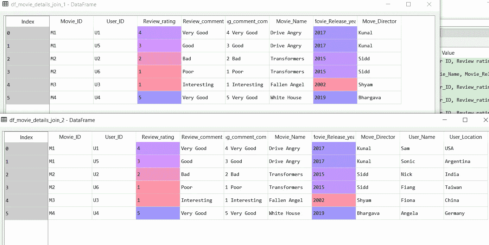

# 数据分析用熊猫——实用指南

> 原文：<https://medium.com/analytics-vidhya/pandas-data-frame-practical-guide-to-get-started-on-data-science-projects-60c6453db90c?source=collection_archive---------18----------------------->


照片来源——pix abay

Pandas Data Frame 可能是最通用的，广泛用于处理结构化数据。如果您正在从 Excel/SQL 迁移到 Python 熊猫数据框是你将要使用的第一个东西。大多数数据科学项目都涉及结构化数据，只有少数项目除外，如图像处理等。

在本文中，我试图列出一些在构建工作代码时所面临的实际场景的方法。 ***本文使用 3 个样本数据集&有演示概念的工作代码，便于参考&可移植性***

**注**:以下场景有多种实现方式。我试图列出一些我认为有用且易于理解的基本方法。请随意探索您自己的方法，并分享相同的方法。


照片来源——pix abay

# 用于演示的数据

1.  ***Movie _ user _ rating***—这包含了电影&的用户评分

```
+----------+---------+---------------+----------------+
| Movie_ID | User_ID | Review_rating | Review_comment |
+----------+---------+---------------+----------------+
| M1       | U1      |             4 | Very Good      |
| M2       | U2      |             2 | Bad            |
| M3       | U3      |             1 | Interesting    |
| M4       | U4      |             5 | Very Good      |
| M1       | U5      |             3 | Good           |
| M2       | U6      |             1 | Poor           |
+----------+---------+---------------+----------------+
```

2.***Movie _ details***—包含电影的详细信息

```
+----------+--------------+--------------------+---------------+
| Movie_ID |  Movie_Name  | Movie_Release_year | Move_Director |
+----------+--------------+--------------------+---------------+
| M1       | Drive Angry  |               2017 | Kunal         |
| M2       | Transformers |               2015 | Sidd          |
| M3       | Fallen Angel |               2002 | Shyam         |
| M4       | White House  |               2019 | Bhargava      |
+----------+--------------+--------------------+---------------+
```

2.***User _ details***—包含给电影评分的用户的详细信息

```
+---------+-----------+---------------+
| User_ID | User_Name | User_Location |
+---------+-----------+---------------+
| U1      | Sam       | USA           |
| U2      | Nick      | India         |
| U3      | Fiona     | China         |
| U4      | Angela    | Germany       |
| U5      | Sonic     | Argentina     |
| U6      | Fiang     | Taiwan        |
+---------+-----------+---------------+
```


照片来源——pix abay

# 1.将数据帧读入程序

Pandas 数据框是数据框类型的变量，具有 X 行和 Y 列，格式为(X，Y)。行和列的索引从零开始。

基本的第一步是使用 Pandas 数据框将 excel 文件读入程序。

***PD . read _ excel***用于读取 excel 文件。如果有一个 ***csv(逗号分隔文件)*** 文件那么我们可以使用 ***pd.read_csv。***

***注意——我们用‘r’表示以只读模式打开文件。***

用 Python 读取 excel 文件的代码

```
 Output----->
print (df_movie_user_review);
print (df_movie_details);
print (df_user_details); Movie_ID User_ID  Review_rating Review_comment
0       M1      U1              4      Very Good
1       M2      U2              2            Bad
2       M3      U3              1    Interesting
3       M4      U4              5      Very Good
4       M1      U5              3           Good
5       M2      U6              1           Poor Movie_ID    Movie_Name  Movie_Release_year Move_Director
0       M1   Drive Angry                2017         Kunal
1       M2  Transformers                2015          Sidd
2       M3  Fallen Angel                2002         Shyam
3       M4   White House                2019      BhargavaUser_ID User_Name User_Location
0      U1       Sam           USA
1      U2      Nick         India
2      U3     Fiona         China
3      U4    Angela       Germany
4      U5     Sonic     Argentina
5      U6     Fiang        Taiwan
```


照片来源——pix abay

# **2。处理 Pandas 数据帧的每一行，并对匹配文本或子字符串或任何其他计算进行条件检查**

在 data _ frame***df _ movie _ user _ Review***中，我们有一个列***Review _ Comment***，它包含文本形式的评论。

我们需要检查评论中是否有“**差评**”或“**差评**”字样，表示差评，并打印出来。我们刊登每一篇“负面”评论。或者，可以根据需要将其存储在单独的数据框或表中。

‘

```
Output---->negative review →
Movie_ID           M2
User_ID            U2
Review_rating       2
Review_comment    Bad
Name: 1, dtype: objectnegative review →
Movie_ID            M2
User_ID             U6
Review_rating        1
Review_comment    Poor
Name: 5, dtype: object
```

这里我们有 3 个方面

1.  ***为循环*** ，在数据帧名称前有 2 个参数— ***i_index*** 为 ***行*** ， ***each_row*** 表示行值本身。
2.  我们有 ***iterrows()，*** ，它本质上有助于检查数据帧的每一行。因此，使用该列值，我们需要使用代码***each _ row[' Review _ Comment ']进行检查。***
3.  然后我们使用 函数中的 ***比较关键字，返回一个 ***布尔值——是或否，1 或 0*** 。这是评估 IF 条件的关键。***


照片来源——pix abay

# **3。基于条件检查从一个数据帧读取数据并将数据插入另一个数据帧**

继续上面的工作，我们现在需要分离负面评论，并将正面评论放入另一个数据框架中进行进一步处理。因此，当条件满足时，我们可以有效地读取一个数据帧并写入另一个数据帧。

```
(***else*** part of the code for visibility) df_movie_positive_review = df_movie_positive_review.append(df_movie_user_review.loc[i_index], ignore_index=True**Output--->*****print  (df_movie_positive_review)* **  Movie_ID Review_comment  Review_rating User_ID
0       M1      Very Good            4.0      U1
1       M3    Interesting            1.0      U3
2       M4      Very Good            5.0      U4
3       M1           Good            3.0      U5
```

在上面的代码中，我们添加了一个 ***else*** 部分，并将写正面评价的代码放入另一个数据帧中。else 部分使用 ***append*** 函数将 *df_movie_user_review* 中的行值**插入到**正面评论的新数据帧—***df _ movie _ positive _ review 中。*** 循环 ***中的 ***i_index*** 表示我们需要插入的行值。***

如果运行上面的代码，新的数据帧***df _ movie _ positive _ review***被填充。

有时，如果我们需要重复运行代码或对多个数据集运行代码，我们将需要清除该数据框，否则这里有一个示例代码来清除数据框或删除行。我们使用 for 循环来适应在删除行之前需要完成的任何条件检查。

这是一个简单的 for 循环，它遍历所有行并删除，然后使用 ***DROP*** 函数。索引表示数据的每一行， ***轴*** 引导 ***下降*** 功能作用于 ***行*** 或 ***列*** 。

轴= 0 →表示行

轴= 1 →表示列


照片来源——pix abay

# **4。通过合并相同或另一个数据框的两列，在数据框中创建一个新列，然后删除一列**

这是一个非常直接的方法，我们将新列等同于我们想要合并的两列的组合。

我们在这里探索两种情况，我们连接两个字符串类型的列，然后一个字符串类型&另一个 INT 类型。在后一种情况下，我们在连接之前将 INT 类型转换为 STRING。我们创建两个新列' ***【评级 _ 评论 _ 组合 _1*** '和' ***评级 _ 评论 _ 组合 _2*** '。我们还删除了列'***rating _ comment _ combi _ 1***'，以展示完整列特性的删除。

```
**Output ---> Joining 2 columns( 2 new clumns created -  combi_1 & combi_2)**Movie_ID User_ID  ...  rating_comment_combi_1 rating_comment_combi_2
0       M1      U1  ...            M1 Very Good            4 Very Good
1       M2      U2  ...                  M2 Bad                  2 Bad
2       M3      U3  ...          M3 Interesting          1 Interesting
3       M4      U4  ...            M4 Very Good            5 Very Good
4       M1      U5  ...                 M1 Good                 3 Good
5       M2      U6  ...                 M2 Poor                 1 Poor**Output --> Dropping the column combi_1**[6 rows x 6 columns]
  Movie_ID User_ID  Review_rating Review_comment rating_comment_combi_2
0       M1      U1              4      Very Good            4 Very Good
1       M2      U2              2            Bad                  2 Bad
2       M3      U3              1    Interesting          1 Interesting
3       M4      U4              5      Very Good            5 Very Good
4       M1      U5              3           Good                 3 Good
5       M2      U6              1           Poor                 1 Poor
```


照片来源——pix abay

# **5。获取列的最小/最大/平均统计数据**

对于任何数值数据，理解数据的分布是很重要的。我们需要像最小值/最大值/平均值等数字列的描述性统计。我们可以在 DataFrame 中使用 ***describe()*** 做同样的事情。这给出了手头数据的高级描述性统计数据——计数、平均值、标准差、最小值、百分位数和最大值。

```
+---------------------------------+------------------+-----------+
| df_movie_user_review.describe() |                  |           |
+---------------------------------+------------------+-----------+
| Out[70]:                        |                  |           |
|                                 |    Review_rating |           |
| count                           |    6.000000      |           |
| mean                            |                  |  2.666667 |
| std                             |                  |  1.632993 |
| min                             |                  |  1.000000 |
| 25%                             |                  |  1.250000 |
| 50%                             |                  |  2.500000 |
| 75%                             |                  |  3.750000 |
| max                             |                  |  5.000000 |
+---------------------------------+------------------+-----------+
```


照片来源——pix abay

# 6。查找/查找/检索**基于匹配属性值的行的索引**

我们在这里的任务是获取/查找特定行的索引，该行在某一列中包含某个值。当您想要查找对应于行索引的值或查找匹配值的索引时，这尤其有用。

这里我们定义一个函数***get _ index _ by _ row _ attribute***并传递 look 值 ***movie_name 值。*** 我们想要 ***电影名*** 出现的行的 ***索引*** 。

这里我们传递不同的电影名称，函数返回行索引值。我们还有一个错误捕获块' ***IndexError*** '，以防电影名称不存在。

```
Output--->
print (get_index_by_row_attribute('Drive Angry'))
print (get_index_by_row_attribute('Transformers'))
print (get_index_by_row_attribute('XYZ'))
0
1
Index out of range, Movie name not in the list
None
```

代码有 3 个部分。让我们探索它们:

1.  ***【df _ 电影 _ 详情。movie _ Name = = movie _ Name]****→*验证属性是否与传递的值匹配。

***2。df _ movie _ details . loc[……]..】*** → *用* ***添加数据帧名称。loc"*** *帮助导航到我们想要匹配行值的数据框和属性列。*

***3。index.values[0]*** →这有助于返回特定行的适当索引。


照片来源——pix abay

# **7。查找/查找/检索给定行索引的行值**

继续上面的查找，我们的任务是在给定索引值的情况下获取特定行的行属性值。

当您想要查找对应于行索引的值或查找匹配值的索引时，这尤其有用。

这里我们定义一个函数***get _ row _ by _ index _ value***并传递 ***index_value。*** 我们希望电影名称出现在与索引对应的行中。

这里我们传递各种 ***index_value*** ，函数 ***从对应于该索引行的数据帧中返回 Movie_Name*** 值。我们还有一个错误捕获块' ***IndexError*** '，以防索引值不存在。

```
Output--->print (get_row_by_index_value(0))
print (get_row_by_index_value(2))
print (get_row_by_index_value(3))
print (get_row_by_index_value(100))
Drive Angry
Fallen Angel
White House
Index out of range, Movie Index not in the list
None
```

比较分为三个部分。让我们探索它们:

1.  ***【df _ movie _ details . index = = index _ value】***→我们比较需要返回行值的索引值

**2*2。df_movie_details.loc[…。】*** → *添加带“，”的数据帧名称。loc”帮助导航到我们想要匹配索引值的数据框和索引列。*

***3。Movie_Name.values[0***


照片来源——pix abay

# *8。基于匹配列合并/连接 2 个数据帧*

经常会出现这样一种情况，我们需要基于一个公共列值连接两个或更多数据帧，类似于我们在 SQL 中所做的。

这里我们将两个数据帧***df _ Movie _ User _ review***&***df _ Movie _ details***连接在公共属性“ ***Movie_ID*** ”上，然后将得到的数据帧***df _ Movie _ details _ join _ 1***与***df _ User _ details***连接在公共属性上

该连接有 3 个部分

1.  ***pd.merge*** —这是合并或加入功能。
2.  接下来，我们提到需要连接的两个数据帧
3.  ***如何*** —本物种加入的类型。这里我们使用内部连接。
4.  *—指定我们加入的列。在我们的例子中，两个数据框中的列名是相同的。但是如果连接的列名不同，我们可以使用***left _ on***&***right _ on***来指定将要执行连接的左表&右表列名。*

```
*#join 2 data frames to get the movie name in the movie_user_details
***df_movie_details_join_1= pd.merge(df_movie_user_review, df_movie_details, how = 'inner', on= 'Movie_ID')***
print (df_movie_details_join_1)##join 2 data frames to get the user details in the movie_user_details
***df_movie_details_join_2= pd.merge(df_movie_details_join_1, df_user_details, how = 'inner', on= 'User_ID')***
print (df_movie_details_join_2)*
```

*输出→*

**

*连接两个数据框的示例，其中连接列名称可以不同。*

*注意——这里我们用 ***右 _ 上*** & ***左 _ 上*** 代替 上的 ***。****

```
*df_movie_details_join_3= pd.merge(df_movie_details_join_1, df_user_details, how = 'inner', ***left_on= 'User_ID', right_on = 'User_ID'*** )
print (df_movie_details_join_3)*
```

**

*照片来源——pix abay*

# *9.从数据框创建数据透视表以进行汇总报告*

*Excel 中最受欢迎的工具之一是数据透视表。您必须同意它是通用的，并且允许以新的聚合视角查看汇总信息，或者基于一个或多个维度属性进行汇总。*

*这里我们探讨多种类型的透视表，可以使用 ***pivot_table*** 函数创建。*

*数据透视表具有以下属性:*

1.  *正在创建数据透视表的数据框名称*
2.  ****索引*** —为数据透视表提供汇总维度，基本上表示数据透视表的行*
3.  ****值*** —聚集参数*
4.  **—这概括了需要完成的聚合类型。**

**案例 1——让我们对电影进行汇总，以获得其评级的描述性统计数据。**

```
**#creating pivot table to display the average rating of movies
***pd.pivot_table(df_movie_details_join_2,index=['Movie_ID'], values=['Review_rating'], aggfunc = {'mean', 'median','min','max'})***
Out[75]: 
                       Review_rating                 
                   max mean median  min
Movie_ID                               
M1                 4.0  3.5    3.5  3.0
M2                 2.0  1.5    1.5  1.0
M3                 1.0  1.0    1.0  1.0
M4                 5.0  5.0    5.0  5.0**
```

**案例 2—让我们对电影进行汇总，以获得每个用户对电影的评级**

```
**#creating pivot table to display the rating of each movie by each user
***pd.pivot_table(df_movie_details_join_2,index=['Movie_ID'] ,values=['Review_rating'], columns=['User_ID'])*** Review_rating                         
User_ID             U1   U2   U3   U4   U5   U6
Movie_ID                                       
M1                 4.0  NaN  NaN  NaN  3.0  NaN
M2                 NaN  2.0  NaN  NaN  NaN  1.0
M3                 NaN  NaN  1.0  NaN  NaN  NaN
M4                 NaN  NaN  NaN  5.0  NaN  NaN**
```

**案例 3——让我们先对电影进行汇总，然后按用户进行汇总，以获得评级**

```
**#creating pivot table to display the rating of each movie by each user***pd.pivot_table(df_movie_details_join_2,index=['Movie_ID', 'User_ID'] ,values=['Review_rating'])*** Review_rating
Movie_ID User_ID               
M1       U1                   4
         U5                   3
M2       U2                   2
         U6                   1
M3       U3                   1
M4       U4                   5**
```

**案例 4—让我们对电影进行汇总，以获得对电影进行评级的用户的平均评级和数量**

**注意—**

```
*****import numpy as np*** #creating pivot table to display the rating of each movie with average rating & rating count
***pd.pivot_table(df_movie_details_join_2,index=['Movie_ID'],values=['User_ID', 'Review_rating'], aggfunc={'User_ID':np.count_nonzero,"Review_rating":np.average})*** Review_rating User_ID
Movie_ID                        
M1                  3.5        2
M2                  1.5        2
M3                  1.0        1
M4                  5.0        1**
```

****

# **10.“iloc ”,用于随意切片和切割数据帧**

**使用“iloc ”,您几乎可以根据需要水平或垂直分割数据帧。让我们以数据帧***df _ movie _ user _ review***为例来解决这个问题，该数据帧包含电影&的用户详细信息。**

*****注意—两行&列*** 的数据帧索引从 0 开始**

*****注意—iloc 的格式是 iloc[[行]，[列] ]*****

**用于 iloc 演示的数据帧→**

```
**+---+----------+---------+---------------+----------------+
|   | Movie_ID | User_ID | Review_rating | Review_comment |
+---+----------+---------+---------------+----------------+
| 0 | M1       | U1      |             4 | Very Good      |
| 1 | M2       | U2      |             2 | Bad            |
| 2 | M3       | U3      |             1 | Interesting    |
| 3 | M4       | U4      |             5 | Very Good      |
| 4 | M1       | U5      |             3 | Good           |
| 5 | M2       | U6      |             1 | Poor           |
+---+----------+---------+---------------+----------------+**
```

*****案例 1*** —我们来玩排—取前 2 排**

```
****print(df_movie_user_review.iloc[:2])** Movie_ID User_ID  Review_rating Review_comment
0       M1      U1              4      Very Good
1       M2      U2              2            Bad**
```

```
******print(df_movie_user_review.iloc[2:])**Movie_ID User_ID  Review_rating Review_comment
2       M3      U3              1    Interesting
3       M4      U4              5      Very Good
4       M1      U5              3           Good
5       M2      U6              1           Poor****
```

*******案例 3*** —让我们来玩列—取前 2 列****

```
******print(df_movie_user_review.iloc[:,:2])** Movie_ID User_ID
0       M1      U1
1       M2      U2
2       M3      U3
3       M4      U4
4       M1      U5
5       M2      U6****
```

*******案例 4*** —让我们来玩列—打印从列索引 2 开始的所有列****

```
******print(df_movie_user_review.iloc[:,2:])
**   Review_rating Review_comment
0              4      Very Good
1              2            Bad
2              1    Interesting
3              5      Very Good
4              3           Good
5              1           Poor****
```

*******案例 5*** —让我们玩列—选择列 1 & 2****

```
******print(df_movie_user_review.iloc[:,[1,2]])** User_ID  Review_rating
0      U1              4
1      U2              2
2      U3              1
3      U4              5
4      U5              3
5      U6              1****
```

*******案例 6*** —我们来玩行&列—打印行索引 2 的所有行，打印索引 1 & 2 的列。****

```
******print(df_movie_user_review.iloc[2:,[1,2]])** User_ID  Review_rating
2      U3              1
3      U4              5
4      U5              3
5      U6              1****
```

*******案例 7*** —让我们玩行&列—打印前 2 行&打印索引为 1 & 2 的列。****

```
******print(df_movie_user_review.iloc[:2,[1,2]])
**  User_ID  Review_rating
0      U1              4
1      U2              2****
```

*******案例 8*** —我们来玩行&列—打印索引为 4 & 5 的行，索引为 1 & 2 的列。****

```
******print(df_movie_user_review.iloc[[4,5],[1,2]])** User_ID  Review_rating
4      U5              3
5      U6              1****
```

*******案例 9*** —让我们通过以编程方式读取行&列的值，使之成为*。我们使用 ***形状*** 函数得到数据帧的行&列。*****

```
******row,columns = df_movie_user_review.shape**print('rows -->' + str(row), 'columns -->'+ str(columns))rows -->6 columns -->4****
```

*******案例 10*** —让我们玩玩 ***动态*** 行&列—读取除最后 2 行以外的所有行，读取除最后 1 行以外的所有列****

```
******print(df_movie_user_review.iloc[:row-2,:columns-1])** Movie_ID User_ID  Review_rating
0       M1      U1              4
1       M2      U2              2
2       M3      U3              1
3       M4      U4              5****
```

*******案例 11*** —让我们玩玩 ***动态*** 行&列—将包含注释的最后一列存储在单独的数据框中****

```
******new_data_frame = pd.DataFrame(df_movie_user_review.iloc[:,columns-1:].values)****print(new_data_frame)**0
0    Very Good
1          Bad
2  Interesting
3    Very Good
4         Good
5         Poor****
```

*******案例 12***—让我们把它写回一个 excel 文件****

```
****new_data_frame.to_excel('review_rating_only.xlsx')****
```

****感谢阅读。随时欢迎反馈和提问！这篇博客是根据我对庞大的 Python 世界及其提供的各种功能的有限理解而写的。快乐学习！！****

****更多信息请参考—[https://pandas . pydata . org/pandas-docs/stable/reference/API/pandas。DataFrame.html](https://pandas.pydata.org/pandas-docs/stable/reference/api/pandas.DataFrame.html)****

****感谢[https://medium . com/@ mesi rii/5-tips-for-embedding-tables-in-your-medium-posts-8722 F3 fc 5 BF 5](/@mesirii/5-tips-for-embedding-tables-in-your-medium-posts-8722f3fc5bf5)关于格式化数据&嵌入代码的帮助****