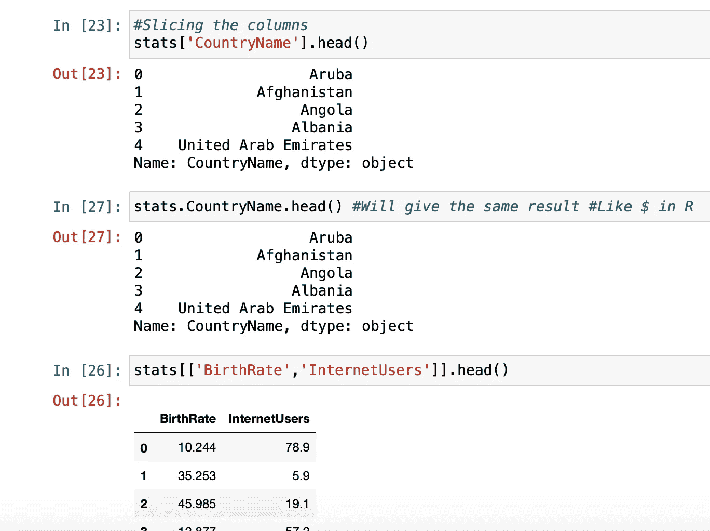
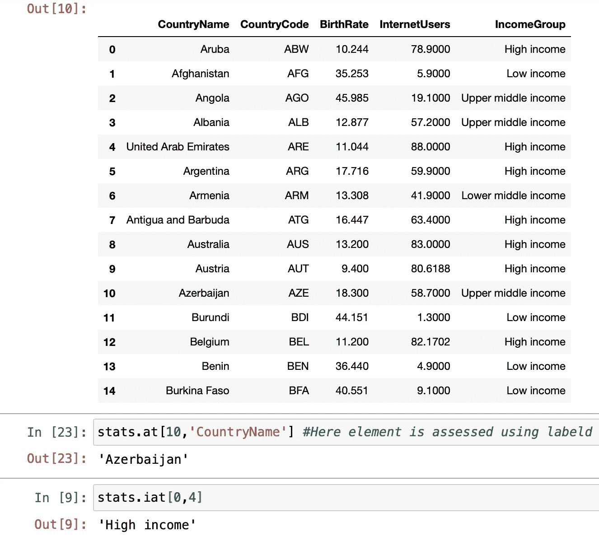

# 熊猫数据框:快速查看

> 原文：<https://medium.com/analytics-vidhya/pandas-data-frames-quick-look-2c486cc49450?source=collection_archive---------24----------------------->

# 导入数据文件

1.  使用 pandas 将数据文件导入 python 有两种方法。您可以指定到`pd.read_csv('file_path')`的完整文件路径，或者您可以`import os os.chdir('pythonFolder')`并将 python 工作目录设置为当前文件夹，这样默认情况下笔记本会在当前目录中搜索数据文件。您可以使用`print(os.getcwd())`查看工作目录
2.  `import pandas as pd`是我们需要的库。
3.  `pd.read_csv()`是最灵活和最常用的。
4.  `pd.read_csv(sheet_name = "", skiprows = "", skipfooter= "")`是可以使用的附加参数。
5.  要保存文件，我们可以使用 pd.to_csv("fileName.csv ")

# 基本探索功能

1.  行数`len(df)`
2.  列数`len(df.columns)`
3.  `df.info()`关于列和数据类型的信息。
4.  `df.describe()`数据框数字列的平均值、标准值和 25 50 75 四分位数值等统计数据。这和 r 里的`df.summary()`差不多。
5.  `df.head()`显示前 5 行。`df.tail()`显示最后 5 行。
6.  `df.transpose()`将行反转为列。
7.  `df['columnName'].unique()`将显示该列的所有唯一元素。`df.columnName.unique()`
8.  颠倒行的顺序`df[::-1]`
9.  以 20 为步长显示行`df[::20]`
10.  重命名数据框的列`df.columns = ['name1', 'name2', 'name3']`
11.  使用`df.drop('columnName1' axis = 1)`删除列。默认轴是行。轴 0 代表行。

# 设置数据帧的子集

1.  对行进行子集化。`df[1:20]`将从 1 到 19 中选择行。这也叫切片。
2.  给列添加子集`df['columnName1']`。通过添加类似`df[[ ''columnName1, 'columnName2' ]]`的列名列表选择多个列。像 R 中的`$`一样，我们在 Python 中使用`df.columnName1`类似于`df['columnName1']`。
3.  设置行和列的子集。`df[40:100][['columnName1', 'columnName2']]`这将选择从 40 到 99 的行和列`'columnName1', 'columnName2'`

# 添加聚合列

1.  `df['result'] = df.column1 * df.column2`用两个数值列的乘积在末尾添加一个新列。

# 过滤数据帧

1.  `df[df.column1 > 3]`将过滤表中小于 3 的所有值。
2.  结合两个条件`df[(df.column1 < 3)&(df.column2 == 'Category1')]`。不要忘记每个条件的圆括号，因为优先顺序会导致错误。

# 评估单个元素

1.  `df.iat[rowIndex, columnIndex]`根据行和列的索引访问元素。
2.  `df.at[index, columnName]`根据 df ie 的整数索引访问元素。第一列。

你可以在[https://github . com/Jay 6445/Learning-Analytics/tree/master/Python % 20 data frames](https://github.com/jay6445/Learning-Analytics/tree/master/Python%20DataFrames)上找到这段代码