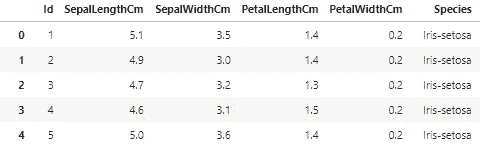
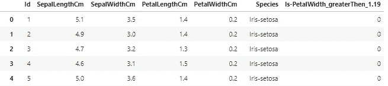
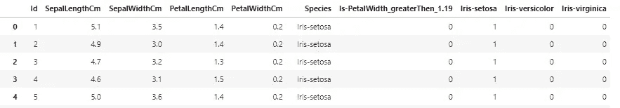
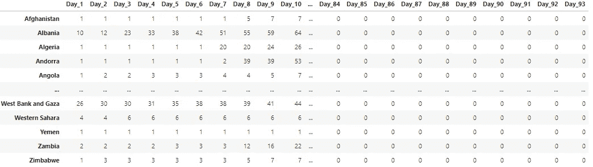

# 熊猫数据框架 Python 中的简单转换

> 原文：<https://medium.com/analytics-vidhya/pandas-dataframe-simple-transformations-in-python-6582523c3d81?source=collection_archive---------11----------------------->

## 实用分析的有用数据转换。

## 准备数据时通常需要几个简单的代码。

在编码时，似乎很少有我经常需要的数据转换，并且总是试图找到最好的解决方案。在我的数据科学“旅程”开始时，我被那些让数据看起来更有代表性的简单答案所吸引。在学习的时候，我脑子里有它的逻辑，但是我没有足够的经验从袖子里拿出代码。

***所以让我们一头扎进去。***


由[弗兰基·查马基](https://unsplash.com/@franki?utm_source=medium&utm_medium=referral)在 [Unsplash](https://unsplash.com?utm_source=medium&utm_medium=referral) 上拍摄的照片

# 1.基于条件添加列

这是我的代码中一直需要的东西。为了做出更好的预测或可视化，无疑仍然需要在我的数据中添加一些额外的东西。在我看来，最有效的方法是添加一个具有功能的列——对它有更多的控制，并且可以根据任何需要轻松调整。

```
def func(data):
    if data['column']==condition:
        return 1
    else:
        return 0
```

我们定义一个函数——取整个数据集，在 **IF** 语句中检查所选列是否符合输入的条件。

条件可以有多种变化:

```
# **one condition** 
if datadata['column']==(>,<,>=,<=)condition:
# **multiple conditions - and (&) , or(|)** if (datadata['column']==condition) | (datadata['column']==condition2):
```

使用 **return，**我们决定如果 if 语句为真，需要在新列中输入什么，可以是 int、string、float 等。…

例如，我将使用虹膜数据集:



```
def func(data):
    if data['PetalWidthCm']>1.19:
        return 1
    else:
        return 0
```

我们希望根据花瓣宽度(以厘米为单位)创建一个新列，如果花瓣宽度大于 1.19，则在新列中写入 1，如果小于或等于 0，则写入 0。

调用函数:
每行应用函数—轴=1 —使用**。应用**。

```
data['Is-PetalWidth_greaterThen_1.19']=data.apply(func,axis=1)
```

输出:



# 2.获取虚拟变量

简而言之，虚拟变量是一个数值变量，它表示分类数据的唯一值。对于每个分类变量-虚拟变量的数量=分类变量中唯一值的数量。

***注*** *:在创建预测模型的过程中——虚拟变量的数量=* ***(分类变量中唯一值的数量)——1****，因为我们希望模型中的预测特征尽可能少。背后的逻辑是——如果我们有 3 种颜色(蓝色、红色、绿色)以及蓝色和红色的虚拟变量。如果蓝色和红色是 0，那么我们知道这个特定的“数据”是绿色的。提到可以通过 pd.get_dummies 来控制(data，****drop _ first = True****)。*

循序渐进:
1。创建一个函数，它将采用:

*   资料组
*   分类栏
*   False(默认情况下)到 True 我们是否希望在获得虚拟变量后删除主要分类值

```
def create_dummy(data,col,drop_main=False):
    return result
```

2.为分类变量创建虚拟变量(例如:物种):

```
pd.get_dummies(data['Species'])
```

3.将其与我们的数据连接:
使用**PD . concat**(pandas imported as PD)将真实数据与虚拟变量按行连接(轴=1)。

```
**def** create_dummy(data,col,drop_main**=False**):
result **=** pd.concat([data,pd.get_dummies(data[col])],axis**=**1,sort**=False**)
```

4.创建删除主要分类变量的规则:
当连接这两个数据帧时，主变量将保留在数据集中，创建新的“规则”drop _ main(False-不删除，True-删除)

```
def create_dummy(data,col,drop_main=False):
    result = pd.concat([data,pd.get_dummies(data[col])],axis=1,sort=False)
    **if drop_main==True:
        result=result.drop(columns=[col])**
    return result
```

最后，我们有一个包含虚拟变量的数据集。



在分析新冠肺炎数据时，我想到了最后一个转换，它对时间序列数据非常有用。为了说明，我将使用自跟踪开始以来通过各国的确诊病例。

## 主旨:

数据集由国家、日期和确诊病例组成，如果我们想要创建这样的数据集，其中国家将被索引，并且对于每个国家，我们跟踪自第一天以来的病例数。重要的**是**，每个国家的第一天都是不同的，因为我们正在跟踪特定国家自该国首例确诊病例以来的数字。

对于每个国家，我们将从第 1 天开始输入确诊病例的数据。当我们到达确诊病例的最后一天时，剩余的天数将用 0 填充。**为什么？**
比如克罗地亚的病例活跃 59 天，而中国是 93 天。我们有 34 天的差异，对于克罗地亚的情况，这些需要用 0 来填充。

Code:
对于数据集中的每个国家— unique()从选定的列中返回唯一值—如果您是 SQL 类型，那么它与 DISTINCT 相同。

```
def rows_to_col(data):
    for i in data['Country/Region'].unique():
```

然后检查该国家的天数—如果它不等于最大日期范围，则追加现有值，剩余日期追加 0。

```
def rows_to_col(data):
    new=pd.DataFrame()
    for i in data['Country/Region'].unique():
        if data[data['Country/Region']==i].Confirmed.shape[0] != data.Date.unique().shape[0]:
            a=np.append(data[data['Country/Region']==i].Confirmed.values, list(repeat(0,(data.Date.unique().shape[0]-data[data['Country/Region']==i].Confirmed.shape[0]))))
            new[i]=a
```

如果一个国家的活动天数与最大日期范围相同，那么只需将其添加到新的**数据框架中。**

```
else:
       new[i]=data[data['Country/Region']==i].Confirmed.values
```

最后，我们想创建一个日期列表—第 1 天，第 2 天，…..，Day_n —并将其设置为我们的数据帧的索引。

```
day_list=['Day_'+str(x+1) for x in range(0,data.Date.unique().shape[0])]
    new=new.set_index([day_list])
```

目前，新的数据框架将活跃天数作为索引插入，将国家作为列插入。现在，我们只想转置整个数据帧，以获得所需的外观。用 return **new 可以很快完成。T** ，其中**。T** 将转置表格。

最终代码在这里:

```
from itertools import repeatdef rows_to_col(data):
    new=pd.DataFrame()
    for i in data['Country/Region'].unique():
        if data[data['Country/Region']==i].Confirmed.shape[0] != data.Date.unique().shape[0]:
            a=np.append(data[data['Country/Region']==i].Confirmed.values, list(repeat(0,(data.Date.unique().shape[0]-data[data['Country/Region']==i].Confirmed.shape[0]))))
            new[i]=a
        else:
            new[i]=data[data['Country/Region']==i].Confirmed.values
    day_list=['Day_'+str(x+1) for x in range(0,data.Date.unique().shape[0])]
    new=new.set_index([day_list])

    return new.T
```

输出:



当创建新功能时，我总是将它们写在“示例”笔记本上，这样我可以快速找到它们，并在新项目中实现它们。有时候找不到你想要的东西真的会很沮丧，但是在解决问题之后，会有自豪和幸福的感觉。

我希望通过一点点的学习，它变得有趣和流畅。

感谢您的阅读，并保持安全。再见。