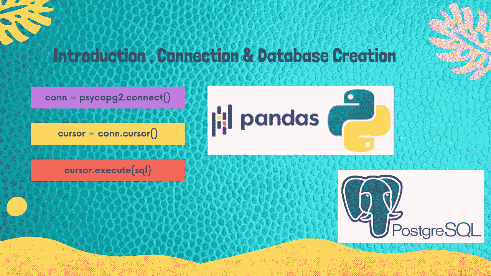
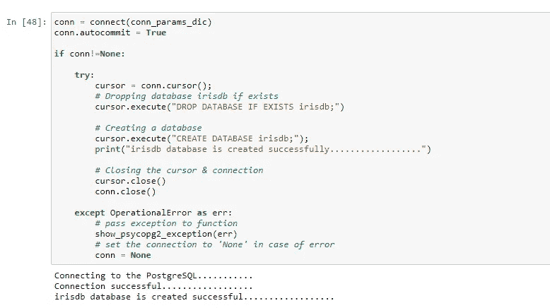

# 使用 Python 将数据帧转换成 PostgreSQL！！第一部分

> 原文：<https://medium.com/analytics-vidhya/pandas-dataframe-to-postgresql-using-python-part-1-93f928f6fac7?source=collection_archive---------4----------------------->

## **介绍、连接&数据库创建**



# 先决条件

**Python 3 . 8 . 3:**[Anaconda 下载链接](https://www.anaconda.com/products/individual)

**PostgreSQL 13:**T8**下载链接**

**Psycopg2 :** 安装 **Psycopg2** 使用命令: **pip 安装 psycopg2**

## 1.介绍

> [**PostgreSQL**](https://www.postgresql.org/about/#:~:text=PostgreSQL%20is%20a%20powerful%2C%20open%20source%20object-relational%20database,store%20and%20scale%20the%20most%20complicated%20data%20workloads.) 是一个强大的开源对象关系数据库系统，它使用并扩展了 SQL 语言，结合了许多功能，可以安全地存储和扩展最复杂的数据工作负载。PostgreSQL 的起源可以追溯到 1986 年，是加州大学伯克利分校的 POSTGRES 项目的一部分，在核心平台上已经有 30 多年的积极发展。

## 2.连接到 PostgreSQL 并创建数据库

**第一步:导入库**

```
**# import sys to get more detailed Python exception info**
import sys**# import the connect library for psycopg2**
import psycopg2**# import the error handling libraries for psycopg2**
from psycopg2 import OperationalError, errorcodes, errors
```

**第二步:指定连接参数**

```
**# Note: please change your host, username & password as per your own values**conn_params_dic = {
    "host"      : "localhost",
    "user"      : "postgres",
    "password"  : "Passw0rd"
}
```

**步骤 3:定义一个处理和解析 psycopg2 异常的函数**

```
**def show_psycopg2_exception(err):**
    **# get details about the exception**
    err_type, err_obj, traceback = sys.exc_info() ** # get the line number when exception occured**
    line_n = traceback.tb_lineno **# print the connect() error**
    print ("\npsycopg2 ERROR:", err, "on line number:", line_n)
    print ("psycopg2 traceback:", traceback, "-- type:", err_type) **# psycopg2 extensions.Diagnostics object attribute**
    print ("\nextensions.Diagnostics:", err.diag) ** # print the pgcode and pgerror exceptions**
    print ("pgerror:", err.pgerror)
    print ("pgcode:", err.pgcode, "\n")
```

**步骤 4:定义一个连接函数来连接 PostgreSQL 数据库服务器**

```
**def connect(conn_params_dic):**
    conn = None
    try:
        print('Connecting to the PostgreSQL...........')
        conn = psycopg2.connect(**conn_params_dic)
        print("Connection successful..................")

    except OperationalError as err:
        **# passing exception to function**
        show_psycopg2_exception(err) ** # set the connection to 'None' in case of error**
        conn = None

    return conn
```

**第五步:在 PostgreSQL 数据库中创建一个名为 irisdb 的数据库**

```
conn = connect(conn_params_dic)
conn.autocommit = Trueif conn!=None:

    try:
        cursor = conn.cursor();
        **# Dropping database irisdb if exists**
        cursor.execute("DROP DATABASE IF EXISTS irisdb;")

       ** # Creating a database**
        cursor.execute("CREATE DATABASE irisdb;");
        print("irisdb database is created successfully............")

        **# Closing the cursor & connection**
        cursor.close()
        conn.close()

    except OperationalError as err:
        **# pass exception to function**
        show_psycopg2_exception(err)
        **# set the connection to 'None' in case of error**
        conn = None
```



**结论:**这就结束了我们的**第一部分**关于**的介绍，连接&数据库创建**。在本教程中，我们学习了如何使用 python 在 PostgreSQL 中连接和创建数据库。

本文的所有代码都可以在 GitHub 上的 [**Jupyter 笔记本中获得。**](https://github.com/Muhd-Shahid/Learn-Python-Data-Access/tree/main/PostgreSQL)

> **接下来** [**第二部分**](https://shahid-dhn.medium.com/pandas-dataframe-to-postgresql-using-python-part-2-3ddb41f473bd) **:使用 Python 在 PostgreSQL 数据库中创建表**

保持积极的态度！！注意安全！！继续学习:))

**感谢您的阅读！！**