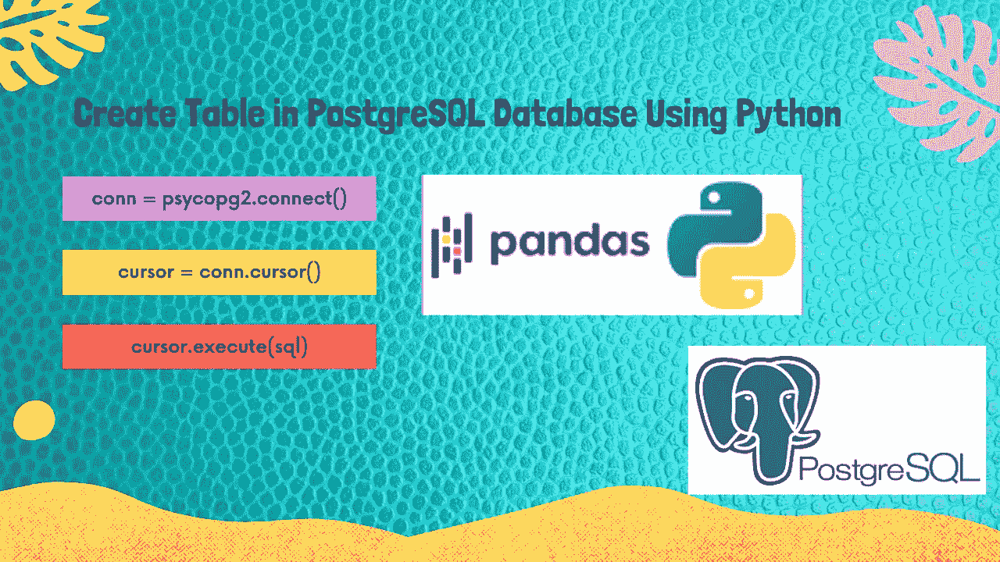
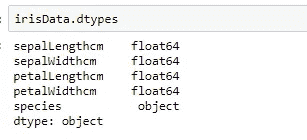
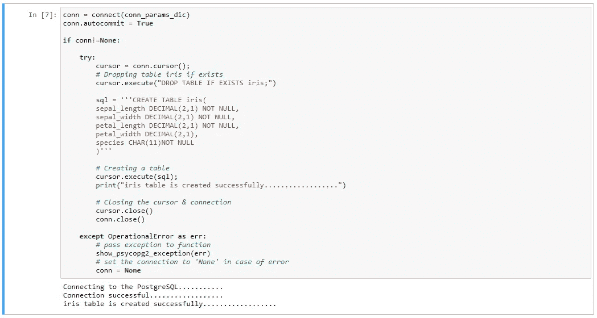

# 使用 Python 将数据帧转换成 PostgreSQL！！第二部分

> 原文：<https://medium.com/analytics-vidhya/pandas-dataframe-to-postgresql-using-python-part-2-3ddb41f473bd?source=collection_archive---------7----------------------->

## **使用 Python 在 PostgreSQL 数据库中创建表格**



# 先决条件

**Python 3 . 8 . 3:**[Anaconda 下载链接](https://www.anaconda.com/products/individual)

**PostgreSQL 13:**T8**下载链接**

**Psycopg2 :** 安装 **Psycopg2** 使用命令: **pip 安装 psycopg2**

# 目标

本文的主要目标是逐步学习创建表的工作代码。

## 步骤 1:导入库

```
**# import sys to get more detailed Python exception info**
import sys
**# import the connect library for psycopg2**
import psycopg2
**# import the error handling libraries for psycopg2**
from psycopg2 import OperationalError, errorcodes, errors
```

**第二步:指定连接参数**

```
**# Note: please change your database, username & password as per your own values** conn_params_dic = {
    "host"      : "localhost",
    "database"  : "irisdb",
    "user"      : "postgres",
    "password"  : "Passw0rd"
}
```

步骤 3:定义一个处理和解析 psycopg2 异常的函数

```
**def show_psycopg2_exception(err):**
    **# get details about the exception**
    err_type, err_obj, traceback = sys.exc_info()   ** 
    # get the line number when exception occured**
    line_n = traceback.tb_lineno    
    **# print the connect() error**
    print ("\npsycopg2 ERROR:", err, "on line number:", line_n)
    print ("psycopg2 traceback:", traceback, "-- type:", err_type) 
    **# psycopg2 extensions.Diagnostics object attribute**
    print ("\nextensions.Diagnostics:", err.diag)   ** 
    # print the pgcode and pgerror exceptions**
    print ("pgerror:", err.pgerror)
    print ("pgcode:", err.pgcode, "\n")
```

**第四步:定义一个连接函数来连接 PostgreSQL 数据库服务器**

```
**def connect(conn_params_dic):**
    conn = None
    try:
        print('Connecting to the PostgreSQL...........')
        conn = psycopg2.connect(**conn_params_dic)
        print("Connection successful..................")

    except OperationalError as err:
        **# passing exception to function**
        show_psycopg2_exception(err)       ** 
        # set the connection to 'None' in case of error**
        conn = None

    return conn
```

## 第五步。准备或识别您的数据

首先，准备或确定稍后要导入 PostgreSQL 数据库的 CSV 文件。例如，我从 GitHub 加载虹膜数据。

```
import pandas as pd
irisData = pd.read_csv('[https://raw.githubusercontent.com/Muhd-Shahid/Learn-Python-Data-Access/main/iris.csv](https://raw.githubusercontent.com/Muhd-Shahid/Learn-Python-Data-Access/main/iris.csv)[',index_col=False](https://github.com/Muhd-Shahid/Write-Raw-File-into-Database-Server/raw/main/iris.csv',index_col=False))
irisData.dtypes
```

首先，我们将确保我们将创建的 PostgreSQL 表中的列和数据类型参数必须与 CSV 文件的列数和数据类型相匹配。



## 步骤 6:在 PostgreSQL 数据库中创建一个名为 iris 的表

要创建 iris 表，请使用 pyscopg2 的游标的 execute()方法执行 CREATE TABLE 语句。

```
conn = connect(conn_params_dic)
conn.autocommit = Trueif conn!=None:

    try:
        cursor = conn.cursor();
        # Dropping table iris if exists
        cursor.execute("DROP TABLE IF EXISTS iris;")

        sql = '''CREATE TABLE iris(
        sepal_length DECIMAL(2,1) NOT NULL, 
        sepal_width DECIMAL(2,1) NOT NULL, 
        petal_length DECIMAL(2,1) NOT NULL, 
        petal_width DECIMAL(2,1),
        species CHAR(11)NOT NULL
        )'''

        # Creating a table
        cursor.execute(sql);
        print("iris table is created successfully................")

        # Closing the cursor & connection
        cursor.close()
        conn.close()

    except OperationalError as err:
        # pass exception to function
        show_psycopg2_exception(err)
        # set the connection to 'None' in case of error
        conn = None
```



**结论:**这就结束了我们的**第二部分**关于创建表的讨论。在本教程中，我们学习了如何使用 python 在 PostgreSQL 数据库中创建表。

本文的所有代码都可以在 GitHub 上的 [**Jupyter 笔记本中获得。**](https://github.com/Muhd-Shahid/Learn-Python-Data-Access/tree/main/PostgreSQL)

> ***下一个*** [***第 3.1 部分***](https://shahid-dhn.medium.com/part-3-1-pandas-dataframe-to-postgresql-using-python-8a3e3da87ff1) ***:使用 Python*** 将数据批量插入 PostgreSQL 数据库
> 
> ***上一篇*** [***第一部分***](https://shahid-dhn.medium.com/pandas-dataframe-to-postgresql-using-python-part-1-93f928f6fac7) ***:简介、连接&数据库创建***

保持积极的态度！！注意安全！！继续学习:))

**感谢您的阅读！！**