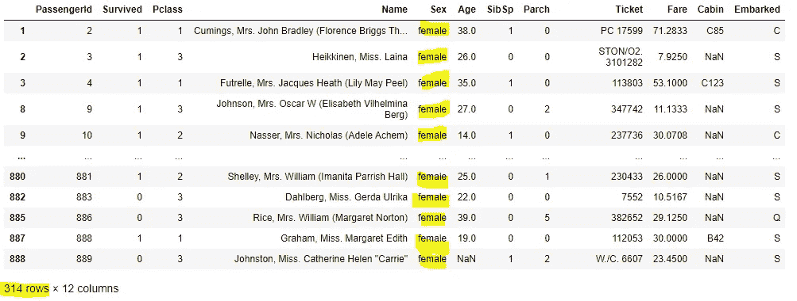
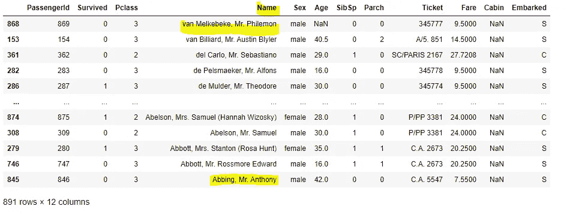

# 10 分钟内开始接触熊猫

> 原文：<https://medium.com/analytics-vidhya/pandas-for-data-analysis-664e280ad6e7?source=collection_archive---------3----------------------->

## 10 分钟学会熊猫


图片来源于媒体帖子

**本文分为四个部分:**

1.  熊猫简介
2.  熊猫能做什么
3.  实际实施
4.  结论

# **1。熊猫简介**

简单地说，pandas 是一个为 python 编程语言编写的快速、强大、灵活且易于使用的软件库，用于进行数据分析和数据操作。

# **2。什么熊猫有能力**

1.  导入和导出数据
2.  查看和检查数据
3.  选择和过滤数据
4.  分组和排序数据
5.  处理缺失和重复的数据
6.  设置和重置索引
7.  重塑数据
8.  合并数据
9.  日期格式化

# **3。实际实施**

让我们从导入熊猫的库开始。下面是导入库的语法。Import 是关键字，pandas 是库名，pd 是别名。通过使用 alias，可以访问 pandas 的所有功能。

```
import pandas as pd
```

## **1。导入和导出数据**

```
#Importing data
data = pd.read_csv('titanic.csv')#Exporting data
data.to_csv('output.csv') 
```

我用的是 Kaggle 的泰坦尼克号数据集，你可以在这里找到 T10。

数据科学项目的第一步是导入数据集。通常，您会使用一个通用单独值(CSV)文件。 **read_csv()** 函数用于导入数据集， **to_csv()** 函数用于导出数据集。

数据是变量名，变量用于存储任何类型的数据。可以使用任何变量名。可以导入和导出不同文件格式的数据，如 Excel、Html、JSON 等。


这是导入数据集的外观

## **2。查看和检查数据**

```
#Returns by default top five rows
data.head()
```


```
#Returns by default last five rows
data.tail()
```


```
#Returns column names
data.columns
```


```
#Returns column data types
data.dtypes
```


```
#Returns (Rows, Columns) of the dataset
data.shape 
```


```
#Returns total count of non NA values for each column 
data.count()#Age, Cabin, Embarked columns have NA values
```


```
#Returns basic statistical information of numeric columns only
data.describe() 
```


```
#Returns information of string type columns
data.describe(include=object)
```


```
#Returns information about dataframe like index dtype and column dtypes, non-null values and memory usage
data.info()
```


```
#Returns distinct count of observations for each column
data.nunique()
```


```
#Returns count of unique values for series(columns in our case)
data['Pclass'].value_counts()
```


```
#Rename the column name
data.rename(columns= {“Name”:”Full Name”})
```


```
#Drop columns
data.drop(columns=[‘Name’,’Survived’,’Pclass’])
```


## **3。选择和过滤数据**

```
#Selects one column data
data['Name']
```


```
#Selects more than one column data
data[['Sex','Name']]
```


```
#Filters data based on condition
data[data['Age']>50]
```


```
#Filters all rows and 3 columns
#loc() function filters by labelsdata.loc[:, ['Sex','Pclass','Age']]
```


```
#Filters 100 to 400 rows and 2 columns
data.loc[100:400 :,['Survived','Sex']]
```


```
#Filters all rows and columns from survived to sex columns
data.loc[:, 'Survived':'Sex']
```


```
#Filters rows based on condition (sex=female) and all columns
data.loc[data['Sex']=='female', ]
```



```
**#**Filters all rows and 1 to 4 columns
#iloc() function filters by index
data.iloc[ :,1:4]#index starts from zero and ignores last index while filtering
```


```
#Filters all rows and 1,4,6 columns
data.iloc[:,[1,4,6]]
```


```
#Filters rows from 150 to 400 and and 2,7,3 columns
data.iloc[150:400:,[2,7,3]]
```


## **4。数据分组和排序**

```
#Returns Survived column wise count
data.groupby('Survived').count()
```


```
#Returns max age based on sex column
data.groupby('Sex')['Age'].max()
```


```
#Returns min age based on sex, survived columns
data.groupby(['Sex','Survived'])['Age'].min()
```


```
#Multiple aggregation functions  
#Returns min,max of age based on parch & survived
data.groupby(['Parch','Survived'])['Age'].agg([min, max])
```


```
#Sorts the dataset based on specified column(default it sorts in ascending order)
data.sort_values(by='Name')
```


```
#Sorts the dataset based on specified column in decending order
data.sort_values(by='Name', ascending=False)
```



## **5。处理缺失数据**

```
#Returns True or False 
data.isnull()
data.isna()#True -> NA 
#False -> Not NA
```


```
#Fills all NA's with zero for both string nd numeric 
#NA values can be filled with mean,median or mode as well.data.fillna(0)
```


```
#Drops rows if the row has at least one NA value
data.dropna(how='any')
```


看看行数是如何从 891 减少到 183 的，使用 dropna()函数时要小心，因为它会丢失很多有价值的数据。

```
#Drops rows if the row have all NA values
data.dropna(how=’all’)
```


在我们的例子中，我们没有任何这样的全 NA 值的行。

```
#Drops columns if the column have at least one NA value
data.dropna(axis=’columns’, how=’any’)
```


年龄，船舱，登上列下降。

```
#Checks if the whole row appears elsewhere with the same values. 
data.duplicated()
```


```
#Checks if there are any duplicate values of a particular column
data.duplicated(‘Age’)
```


```
#Drops duplicate records 
data.drop_duplicates()
```


在我们的例子中，我们没有任何重复的记录。

```
#Drops duplicates from particular column
data.drop_duplicates(‘Age’)
```


看看行数是如何从 891 减少到 89 的，使用 drop_duplicates()函数时要小心，因为它会丢失很多有价值的数据。在我们的例子中，很明显是同一年龄段的人乘坐泰坦尼克号。仅用于举例。

## **6。设置和重置索引**

```
#Sets index based on specified column 
data.set_index(‘Sex’)
```


```
#Sets index based on specified columns
data.set_index([‘Sex’,’PassengerId’])
```


```
#Reset index 
data1.reset_index()
```


现在 Sex、PassengerId 列被重置回正常列。

## **7。重塑数据**

```
#melt() function is used to convert dataframe from wide format to long formatdata.melt(id_vars='PassengerId')
```


```
#melt() function can be used for particular columns as welldata.melt(id_vars='PassengerId', value_vars=['Survived','Sex'], var_name='Columns', value_name='Column_values')
```


```
#pivot() function is used to reshape dataframe based on index/columns values. Results into multiindex
# don't support aggregation functiondata.pivot(index='PassengerId', columns='Sex', values=['Survived','Pclass','Age'])
```


```
#pivot_table is used for data aggregation 
#Obersvations are filled with sum of age valuesdata.pivot_table(index=’PassengerId’, columns=’Sex’, values=’Age’, aggfunc=’sum’)
```


## 8。合并数据

让我们创建数据框来演示合并和连接功能

```
df1 = pd.DataFrame({“x1”: [“a”,”b”,”c”,”d”], “x2”:[12.0, 23.2, 56, 45.4]})
 df1df2 = pd.DataFrame({“x1”: [“a”,”b”,”c”,”e”], “x3”:[9.5, 37.0, 77,38.9]})
df2
```


```
#Returns come data based on x1 column: inner join (a,b,c)
pd.merge(df1,df2,on=”x1") #Merges both data based on x1 column: outer join (a,b,c,d,e)
pd.merge(df1,df2,on="x1", how="outer") #Merges common data from both dataset and remaining data from left dataset
pd.merge(df1,df2,on=”x1", how=”left”) #Merges common data from both dataset and remaining data from right dataset
pd.merge(df1,df2,on="x1", how="right")
```


请注意，合并时，如果数据不存在，那么它将替换为 NaN 值。

```
#Concat function by default performs outer join and works row wise
pd.concat([df1,df2])#Axis will be labeled 0, …, n - 1
pd.concat([df1,df2], ignore_index=True)#Concatnates column wise
pd.concat([df1,df2], axis=1)pd.concat([df1,df2], join="inner")
```


## 9.日期格式化

我正在使用谷歌财经网站上的苹果股票价格数据集，你可以在这里找到。

```
#Load the dataset 
data1 = pd.read_csv(‘applestock.csv’)data1.head()
```


```
#Check the datatypes
data1.dtypes#date column is object type not datetime format
```


```
#to_datetime() — converts any format to datetime formatdata1[‘Date’] = pd.to_datetime(data1[‘Date’])
data1.dtypes
```


```
#Extract year, month, day from date columndata1[‘Year’] = data1[‘Date’].dt.year
data1[‘Month’] = data1[‘Date’].dt.month
data1[‘day’] = data1[‘Date’].dt.daydata1.head()
```


```
#pd.DatetimeIndex() — sets date as index
data1.index = pd.DatetimeIndex(data1[‘Date’])#Once we set date as index, needs to del date column 
data1.drop(columns=[‘Date’], inplace=True)data1
```


```
#Resample() — resamples time series data based on specified frequency
data1[‘High’].resample(‘M’).sum()
```


```
#date_range() - creates array of datetime#Creates 10 dates starting from 2020-01-05 with WEEK frequency
date1 = pd.date_range(start='2020-01-05', periods=10, freq='W')#Creates 10 dates ending date is 2020-03-10 with MONTH frequency
date2 = pd.date_range(end='2020-03-10', periods=10, freq='M')#Creates 10 dates ending date is 2020-03-10 with MONTH frequency
date3 = pd.date_range(start='2020-01-01', end='2020-06-01', freq='SM')pd.DataFrame({"Date1": date1, "Date2": date2, "Date3": date3})
```


# **4。结论**

一旦你读完这篇文章，你将能够使用 pandas 进行数据分析，比如加载、检查、选择、过滤、分组、排序等等。如果你想练习上面的例子[，这里是我的 jupyter 笔记本的链接。](https://github.com/Ekta-Manvar/Pandas-For-Data-Analysis)这些只是基本的 pandas 功能，您还可以进行更高级别的数据分析。

**感谢阅读:)**