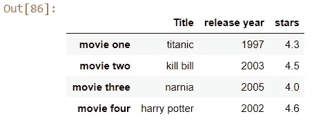

# 数据科学熊猫-第二部分

> 原文：<https://medium.com/analytics-vidhya/pandas-for-data-science-part-02-22e8dfa48b9?source=collection_archive---------17----------------------->

这是我的部分-02 在数据科学与 python 使用熊猫，检查部分-01 [在这里](/@ksailakshman2000/introduction-to-pandas-for-data-science-part-01-b368a40439aa)。


选择一个新的图书馆作为起点是一个非常困难的决定。有很多研究要做，有很多路要走。所以要打败熊猫需要很多时间，但是通过大量的练习，我们可以达到它的极致，不要担心，从这里继续你的阅读，它会对你有很大的帮助。

因此，在开始之前，请确保您的控制台中安装了 python，您可以在 python 的官方网站(python.org)上查看，也可以使用 anaconda 来运行您的 jupyter 笔记本。

## 进口熊猫

```
import pandas as pdimport numpy as np
```

## **根据字典**创建熊猫的数据框架

```
data={‘movie’:[‘titanic’,’kill bill’,’narnia’,’harry potter’],’year’:[1997,2003,2005,2002],’rating’:[4.3,4.5,4.0,4.6]}df=pd.DataFrame(data)df
```


## 访问数据帧的最后一行和第一行

```
df.head(2)
```


```
df.tail(2)
```


## 重命名数据帧的索引/列名(标签)

```
df_new = df.rename(columns={‘movie’: ‘Title’,’year’:’release year’,’rating’:’stars’}, index={0:’movie one’,1:’movie two’,2:’movie three’,3:’movie four’})df_new
```



## 访问熊猫数据框架中的列

```
df_new[‘Title’]movie one           titanic
movie two         kill bill
movie three          narnia
movie four     harry potter
Name: Title, dtype: object
```

## 将列作为属性访问

```
df_new.starsmovie one      4.3
movie two      4.5
movie three    4.0
movie four     4.6
Name: stars, dtype: float64
```

## 访问数据框中的行

```
df_new.loc[‘movie one’]Title           titanic
release year       1997
stars               4.3
Name: movie one, dtype: object
--------------------------------
df_new.loc['movie four']Title           harry potter
release year            2002
stars                    4.6
Name: movie four, dtype: object
```

## 让我们创建第二个 DataFrame，这一次，在 column 属性中，我们添加一个字典中没有的列。

```
df_new[‘My new columns’]=’default’
df_new
```


## 如果要在某个索引处添加新列


如果要指定列的顺序

```
df_new.insert(1, ‘My 2nd new column’, ‘default value 2’)
df_new
```


## Pandas 的一个很酷的特性是，你可以为一个列分配一个常量值。

```
df_new[‘My 2nd new column’]=’human’
df_new
```


## 我们还可以将系列映射到数据帧中的列上。

```
ser=pd.Series([2,3,],index=[1,3])
df_new[‘My new columns’]=ser
df_new
```


## 删除熊猫数据框架中的列

```
del df_new[‘My new columns’]
df_new
```


## 删除熊猫数据框架中的行

```
df_new.drop([‘movie one’])
```


## 具有嵌套字典的数据框架

```
dicty={‘friends age’:{‘charan’:20,’sri sai’:20,’vijay’:22,’poojitha’:20},’teachers age’:{‘col ranjith sinha’:55,’chandan’:44,’shivangi goel’:25}}df_n3=pd.DataFrame(dicty)df_n3
```


## 转置熊猫数据帧

```
df_n3.T
```


## 迭代数据帧的行和列

```
dat_new= { ‘fruit’: [“Guava”, “Apple”, “Oranges”], ‘price’:[40, 120, 60]}data_df= pd.DataFrame(dat_new)
data_df
```


```
for i,j in data_df.iterrows():
 print(i,j)
 print()0 fruit    Guava
price       40
Name: 0, dtype: object

1 fruit    Apple
price      120
Name: 1, dtype: object

2 fruit    Oranges
price         60
Name: 2, dtype: object
```

## 数据帧的堆叠和拆分

```
data_st=data_df.stack()
data_st0  fruit      Guava
   price         40
1  fruit      Apple
   price        120
2  fruit    Oranges
   price         60
dtype: objectdata_unst=data_df.unstack()
data_unstfruit  0      Guava
       1      Apple
       2    Oranges
price  0         40
       1        120
       2         60
dtype: object
```

## 将列表设置为 Pandas 数据帧中的索引

```
data_df
```


```
id=[‘one’,’two’,’three’]
data_df.index=id
data_df
```


## 根据索引从数据帧中选择值

```
data_df.loc[‘two’]fruit    Apple
price      120
Name: two, dtype: object
```

## 使用缺失值

```
datamiss_dict={‘Data’:[1, np.nan, 8, 9, np.nan], ‘name’:[“charan”,”mike”,”vj”,”nandy”,”vikram”]}datamiss_a= pd.DataFrame(datamiss_dict)datamiss_a
```


```
datamiss_a.isnull()
```


```
datamiss_a.fillna(‘Not available’)
```


## 我们可以丢弃所有丢失的数据。dropna()函数

```
datamiss_a.dropna()
```


资源:[https://pandas.pydata.org/](https://pandas.pydata.org/)

关于我:大家好，我是拉克什曼·卡托朱，一名本科生，我喜欢探索事物，不断学习新的东西并教授它们。