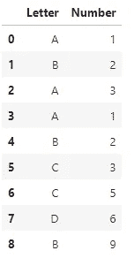

# 熊猫分组——充分利用您的数据

> 原文：<https://medium.com/analytics-vidhya/pandas-groupby-take-the-most-from-your-data-1303a4d41389?source=collection_archive---------6----------------------->

## 转向熊猫。GroupBy 函数—坚持住，这将是一个旅程！

在思考文章的新主题时，我总是问自己——在我作为数据科学家的旅程开始时，我需要了解哪些主题？

请不要误会我的意思，我从未停止寻找更好、更好的解决方案。不知何故，随着每一次探索，我总能找到可以在我的项目中实现的额外代码。寻找令人兴奋的解决方案和创造新版本或从中寻找灵感不知何故成了我的日常生活，我**爱**它。

现在，让我们回到主题。

在日常工作中，**熊猫**的 **groupby()** 函数似乎总能帮我实现更好的数据表现。我一直在使用它，尤其是当我需要找到更多关于数据的信息，或者数据的结构不同，需要转换时。

***希望你准备好了。让我们开始吧。***


照片由 [Poodar Chu](https://unsplash.com/@poodar?utm_source=medium&utm_medium=referral) 在 [Unsplash](https://unsplash.com?utm_source=medium&utm_medium=referral) 上拍摄

简而言之，所有关于**熊猫的**图书馆你都可以在这里找到:[https://pandas.pydata.org/docs/index.html](https://pandas.pydata.org/docs/index.html)

当涉及到将数据组织到表中并在其上实现许多转换时，它是一个在全球范围内使用的有用的库。你可以用熊猫做很多事情，但是今天我们将重点讨论 **GroupBy** 函数。

# 基础

在某些时候，您可能确实在 Excel 中工作，并在其中使用了数据透视表。GroupBy 允许我们根据给定的数据帧中编码的变量和条件创建“数据透视表”。

首先，我们可以创建数据集:

```
my_data=pd.DataFrame(
             data={'Letter' : ['A','B','A','A','B','C','C','D','B'],
                   'Number' : [1,2,3,1,2,3,5,6,9]})
```



对于每个字母，在这个数据集中有一个相应的数字。如你所见，有些字母输入了多次。在这种情况下，当我们希望数据集中有唯一的变量时， **groupby()** 就派上了用场。

## 主要结构:


例如，按字母对数据进行分组，并将相应的数字加到字母上:

> **注:**我一直比较喜欢，分组后，重置索引。默认情况下，groupby 函数会将“按变量分组”设置为 DataFrame 中的索引。使用 reset_index()函数，我们可以释放其中的任何现有索引。

```
#grouping data by Letter-sum variable Number for each letter
data_1=my_data.groupby('Letter')['Number'].sum()
data_1=data_1.reset_index()
data_1
```


用 sum()分组后的数据

很简单，对吗？让我们进一步探索和研究可能的聚合函数。

我们可以用 mean()，median()等等。如果我们使用 mean():

```
data_1=my_data.groupby('Letter')['Number'].mean()
data_1=data_1.reset_index()
data_1
```


用平均值()分组后的数据

现在我们知道了它的基本原理，让我向你展示它在现实生活中是如何有用的。

# 在项目中采用 GroupBy

为了演示，我将使用新冠肺炎数据集(因为这是当今最热门的话题)，你可以在这里找到它:[https://www.kaggle.com/imdevskp/corona-virus-report](https://www.kaggle.com/imdevskp/corona-virus-report)。

仔细看看数据:

```
import pandas as pd
data=pd.read_csv('covid_19_clean_complete.csv')
```


如您所见，数据集包含以下数据:

*   省/州
*   国家/地区
*   省/州的纬度和经度
*   日期—数据每天更新，并且每天跟踪确诊、死亡和康复的人数
*   各省/州每日确诊、死亡和恢复病例。

这里的主要问题是——按国家分析记录在案的案例。**你可能会问为什么？**查看这些数据，您会注意到我们记录了每日**的实例，但**是按**省/州**记录的。没有省或州的国家，比如克罗地亚，对他们来说，我们每天都有一个新的行。但是让我们看看澳大利亚，每个注册的省都有一个每日记录，注意，对于有记录的省/州变量的国家，我们每天都插入多行。

我希望你能领会它，并看到在分析这个数据集时，有人是多么容易犯错误。

现在，我们可以在自然光下看到 **groupby** ！计划用以下变量创建一个新数据集:

*   国家/地区
*   确诊、死亡和康复

所以，让我们这样做:

```
#grouping data
data_by_country=data.groupby(['Country/Region'])[['Confirmed','Deaths','Recovered']].sum()#reset index
data_by_country=data_by_country.reset_index()#print out sorted data from max to min by Confirmed cases
data_by_country.sort_values(by='Confirmed',ascending=False)
```


按国家分列的记录案件

这太棒了！我们现在可以看到每个国家记录的所有病例的总和，从最大病例数到最小病例数排序。在之前的例子中，我们只取了一个变量(数字)并按字母求和，但现在我们取了三个变量并按国家求和。*请注意，总是使用* ***列表中的*** *你想要转换的变量！*

我知道下面的问题是什么。

在这个函数中可以有多个变量作为索引吗？是的，我们可以！

让我们按照国家和日期变量对数据进行分组。基本上，对于每个国家，我们希望按日期记录病例。我们可以这样做:

```
data_by_country_date**=**data.groupby(['Country/Region','Date'])[['Confirmed','Deaths','Recovered']].sum()data_by_country_date**=**data_by_country_date.reset_index()data_by_country_date
```


按国家和日期分组的数据

这太神奇了！我们都记录了每个国家每天的病例。有了这个数据集，我们可以很容易地创建美丽的可视化和国家之间的比较。

如果我们只想筛选出每个国家存在确诊病例的数据，只需使用以下条件进行筛选即可:

```
data_by_country_date[data_by_country_date.Confirmed>0]
```


您可以看到，阿富汗的开始日期是 2020 年 2 月 24 日，而不是 2020 年 2 月 22 日。

现在你有了它，探索这个熊猫函数，当你必须转换数据集时，在你的项目中使用它。下面的代码演示了我如何使用它来分析新冠肺炎数据。

我知道这并不新奇，但我只是想向您展示它在实际编码中的应用。

以下功能流程:

获取原始数据集和要显示的国家/地区的名称(如果未输入国家/地区，则获取全局数据),并返回从第一个案例到今天为止记录的案例。

```
**def** **get_overall_numbers**(df,country='all'):df['Date']=df.Date.astype('datetime64') **#set Date to datetime**if country=='all': **#all - takes data globally**
        subset=df.groupby('Date')          [['Confirmed','Deaths','Recovered']].sum()
        subset=subset.reset_index()else:
        sub=df[df['Country/Region']==country] **#take data for given    country**
        subset=sub.groupby(['Country/Region','Date'])[['Confirmed','Deaths','Recovered']].sum()
        subset=subset.reset_index()

    return subset[subset.Confirmed>0]
```

调用函数:

1.  全球—国家= '所有'

```
get_overall_numbers(data)
```


按日期列出的全球记录案例

2.国家= '克罗地亚'

```
get_overall_numbers(data,'Croatia')
```


克罗地亚按日期记录的案件

如果你不是头号人物，让我们把它带到剧情中:

```
#Code is now really simple since we have function#importing libraries
import seaborn as sns
import matplotlib.pyplot as pltsns.lineplot(x=get_overall_numbers(data).Date,y=get_overall_numbers(data).Confirmed/1000000)
```


# 结论

我希望这对 python 世界的所有人，新手，或者只是想学习更多的人有所帮助。请让我知道你是否在你的项目中使用它。:)

当我的大学同事提到以下内容时，我想写这篇文章作为他们的灵感:*他们正在寻找关于如何分组数据以及如何在转换后使用数据的简单解释*。

如果有人有类似或相同的问题，我真诚地希望你能在这篇文章中找到答案。

感谢您的阅读。敬请关注。

再见。